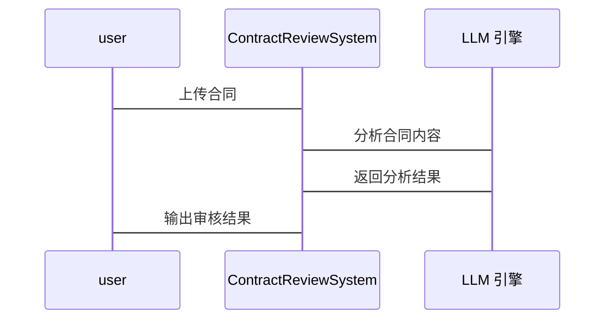

                 


# 智能合同审核 AI Agent：LLM 在法律文件处理中的应用

---

## 关键词：
智能合同审核，LLM，法律文件处理，AI Agent，法律文本分析，大语言模型

---

## 摘要：
随着人工智能技术的快速发展，法律文件处理领域正经历一场深刻的变革。传统的合同审核流程繁琐、效率低下，而基于大语言模型（LLM）的智能合同审核 AI Agent 正在改变这一现状。本文将深入探讨智能合同审核的背景、技术原理、系统设计与实现，并通过实际案例分析，展示 LLM 在法律文件处理中的广泛应用。文章还将总结智能合同审核的最佳实践，为读者提供有价值的参考。

---

# 第一章：智能合同审核的背景与意义

## 1.1 合同审核的背景与挑战

### 1.1.1 传统合同审核的痛点
传统合同审核流程通常依赖人工操作，存在以下问题：
- **效率低下**：人工审核合同需要大量时间，特别是在处理大量合同文件时。
- **错误风险**：人为疏忽可能导致关键条款的遗漏或误判。
- **成本高昂**：需要大量法律专业人员参与，增加了企业的运营成本。

### 1.1.2 AI 技术在合同审核中的应用价值
人工智能技术，特别是大语言模型（LLM），为合同审核带来了革命性的变化：
- **自动化处理**：AI 可以快速分析和理解合同内容，自动识别关键条款。
- **高精度**：通过训练模型可以实现对合同内容的准确理解和判断。
- **成本降低**：AI 技术可以显著减少对人工审核的依赖，降低运营成本。

### 1.1.3 智能合同审核的边界与外延
智能合同审核的边界包括：
- **合同分类**：将合同按照类型（如商业合同、服务合同）进行分类。
- **信息抽取**：从合同中提取关键信息（如金额、期限、条款）。
- **条款分析**：分析合同条款的合法性、合规性。

外延则包括：
- **合同生成**：基于用户需求自动生成合同模板。
- **合同监控**：实时监控合同履行情况，提醒关键节点。

---

## 1.2 AI Agent 在法律文件处理中的作用

### 1.2.1 AI Agent 的定义与特点
AI Agent 是一种智能体，能够根据输入的指令执行特定任务。其特点包括：
- **自主性**：能够在没有人工干预的情况下完成任务。
- **反应性**：能够根据输入数据实时调整行为。
- **学习能力**：能够通过数据训练不断优化性能。

### 1.2.2 大语言模型（LLM）在法律文本处理中的优势
LLM 在法律文本处理中的优势包括：
- **强大的理解能力**：LLM 能够理解复杂文本的上下文和语义。
- **生成能力**：LLM 可以生成符合要求的法律文本，如合同条款。
- **可扩展性**：LLM 可以处理多种语言和多种类型的法律文本。

### 1.2.3 智能合同审核的场景与应用
智能合同审核的应用场景包括：
- **企业内部合同管理**：帮助企业高效审核和管理内部合同。
- **法律咨询服务**：为律师提供辅助工具，提高工作效率。
- **自动化合规检查**：确保合同内容符合相关法律法规。

---

## 1.3 本书的核心内容与目标

### 1.3.1 本书的核心问题
本书将探讨以下核心问题：
- LLM 在合同审核中的具体应用。
- 智能合同审核系统的架构设计。
- 实际项目中的技术实现与优化。

### 1.3.2 本书的目标与结构安排
本书的目标是：
- 提供智能合同审核的理论基础。
- 展示 LLM 在法律文本处理中的实际应用。
- 提供可操作的系统设计与实现方案。

### 1.3.3 本书的适用读者
本书适合以下读者阅读：
- 对人工智能技术感兴趣的程序员。
- 从事法律文件处理的从业者。
- 对智能合同审核系统感兴趣的的企业管理者。

---

# 第二章：大语言模型（LLM）的基本原理

## 2.1 大语言模型的定义与技术特点

### 2.1.1 大语言模型的定义
大语言模型（LLM）是指基于深度学习技术构建的大型语言模型，通常具有 billions 级别的参数量。

### 2.1.2 LLM 的核心技术特点
LLM 的核心特点包括：
- **大规模训练数据**：通过大量文本数据的训练，模型能够理解多种语言和语义。
- **自注意力机制**：通过自注意力机制，模型可以捕捉文本中的长距离依赖关系。
- **生成能力**：模型可以通过生成式的方式输出文本。

### 2.1.3 LLM 与传统 NLP 技术的区别
| 特性 | LLM | 传统 NLP 技术 |
|------|------|---------------|
| 参数量 | 大型（ billions） | 小型（ millions） |
| 训练数据 | 大规模（ hundreds of billions tokens） | 较小规模 |
| 任务能力 | 多任务通用 | 专为特定任务设计 |

---

## 2.2 LLM 的训练与优化

### 2.2.1 LLM 的训练方法
LLM 的训练通常采用以下方法：
1. **预训练**：在大规模通用数据上进行无监督预训练。
2. **微调**：在特定任务数据上进行有监督微调。

### 2.2.2 LLM 的优化策略
优化策略包括：
- **参数调整**：通过调整模型参数，优化模型的性能。
- **模型压缩**：通过模型压缩技术，减少模型的计算资源消耗。
- **知识蒸馏**：将大模型的知识迁移到小模型中。

### 2.2.3 LLM 的评估指标
常用的评估指标包括：
- **准确率**：模型预测的正确比例。
- **困惑度（Perplexity）**：衡量模型生成文本的质量。
- **F1 分数**：用于分类任务的评估。

---

## 2.3 LLM 在法律文本处理中的应用

### 2.3.1 法律文本的特征与挑战
法律文本的特征包括：
- **专业术语多**：法律文本中包含大量专业术语。
- **结构复杂**：法律文本通常具有复杂的结构。
- **语义明确**：法律文本的语义通常非常明确。

### 2.3.2 LLM 在法律文本处理中的优势
- **语义理解能力强**：LLM 能够准确理解法律文本的语义。
- **生成能力强**：LLM 可以生成符合法律要求的文本。
- **适应性强**：LLM 可以处理多种语言和类型的法律文本。

### 2.3.3 LLM 在合同审核中的具体应用
- **合同分类**：将合同分为不同的类别。
- **信息抽取**：从合同中提取关键信息。
- **条款分析**：分析合同条款的合法性。

---

# 第三章：智能合同审核系统的系统设计与实现

## 3.1 系统需求分析

### 3.1.1 问题场景介绍
智能合同审核系统的应用场景包括：
- 企业内部合同审核。
- 法律咨询服务。
- 合同合规性检查。

### 3.1.2 系统功能需求
系统需要实现以下功能：
- **合同上传**：用户可以上传合同文件。
- **合同分类**：系统自动将合同分类。
- **信息抽取**：提取合同中的关键信息。
- **条款分析**：分析合同条款的合法性。
- **审核结果输出**：输出审核结果和建议。

### 3.1.3 系统性能需求
系统性能需求包括：
- **响应时间**：小于 5 秒。
- **处理能力**：能够同时处理多份合同。

---

## 3.2 系统功能设计

### 3.2.1 领域模型设计（Mermaid 类图）

```mermaid
classDiagram
    class ContractReviewSystem {
        +合同库：存储所有合同信息
        +LLM 引擎：负责合同理解和生成
        +用户界面：供用户交互
    }
    class Contract {
        +合同编号：string
        +合同内容：string
        +审核状态：enum{待审核, 审核通过, 审核不通过}
    }
    class ReviewResult {
        +合同编号：string
        +审核意见：string
        +审核时间：datetime
    }
    ContractReviewSystem 

```

---

## 3.3 系统架构设计

### 3.3.1 系统架构设计（Mermaid 架构图）

```mermaid
container LLM 服务 {
    service LLM 接口
    service 训练模块
}
container 合同管理系统 {
    service 合同上传
    service 合同分类
    service 信息抽取
    service 条款分析
    service 审核结果输出
}
```

---

## 3.4 系统接口设计

### 3.4.1 API 接口设计
系统需要以下 API 接口：
- `POST /contract/upload`：上传合同。
- `GET /contract/classify`：合同分类。
- `GET /contract/extract`：信息抽取。
- `GET /contract/analyze`：条款分析。
- `GET /contract/review`：审核结果输出。

---

## 3.5 系统交互设计（Mermaid 序列图）



---

# 第四章：智能合同审核的项目实战

## 4.1 环境配置

### 4.1.1 开发环境
- **编程语言**：Python 3.8+
- **框架**：Flask 或 Django
- **LLM 模型**：使用开源模型（如 Llama）

### 4.1.2 依赖安装
```bash
pip install flask
pip install llama
```

---

## 4.2 核心实现代码

### 4.2.1 合同上传与分类

```python
from flask import Flask, request
import llama

app = Flask(__name__)
llm = llama.Llama()

@app.route('/contract/upload', methods=['POST'])
def upload_contract():
    file = request.files['contract']
    content = file.read().decode('utf-8')
    classification = llm.classify(content)
    return {'status': 'success', 'classification': classification}
```

---

## 4.3 实际案例分析

### 4.3.1 案例分析：商业合同审核
假设用户上传了一份商业合同，系统将执行以下步骤：
1. **合同分类**：识别合同类型为“商业合同”。
2. **信息抽取**：提取合同中的金额、期限等关键信息。
3. **条款分析**：分析合同条款的合法性。
4. **审核结果输出**：返回审核结果和建议。

---

## 4.4 项目总结
通过实际案例分析，我们可以看到 LLM 在智能合同审核中的巨大潜力。系统能够高效地处理合同，减少人工干预，显著提高审核效率和准确性。

---

# 第五章：智能合同审核的最佳实践与小结

## 5.1 最佳实践 tips

### 5.1.1 模型选择
选择合适的 LLM 模型，确保模型的性能和适用性。

### 5.1.2 数据质量
确保训练数据的质量和多样性，以提高模型的泛化能力。

### 5.1.3 系统优化
通过模型压缩和优化技术，降低系统的计算资源消耗。

---

## 5.2 注意事项

### 5.2.1 数据隐私
处理法律文件时，需要注意数据隐私问题，确保数据的安全性。

### 5.2.2 模型解释性
提高模型的可解释性，以便用户更好地理解审核结果。

### 5.2.3 法律合规
确保系统的审核结果符合相关法律法规。

---

## 5.3 拓展阅读

### 5.3.1 推荐书籍
- 《深度学习实战》
- 《自然语言处理实战》

### 5.3.2 技术博客
- [Towards Data Science](https://towardsdatascience.com)
- [Medium - AI](https://medium.com/ai)

---

# 作者：AI天才研究院/AI Genius Institute & 禅与计算机程序设计艺术/Zen And The Art of Computer Programming

---

**摘要：**  
本文深入探讨了智能合同审核 AI Agent 的背景、技术原理、系统设计与实现，并通过实际案例分析展示了 LLM 在法律文件处理中的广泛应用。文章还总结了智能合同审核的最佳实践，为读者提供了有价值的参考。

