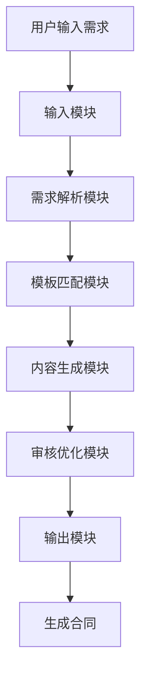

                 


# 智能合同生成AI Agent：LLM在法律文书撰写中的应用

> 关键词：智能合同生成、LLM、大语言模型、法律文书、NLP、AI Agent

> 摘要：随着人工智能技术的迅速发展，法律领域正在经历一场深刻的变革。本文探讨了如何利用大语言模型（LLM）构建智能合同生成AI Agent，分析其在法律文书撰写中的应用。通过详细讲解技术背景、算法原理、系统架构、项目实战等，本文旨在为法律专业人士和技术开发者提供一份全面的指南，帮助他们理解和应用这一前沿技术。

---

# 第一部分: 智能合同生成AI Agent概述

## 第1章: 智能合同生成的背景与意义

### 1.1 合同生成的背景与现状

#### 1.1.1 传统合同生成的痛点
传统合同生成过程中，法律专业人士需要手动起草和审核合同，这一过程不仅耗时，还容易出现疏漏。尤其是在处理大量重复性工作时，效率低下且成本高昂。

#### 1.1.2 智能化合同生成的必要性
随着企业对高效法律服务的需求增加，智能化合同生成成为必然趋势。通过AI技术，可以自动化处理合同生成，减少人为错误，提升效率。

#### 1.1.3 AI在法律文书中的应用前景
AI技术在法律领域的应用潜力巨大，尤其是在合同生成、案例分析和法律咨询等方面。通过LLM，AI能够理解复杂的法律文本，提供精准的支持。

### 1.2 大语言模型（LLM）的基本概念

#### 1.2.1 什么是大语言模型
大语言模型是一种基于深度学习的自然语言处理模型，能够理解和生成人类语言。它通过大量数据训练，具备强大的上下文理解和生成能力。

#### 1.2.2 LLM的核心特点
- **大规模训练数据**：模型通过训练海量文本数据，掌握语言的统计规律。
- **深度神经网络**：使用Transformer架构，具备强大的序列建模能力。
- **多任务学习能力**：模型可以在多种任务中表现良好，如翻译、问答、文本生成。

#### 1.2.3 LLM与传统NLP技术的区别
传统NLP技术依赖于特定规则和模板，而LLM采用数据驱动方法，能够自适应处理多种任务，生成更自然的文本。

### 1.3 智能合同生成的流程与优势

#### 1.3.1 智能合同生成的流程
1. **输入需求**：用户输入合同的基本信息和要求。
2. **模板匹配**：系统根据需求匹配合适的合同模板。
3. **内容生成**：LLM根据模板和需求生成合同内容。
4. **审核与优化**：系统对生成的内容进行语法和法律合规性检查，进行优化。
5. **输出结果**：生成并输出最终合同。

#### 1.3.2 LLM在合同生成中的优势
- **高效性**：自动化处理，节省时间和成本。
- **准确性**：减少人为错误，确保合同内容合规。
- **灵活性**：能够适应不同类型的合同需求。

#### 1.3.3 智能合同生成的边界与外延
智能合同生成主要用于合同草拟和初稿生成，其边界包括合同的合规性检查和法律建议，而外延则涉及合同管理和智能化法律服务。

### 1.4 本章小结
本章介绍了智能合同生成的背景、LLM的基本概念及其在合同生成中的应用优势，为后续内容奠定了基础。

---

## 第2章: LLM在法律文书撰写中的技术原理

### 2.1 LLM的基本原理

#### 2.1.1 概率语言模型的概念
概率语言模型通过计算文本中各个词出现的概率，生成最可能的后续文本。其核心公式为：
$$ P(y|x) = \prod_{i=1}^{n} P(y_i|y_{<i},x) $$

#### 2.1.2 Transformer架构的介绍
Transformer架构由编码器和解码器组成，通过自注意力机制捕捉文本中的长距离依赖关系。

#### 2.1.3 注意力机制的作用
注意力机制通过计算输入序列中每个词的重要性，帮助模型聚焦于关键信息。其公式为：
$$ \text{Attention}(Q,K,V) = \text{softmax}\left(\frac{QK^T}{\sqrt{d_k}}\right)V $$

### 2.2 深度学习模型的训练方法

#### 2.2.1 监督学习与无监督学习
- **监督学习**：使用带标签的数据进行训练，如分类任务。
- **无监督学习**：利用无标签数据，如聚类和降维。

#### 2.2.2 微调（Fine-tuning）技术
微调是在预训练模型的基础上，针对特定任务进行进一步训练，以适应具体需求。

#### 2.2.3 对抗训练的应用
通过生成器和判别器的对抗训练，提升模型的生成能力和判别能力。

### 2.3 模型推理机制

#### 2.3.1 解码器的生成策略
解码器通过逐步生成词并结合上下文，生成最终文本。常用策略包括贪心搜索和束搜索。

#### 2.3.2 贪婪搜索与束搜索
- **贪心搜索**：每次选择概率最高的词，生成速度较快，但可能忽略全局最优。
- **束搜索**：生成多个候选词，最终选择最优解，生成质量更高。

#### 2.3.3 温度与重复惩罚参数
- **温度**：控制生成文本的随机性，温度越高，生成越多样化。
- **重复惩罚**：防止生成重复词，提升文本连贯性。

### 2.4 数学模型与公式

#### 2.4.1 概率生成模型的公式
$$ P(y|x) = \prod_{i=1}^{n} P(y_i|y_{<i},x) $$

#### 2.4.2 Transformer模型的注意力机制公式
$$ \text{Attention}(Q,K,V) = \text{softmax}\left(\frac{QK^T}{\sqrt{d_k}}\right)V $$

---

## 第3章: 智能合同生成系统的架构设计

### 3.1 系统总体架构

#### 3.1.1 系统模块划分
- **输入模块**：接收用户需求。
- **处理模块**：生成合同内容。
- **输出模块**：展示生成的合同。

#### 3.1.2 系统功能设计
- **需求解析**：理解用户输入的需求。
- **模板匹配**：选择合适的合同模板。
- **内容生成**：利用LLM生成合同内容。
- **审核优化**：检查合同的合规性和准确性。

#### 3.1.3 系统交互流程
用户输入需求 -> 系统解析需求 -> 匹配模板 -> 生成内容 -> 审核优化 -> 输出合同。

### 3.2 系统功能模块

#### 3.2.1 需求解析模块
通过自然语言处理技术，理解用户的输入需求，提取关键信息。

#### 3.2.2 模板匹配模块
根据提取的需求，匹配最合适的合同模板。

#### 3.2.3 内容生成模块
利用LLM生成合同内容，确保准确性和专业性。

#### 3.2.4 审核优化模块
对生成的内容进行语法和法律合规性检查，优化合同结构。

### 3.3 系统架构设计

#### 3.3.1 分层架构
系统分为数据层、业务逻辑层和表现层，各层之间职责分明。

#### 3.3.2 模块交互
- 输入模块 -> 需求解析模块 -> 模板匹配模块 -> 内容生成模块 -> 审核优化模块 -> 输出模块。

### 3.4 系统接口设计

#### 3.4.1 API接口
- **输入接口**：接收用户需求。
- **输出接口**：返回生成的合同内容。
- **状态接口**：返回生成过程中的状态信息。

#### 3.4.2 数据接口
- **模板数据库**：存储合同模板。
- **模型接口**：调用LLM进行内容生成。

### 3.5 系统交互流程图



---

## 第4章: 智能合同生成系统的实现

### 4.1 项目实战

#### 4.1.1 环境搭建
- **安装Python**：确保安装了Python 3.8及以上版本。
- **安装依赖库**：安装`transformers`、`torch`等库。

#### 4.1.2 核心代码实现

```python
from transformers import AutoTokenizer, AutoModelForCausalLM
import torch

# 加载预训练模型和分词器
model_name = "gpt2-large"
tokenizer = AutoTokenizer.from_pretrained(model_name)
model = AutoModelForCausalLM.from_pretrained(model_name)

# 定义生成函数
def generate_contract(prompt, max_length=500):
    inputs = tokenizer.encode(prompt, return_tensors="pt")
    outputs = model.generate(inputs, max_length=max_length, do_sample=True)
    contract = tokenizer.decode(outputs[0], skip_special_tokens=True)
    return contract

# 示例使用
prompt = "Generate a contract for a service agreement between Company A and Company B."
contract = generate_contract(prompt)
print(contract)
```

#### 4.1.3 案例分析
以服务协议为例，展示系统如何根据用户输入生成合同内容。

#### 4.1.4 项目总结
总结项目实现的关键点和经验教训，为后续优化提供参考。

---

## 第5章: 智能合同生成系统的挑战与解决方案

### 5.1 挑战分析

#### 5.1.1 数据隐私与安全
处理敏感法律信息时，需确保数据隐私和安全。

#### 5.1.2 模型优化
优化LLM的生成效果，提升合同的准确性和专业性。

#### 5.1.3 用户体验
设计友好的用户界面，提升用户体验。

### 5.2 解决方案

#### 5.2.1 数据隐私保护
采用加密技术，确保数据在传输和存储过程中的安全性。

#### 5.2.2 模型优化策略
- **微调模型**：针对法律领域进行微调。
- **多任务学习**：同时优化生成和审核任务。

#### 5.2.3 用户体验优化
- **直观界面**：设计用户友好的界面。
- **实时反馈**：生成过程中提供实时反馈。

---

## 第6章: 智能合同生成系统的未来展望

### 6.1 未来趋势

#### 6.1.1 技术发展
随着AI技术的进步，智能合同生成将更加智能化和自动化。

#### 6.1.2 法律服务的智能化
AI将深度融入法律服务，提供更全面的支持。

#### 6.1.3 伦理与合规
AI在法律领域的应用需遵守伦理规范和法律法规。

### 6.2 技术发展建议

#### 6.2.1 加强模型可解释性
提升模型的可解释性，增强用户信任。

#### 6.2.2 推动跨领域合作
加强法律、技术和业务的跨界合作，推动技术落地。

---

## 第7章: 结论与展望

### 7.1 本文总结
本文详细探讨了LLM在智能合同生成中的应用，分析了其技术原理和系统架构，并展示了实际应用案例。

### 7.2 未来研究方向
未来研究可以集中在模型优化、用户体验提升和法律合规性增强等方面。

---

# 作者信息

作者：AI天才研究院/AI Genius Institute  
联系邮箱：contact@aigeniusinstitute.com  
更多信息请访问：https://www.aigeniusinstitute.com

---

通过以上结构，文章详细探讨了智能合同生成AI Agent的各个方面，从技术原理到实际应用，为读者提供了全面的视角和深入的分析。

