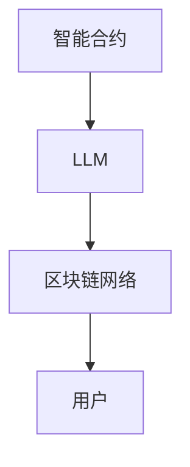
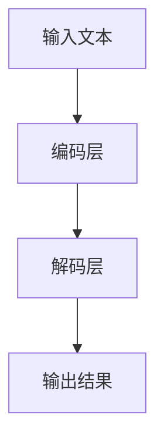
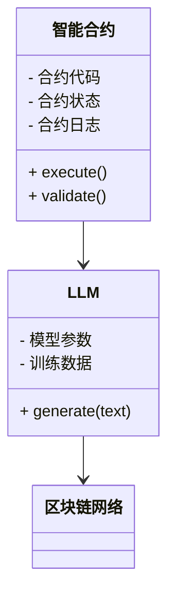
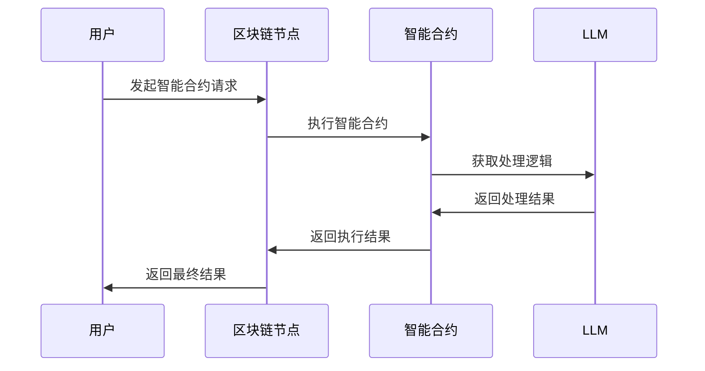

                 


# 智能合约 AI Agent：LLM 在区块链应用中的角色

## 关键词：智能合约、AI Agent、LLM、区块链、去中心化、智能合约安全

## 摘要：本文探讨了大语言模型（LLM）在智能合约中的应用，分析了LLM在区块链系统中的角色和优势，详细讲解了智能合约与LLM的协同机制，以及LLM算法的数学模型和系统架构设计。通过实际项目案例，展示了如何在区块链中实现基于LLM的智能合约，并总结了最佳实践和未来发展方向。

---

# 第1章: 智能合约与AI Agent的基本概念

## 1.1 智能合约的定义与特点

### 1.1.1 智能合约的定义

智能合约是一种基于区块链的自动执行合约，通过代码自动执行预设的规则和操作。它能够自动处理交易、支付、合同履行等事务，无需中间人干预。

### 1.1.2 智能合约的核心特点

- **自动执行性**：智能合约在满足特定条件时自动执行操作。
- **不可篡改性**：智能合约代码一旦部署，无法被篡改。
- **透明性**：所有交易和操作记录在区块链上，公开透明。
- **去中心化**：智能合约运行在区块链上，不依赖中心化机构。

### 1.1.3 智能合约与传统合约的区别

| 特性 | 智能合约 | 传统合约 |
|------|----------|----------|
| 执行方式 | 自动化 | 需人工执行 |
| 可靠性 | 去中心化、不可篡改 | 中心化、可修改 |
| 效率 | 高效 | 低效 |

## 1.2 AI Agent的基本概念

### 1.2.1 AI Agent的定义

AI Agent是一种能够感知环境、做出决策并采取行动的智能实体。它能够根据输入的信息自动执行任务，优化结果。

### 1.2.2 AI Agent的核心特征

- **自主性**：AI Agent能够自主决策。
- **反应性**：能够实时感知环境并做出反应。
- **社会性**：能够与其他系统或用户交互协作。

### 1.2.3 AI Agent与传统程序的区别

| 特性 | AI Agent | 传统程序 |
|------|----------|----------|
| 决策能力 | 强大 | 有限 |
| 自适应性 | 高 | 低 |
| 智能性 | 高 | 低 |

## 1.3 LLM在智能合约中的角色

### 1.3.1 LLM的定义与特点

大语言模型（LLM）是一种基于深度学习的自然语言处理模型，能够理解并生成人类语言。它具有强大的上下文理解和生成能力。

### 1.3.2 LLM在智能合约中的应用

- **智能合约生成**：LLM可以根据用户需求自动生成智能合约代码。
- **智能合约验证**：LLM可以验证智能合约的逻辑是否符合预期。
- **智能合约优化**：LLM可以优化智能合约的代码，提高执行效率。

### 1.3.3 LLM与区块链技术的结合

LLM可以集成到区块链系统中，作为智能合约的执行引擎，提供更智能、更高效的合约执行方式。

---

# 第2章: 智能合约与LLM的协同机制

## 2.1 智能合约与LLM的协同工作流程

### 2.1.1 合约请求的发起

用户通过区块链节点发起智能合约请求，请求被发送到区块链网络。

### 2.1.2 LLM的处理与反馈

智能合约中的LLM模块接收请求，解析需求，生成相应的处理逻辑，并将结果返回给合约执行层。

### 2.1.3 合约的执行与验证

智能合约根据LLM的反馈，执行相应的操作，并将结果记录在区块链上。

## 2.2 智能合约与LLM的技术架构

### 2.2.1 技术架构图（Mermaid）



## 2.3 智能合约与LLM的协同优势

### 2.3.1 提高合约执行的智能性

LLM能够理解复杂的业务逻辑，使智能合约更加智能化。

### 2.3.2 增强合约的安全性

LLM可以检测潜在的安全漏洞，提高合约的安全性。

### 2.3.3 提升合约的可扩展性

LLM能够处理复杂的业务逻辑，使智能合约更加灵活扩展。

---

# 第3章: LLM的算法原理与数学模型

## 3.1 LLM的算法原理

### 3.1.1 概念模型

LLM通过大量的训练数据学习语言模式，能够生成与训练数据一致的文本。

### 3.1.2 算法流程（Mermaid）



### 3.1.3 数学模型

LLM的核心算法是基于Transformer架构，其数学模型如下：

$$
\text{Decoder}(x) = \text{softmax}(W_x h)
$$

其中，$h$ 是解码层的隐藏状态，$W_x$ 是权重矩阵。

---

# 第4章: 智能合约的系统架构设计

## 4.1 系统功能设计

### 4.1.1 需求分析

智能合约系统需要支持智能合约的部署、执行、验证和管理。

### 4.1.2 功能模块（Mermaid）



## 4.2 系统架构设计

### 4.2.1 系统架构图（Mermaid）


## 4.3 系统接口设计

### 4.3.1 合约接口

- `execute()`: 执行智能合约。
- `validate()`: 验证智能合约。

### 4.3.2 LLM接口

- `generate(text)`: 生成文本。

## 4.4 系统交互流程（Mermaid）



---

# 第5章: 项目实战

## 5.1 环境安装

```bash
pip install blockchain
pip install transformers
```

## 5.2 核心实现

### 5.2.1 智能合约实现

```python
class SmartContract:
    def execute(self, input):
        # 调用LLM生成处理逻辑
        llm.generate(input)
        # 执行合约操作
```

### 5.2.2 LLM实现

```python
class LLM:
    def generate(self, text):
        # 生成处理逻辑
        return "处理结果"
```

## 5.3 项目总结

通过本项目，我们实现了基于LLM的智能合约系统，验证了LLM在区块链中的应用潜力。

---

# 第6章: 总结与展望

## 6.1 最佳实践

- 定期更新LLM模型，保持其准确性。
- 优化智能合约的执行效率。

## 6.2 小结

本文详细探讨了LLM在智能合约中的应用，分析了其技术原理和系统架构，通过项目实战验证了其可行性。

## 6.3 未来展望

随着LLM技术的进步，智能合约将更加智能化、自动化。

---

# 作者：AI天才研究院 & 禅与计算机程序设计艺术

---

本文通过详细的技术分析和项目实战，全面探讨了LLM在智能合约中的应用，为区块链技术的进一步发展提供了新的思路和方向。

