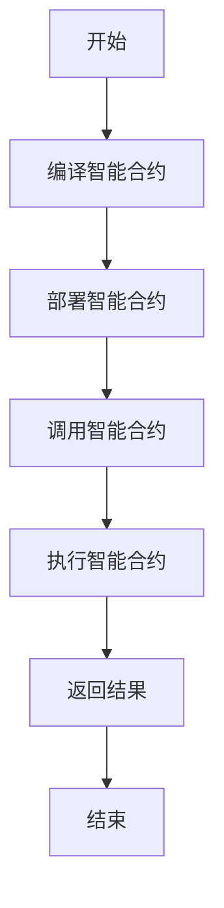

                 

# 智能合约与区块链技术的应用

> 关键词：智能合约，区块链技术，分布式 ledger，智能合约开发，区块链应用

> 摘要：本文将详细介绍智能合约与区块链技术的核心原理及其在多个领域的广泛应用。从智能合约的基本概念到区块链的技术原理，从智能合约的编程模型到实际应用场景的分析，我们将深入探讨这一技术如何改变我们的生活和商业模式。

---

## 第1章: 智能合约与区块链技术概述

### 1.1 智能合约的定义与背景

#### 1.1.1 智能合约的定义

智能合约是一种基于区块链技术的自动执行合同，其核心在于通过预设的代码逻辑，在区块链网络上自动执行和管理合同条款。智能合约的概念最早由密码学专家尼克·萨博（Nick Szabo）在1994年提出，但真正将其应用于实际的区块链系统中，则是在以太坊（Ethereum）平台的出现之后。

智能合约的特点包括：

1. **去中心化**：智能合约运行在区块链网络上，不依赖于任何中心化机构。
2. **自动执行**：一旦触发条件满足，智能合约会自动执行相应的操作。
3. **不可篡改**：智能合约代码一旦部署，无法被篡改，确保合同的公平性和安全性。
4. **透明性**：智能合约的执行过程和结果对所有参与者公开透明。

#### 1.1.2 智能合约的历史发展

智能合约的概念起源于20世纪90年代，但真正的发展和应用主要集中在近年来的区块链技术发展中。

- **20世纪90年代**：尼克·萨博提出智能合约的概念，将其定义为“不可约化的计算机协议”。
- **2015年**：以太坊平台的出现，使得智能合约的概念得到了实际的应用和推广。
- **近年来**：随着区块链技术的快速发展，智能合约的应用范围不断扩大，涵盖金融、供应链、医疗等多个领域。

#### 1.1.3 智能合约的核心特点

智能合约的核心特点可以总结为以下几点：

1. **自动性**：智能合约能够自动执行合同条款，无需人工干预。
2. **去中心化**：智能合约运行在区块链网络上，不依赖于任何中心化机构。
3. **安全性**：通过区块链的加密技术，确保智能合约的安全性和不可篡改性。
4. **透明性**：智能合约的执行过程和结果对所有参与者公开透明。

### 1.2 区块链技术的定义与特点

#### 1.2.1 区块链的基本概念

区块链是一种分布式账本技术，通过去中心化的共识机制，确保数据的安全性和一致性。区块链的核心数据结构包括区块、链、哈希指针等。

#### 1.2.2 区块链的核心特点

区块链的核心特点包括：

1. **去中心化**：数据不依赖于任何中心化机构，而是分布在网络的各个节点上。
2. **不可篡改性**：通过哈希函数和链式结构，确保数据的不可篡改性。
3. **透明性**：区块链上的交易记录对所有参与者公开透明。
4. **安全性**：通过加密算法和共识机制，确保区块链的安全性。

#### 1.2.3 区块链的分类与应用场景

区块链的分类主要基于其权限和应用场景：

1. **公有链**：如比特币、以太坊，面向所有人开放，任何人都可以参与。
2. **联盟链**：如Hyperledger，适用于特定组织或机构内部。
3. **私有链**：仅限于特定个人或组织使用。

### 1.3 智能合约与区块链的关系

#### 1.3.1 智能合约在区块链中的作用

智能合约是区块链技术的重要组成部分，能够通过自动化的代码实现合同的自动执行和管理。

#### 1.3.2 区块链如何支持智能合约的运行

区块链通过提供去中心化的计算环境，确保智能合约的安全性和高效运行。

#### 1.3.3 智能合约与区块链的结合优势

智能合约与区块链的结合，使得合同的执行更加自动化、透明化和不可篡改。

### 1.4 本章小结

本章介绍了智能合约和区块链技术的基本概念、特点和发展历程，为后续章节的深入分析奠定了基础。

---

## 第2章: 区块链技术原理

### 2.1 区块链的基本组成

#### 2.1.1 区块链的节点与网络结构

区块链网络由多个节点组成，每个节点负责存储和验证区块链上的数据。

#### 2.1.2 区块链的数据结构

区块链的数据结构包括区块和链。每个区块包含交易数据和区块头信息，区块头信息包含哈希指针和时间戳等。

#### 2.1.3 区块链的共识机制

共识机制是区块链的核心技术之一，用于确保所有节点达成一致。常见的共识机制包括工作量证明（PoW）、权益证明（PoS）等。

### 2.2 区块链的共识机制

#### 2.2.1 工作量证明（PoW）机制

工作量证明机制通过计算哈希值来验证区块的有效性，以防止恶意节点的攻击。

#### 2.2.2 权益证明（PoS）机制

权益证明机制通过持有代币的数量来决定节点的权重，从而降低计算成本。

#### 2.2.3 其他共识机制

其他共识机制包括 delegated proof of stake（DPOS）和 practical Byzantine fault tolerance（PBFT）等。

### 2.3 区块链的加密技术

#### 2.3.1 加密算法的基本原理

加密算法通过数学变换将明文转换为密文，确保数据的安全性。

#### 2.3.2 数字签名与哈希函数

数字签名用于验证数据的来源和完整性，哈希函数用于确保数据的唯一性和完整性。

#### 2.3.3 加密技术在区块链中的应用

加密技术在区块链中的应用包括交易签名、区块哈希和密钥管理等。

### 2.4 区块链的智能合约执行环境

#### 2.4.1 智能合约的运行环境

智能合约的运行环境通常是一个虚拟机，如以太坊的以太坊虚拟机（EVM）。

#### 2.4.2 智能合约的执行流程

智能合约的执行流程包括编译、部署、调用和执行结果返回。

#### 2.4.3 智能合约的编译与部署

智能合约需要通过编译器转换为目标平台的字节码，然后部署到区块链网络上。

### 2.5 本章小结

本章详细介绍了区块链技术的核心原理，包括数据结构、共识机制、加密技术和智能合约的执行环境。

---

## 第3章: 智能合约的核心原理

### 3.1 智能合约的编程模型

#### 3.1.1 智能合约的编程语言

以太坊平台使用Solidity语言编写智能合约，支持面向对象的编程特性。

#### 3.1.2 智能合约的运行环境

智能合约运行在一个虚拟机环境中，如以太坊虚拟机（EVM）。

#### 3.1.3 智能合约的代码结构

智能合约的代码结构通常包括状态变量、函数和事件。

### 3.2 智能合约的状态与操作

#### 3.2.1 智能合约的状态变量

状态变量是智能合约在区块链上的存储数据，用于记录合约的状态。

#### 3.2.2 智能合约的函数与事件

智能合约的函数用于接收外部调用，事件用于记录合约的状态变化。

#### 3.2.3 智能合约的调用与交互

智能合约通过外部调用或内部调用与其他合约或外部系统进行交互。

### 3.3 智能合约的执行流程

#### 3.3.1 智能合约的部署

智能合约需要通过编译和部署过程，将其部署到区块链网络上。

#### 3.3.2 智能合约的调用

智能合约的调用通过外部交易或内部调用触发。

#### 3.3.3 智能合约的执行结果

智能合约的执行结果返回调用者，并记录在区块链上。

### 3.4 智能合约的数学模型与公式

#### 3.4.1 智能合约的交易模型

智能合约的交易模型包括输入、处理和输出三个阶段。

#### 3.4.2 智能合约的状态转移方程

智能合约的状态通过状态转移方程进行更新，确保合约的正确执行。

#### 3.4.3 智能合约的执行流程图

以下是智能合约的执行流程图：

### 3.5 本章小结

本章详细介绍了智能合约的核心原理，包括编程模型、状态与操作、执行流程和数学模型。

---

## 第4章: 智能合约在金融领域的应用

### 4.1 智能合约在金融中的应用场景

#### 4.1.1 智能合约在支付与清算中的应用

智能合约可以用于自动化的支付与清算，减少中间环节和成本。

#### 4.1.2 智能合约在借贷与融资中的应用

智能合约可以用于自动化的借贷和融资，确保合同的自动执行。

#### 4.1.3 智能合约在保险领域的应用

智能合约可以用于保险产品的自动理赔和保费计算。

### 4.2 智能合约在供应链管理中的应用

#### 4.2.1 智能合约在供应链中的作用

智能合约可以用于供应链的自动化管理，确保供应链的透明和高效。

#### 4.2.2 智能合约在供应链中的具体应用

智能合约可以用于货物追踪、库存管理、支付与结算等。

---

## 作者

作者：AI天才研究院/AI Genius Institute & 禅与计算机程序设计艺术 /Zen And The Art of Computer Programming

---

以上是《智能合约与区块链技术的应用》的部分内容，涵盖了智能合约和区块链技术的核心原理及其在金融和供应链领域的应用。后续章节将根据这一结构继续深入探讨更多细节和应用场景。

---

如果需要进一步扩展和完成整篇文章，可以根据上述目录和内容继续撰写。

