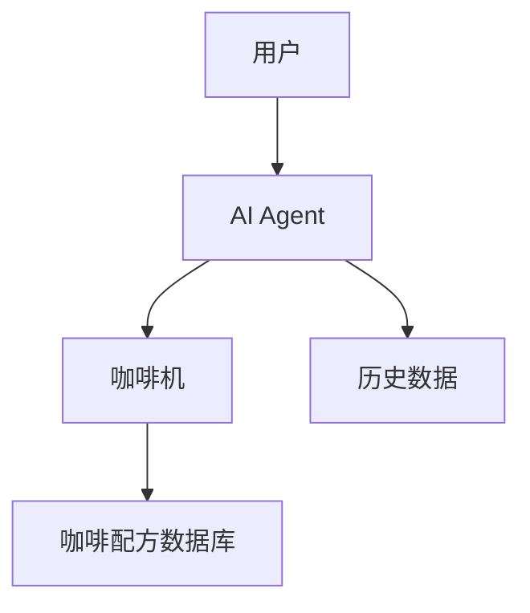
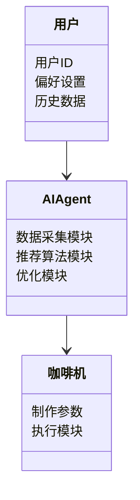
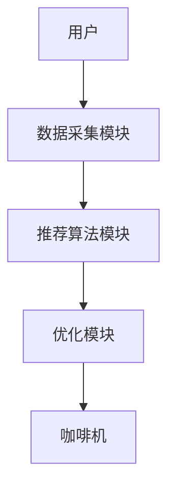

                 

# 智能咖啡机：AI Agent的个性化口味定制

---

## 关键词：智能咖啡机、AI Agent、个性化口味定制、人工智能、智能系统

---

## 摘要：本文探讨了AI技术在咖啡机中的应用，特别是AI Agent如何通过学习用户偏好，实现个性化口味定制。文章从背景、核心概念、算法原理到系统架构，全面解析智能咖啡机的设计与实现，最后通过项目实战展示其应用价值。

---

## 第一部分：智能咖啡机的背景与概念

### 第1章：咖啡文化与智能科技的结合

#### 1.1 咖啡文化的发展历程

咖啡作为世界上最受欢迎的饮品之一，其文化历史可以追溯到数百年前。从最初的野生咖啡树到现代的咖啡种植、烘焙和萃取技术，咖啡文化经历了巨大的演变。随着科技的进步，咖啡的制作方式也在不断优化，从手动冲泡到全自动咖啡机，每一次技术革新都为咖啡爱好者带来了更好的体验。

然而，传统咖啡机的功能相对固定，无法根据用户的口味偏好进行个性化调整。这成为现代咖啡文化中的一个重要痛点。用户希望能够在一杯咖啡中获得独一无二的口感，而不仅仅是标准化的产品。

---

#### 1.2 传统咖啡机的局限性

传统咖啡机的局限性主要体现在以下几个方面：

1. **功能单一**：大多数传统咖啡机仅能执行预设的程序，无法根据用户的口味偏好进行动态调整。
2. **用户体验不足**：用户无法方便地记录和调整自己的偏好设置，咖啡机也无法根据用户的历史行为提供个性化的建议。
3. **市场变化难以适应**：随着消费者口味的变化和新咖啡品种的出现，传统咖啡机难以快速适应市场的需求。

这些局限性促使人们寻找一种更加智能、灵活的咖啡解决方案。

---

#### 1.3 AI技术在咖啡机中的应用前景

AI技术的快速发展为咖啡机的智能化提供了新的可能性。通过AI Agent（智能代理），咖啡机可以实时感知用户的偏好，并动态调整咖啡的制作参数，如水温、萃取时间、咖啡粉量等，从而实现个性化的口味定制。

AI Agent的核心优势在于其学习能力和自适应能力。通过收集和分析用户的使用数据，AI Agent能够不断优化咖啡的制作过程，为用户提供更加精准和个性化的服务。这种技术的应用不仅提升了用户体验，还能够帮助咖啡机制造商在市场竞争中占据优势。

---

## 第二部分：AI Agent的核心概念与原理

### 第2章：AI Agent的基本原理

#### 2.1 AI Agent的定义与特点

AI Agent是一种能够感知环境并采取行动以实现目标的智能实体。在智能咖啡机中，AI Agent的主要职责是根据用户的输入和历史数据，生成个性化的咖啡配方建议。

AI Agent的特点包括：

1. **自主性**：AI Agent可以在没有人工干预的情况下独立运行。
2. **反应性**：AI Agent能够实时感知环境变化并做出相应的反应。
3. **学习能力**：通过机器学习算法，AI Agent能够从数据中提取模式并不断优化其决策过程。

---

#### 2.2 个性化口味定制的关键要素

个性化口味定制是智能咖啡机的核心功能，其关键要素包括：

1. **用户偏好识别**：通过收集用户的使用数据（如饮用时间、咖啡浓度偏好、添加物习惯等），AI Agent能够准确识别用户的口味偏好。
2. **咖啡配方调整**：基于用户偏好，AI Agent动态调整咖啡的制作参数，以满足用户的个性化需求。
3. **数据驱动优化**：通过持续的数据收集和分析，AI Agent能够不断优化咖啡配方，提升用户体验。

---

#### 2.3 AI Agent在智能咖啡机中的实体关系图

下图展示了AI Agent在智能咖啡机中的实体关系：

---

## 第三部分：个性化口味定制的算法原理

### 第3章：基于用户偏好的推荐算法

#### 3.1 协同过滤算法

协同过滤是一种基于用户行为数据的推荐算法，主要包括基于用户的协同过滤和基于物品的协同过滤。

##### 3.1.1 基于用户的协同过滤

基于用户的协同过滤算法通过寻找与当前用户行为相似的其他用户，推荐他们喜欢的物品。其步骤如下：

1. **数据收集**：收集用户的购买记录、评分数据等。
2. **相似性计算**：使用余弦相似度等方法计算用户之间的相似性。
3. **推荐生成**：基于相似用户的偏好，推荐当前用户可能感兴趣的内容。

##### 3.1.2 基于物品的协同过滤

基于物品的协同过滤算法通过分析物品之间的关联性，推荐与当前用户已购买物品相似的其他物品。其步骤如下：

1. **数据收集**：收集用户对物品的评分数据。
2. **相似性计算**：计算物品之间的相似性。
3. **推荐生成**：基于物品相似性，推荐当前用户可能感兴趣的内容。

##### 3.1.3 混合推荐算法

混合推荐算法结合了基于用户的协同过滤和基于物品的协同过滤，通过将两者的结果进行加权融合，生成最终的推荐结果。

---

#### 3.2 聚类分析算法

聚类分析是一种基于数据相似性进行分组的算法，常用于用户分群和物品推荐。

##### 3.2.1 K-means聚类

K-means聚类是一种经典的无监督学习算法，适用于将数据划分为若干个簇。其步骤如下：

1. **数据预处理**：标准化数据特征。
2. **初始质心选择**：随机选择K个质心。
3. **迭代优化**：计算每个数据点到质心的最近距离，并更新质心位置，直到收敛。

##### 3.2.2 层次聚类

层次聚类是一种基于层次结构的聚类方法，适用于数据的逐步分层。

---

#### 3.3 深度学习模型

深度学习模型在个性化口味定制中具有强大的表现能力。

##### 3.3.1 神经网络的基本结构

神经网络由输入层、隐藏层和输出层组成，通过多层非线性变换，能够捕捉复杂的模式和特征。

##### 3.3.2 卷积神经网络（CNN）

卷积神经网络常用于图像识别任务，但在文本和序列数据处理中也具有广泛的应用。

##### 3.3.3 循环神经网络（RNN）

循环神经网络适用于时间序列数据的处理，能够捕捉数据中的时序依赖关系。

---

## 第四部分：系统分析与架构设计

### 第4章：系统功能设计

#### 4.1 问题场景介绍

智能咖啡机的系统设计需要解决以下问题：

1. 如何实时感知用户的口味偏好？
2. 如何动态调整咖啡的制作参数？
3. 如何优化咖啡配方以提升用户体验？

---

#### 4.2 系统功能设计

##### 4.2.1 用户偏好收集

系统通过记录用户的使用数据（如饮用时间、咖啡浓度、添加物习惯等），构建用户的口味偏好模型。

##### 4.2.2 味道推荐引擎

基于用户的偏好数据，AI Agent生成个性化的咖啡配方建议。

##### 4.2.3 个性化设置

用户可以根据自己的偏好，调整咖啡机的默认设置，实现个性化的口味定制。

---

#### 4.3 系统架构设计

##### 4.3.1 领域模型

##### 4.3.2 系统架构图

---

## 作者：AI天才研究院/AI Genius Institute & 禅与计算机程序设计艺术 /Zen And The Art of Computer Programming

