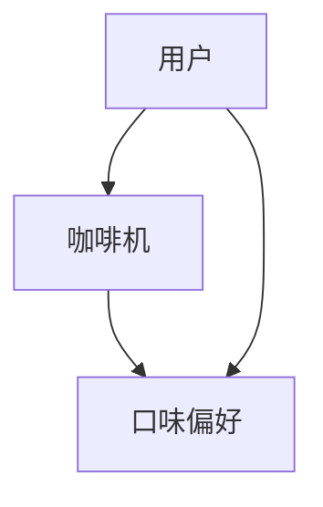
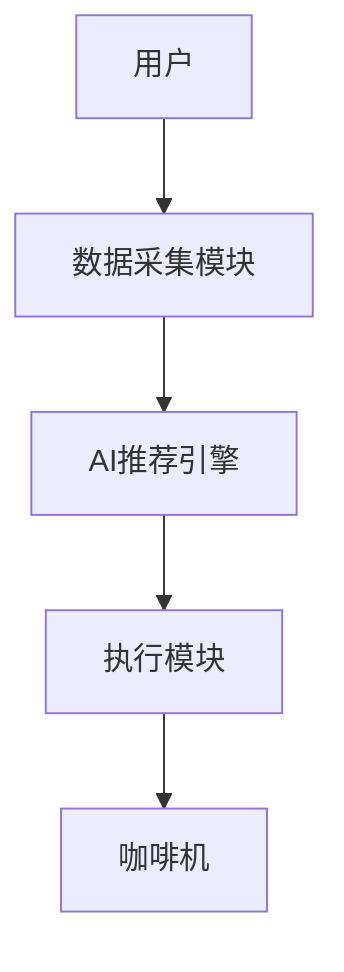

                 


# 智能咖啡机：AI Agent的个性化口味定制系统

## 关键词：智能咖啡机, AI Agent, 个性化口味定制, 机器学习, 算法推荐

## 摘要：  
智能咖啡机结合AI Agent技术，通过个性化口味定制系统，为用户提供智能化、个性化的咖啡饮用体验。本文将详细探讨智能咖啡机的发展背景、AI Agent的核心原理、个性化口味定制的算法实现、系统架构设计、项目实战与优化，以及实际应用场景中的最佳实践。

---

# 第一部分：背景介绍与核心概念

## 第1章：智能咖啡机的发展历程

### 1.1 从传统咖啡机到智能咖啡机的演变  
传统咖啡机的功能相对单一，仅能完成基础的咖啡制作流程。而智能咖啡机则通过引入AI技术，实现了从咖啡豆的选择、烘焙度的调整、奶泡的比例控制到杯温的精准调节等复杂操作的自动化和个性化定制。  

### 1.2 智能咖啡机的核心特征  
- **智能化**：通过AI Agent实现自动化操作和个性化推荐。  
- **个性化**：根据用户的口味偏好实时调整咖啡参数。  
- **互联性**：支持与物联网设备、智能家居的联动。  

### 1.3 个性化口味定制的需求背景  
随着人们对咖啡品质要求的提高，用户希望获得更贴合个人口味的咖啡。传统咖啡机无法满足这种需求，而智能咖啡机通过AI技术实现了这一目标。

---

## 第2章：AI Agent的基本概念与应用

### 2.1 AI Agent的定义与核心特征  
AI Agent是一种能够感知环境、做出决策并执行操作的智能实体。其核心特征包括：  
- **自主性**：无需人工干预，自动完成任务。  
- **反应性**：实时感知环境变化并做出调整。  
- **学习能力**：通过数据反馈不断优化自身的推荐算法。  

### 2.2 AI Agent在智能咖啡机中的应用  
AI Agent在智能咖啡机中的主要功能包括：  
- **用户行为分析**：通过记录用户的饮用历史和偏好，生成个性化推荐。  
- **实时反馈处理**：根据用户的实时反馈调整咖啡参数。  
- **数据驱动优化**：利用大数据分析不断优化推荐算法。  

---

# 第二部分：核心概念与联系

## 第3章：AI Agent的原理与实现机制

### 3.1 AI Agent的基本原理  
AI Agent的工作流程可以分为三个阶段：  
1. **感知阶段**：通过传感器或用户输入获取环境数据。  
2. **决策阶段**：基于获取的数据，利用算法生成推荐方案。  
3. **执行阶段**：将推荐方案转化为具体的咖啡参数调整操作。  

### 3.2 AI Agent的核心算法  
- **协同过滤算法**：基于用户历史行为推荐相似的口味组合。  
- **基于内容的推荐算法**：根据咖啡豆的属性（如产地、烘焙度）进行推荐。  
- **混合推荐算法**：结合协同过滤和基于内容的推荐，提高推荐准确率。  

### 3.3 AI Agent与智能咖啡机的实体关系图  



---

# 第三部分：算法原理与数学模型

## 第4章：个性化口味推荐算法

### 4.1 协同过滤算法的核心原理  
协同过滤算法通过分析用户的饮用历史，找到与当前用户口味相似的用户群体，并推荐这些用户偏好的咖啡组合。  

#### 协同过滤的数学模型  
$$ sim(u, v) = \frac{\sum_{i=1}^{n} (r_{ui} - \bar{r_u})(r_{vi} - \bar{r_v})}{\sqrt{\sum_{i=1}^{n} (r_{ui} - \bar{r_u})^2} \cdot \sqrt{\sum_{i=1}^{n} (r_{vi} - \bar{r_v})^2}}} $$  
其中，$sim(u, v)$ 表示用户 $u$ 和用户 $v$ 之间的相似度，$r_{ui}$ 表示用户 $u$ 对咖啡组合 $i$ 的评分，$\bar{r_u}$ 表示用户 $u$ 的平均评分。

### 4.2 基于内容的推荐算法  
基于内容的推荐算法通过分析咖啡豆的属性（如豆种、烘焙度）来生成推荐。  

#### 基于内容的推荐模型  
$$ score(i, j) = \sum_{k=1}^{m} w_k \cdot |f_{ik} - f_{jk}| $$  
其中，$score(i, j)$ 表示咖啡组合 $i$ 和咖啡组合 $j$ 的相似度，$w_k$ 是属性 $k$ 的权重，$f_{ik}$ 和 $f_{jk}$ 分别是咖啡组合 $i$ 和 $j$ 在属性 $k$ 上的特征值。

---

# 第四部分：系统分析与架构设计

## 第5章：系统架构设计

### 5.1 问题场景介绍  
用户通过智能咖啡机制作咖啡，系统需要根据用户的口味偏好推荐咖啡参数，并实时调整以满足用户需求。

### 5.2 系统功能设计  
- **用户界面**：提供个性化的用户界面，支持用户输入口味偏好。  
- **数据采集模块**：收集用户的饮用历史和反馈。  
- **AI推荐引擎**：基于用户数据生成推荐方案。  
- **执行模块**：根据推荐方案调整咖啡机的参数。  

### 5.3 系统架构图  



---

## 第6章：项目实战

### 6.1 环境搭建  
- **Python**：安装Python 3.8及以上版本。  
- **库的安装**：安装 `numpy`, `scikit-learn`, `pandas` 等库。  

### 6.2 核心代码实现  

```python
from sklearn.metrics.pairwise import cosine_similarity

# 示例数据：用户饮用历史
user_data = {
    'user1': [8, 6, 9],
    'user2': [7, 5, 8],
    'user3': [9, 8, 7]
}

# 计算相似度矩阵
similarities = cosine_similarity([user_data['user1'], user_data['user2'], user_data['user3']], [user_data['user1'], user_data['user2'], user_data['user3']])
print(similarities)
```

### 6.3 实际案例分析  
以用户A为例，假设用户A的饮用历史为 [8, 6, 9]，系统会推荐与用户A相似的其他用户的咖啡组合，并根据反馈不断优化推荐算法。

---

# 第五部分：优化与扩展

## 第7章：系统优化与扩展

### 7.1 系统优化  
- **实时反馈机制**：引入实时反馈以快速调整推荐方案。  
- **模型优化**：采用深度学习模型（如神经网络）进一步提升推荐准确率。  

### 7.2 系统扩展  
- **多设备联动**：支持与智能家居、咖啡豆供应链的联动。  
- **全球化口味适配**：根据地区和文化差异调整推荐策略。  

---

# 第六部分：最佳实践

## 第8章：总结与展望

### 8.1 总结  
通过AI Agent技术，智能咖啡机实现了个性化口味定制，为用户提供了更优质的咖啡饮用体验。  

### 8.2 展望  
未来，智能咖啡机将更加智能化和个性化，结合更多AI技术（如自然语言处理）进一步提升用户体验。

---

# 作者：AI天才研究院 & 禅与计算机程序设计艺术

