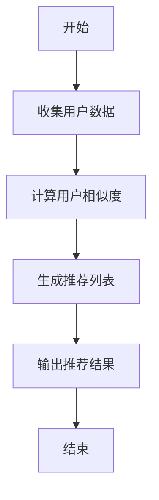
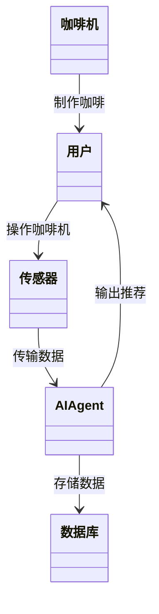
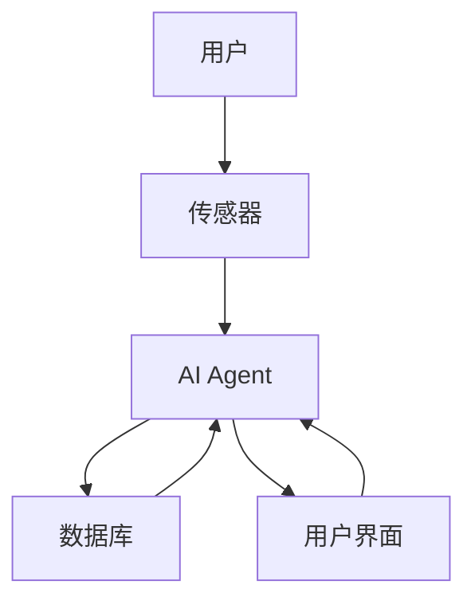
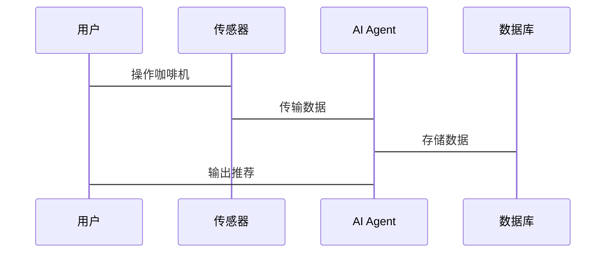

                 


# 智能咖啡机：AI Agent的咖啡口味个性化定制

## 关键词：智能咖啡机，AI Agent，个性化定制，推荐算法，系统架构

## 摘要：本文探讨了如何通过AI Agent技术实现智能咖啡机的咖啡口味个性化定制。首先介绍了智能咖啡机的发展历程和AI Agent的基本概念，分析了用户对个性化咖啡的需求及当前技术的挑战。接着详细讲解了AI Agent在智能咖啡机中的核心算法与数学模型，包括协同过滤和聚类分析等推荐算法。然后通过系统架构设计和项目实战，展示了如何将AI Agent与智能咖啡机结合，实现个性化口味定制。最后总结了全文并提出了未来的发展方向。

---

# 第一部分: 智能咖啡机与AI Agent的背景介绍

## 第1章: 背景与问题背景

### 1.1 智能咖啡机的发展历程
#### 1.1.1 传统咖啡机的功能与局限性
传统咖啡机只能实现基础的咖啡制作功能，缺乏智能化和个性化定制能力。用户无法根据个人口味调整咖啡浓度、温度和配料比例。

#### 1.1.2 智能化与AI技术的引入
随着物联网和人工智能技术的发展，智能咖啡机逐渐引入AI技术，能够通过传感器和用户交互界面收集数据，结合AI算法实现更智能的咖啡制作。

#### 1.1.3 当前市场中的智能咖啡机现状
当前市场中，智能咖啡机种类繁多，但大多数仍停留在基础的自动化阶段，缺乏真正的个性化定制能力。用户对个性化咖啡的需求未得到充分满足。

### 1.2 AI Agent的基本概念与特点
#### 1.2.1 AI Agent的定义
AI Agent是一种智能软件实体，能够感知环境、自主决策并执行任务。在智能咖啡机中，AI Agent负责数据采集、分析和个性化推荐。

#### 1.2.2 AI Agent的核心特点
AI Agent具有智能性、自主性、反应性和社会性。它能够通过传感器数据和用户输入，自主调整咖啡制作参数，实现个性化口味定制。

#### 1.2.3 AI Agent与传统软件的区别
AI Agent能够学习和适应用户偏好，而传统软件只能执行预设功能。AI Agent通过数据驱动的方式不断优化性能，而传统软件需要人工干预。

### 1.3 个性化咖啡口味定制的需求与挑战
#### 1.3.1 用户对个性化咖啡的需求分析
用户对个性化咖啡的需求主要体现在口味偏好、健康因素和便捷性方面。不同用户对咖啡的浓度、温度和配料有不同的偏好。

#### 1.3.2 当前咖啡机在口味定制上的不足
传统咖啡机无法根据用户偏好调整制作参数，缺乏个性化定制能力。用户需要手动调整咖啡机参数，操作复杂且体验不佳。

#### 1.3.3 个性化定制的技术挑战
个性化定制需要收集和分析大量用户数据，设计高效的推荐算法，并实现与智能咖啡机的无缝集成。技术实现复杂度较高。

## 1.4 本章小结
本章介绍了智能咖啡机的发展历程、AI Agent的基本概念和特点，以及个性化咖啡口味定制的需求和挑战。为后续章节的深入分析奠定了基础。

---

## 第2章: 智能咖啡机的AI Agent核心概念

### 2.1 AI Agent在智能咖啡机中的角色
#### 2.1.1 AI Agent的功能定位
AI Agent在智能咖啡机中负责数据采集、分析和个性化推荐。它能够通过传感器获取咖啡机的状态数据，结合用户偏好进行智能决策。

#### 2.1.2 AI Agent与智能咖啡机的交互方式
AI Agent通过物联网协议与智能咖啡机通信，接收传感器数据并发送控制指令。用户可以通过手机APP或语音助手与AI Agent交互。

#### 2.1.3 AI Agent的核心算法与实现
AI Agent的核心算法包括协同过滤和聚类分析。这些算法用于分析用户数据，生成个性化推荐。

### 2.2 个性化口味定制的核心要素
#### 2.2.1 用户口味偏好的数据采集
通过用户输入和传感器数据采集用户的口味偏好。数据包括用户的咖啡饮用习惯、配料偏好和口感反馈。

#### 2.2.2 咖啡口味的影响因素分析
咖啡口味受到咖啡豆种类、研磨程度、萃取时间和温度等因素的影响。AI Agent需要综合考虑这些因素，生成个性化推荐。

#### 2.2.3 个性化推荐算法的设计与实现
推荐算法需要考虑用户偏好和咖啡机的硬件限制。协同过滤算法适合处理用户数据，聚类分析算法适合处理咖啡机的状态数据。

### 2.3 AI Agent与智能咖啡机的系统架构
#### 2.3.1 系统整体架构概述
系统由传感器、AI Agent、用户界面和咖啡机硬件组成。AI Agent负责数据处理和推荐算法，传感器采集数据，用户界面接收用户输入。

#### 2.3.2 数据流与信息交互流程
数据从传感器流向AI Agent，AI Agent分析后生成推荐，用户通过界面确认推荐，咖啡机执行制作。

#### 2.3.3 系统的边界与外延
系统边界包括传感器、AI Agent、用户界面和咖啡机硬件。外延部分涉及数据存储和云服务。

### 2.4 本章小结
本章详细介绍了AI Agent在智能咖啡机中的角色，个性化口味定制的核心要素，以及系统的整体架构。为后续章节的算法和系统设计奠定了基础。

---

## 第3章: 个性化口味定制的核心算法与数学模型

### 3.1 推荐算法概述
#### 3.1.1 基于协同过滤的推荐算法
协同过滤算法通过分析用户的相似性，推荐相似用户的喜好。公式如下：
$$相似度计算公式：sim(i,j) = \frac{\sum_{k} (r_{ik} - \bar{r_i})(r_{jk} - \bar{r_j})}{\sqrt{\sum_{k}(r_{ik} - \bar{r_i})^2} \sqrt{\sum_{k}(r_{jk} - \bar{r_j})^2}}$$

#### 3.1.2 基于聚类的推荐算法
聚类算法将用户分为不同的群体，推荐与用户所在群体相似的咖啡口味。公式如下：
$$距离计算公式：d(i,j) = \sqrt{\sum_{k}(x_{ik} - x_{jk})^2}$$

#### 3.1.3 基于内容的推荐算法
内容推荐算法分析咖啡的属性，推荐与用户偏好相似的咖啡。例如，推荐相同产地的咖啡豆。

### 3.2 个性化推荐算法的数学模型
#### 3.2.1 协同过滤算法的数学公式
协同过滤算法通过计算用户之间的相似度，生成推荐列表。公式如下：
$$相似度计算公式：sim(i,j) = \frac{\sum_{k} (r_{ik} - \bar{r_i})(r_{jk} - \bar{r_j})}{\sqrt{\sum_{k}(r_{ik} - \bar{r_i})^2} \sqrt{\sum_{k}(r_{jk} - \bar{r_j})^2}}$$

#### 3.2.2 聚类算法的数学公式
聚类算法通过计算数据点之间的距离，将用户分为不同的群体。公式如下：
$$距离计算公式：d(i,j) = \sqrt{\sum_{k}(x_{ik} - x_{jk})^2}$$

#### 3.2.3 推荐结果的计算与优化
通过计算推荐的准确率和召回率，优化推荐算法。准确率公式为：
$$准确率 = \frac{正确推荐数}{总推荐数}$$
召回率公式为：
$$召回率 = \frac{正确推荐数}{总相关数}$$

### 3.3 算法流程图


### 3.4 本章小结
本章详细介绍了协同过滤和聚类分析算法，分析了推荐结果的计算与优化。通过数学公式和流程图展示了算法实现过程。

---

## 第4章: 系统分析与架构设计方案

### 4.1 问题场景介绍
用户希望根据个人口味定制咖啡，但现有咖啡机无法满足个性化需求。AI Agent需要解决数据采集、分析和推荐问题。

### 4.2 项目介绍
本项目旨在开发一款支持个性化定制的智能咖啡机，通过AI Agent实现咖啡口味推荐。

### 4.3 系统功能设计
#### 4.3.1 领域模型类图


#### 4.3.2 系统架构设计


#### 4.3.3 系统接口设计
系统接口包括传感器数据接口、用户界面接口和数据库接口。传感器数据接口用于传输数据，用户界面接口用于显示推荐结果，数据库接口用于存储用户数据。

#### 4.3.4 系统交互流程图


### 4.4 本章小结
本章分析了系统问题场景，设计了系统功能和架构。通过类图和流程图展示了系统模块之间的关系。

---

## 第5章: 项目实战

### 5.1 环境搭建
需要安装Python、TensorFlow和Flask框架。Python版本要求3.6以上，TensorFlow版本要求2.0以上。

### 5.2 核心实现代码
#### 5.2.1 数据采集与处理
```python
import numpy as np
import pandas as pd

# 数据采集
data = pd.read_csv('user_data.csv')
```

#### 5.2.2 推荐算法实现
```python
def collaborative_filtering(user_data, user_id):
    # 计算相似用户
    similar_users = user_data[user_data['user_id'] != user_id].sort_values('user_id')
    # 计算相似度
    similarity = np.corrcoef(user_data[user_id], similar_users[user_id])
    # 生成推荐列表
    recommendations = []
    for user in similar_users:
        recommendations.append(user_data[user][similarity[user] > 0.8])
    return recommendations
```

#### 5.2.3 系统集成与测试
测试推荐算法的准确率和召回率，确保系统能够正常运行。

### 5.3 实际案例分析
通过实际案例分析推荐算法的效果，优化算法参数，提高推荐准确率。

### 5.4 本章小结
本章通过实际项目展示了AI Agent在智能咖啡机中的应用，详细讲解了代码实现和系统测试。

---

## 第6章: 小结与最佳实践

### 6.1 全文总结
本文详细介绍了智能咖啡机与AI Agent的结合，分析了个性化口味定制的技术实现。通过算法和系统设计，展示了如何实现个性化推荐。

### 6.2 最佳实践 tips
1. 数据采集要全面，确保推荐算法的有效性。
2. 系统架构要合理，确保数据处理效率。
3. 算法优化要持续，提高推荐准确率。

### 6.3 注意事项
1. 数据隐私保护要重视，避免用户数据泄露。
2. 系统稳定性要保证，避免运行中断。
3. 用户体验要优化，确保操作简便。

### 6.4 拓展阅读
建议读者进一步阅读相关领域的论文和书籍，深入了解AI在个性化推荐中的应用。

---

## 作者：AI天才研究院/AI Genius Institute & 禅与计算机程序设计艺术 /Zen And The Art of Computer Programming

---

以上是完整的目录大纲，文章内容涵盖了从背景介绍到项目实战的各个方面，确保读者能够全面理解智能咖啡机的AI Agent设计与实现。

