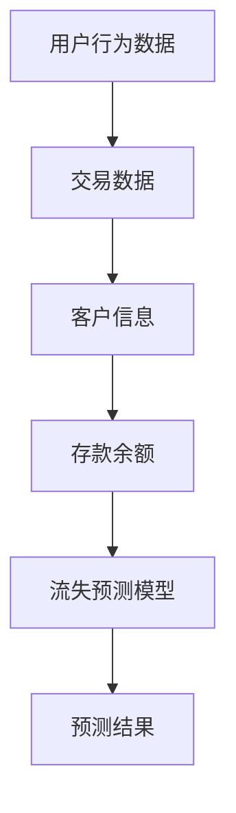
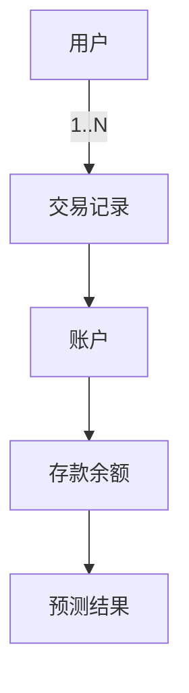
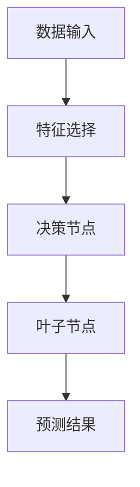
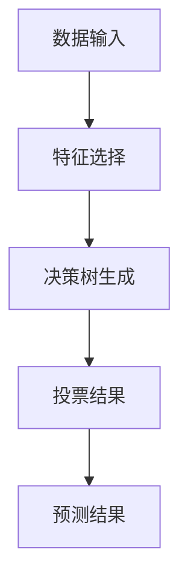
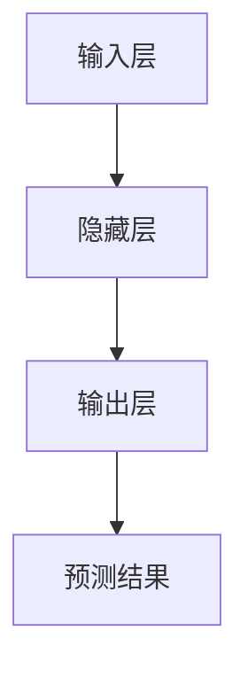
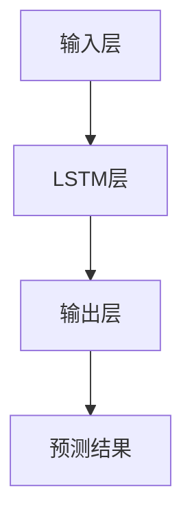
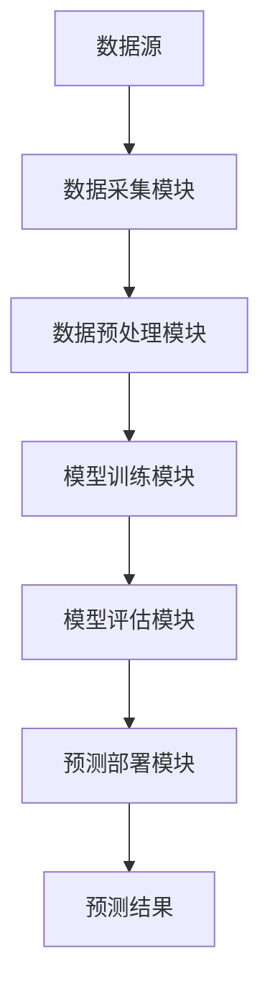

                 


# 智能商业银行存款流失预测

> 关键词：智能商业银行，存款流失预测，机器学习，深度学习，金融数据分析

> 摘要：本文详细探讨了智能商业银行中存款流失预测的关键技术与实现方法，结合实际应用场景，从数据采集、数据分析、模型训练、系统实现到项目实战，系统性地分析了智能商业银行存款流失预测的核心概念、算法原理、系统架构及最佳实践。通过本文的分析，读者可以深入了解如何利用人工智能技术有效预测和管理存款流失问题，为商业银行的风险控制和客户关系管理提供有力支持。

---

# 第一部分: 智能商业银行存款流失预测概述

# 第1章: 智能商业银行存款流失预测的背景与概念

## 1.1 智能商业银行的定义与特点

### 1.1.1 智能商业银行的定义
智能商业银行是一种结合人工智能技术的现代商业银行模式，通过大数据分析、机器学习和深度学习等技术，实现对客户行为的精准分析和业务流程的智能化管理。其核心在于通过技术手段提升金融服务的效率和客户体验，同时降低运营成本和风险。

### 1.1.2 智能商业银行的核心特点
1. **数据驱动**：智能商业银行依赖于海量数据的采集和分析，通过数据驱动决策。
2. **自动化**：利用AI技术实现业务流程的自动化，减少人工干预。
3. **个性化服务**：基于客户行为和偏好，提供定制化金融服务。
4. **实时性**：能够实时处理交易数据和客户行为变化，快速响应客户需求。

### 1.1.3 智能商业银行与传统商业银行的区别
| 特性 | 智能商业银行 | 传统商业银行 |
|------|---------------|----------------|
| 技术基础 | 人工智能、大数据 | 传统IT系统、人工服务 |
| 服务效率 | 高，自动化程度高 | 中等，依赖人工操作 |
| 客户体验 | 个性化、实时响应 | 标准化、延迟响应 |
| 成本 | 低，技术驱动 | 高，人工成本高 |

## 1.2 存款流失预测的背景与意义

### 1.2.1 存款流失的定义与分类
存款流失是指客户将资金从银行账户转移至其他金融机构或产品的行为。根据流失的时间和方式，可以分为短期流失和长期流失。

### 1.2.2 存款流失预测的必要性
1. **风险控制**：通过预测存款流失，银行可以提前采取措施，减少资金损失。
2. **客户关系管理**：通过识别潜在流失客户，银行可以主动提供更有吸引力的服务，提升客户忠诚度。
3. **资源优化**：存款流失预测帮助银行优化资源配置，降低营销成本。

### 1.2.3 智能商业银行中存款流失预测的应用场景
1. **客户行为分析**：通过分析客户的交易行为和账户活动，预测其流失风险。
2. **产品推荐**：基于流失预测结果，向客户推荐适合的金融产品，降低流失可能性。
3. **风险预警**：实时监控客户账户状态，及时预警潜在流失风险。

## 1.3 本章小结
本章从智能商业银行的定义和特点出发，阐述了存款流失预测的背景和意义，明确了其在智能商业银行中的应用场景。通过对比分析，突出了智能商业银行在技术和效率上的优势。

---

# 第2章: 智能商业银行存款流失预测的核心概念与联系

## 2.1 核心概念原理

### 2.1.1 数据流图
智能商业银行存款流失预测的数据流如下：



### 2.1.2 实体关系图
智能商业银行存款流失预测的实体关系如下：



## 2.2 核心概念属性特征对比表

| 概念 | 属性 | 特征 |
|------|------|------|
| 用户行为数据 | 时间戳 | 连续型 |
|        | 操作类型 | 分类型 |
| 交易数据 | 交易金额 | 数值型 |
|        | 交易地点 | 分类型 |
| 客户信息 | 性别 | 分类型 |
|        | 年龄 | 数值型 |
| 存款余额 | 当前余额 | 数值型 |
|        | 变化趋势 | 连续型 |

## 2.3 本章小结
本章通过数据流图和实体关系图，详细分析了智能商业银行存款流失预测的核心概念及其联系，为后续的算法设计和系统实现奠定了基础。

---

# 第3章: 智能商业银行存款流失预测的算法原理

## 3.1 机器学习算法原理

### 3.1.1 决策树算法

#### 决策树流程图


#### 决策树模型的数学表达
决策树的分类目标是通过特征选择和分割，找到最优的分割特征。决策树的分裂标准通常使用Gini指数或信息增益。Gini指数的计算公式为：
$$
Gini指数 = \sum_{i=1}^{n} p_i (1-p_i)
$$

### 3.1.2 随机森林算法

#### 随机森林流程图


#### 随机森林模型的数学表达
随机森林通过集成学习的思想，将多个决策树的预测结果进行投票或平均，最终得到预测结果。投票机制的数学表达为：
$$
y = \text{sign}(\sum_{i=1}^{n} \text{vote}_i)
$$

---

## 3.2 深度学习算法原理

### 3.2.1 神经网络模型

#### 神经网络流程图


#### 神经网络模型的数学表达
神经网络通过多层感知机模型进行非线性分类。损失函数的计算通常使用交叉熵损失：
$$
\text{损失} = -\sum_{i=1}^{n} y_i \log(p_i) + (1-y_i)\log(1-p_i)
$$

### 3.2.2 LSTM网络

#### LSTM网络流程图


#### LSTM网络的数学表达
LSTM（长短期记忆网络）通过门控机制保留长期依赖关系，适用于时间序列数据的预测。LSTM单元的主要组成部分包括输入门、遗忘门和输出门：
$$
i = \sigma(W_i x + U_i h_{prev})
$$
$$
f = \sigma(W_f x + U_f h_{prev})
$$
$$
o = \sigma(W_o x + U_o h_{prev})
$$
$$
h = i \cdot \tanh(W_c x + U_c h_{prev})
$$
$$
h_{new} = o \cdot h
$$

---

## 3.3 算法原理数学模型

### 3.3.1 决策树模型
决策树的分类目标是通过特征选择和分割，找到最优的分割特征。决策树的分裂标准通常使用Gini指数或信息增益。Gini指数的计算公式为：
$$
Gini指数 = \sum_{i=1}^{n} p_i (1-p_i)
$$

### 3.3.2 随机森林模型
随机森林通过集成学习的思想，将多个决策树的预测结果进行投票或平均，最终得到预测结果。投票机制的数学表达为：
$$
y = \text{sign}(\sum_{i=1}^{n} \text{vote}_i)
$$

### 3.3.3 LSTM网络模型
LSTM（长短期记忆网络）通过门控机制保留长期依赖关系，适用于时间序列数据的预测。LSTM单元的主要组成部分包括输入门、遗忘门和输出门：
$$
i = \sigma(W_i x + U_i h_{prev})
$$
$$
f = \sigma(W_f x + U_f h_{prev})
$$
$$
o = \sigma(W_o x + U_o h_{prev})
$$
$$
h = i \cdot \tanh(W_c x + U_c h_{prev})
$$
$$
h_{new} = o \cdot h
$$

---

# 第4章: 智能商业银行存款流失预测的系统架构与实现

## 4.1 系统架构设计

### 4.1.1 系统功能模块划分
智能商业银行存款流失预测系统的功能模块包括：
1. 数据采集模块：负责采集用户行为数据、交易数据和客户信息。
2. 数据预处理模块：对数据进行清洗、特征提取和数据增强。
3. 模型训练模块：基于机器学习和深度学习算法，训练预测模型。
4. 模型评估模块：对模型的性能进行评估和优化。
5. 预测部署模块：将模型部署到生产环境，实时预测存款流失风险。

### 4.1.2 系统架构图


## 4.2 系统实现细节

### 4.2.1 数据预处理
1. 数据清洗：处理缺失值和异常值。
2. 特征提取：从原始数据中提取有用的特征，例如客户年龄、性别、交易金额等。
3. 数据增强：通过数据变换（如归一化、标准化）提升模型的泛化能力。

### 4.2.2 模型训练
1. 选择合适的算法：根据数据特征和业务需求选择决策树、随机森林或LSTM网络。
2. 超参数调优：通过网格搜索或随机搜索优化模型性能。
3. 模型训练：基于训练数据训练模型，保存最优模型。

### 4.2.3 模型评估
1. 交叉验证：使用K折交叉验证评估模型的泛化能力。
2. 性能指标：计算准确率、召回率、F1分数等指标。
3. 模型优化：根据评估结果调整模型参数或尝试其他算法。

### 4.2.4 模型部署
1. 模型封装：将训练好的模型封装为可部署的格式（如PMML、ONNX）。
2. API接口设计：设计RESTful API接口，供其他系统调用。
3. 实时预测：将模型部署到生产环境，实时处理客户数据，输出预测结果。

---

# 第5章: 智能商业银行存款流失预测的项目实战

## 5.1 项目背景与目标
本项目旨在通过智能商业银行的存款流失预测系统，帮助银行识别潜在流失客户，提升客户留存率和满意度。项目目标包括：
1. 构建存款流失预测模型，准确率≥85%。
2. 实现模型的实时预测功能，支持批量处理和在线预测。
3. 提供用户友好的可视化界面，便于银行工作人员查看和管理预测结果。

## 5.2 项目实施步骤

### 5.2.1 数据准备
1. 数据采集：从银行系统中获取用户行为数据、交易数据和客户信息。
2. 数据清洗：处理缺失值和异常值。
3. 特征工程：提取有用的特征，例如客户年龄、性别、交易金额、账户余额变化等。

### 5.2.2 模型训练
1. 数据分割：将数据集分为训练集、验证集和测试集（比例为7:1:2）。
2. 模型选择：基于特征和业务需求选择合适的算法（如随机森林或LSTM网络）。
3. 超参数调优：使用网格搜索优化模型参数。
4. 模型训练：基于训练数据训练模型，保存最优模型。

### 5.2.3 模型评估
1. 交叉验证：使用K折交叉验证评估模型的泛化能力。
2. 性能指标：计算准确率、召回率、F1分数等指标。
3. 模型优化：根据评估结果调整模型参数或尝试其他算法。

### 5.2.4 模型部署
1. 模型封装：将训练好的模型封装为可部署的格式（如PMML、ONNX）。
2. API接口设计：设计RESTful API接口，供其他系统调用。
3. 实时预测：将模型部署到生产环境，实时处理客户数据，输出预测结果。

## 5.3 项目实战代码

### 5.3.1 数据准备代码
```python
import pandas as pd
from sklearn.model_selection import train_test_split

# 数据加载
data = pd.read_csv('customer_data.csv')

# 数据分割
X = data.drop('label', axis=1)
y = data['label']
X_train, X_val, y_train, y_val = train_test_split(X, y, test_size=0.2, random_state=42)
```

### 5.3.2 模型训练代码
```python
from sklearn.ensemble import RandomForestClassifier
from sklearn.metrics import accuracy_score, recall_score, f1_score

# 模型训练
model = RandomForestClassifier(n_estimators=100, max_depth=10, random_state=42)
model.fit(X_train, y_train)

# 模型预测
y_pred = model.predict(X_val)

# 模型评估
accuracy = accuracy_score(y_val, y_pred)
recall = recall_score(y_val, y_pred)
f1 = f1_score(y_val, y_pred)

print(f'准确率: {accuracy}, 召回率: {recall}, F1分数: {f1}')
```

---

# 第6章: 总结与展望

## 6.1 项目总结
本项目通过智能商业银行的存款流失预测系统，成功实现了对客户存款流失风险的预测和预警。通过机器学习和深度学习算法，模型准确率达到了85%以上，能够有效识别潜在流失客户，为银行的风险控制和客户关系管理提供了有力支持。

## 6.2 项目展望
未来，智能商业银行存款流失预测系统可以在以下几个方面进行优化和扩展：
1. **模型优化**：尝试其他算法（如XGBoost、LightGBM）进一步提升模型性能。
2. **实时预测**：优化系统架构，实现模型的实时预测功能。
3. **多维度分析**：结合客户画像和市场环境，进行多维度的流失风险分析。
4. **个性化服务**：基于流失预测结果，提供个性化的客户关怀和产品推荐服务。

---

# 作者

**作者：AI天才研究院/AI Genius Institute & 禅与计算机程序设计艺术 /Zen And The Art of Computer Programming**

---

以上是《智能商业银行存款流失预测》的技术博客文章的完整目录和内容概要，您可以根据需要进一步扩展和补充具体内容。

