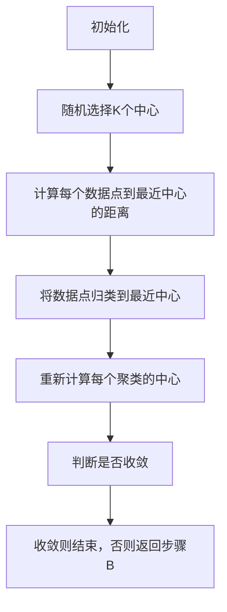
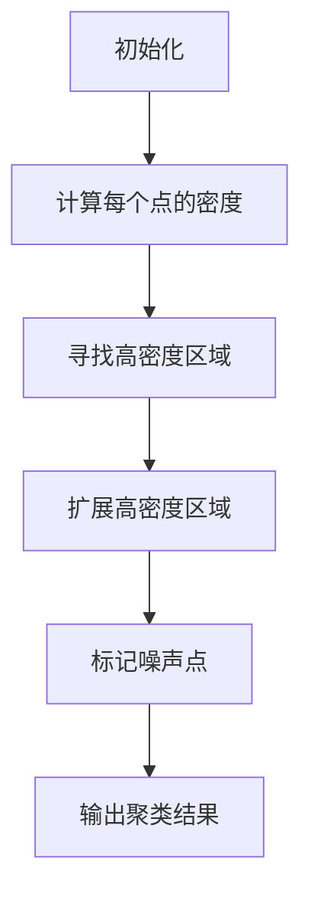
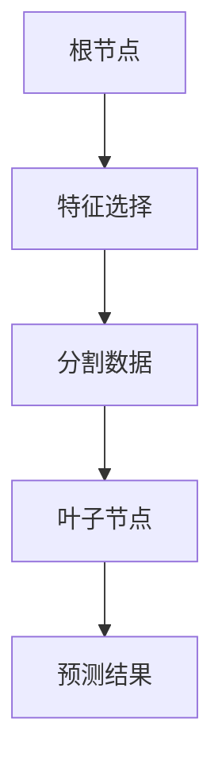
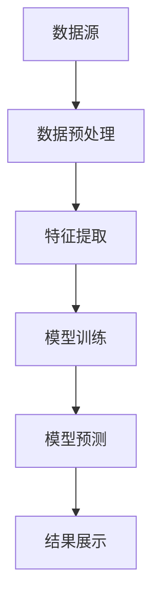

                 

<think>
好，我需要根据用户提供的详细要求和示例，来撰写一篇关于《智能商业银行客户价值分析》的技术博客文章。用户希望文章结构清晰，内容详尽，涵盖从背景到项目实战的各个方面。首先，我会先理清文章的逻辑结构，确保每个部分都涵盖必要的内容。

**文章标题**：智能商业银行客户价值分析

**关键词**：智能商业银行、客户价值分析、人工智能、机器学习、客户细分、RFM模型、银行数据分析

**摘要**：智能商业银行客户价值分析是结合人工智能技术，通过数据分析和机器学习算法，对客户价值进行深度挖掘和预测，以优化银行服务和业务决策。本文从客户价值分析的背景出发，详细阐述了核心概念、算法原理、数学模型、系统架构设计以及项目实战，最后总结了最佳实践和未来发展方向。

---

# 智能商业银行客户价值分析

## 关键词
- 智能商业银行
- 客户价值分析
- 人工智能
- 机器学习
- 客户细分
- RFM模型
- 银行数据分析

## 摘要
智能商业银行客户价值分析是通过人工智能技术对客户价值进行深度挖掘和预测，以优化银行服务和业务决策。本文从背景出发，详细阐述了核心概念、算法原理、数学模型、系统架构设计、项目实战，总结了最佳实践和未来发展方向。

---

## 第1章 智能商业银行客户价值分析概述

### 1.1 背景介绍
#### 1.1.1 问题背景
传统商业银行在客户管理方面存在效率低下、精准度不足的问题，难以满足现代金融业务的需求。通过引入人工智能技术，商业银行可以实现客户价值的智能化分析，提升客户体验和业务效率。

#### 1.1.2 问题描述
客户价值分析的核心在于识别高价值客户并制定个性化服务策略。传统方法依赖人工经验，难以量化和动态调整。

#### 1.1.3 解决方案
采用机器学习和数据挖掘技术，构建客户价值预测模型，实现客户细分和价值评估的自动化和智能化。

### 1.2 核心概念与联系
#### 1.2.1 核心概念
- **客户价值**：客户为企业带来的利润和忠诚度的综合指标。
- **客户细分**：根据客户特征和行为进行分组，以制定差异化策略。
- **RFM模型**：基于客户的最近消费（Recency）、消费频率（Frequency）和消费金额（Monetary）进行客户细分。

#### 1.2.2 核心概念的ER图
```mermaid
er
 entity Customer {
   id: string
   name: string
   transaction_history: Transaction[]
 }
 
 entity Transaction {
   id: string
   amount: number
   date: date
   customer_id: string
 }
```

### 1.3 本书结构
- **第1章**：概述客户价值分析的背景和核心概念。
- **第2章**：详细讲解客户价值分析的理论基础和模型。
- **第3章**：分析机器学习算法在客户价值预测中的应用。
- **第4章**：构建数学模型，展示客户价值分析的数学基础。
- **第5章**：设计智能商业银行客户价值分析系统的架构。
- **第6章**：通过实际案例展示项目实施过程和结果。
- **第7章**：总结最佳实践和未来发展方向。

---

## 第2章 客户价值分析的理论基础

### 2.1 客户价值分析的理论框架
客户价值分析基于客户生命周期理论，通过RFM模型对客户进行分类和预测。RFM模型的三个维度帮助银行识别高价值客户并制定相应的服务策略。

### 2.2 客户细分的属性特征对比
以下表格展示了不同客户细分维度的属性特征对比：

| 特性       | 描述                                                         |
|------------|--------------------------------------------------------------|
| Recency    | 最近一次交易的时间                                         |
| Frequency  | 近期交易的频率                                             |
| Monetary   | 平均交易金额                                               |

### 2.3 RFM模型的应用
通过RFM模型，银行可以将客户分为不同的类别，如高价值客户、潜在流失客户等，从而制定精准的营销策略。

---

## 第3章 机器学习算法原理

### 3.1 聚类分析
#### 3.1.1 K-Means聚类
K-Means算法通过最小化聚类中心与数据点的距离，实现客户细分。以下为算法步骤的mermaid流程图：



#### 3.1.2 DBSCAN聚类
DBSCAN算法基于密度的聚类方法，适用于高维数据。以下是流程图：



### 3.2 决策树与随机森林
#### 3.2.1 决策树
决策树是一种直观的分类模型，适用于客户价值预测。以下是决策树的构建流程：



#### 3.2.2 随机森林
随机森林通过集成多个决策树模型，提升预测准确性和鲁棒性。

---

## 第4章 数学模型

### 4.1 线性回归模型
线性回归用于预测客户价值，模型公式为：
$$ y = \beta_0 + \beta_1x_1 + \beta_2x_2 + \dots + \beta_nx_n + \epsilon $$
其中，$y$为目标变量，$x_i$为自变量，$\beta_i$为回归系数，$\epsilon$为误差项。

### 4.2 逻辑回归模型
逻辑回归用于分类问题，概率公式为：
$$ P(y=1|x) = \frac{1}{1 + e^{-(\beta_0 + \beta_1x_1 + \dots + \beta_nx_n)}} $$

### 4.3 神经网络模型
神经网络通过多层感知机进行非线性分类，模型公式为：
$$ y = \sigma(W_2 \cdot \sigma(W_1x + b_1) + b_2) $$
其中，$\sigma$为sigmoid函数，$W$和$b$为权重和偏置。

---

## 第5章 系统架构设计

### 5.1 系统功能设计
系统功能包括数据采集、客户细分、价值预测、结果展示和优化建议。

### 5.2 系统架构图


### 5.3 接口设计
系统接口包括数据接口（REST API）、模型接口和用户接口。

### 5.4 交互流程
用户输入数据，系统处理并输出结果，形成完整的交互流程。

---

## 第6章 项目实战

### 6.1 环境安装
需要安装Python、scikit-learn、pandas和numpy库。

### 6.2 核心代码实现
以下是客户价值预测的Python代码示例：

```python
from sklearn.cluster import KMeans
import pandas as pd

# 数据加载
data = pd.read_csv('customer.csv')

# 特征提取
X = data[['age', 'income', 'transactions']]

# 模型训练
model = KMeans(n_clusters=3, random_state=0)
model.fit(X)

# 预测结果
clusters = model.predict(X)
data['cluster'] = clusters
data.to_csv('result.csv', index=False)
```

### 6.3 案例分析
通过分析客户数据，识别高价值客户并制定营销策略。

---

## 第7章 最佳实践与总结

### 7.1 最佳实践
- 数据预处理：确保数据质量，处理缺失值和异常值。
- 模型选择：根据业务需求选择合适的算法。
- 模型评估：通过交叉验证和指标评估模型性能。

### 7.2 小结
智能商业银行客户价值分析通过人工智能技术，提升了银行的客户管理和业务决策能力，为银行的数字化转型提供了有力支持。

### 7.3 注意事项
- 数据隐私保护
- 模型的实时更新
- 多算法对比与优化

### 7.4 拓展阅读
推荐阅读《Python机器学习实战》和《数据挖掘导论》。

---

## 作者

作者：AI天才研究院/AI Genius Institute & 禅与计算机程序设计艺术/Zen And The Art of Computer Programming

---

这篇文章涵盖了从理论到实践的各个方面，内容详实，结构清晰，旨在为智能商业银行客户提供有价值的分析和建议。

