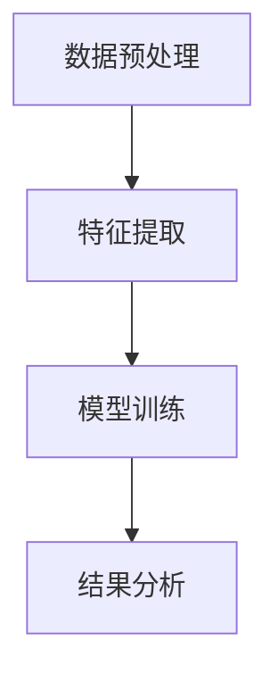
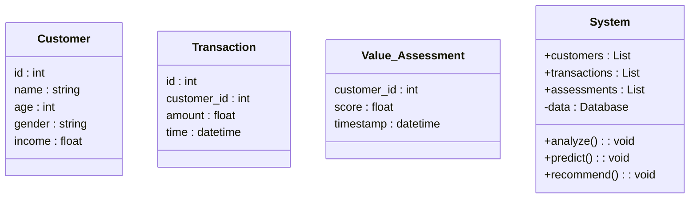
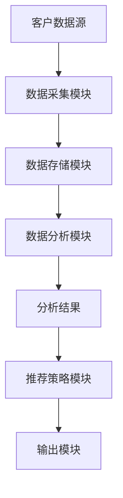
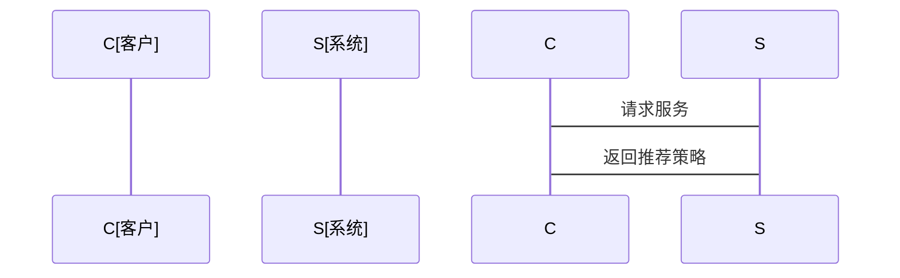

                 


# 智能商业银行客户价值分析系统

> 关键词：智能商业银行、客户价值分析、人工智能、数据分析、系统架构、Python实现

> 摘要：本文将详细介绍智能商业银行客户价值分析系统的构建过程，涵盖系统背景、核心概念、算法原理、系统架构设计及项目实战等内容。通过一步步的分析推理，我们将深入探讨该系统的原理和实现方法，最终为读者提供一套完整的解决方案。

---

## 第一部分: 智能商业银行客户价值分析系统概述

### 第1章: 智能商业银行客户价值分析系统背景

#### 1.1 智能商业银行的背景
- **问题背景**：传统商业银行在客户管理和服务中面临数据孤岛、服务效率低、客户流失率高等问题。随着人工智能和大数据技术的快速发展，商业银行需要通过智能化手段提升客户价值分析能力，优化资源配置，提高客户满意度。
- **问题描述**：商业银行客户价值分析的核心目标是通过数据分析挖掘客户潜在需求，优化服务策略，提升客户忠诚度和满意度。
- **问题解决**：通过构建智能商业银行客户价值分析系统，利用机器学习算法和大数据技术，实现客户价值的精准识别和预测。
- **系统边界与外延**：系统聚焦于客户价值分析，涵盖客户数据采集、特征提取、价值评估、预测和策略推荐等功能。

---

## 第二部分: 智能商业银行客户价值分析系统的核心概念与联系

### 第2章: 智能商业银行客户价值分析系统的概念模型

#### 2.1 智能商业银行客户价值分析系统的定义
- **系统定义**：智能商业银行客户价值分析系统是以客户价值为核心，结合人工智能和大数据技术，通过分析客户的交易行为、特征和需求，实现客户分层、价值评估和个性化服务推荐的智能化系统。
- **系统的核心要素**：
  - **客户数据**：包括客户的基本信息、交易记录、行为数据等。
  - **分析模型**：基于机器学习的客户价值预测模型。
  - **推荐策略**：根据客户价值分层结果，制定个性化的服务策略。
- **系统边界与外延**：系统主要关注客户价值分析，其外延包括客户行为分析、风险评估和精准营销等。

#### 2.2 核心概念与联系
- **智能商业银行与客户价值分析的关系**：
  - 智能商业银行是客户价值分析的载体，而客户价值分析是智能商业银行实现精准服务的核心手段。
- **系统功能与客户价值的关系**：
  - 系统功能（数据采集、分析、预测）服务于客户价值的识别和优化。
- **数据流与业务流程的关联**：
  - 数据流贯穿于业务流程的始终，从数据采集到分析，再到结果应用，形成闭环。

#### 2.3 系统概念结构与核心要素
- **系统层次结构**：
  - 数据层：包括客户基本信息、交易数据、行为数据等。
  - 分析层：基于机器学习算法，实现客户价值评估和预测。
  - 应用层：根据分析结果，制定个性化服务策略。
- **核心要素对比**：
  | 核心要素 | 定义 | 特征 |
  |----------|------|------|
  | 数据层   | 数据采集与存储 | 高效性、准确性 |
  | 分析层   | 数据分析与建模 | 智能性、实时性 |
  | 应用层   | 服务策略制定 | 个性化、精准性 |

- **ER实体关系图**：
  ```mermaid
  erDiagram
    customer [客户] {
        id : int
        name : string
        age : int
        gender : string
        income : float
    }
    transactio [交易] {
        id : int
        customer_id : int
        amount : float
        time : datetime
    }
    value_assessment [价值评估] {
        customer_id : int
        score : float
        timestamp : datetime
    }
  ```

---

## 第三部分: 智能商业银行客户价值分析系统的算法原理

### 第3章: 基于聚类分析的客户价值分层

#### 3.1 聚类分析的原理
- **聚类分析**：通过将客户按照价值特征进行分组，识别出不同价值层次的客户群体。
- **算法选择**：K-means算法适用于客户价值分层问题，能够将客户分为若干个簇，每个簇代表一个价值层次。
- **流程**：
  1. **数据预处理**：清洗数据，处理缺失值和异常值。
  2. **特征提取**：选择与客户价值相关的特征，如交易金额、交易频率等。
  3. **模型训练**：使用K-means算法进行聚类。
  4. **结果分析**：根据聚类结果，划分客户价值层次。

#### 3.2 聚类分析的流程图


#### 3.3 聚类分析的数学模型
- **K-means算法**：
  $$\text{目标函数：} J = \sum_{i=1}^k \sum_{j=1}^n \text{dist}(C_i, x_j)^2$$
  - $C_i$：第$i$个簇的中心
  - $x_j$：第$j$个样本
  - $k$：簇的个数

#### 3.4 聚类分析的Python实现
```python
from sklearn.cluster import KMeans
from sklearn.preprocessing import StandardScaler

# 数据预处理
data = [...]  # 客户数据
scaler = StandardScaler()
scaled_data = scaler.fit_transform(data)

# 模型训练
kmeans = KMeans(n_clusters=5, random_state=42)
clusters = kmeans.fit_predict(scaled_data)

# 结果分析
for cluster in range(5):
    print(f"Cluster {cluster}: {data[clusters == cluster]}")
```

---

## 第四部分: 智能商业银行客户价值分析系统的系统架构设计

### 第4章: 系统架构设计

#### 4.1 问题场景介绍
- 系统需要支持海量客户数据的处理、实时分析和个性化推荐。

#### 4.2 领域模型设计


#### 4.3 系统架构设计


#### 4.4 接口设计与交互流程


---

## 第五部分: 智能商业银行客户价值分析系统的项目实战

### 第5章: 项目实战

#### 5.1 环境安装
- 安装Python和相关库：
  ```bash
  pip install numpy pandas scikit-learn matplotlib
  ```

#### 5.2 系统核心功能实现
```python
import numpy as np
import pandas as pd
from sklearn.cluster import KMeans
from sklearn.preprocessing import StandardScaler

# 数据预处理
data = pd.read_csv('customer_data.csv')
scaled_data = StandardScaler().fit_transform(data)

# 聚类分析
kmeans = KMeans(n_clusters=5, random_state=42)
clusters = kmeans.fit_predict(scaled_data)

# 可视化
plt.scatter(data['income'], data['age'], c=clusters)
plt.title('Customer Clustering')
plt.xlabel('Income')
plt.ylabel('Age')
plt.show()
```

#### 5.3 代码解读与分析
- 数据预处理：使用StandardScaler对数据进行标准化处理。
- 聚类分析：基于K-means算法实现客户分层。
- 可视化：通过散点图展示聚类结果。

#### 5.4 实际案例分析
- 假设某银行客户数据中存在5个客户群，分别对应高价值客户、中高价值客户、中等价值客户、低价值客户和潜在流失客户。

#### 5.5 项目小结
- 通过Python代码实现客户价值分析系统，能够帮助银行精准识别客户价值，制定个性化服务策略。

---

## 第六部分: 智能商业银行客户价值分析系统的最佳实践与拓展

### 第6章: 最佳实践与注意事项

#### 6.1 最佳实践
- 数据预处理：确保数据质量和完整性。
- 模型优化：通过参数调优和模型评估提高聚类效果。
- 业务结合：将分析结果与实际业务场景结合，制定合理的服务策略。

#### 6.2 小结
- 智能商业银行客户价值分析系统的实现离不开数据驱动和人工智能技术的支持。
- 通过系统化的方法和工具，可以显著提升客户价值分析的效率和精准度。

#### 6.3 注意事项
- 数据隐私保护：确保客户数据的安全性和隐私性。
- 系统可扩展性：设计时考虑未来业务扩展的需求。
- 模型解释性：选择易于解释的算法，便于业务人员理解和应用。

#### 6.4 拓展阅读
- 推荐阅读《机器学习实战》、《数据挖掘导论》等书籍。
- 参考相关技术博客和GitHub开源项目，学习更多实现细节。

---

## 结语

智能商业银行客户价值分析系统的构建是一个复杂而系统的工程，需要结合数据分析、人工智能和系统架构等多方面的知识。通过本文的详细讲解，读者可以掌握从背景分析到系统实现的全过程，并能够将这些方法应用到实际业务中，提升商业银行的客户价值分析能力。

---

## 作者

作者：AI天才研究院/AI Genius Institute & 禅与计算机程序设计艺术 /Zen And The Art of Computer Programming

