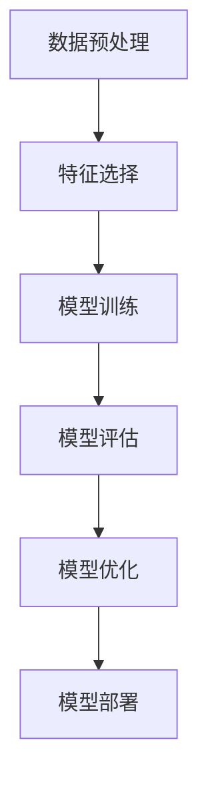
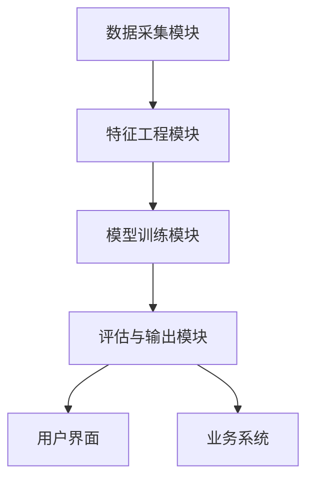
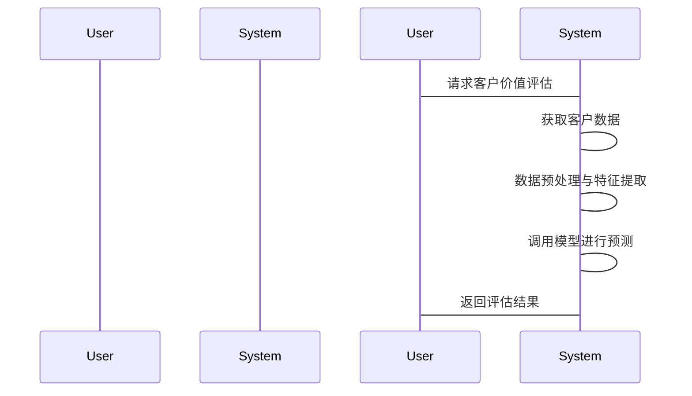

                 


# 智能商业银行客户价值评估模型

> 关键词：智能商业银行、客户价值评估、机器学习、数据挖掘、金融模型

> 摘要：本文详细探讨了智能商业银行客户价值评估模型的设计与实现，涵盖背景分析、核心概念、算法原理、系统架构、项目实战及总结。通过机器学习和大数据技术，模型有效提升客户价值评估的准确性和实时性，为商业银行优化资源配置和风险控制提供有力支持。

---

## 第一部分：智能商业银行客户价值评估模型概述

### 第1章：客户价值评估模型的背景与意义

#### 1.1 问题背景
- **1.1.1 商业银行客户价值评估的重要性**  
  在金融行业中，客户价值评估是商业银行优化资源配置、提高客户满意度和业务增长的关键环节。传统评估方法依赖人工经验，存在主观性强、效率低、精度不足等问题，难以满足现代银行业的智能化需求。

- **1.1.2 当前客户价值评估的挑战**  
  传统评估方法面临数据维度单一、难以量化客户长期价值、难以实时更新等问题。同时，客户需求日益多样化，银行需要更加精准和动态的客户价值评估方法。

- **1.1.3 智能化评估的必要性**  
  随着大数据和人工智能技术的发展，智能化客户价值评估模型能够通过多维度数据和复杂算法，提供更精准、实时的评估结果，帮助银行制定个性化的服务策略，提升客户满意度和业务收益。

#### 1.2 问题描述
- **1.2.1 客户价值的多维度定义**  
  客户价值不仅包括直接的金融贡献，如存款、贷款和理财收入，还包括客户生命周期价值、客户影响力和客户忠诚度等。

- **1.2.2 传统评估方法的局限性**  
  传统方法通常基于简单的财务指标，忽视了客户行为数据、市场趋势和宏观经济因素，导致评估结果不够准确。

- **1.2.3 智能化评估的目标与范围**  
  智能评估目标是通过机器学习算法，整合多维度数据，构建动态、精准的客户价值预测模型，覆盖客户全生命周期的各个阶段。

#### 1.3 问题解决思路
- **1.3.1 数据驱动的解决方案**  
  通过收集和分析客户的交易数据、行为数据、人口统计数据等，构建多维度的数据特征，为模型提供丰富的输入。

- **1.3.2 智能算法的应用场景**  
  使用机器学习算法（如随机森林、神经网络等）对客户数据进行建模和训练，实现客户价值的精准预测。

- **1.3.3 业务价值的实现路径**  
  智能模型帮助银行识别高价值客户，优化资源配置，提升客户满意度，降低客户流失率，实现业务增长。

#### 1.4 模型的边界与外延
- **1.4.1 模型的应用边界**  
  本模型主要用于评估现有客户和潜在客户的价值，不涉及客户的信用评分和欺诈检测。

- **1.4.2 相关领域的外延**  
  模型可以与客户画像、精准营销、风险控制等系统结合，形成完整的客户关系管理解决方案。

- **1.4.3 模型与其他系统的接口**  
  模型需要与银行的核心系统、数据分析平台和营销系统进行集成，确保数据的实时共享和业务流程的无缝对接。

#### 1.5 核心概念与组成
- **1.5.1 模型的核心要素**  
  包括客户数据、模型算法、评估指标和业务规则。

- **1.5.2 模型的组成结构**  
  由数据采集模块、特征工程模块、模型训练模块和评估结果输出模块组成。

- **1.5.3 模型的输入与输出**  
  输入包括客户的基本信息、交易数据、行为数据等，输出包括客户价值评分、客户分层结果和个性化服务建议。

### 1.6 本章小结
本章详细介绍了智能商业银行客户价值评估模型的背景、意义、核心概念和组成结构，为后续章节的模型构建和实现奠定了基础。

---

## 第二部分：智能客户价值评估模型的核心概念

### 第2章：模型的核心概念与原理

#### 2.1 模型的原理与机制
- **2.1.1 数据采集与处理**  
  通过银行系统获取客户数据，包括基本信息、交易记录、行为数据等，并进行数据清洗和特征提取。

- **2.1.2 特征提取与选择**  
  使用统计学方法和机器学习技术，从原始数据中提取高价值特征，如交易频率、金额大小、客户活跃度等。

- **2.1.3 模型训练与优化**  
  使用训练数据对机器学习模型进行训练，通过交叉验证和调参优化模型性能。

#### 2.2 核心概念的属性对比
- **2.2.1 数据特征对比表**  
  下表展示了客户价值评估中常用的几个特征及其属性：

  | 特征名称      | 数据类型 | 是否数值型 | 是否分类型 | 是否相关性 |
  |---------------|----------|------------|------------|------------|
  | 年龄          | 数值型   | 是         | 否         | 中等       |
  | 收入          | 数值型   | 是         | 否         | 高         |
  | 信用卡使用频率| 数值型   | 是         | 否         | 高         |

- **2.2.2 模型算法对比表**  
  下表展示了几种常用的机器学习算法及其特点：

  | 算法名称       | 优势               | 劣势               |
  |----------------|--------------------|--------------------|
  | 随机森林       | 高准确性，抗过拟合   | 对特征重要性解释性较差 |
  | 线性回归       | 简单易解释         | 适用于线性关系     |
  | 支持向量机     | 高维数据表现好     | 参数敏感          |

- **2.2.3 评估指标对比表**  
  下表展示了几种常用的评估指标及其适用场景：

  | 指标名称       | 计算公式             | 适用场景             |
  |----------------|----------------------|----------------------|
  | 准确率         | 正确预测数 / 总样本数 | 分类任务整体表现     |
  | 召回率         | 正确预测的正例数 / 总正例数 | 分类任务中关注正例的召回 |
  | F1分数         | 2 * (precision * recall) / (precision + recall) | 平衡准确率和召回率   |

#### 2.3 ER实体关系图
```mermaid
er
    Customer (
        customerId (PK),
        customerName,
        customerType,
        customerValue,
        customerScore
    )
    Model (
        modelId (PK),
        modelName,
        modelVersion,
        modelDescription
    )
    Feature (
        featureId (PK),
        featureName,
        featureType,
        featureImportance
    )
    TrainingData (
        trainingDataId (PK),
        trainingDate,
        trainingSampleCount,
        trainingAccuracy
    )
    relationship from Customer to Model: one to many
    relationship from Model to Feature: one to many
    relationship from TrainingData to Model: one to many
```

### 2.4 本章小结
本章详细介绍了智能客户价值评估模型的核心概念，包括模型的原理、特征属性对比和ER实体关系图，为后续的算法实现奠定了基础。

---

## 第三部分：智能客户价值评估模型的算法原理

### 第3章：模型的算法原理

#### 3.1 算法选择与优化
- **3.1.1 算法选择**  
  基于模型的预测精度和计算效率，选择随机森林作为模型算法。随机森林具有高准确性和抗过拟合的特点，适合处理高维数据和非线性关系。

- **3.1.2 算法优化**  
  使用网格搜索（Grid Search）进行参数调优，如调整树的深度、叶子节点数和树的数量，以提高模型性能。

#### 3.2 算法实现流程


#### 3.3 算法的数学模型
- **随机森林模型**  
  随机森林是一种基于决策树的集成学习算法，通过构建多棵决策树并进行投票或平均，提高模型的准确性和鲁棒性。其数学模型可以表示为：

  $$ y = \text{sign}(\sum_{i=1}^{n} \text{tree}_i(x)) $$

  其中，$y$ 是预测结果，$\text{tree}_i(x)$ 是第 $i$ 棵决策树的输出，$n$ 是决策树的数量。

- **特征重要性计算**  
  使用特征重要性评分（如Gini重要性）来衡量每个特征对模型的贡献度，公式如下：

  $$ \text{featureImportance}_i = \sum_{j=1}^{n} \text{gini}(j) \times \text{split}_i(j) $$

  其中，$\text{gini}(j)$ 是第 $j$ 个节点的基尼指数，$\text{split}_i(j)$ 是第 $i$ 个特征在第 $j$ 个节点的分裂情况。

#### 3.4 算法实现代码
```python
import pandas as pd
from sklearn.ensemble import RandomForestClassifier
from sklearn.metrics import accuracy_score
from sklearn.model_selection import train_test_split

# 数据加载与预处理
data = pd.read_csv('customer_value.csv')
X = data.drop('customerValue', axis=1)
y = data['customerValue']

# 数据分割
X_train, X_test, y_train, y_test = train_test_split(X, y, test_size=0.2, random_state=42)

# 模型训练
model = RandomForestClassifier(n_estimators=100, max_depth=10, random_state=42)
model.fit(X_train, y_train)

# 模型评估
y_pred = model.predict(X_test)
print(f'模型准确率: {accuracy_score(y_test, y_pred):.4f}')
```

#### 3.5 算法实现案例分析
通过实际数据集训练随机森林模型，输出客户价值评分和分类结果。例如，某客户的历史交易数据和行为数据经过模型处理后，得到客户价值评分为0.85，属于高价值客户。

### 3.6 本章小结
本章详细讲解了模型算法的选择与优化，展示了随机森林算法的实现流程、数学模型和代码实现，通过案例分析验证了模型的有效性。

---

## 第四部分：智能客户价值评估模型的系统架构设计

### 第4章：系统架构设计

#### 4.1 系统功能设计
- **4.1.1 数据采集模块**  
  负责收集客户的基本信息、交易记录、行为数据等，存储在数据仓库中。

- **4.1.2 特征工程模块**  
  对数据进行清洗、转换和特征提取，生成模型所需的输入数据。

- **4.1.3 模型训练模块**  
  使用训练数据对随机森林模型进行训练和优化，生成最终的模型。

- **4.1.4 评估与输出模块**  
  对模型进行评估，输出客户价值评分和个性化服务建议。

#### 4.2 系统架构图


#### 4.3 系统接口设计
- **API接口设计**  
  提供RESTful API接口，供其他系统调用客户价值评估结果。

- **数据接口设计**  
  使用JDBC或API连接数据仓库，实时获取客户数据。

#### 4.4 系统交互流程


### 4.5 本章小结
本章详细设计了智能客户价值评估系统的架构，包括功能模块、系统交互流程和接口设计，确保系统的可扩展性和稳定性。

---

## 第五部分：智能客户价值评估模型的项目实战

### 第5章：项目实战

#### 5.1 环境安装与配置
- **5.1.1 安装Python环境**  
  使用Anaconda或Miniconda安装Python 3.8及以上版本。

- **5.1.2 安装依赖库**  
  安装scikit-learn、pandas、numpy等机器学习库。

#### 5.2 核心代码实现
- **数据加载与预处理**  
  ```python
  import pandas as pd
  data = pd.read_csv('customer_value.csv')
  data = data.dropna()
  ```

- **特征选择与模型训练**  
  ```python
  from sklearn.ensemble import RandomForestClassifier
  model = RandomForestClassifier(n_estimators=100, max_depth=10, random_state=42)
  model.fit(X_train, y_train)
  ```

- **模型评估与输出**  
  ```python
  from sklearn.metrics import classification_report
  print(classification_report(y_test, y_pred))
  ```

#### 5.3 案例分析与结果解读
- **案例分析**  
  以某银行客户为例，模型预测该客户的价值评分为0.9，属于高价值客户。

- **结果解读**  
  模型输出客户价值评分和分层结果，帮助银行制定个性化服务策略。

#### 5.4 项目小结
本章通过实际项目展示了模型的实现过程，从环境配置到代码实现，再到结果解读，帮助读者掌握模型的实际应用。

---

## 第六部分：总结与展望

### 第6章：总结与展望

#### 6.1 总结
本文详细介绍了智能商业银行客户价值评估模型的设计与实现，涵盖了背景分析、核心概念、算法原理、系统架构和项目实战。通过随机森林算法和大数据技术，模型能够实现客户价值的精准评估，为商业银行优化资源配置和风险控制提供有力支持。

#### 6.2 展望
未来，随着人工智能和大数据技术的不断发展，客户价值评估模型将更加智能化和个性化。模型可以进一步结合自然语言处理和强化学习技术，提升评估的准确性和实时性，为商业银行创造更大的业务价值。

---

## 作者：AI天才研究院/AI Genius Institute & 禅与计算机程序设计艺术/Zen And The Art of Computer Programming

---

**本文版权归作者所有，转载请注明出处。**

