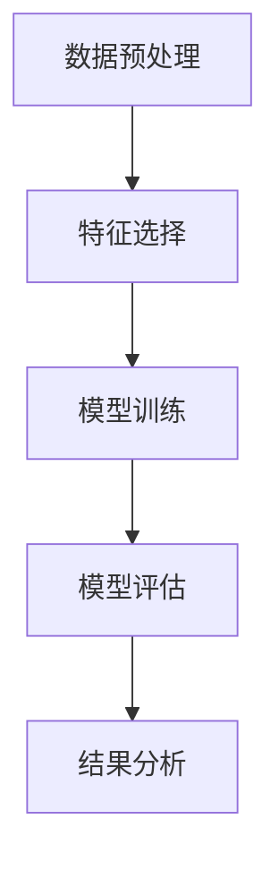
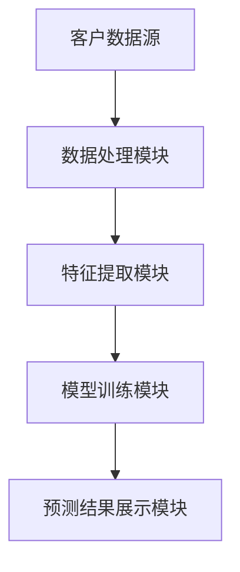
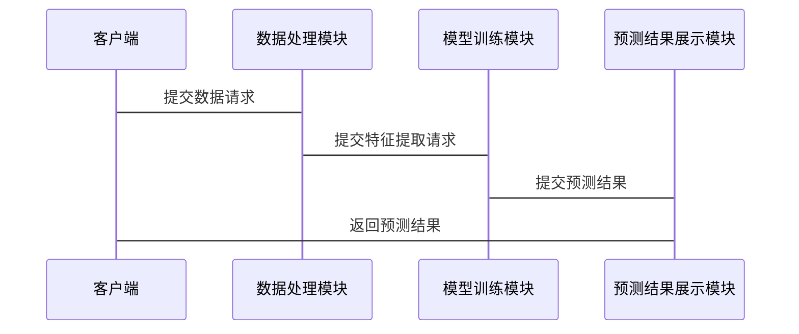

                 


# 智能商业银行客户流失预测

> 关键词：智能商业银行，客户流失预测，机器学习，数据挖掘，系统架构，项目实战

> 摘要：本文深入探讨智能商业银行客户流失预测的核心概念、算法原理、系统架构及项目实现。通过分析客户行为数据，结合机器学习算法，构建预测模型，并设计智能预测系统，帮助商业银行有效降低客户流失率。文章从理论到实践，详细阐述了智能客户流失预测的全过程，为商业银行数字化转型提供参考。

---

## 第一部分：智能商业银行客户流失预测的背景与基础

### 第1章：智能商业银行客户流失预测概述

#### 1.1 智能商业银行的背景与特点

##### 1.1.1 传统商业银行的业务模式
传统商业银行通过分支机构和柜员提供服务，依赖人工审核和管理，业务流程繁琐，客户体验较差。其核心业务包括存款、贷款、理财等，但服务模式相对单一。

##### 1.1.2 智能商业银行的核心特征
智能商业银行借助人工智能、大数据、云计算等技术，实现业务流程自动化、服务个性化和决策智能化。其核心特征包括：
- **数据驱动**：通过收集和分析海量客户数据，提供精准的金融服务。
- **智能推荐**：利用机器学习算法，为客户提供个性化的产品推荐。
- **实时响应**：通过自动化系统，快速响应客户需求和市场变化。
- **风险管理**：运用智能算法，实时监测和评估风险，保障资产安全。

##### 1.1.3 数字化转型对商业银行的影响
数字化转型使商业银行能够更高效地服务客户，提升客户体验，降低运营成本。通过数字化技术，商业银行可以更好地应对市场竞争，提升核心竞争力。

#### 1.2 客户流失的定义与影响

##### 1.2.1 客户流失的定义与分类
客户流失指客户不再使用商业银行的产品或服务，导致收入减少的现象。根据客户流失的原因，可以分为以下几类：
- **自然流失**：客户因自身需求变化或满意度下降而主动离开。
- **竞争流失**：客户被其他银行的产品或服务吸引，转而选择竞争对手。
- **策略流失**：商业银行因内部策略调整，主动放弃某些客户群体。

##### 1.2.2 客户流失对商业银行的影响
客户流失对商业银行的影响是多方面的：
- **收入减少**：流失客户可能导致直接收入损失。
- **成本增加**：获取新客户成本远高于保留现有客户。
- **声誉受损**：客户流失可能影响商业银行的市场形象。
- **风险增加**：客户流失可能导致资产质量下降，增加信用风险。

##### 1.2.3 客户流失预测的业务价值
通过客户流失预测，商业银行可以提前识别潜在流失客户，采取针对性措施，降低客户流失率，提升客户满意度和忠诚度。这不仅有助于稳定客户群体，还能通过精准营销提高收入。

#### 1.3 智能客户流失预测的核心概念

##### 1.3.1 数据驱动的客户行为分析
通过收集和分析客户的行为数据（如交易频率、金额、时间等），可以发现客户的消费习惯和行为模式，从而预测客户流失的可能性。

##### 1.3.2 机器学习在客户流失预测中的应用
机器学习算法（如逻辑回归、随机森林、神经网络等）可以有效处理非线性关系，捕捉客户流失的隐含特征，提供高精度的预测结果。

##### 1.3.3 智能预测系统的构建目标
智能预测系统的构建目标包括：
- 提供实时或近实时的客户流失预测结果。
- 提供可解释的预测结果，帮助业务人员理解预测依据。
- 提供动态更新的预测模型，适应市场变化和客户需求。

#### 1.4 本章小结
本章介绍了智能商业银行的基本概念、客户流失的定义与影响，以及智能客户流失预测的核心概念。通过这些内容，读者可以理解智能商业银行客户流失预测的背景和重要性。

---

## 第二部分：智能商业银行客户流失预测的核心概念与联系

### 第2章：客户流失预测的背景与问题分析

#### 2.1 客户流失问题的背景

##### 2.1.1 商业银行客户流失的现状
随着市场竞争加剧，客户流失率逐年上升，尤其是在互联网金融和第三方支付平台的冲击下，商业银行客户流失问题更加突出。

##### 2.1.2 数字化客户关系管理的重要性
通过数字化手段，商业银行可以更精准地了解客户需求，提供个性化服务，增强客户粘性。

##### 2.1.3 客户流失预测的行业需求
客户流失预测是商业银行数字化转型的重要组成部分，通过预测模型，银行可以提前采取措施，降低客户流失率。

#### 2.2 客户流失预测的核心问题

##### 2.2.1 客户行为数据的收集与分析
客户行为数据包括交易数据、客户属性数据、产品使用数据等，是客户流失预测的基础。

##### 2.2.2 客户流失预测的模型构建
模型构建需要选择合适的算法，进行特征工程，优化模型参数，确保预测结果的准确性。

##### 2.2.3 预测结果的应用场景
预测结果可以用于客户保留、精准营销、风险控制等场景。

#### 2.3 问题解决的思路与方法

##### 2.3.1 数据驱动的预测方法
通过数据挖掘和机器学习技术，从海量数据中提取有价值的信息，构建预测模型。

##### 2.3.2 机器学习算法的选择
选择适合业务场景的算法，如逻辑回归、随机森林、神经网络等。

##### 2.3.3 系统化解决方案的设计
从数据采集、模型构建到结果应用，设计完整的系统化解决方案。

#### 2.4 本章小结
本章分析了客户流失预测的背景和核心问题，探讨了数据驱动的预测方法和机器学习算法的选择，为后续章节的模型构建奠定了基础。

---

## 第三部分：智能商业银行客户流失预测的算法原理与实现

### 第3章：客户流失预测的算法原理与实现

#### 3.1 算法原理讲解

##### 3.1.1 逻辑回归算法
逻辑回归是一种常用的分类算法，适用于二分类问题。其核心思想是通过回归系数来计算客户流失的概率。

##### 3.1.2 支持向量机算法
支持向量机（SVM）通过构建超平面，将数据点分到不同的类别中。适用于中小规模数据集。

##### 3.1.3 随机森林算法
随机森林是一种基于决策树的集成算法，通过构建多个决策树并取平均，提高模型的准确性和鲁棒性。

##### 3.1.4 神经网络算法
神经网络通过多层非线性变换，能够捕捉数据中的复杂模式，适用于高维数据的分类任务。

#### 3.2 算法流程图



#### 3.3 算法实现代码

```python
import pandas as pd
from sklearn.model_selection import train_test_split
from sklearn.linear_model import LogisticRegression
from sklearn.metrics import accuracy_score

# 数据预处理
data = pd.read_csv('customer_churn.csv')
X = data.drop('churn', axis=1)
y = data['churn']
X_train, X_test, y_train, y_test = train_test_split(X, y, test_size=0.2, random_state=42)

# 模型训练
model = LogisticRegression()
model.fit(X_train, y_train)

# 模型评估
y_pred = model.predict(X_test)
print('准确率:', accuracy_score(y_test, y_pred))
```

#### 3.4 本章小结
本章详细讲解了逻辑回归、支持向量机、随机森林和神经网络等算法的原理，并通过流程图和代码示例，展示了算法实现的步骤。

---

## 第四部分：智能商业银行客户流失预测的系统架构与实现

### 第4章：系统架构与实现

#### 4.1 系统架构设计

##### 4.1.1 系统功能设计
系统功能包括数据采集、特征工程、模型训练、预测结果展示等。

##### 4.1.2 系统架构图



##### 4.1.3 系统接口设计
系统接口包括数据接口、模型接口和展示接口，确保各模块之间的数据流转和交互。

##### 4.1.4 系统交互流程图



#### 4.2 本章小结
本章设计了智能客户流失预测系统的架构，包括功能模块、接口设计和交互流程，为后续的系统实现奠定了基础。

---

## 第五部分：智能商业银行客户流失预测的项目实战

### 第5章：项目实战

#### 5.1 项目环境安装

##### 5.1.1 安装Python环境
使用Anaconda安装Python 3.8及以上版本。

##### 5.1.2 安装依赖库
安装pandas、scikit-learn、matplotlib等库。

#### 5.2 系统核心实现源代码

##### 5.2.1 数据处理模块

```python
import pandas as pd
import numpy as np

# 数据加载
data = pd.read_csv('customer_churn.csv')

# 数据清洗
data.dropna(inplace=True)
data = pd.get_dummies(data)
```

##### 5.2.2 模型训练模块

```python
from sklearn.model_selection import train_test_split
from sklearn.ensemble import RandomForestClassifier

X = data.drop('churn', axis=1)
y = data['churn']
X_train, X_test, y_train, y_test = train_test_split(X, y, test_size=0.2, random_state=42)

model = RandomForestClassifier()
model.fit(X_train, y_train)
```

##### 5.2.3 预测结果展示模块

```python
import matplotlib.pyplot as plt

y_pred = model.predict(X_test)
cm = confusion_matrix(y_test, y_pred)
plt.matshow(cm, cmap='coolwarm')
plt.title('Confusion Matrix')
plt.show()
```

#### 5.3 项目小结
本章通过实际项目案例，展示了智能客户流失预测系统的实现过程，包括数据处理、模型训练和结果展示。

---

## 第六部分：智能商业银行客户流失预测的优化与扩展

### 第6章：最佳实践与优化

#### 6.1 模型优化技巧

##### 6.1.1 特征选择与优化
通过特征重要性分析，去除冗余特征，提升模型性能。

##### 6.1.2 超参数优化
使用网格搜索或随机搜索，优化模型的超参数，提升预测准确率。

#### 6.2 系统优化建议

##### 6.2.1 数据处理优化
采用分布式计算框架（如Spark）处理海量数据，提升数据处理效率。

##### 6.2.2 模型部署优化
通过容器化技术（如Docker）部署模型，确保系统的稳定性和可扩展性。

#### 6.3 小结
本章总结了智能客户流失预测系统优化的技巧和建议，帮助读者进一步提升系统性能和稳定性。

---

## 第七部分：智能商业银行客户流失预测的总结与展望

### 第7章：总结与展望

#### 7.1 本项目的核心成果
通过智能客户流失预测系统，商业银行可以有效降低客户流失率，提升客户满意度和忠诚度。

#### 7.2 项目总结
本文从理论到实践，详细阐述了智能商业银行客户流失预测的全过程，为商业银行数字化转型提供了参考。

#### 7.3 未来展望
未来，随着人工智能和大数据技术的不断发展，智能客户流失预测将更加精准和智能化，为商业银行带来更多价值。

---

## 作者：AI天才研究院/AI Genius Institute & 禅与计算机程序设计艺术 /Zen And The Art of Computer Programming

---

**本文通过系统化的分析和实践，深入探讨了智能商业银行客户流失预测的核心概念、算法原理、系统架构及项目实现。通过理论与实践相结合的方式，为商业银行提供了降低客户流失率的有效方法。**

