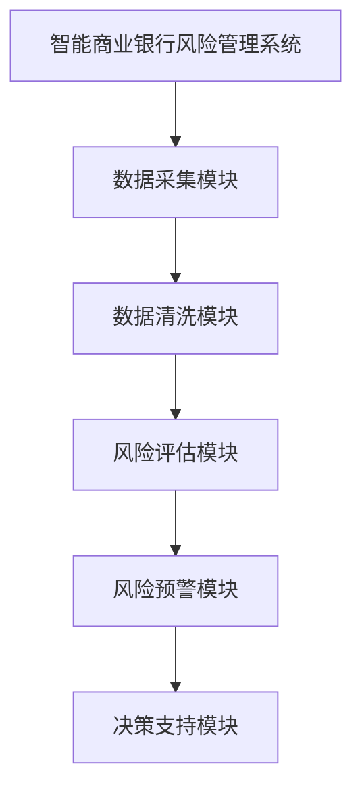
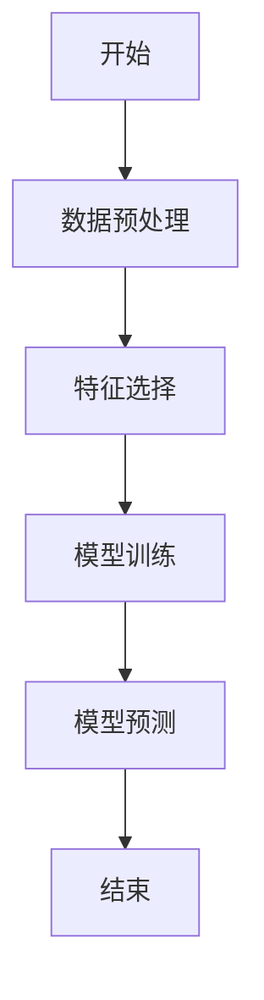
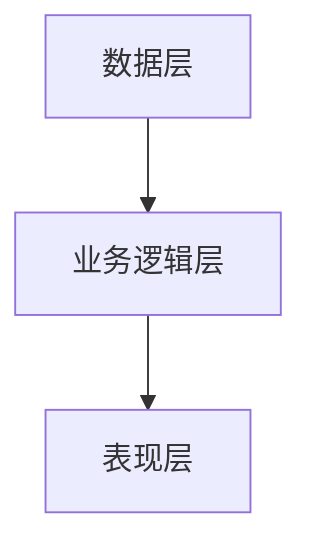

                 


# 智能商业银行风险管理系统

> 关键词：智能商业银行、风险管理、机器学习、系统架构、金融安全

> 摘要：本文探讨了智能商业银行风险管理系统的核心概念、算法原理、系统架构以及实际应用。通过分析传统银行风险管理的局限性，引入智能技术提升风险管理效率和准确性，结合机器学习算法和大数据技术，构建高效的智能风险管理系统。本文还详细介绍了系统的实现过程和实际案例，为商业银行的风险管理提供了新的思路和解决方案。

---

# 第一章：银行风险概述

## 1.1 银行风险的定义与分类

银行风险是指在银行运营过程中，由于内外部因素的影响，可能导致资金损失、信誉受损或业务中断的可能性。银行风险主要分为以下几类：

- **信用风险**：客户未能履行还款义务的风险。
- **市场风险**：由于市场波动导致资产价值下降的风险。
- **操作风险**：由于内部操作失误或外部事件导致的损失风险。
- **流动性风险**：银行无法及时获得足够资金以满足其负债或资产需求的风险。
- **声誉风险**：由于银行行为或事件导致的公众信任度下降的风险。

## 1.2 传统银行风险管理方法

传统的银行风险管理方法主要包括以下几种：

- **信用评分模型**：基于客户的信用历史和财务状况进行评分，决定贷款额度和利率。
- **VaR（Value at Risk）模型**：用于衡量市场风险，计算在特定置信水平下可能的最大损失。
- **情景分析法**：通过模拟不同市场情景，评估银行在极端情况下的风险敞口。

### 1.2.1 传统风险管理方法的优缺点

- **优点**：
  - 简单易懂，易于实施。
  - 可以快速得到初步风险评估结果。
  
- **缺点**：
  - 依赖历史数据，无法准确预测未来风险。
  - 无法处理复杂的非线性关系，导致评估结果不够精确。

## 1.3 智能化风险管理的必要性

随着金融市场的日益复杂化，传统风险管理方法已难以应对新型风险。智能化风险管理通过引入人工智能和大数据技术，能够实时分析海量数据，发现潜在风险，并提供更加精准的预测和决策支持。

---

# 第二章：智能商业银行风险管理系统的核心概念

## 2.1 智能商业银行风险管理系统的基本定义

智能商业银行风险管理系统是一种基于人工智能和大数据技术的智能系统，能够实时分析银行的各类风险数据，识别潜在风险，并提供风险预警和应对策略。

## 2.2 智能商业银行风险管理系统的关键属性

- **数据驱动性**：系统依赖大量数据进行分析和预测。
- **实时性**：能够实时处理数据，快速响应风险事件。
- **预测性**：通过机器学习算法预测未来风险。
- **自适应性**：系统能够根据新的数据和环境变化自动调整模型。

## 2.3 智能商业银行风险管理系统与传统系统的对比

### 2.3.1 对比分析表

| 属性             | 传统风险管理 | 智能风险管理 |
|------------------|--------------|--------------|
| 数据来源         | 历史数据     | 实时数据     |
| 分析方法         | 统计分析     | 机器学习     |
| 处理速度         | 较慢         | 实时处理     |
| 准确性           | 较低         | 较高         |
| 自适应能力       | 无           | 有           |

### 2.3.2 系统架构图（Mermaid）



---

# 第三章：智能商业银行风险管理系统的核心算法

## 3.1 机器学习算法在风险管理中的应用

机器学习算法在智能风险管理中的应用主要体现在以下几个方面：

- **信用评分**：使用逻辑回归或随机森林算法对客户信用进行评分。
- **风险预测**：使用支持向量机（SVM）或神经网络模型预测市场风险。
- **异常检测**：使用无监督学习算法（如K-Means）检测异常交易行为。

## 3.2 常见的风险评估算法

### 3.2.1 逻辑回归算法

逻辑回归是一种常用的分类算法，适用于二分类问题。其数学模型如下：

$$ P(y=1|x) = \frac{e^{\beta_0 + \beta_1 x_1 + \cdots + \beta_n x_n}}{1 + e^{\beta_0 + \beta_1 x_1 + \cdots + \beta_n x_n}} $$

### 3.2.2 支持向量机算法

支持向量机（SVM）是一种强大的分类算法，适用于高维数据。其核心思想是通过找到一个超平面，将数据分成两类。

### 3.2.3 随机森林算法

随机森林是一种基于树的集成算法，适用于分类和回归问题。其优势在于能够处理高维数据，并且具有较高的抗过拟合能力。

## 3.3 算法原理与实现（Mermaid流程图）

### 3.3.1 逻辑回归算法流程图



---

# 第四章：智能商业银行风险管理系统架构设计

## 4.1 系统功能设计

智能商业银行风险管理系统的主要功能模块包括：

- **数据采集模块**：实时采集银行的各项数据，包括交易数据、客户数据等。
- **数据清洗模块**：对采集到的数据进行预处理，去除噪声数据。
- **风险评估模块**：使用机器学习算法对数据进行分析，评估各项风险。
- **风险预警模块**：根据评估结果，生成风险预警信息。
- **决策支持模块**：提供风险应对策略，帮助银行进行决策。

## 4.2 系统架构设计

智能商业银行风险管理系统的架构设计采用分层架构，包括数据层、业务逻辑层和表现层。

### 4.2.1 分层架构图（Mermaid）



---

# 第五章：项目实战

## 5.1 环境配置

以下是项目实战所需的环境配置：

- **Python**：3.6+
- **TensorFlow**：2.0+
- **Pandas**：1.0+

## 5.2 系统核心实现

### 5.2.1 数据预处理代码

```python
import pandas as pd

# 读取数据
data = pd.read_csv('risk_data.csv')

# 数据清洗
data.dropna(inplace=True)
data = pd.get_dummies(data)
```

### 5.2.2 模型训练代码

```python
from sklearn.linear_model import LogisticRegression

# 初始化模型
model = LogisticRegression()

# 训练模型
model.fit(X_train, y_train)
```

---

# 第六章：最佳实践

## 6.1 小结

智能商业银行风险管理系统通过引入机器学习和大数据技术，显著提高了风险管理的效率和准确性。本文详细介绍了系统的各个组成部分，并通过实际案例展示了系统的实现过程。

## 6.2 注意事项

- 数据隐私保护是系统设计中的重要问题，必须确保数据的安全性。
- 系统的实时性和准确性是关键，需要选择合适的算法和优化模型。
- 系统的可解释性也是重要的，尤其是在金融领域，需要确保模型的决策过程透明。

## 6.3 未来展望

随着人工智能技术的不断发展，智能商业银行风险管理系统将更加智能化和自动化。未来的系统将能够更好地应对复杂的金融市场风险，为银行提供更加精准的风险管理支持。

---

# 作者

作者：AI天才研究院/AI Genius Institute & 禅与计算机程序设计艺术 /Zen And The Art of Computer Programming

