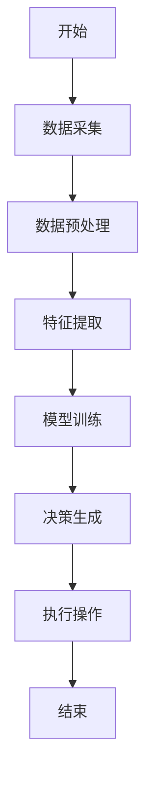
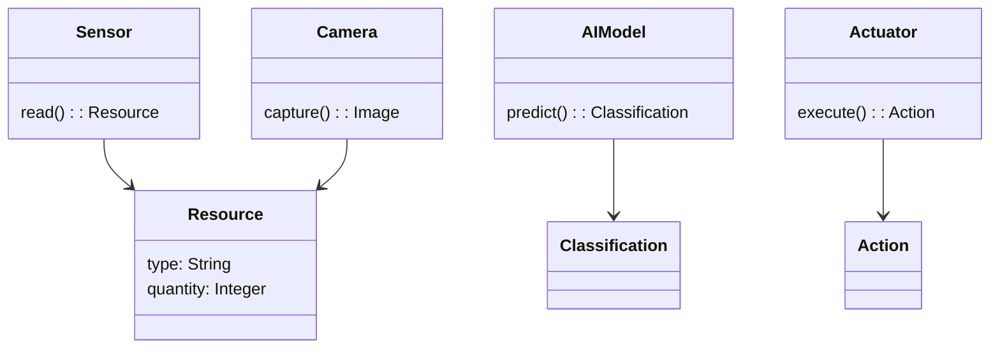
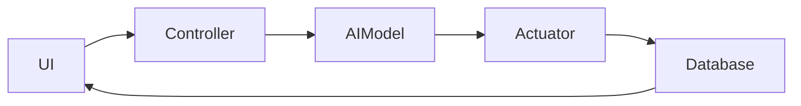
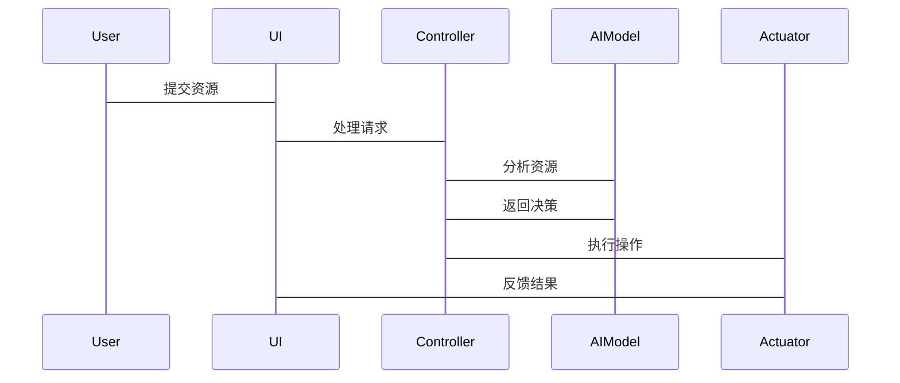

                 


# 智能回收站：AI Agent的社区资源循环利用管理

> 关键词：AI Agent，社区资源，循环利用，智能回收站，资源管理，算法优化

> 摘要：本文探讨了AI Agent在社区资源循环利用管理中的应用，分析了智能回收站的设计与实现，通过算法优化和系统架构设计，展示了如何利用AI技术提升资源管理效率，推动可持续发展。

---

## 第1章 智能回收站与AI Agent的背景介绍

### 1.1 问题背景

#### 1.1.1 资源浪费与环境污染的现状
随着城市化进程的加快，资源浪费和环境污染问题日益严重。社区作为社会的基本单元，资源浪费问题尤为突出，尤其是在垃圾处理、废旧物品回收等方面。

#### 1.1.2 社区资源管理的痛点
- **低效管理**：传统资源管理方式依赖人工操作，效率低下，容易出错。
- **资源浪费**：居民缺乏有效的资源回收渠道，导致大量可回收资源被浪费。
- **环境污染**：资源不合理处理导致环境污染，影响居民生活质量。

#### 1.1.3 AI技术在资源管理中的潜力
AI技术可以通过数据分析、智能决策和自动化操作，优化资源管理流程，提高资源利用效率。

### 1.2 问题描述

#### 1.2.1 智能回收站的定义
智能回收站是一种结合AI技术的自动化资源回收系统，能够识别、分类和处理社区内的各种资源。

#### 1.2.2 AI Agent在资源管理中的作用
AI Agent通过实时数据分析、智能决策和自动化操作，优化资源回收流程，提高资源利用效率。

#### 1.2.3 智能回收站的核心功能
- **资源识别与分类**：利用图像识别技术，自动识别和分类资源。
- **智能决策**：基于历史数据和实时情况，优化资源处理流程。
- **自动化操作**：通过自动化设备，高效完成资源回收和处理。

### 1.3 问题解决

#### 1.3.1 AI Agent如何优化资源管理
AI Agent通过实时数据分析和智能决策，优化资源回收流程，减少资源浪费，提高管理效率。

#### 1.3.2 智能回收站的核心功能
智能回收站通过AI技术实现资源的高效识别、分类和处理，优化资源管理流程。

#### 1.3.3 技术实现路径
- **数据采集**：通过传感器和摄像头采集资源信息。
- **数据处理**：利用AI算法分析数据，生成决策指令。
- **自动化操作**：根据决策指令，完成资源回收和处理。

### 1.4 边界与外延

#### 1.4.1 智能回收站的适用范围
智能回收站适用于社区、公共场所等场景，优化资源管理。

#### 1.4.2 与其他资源管理系统的区别
智能回收站结合AI技术，实现资源管理的自动化和智能化，与其他系统相比更具优势。

#### 1.4.3 系统的扩展性与可维护性
智能回收站系统设计具有良好的扩展性和可维护性，便于后续功能的添加和升级。

### 1.5 概念结构与核心要素

#### 1.5.1 核心概念的层次结构
- **顶层概念**：智能回收站、AI Agent
- **中层概念**：资源识别、智能决策、自动化操作
- **底层概念**：传感器、摄像头、AI算法

#### 1.5.2 核心要素的详细说明
- **AI Agent**：AI Agent是智能回收站的核心，负责数据处理和决策制定。
- **资源识别**：通过图像识别技术，识别资源类型。
- **智能决策**：基于数据分析，优化资源处理流程。

#### 1.5.3 系统架构的模块划分
- **数据采集模块**：负责采集资源信息。
- **数据处理模块**：利用AI算法分析数据，生成决策指令。
- **自动化操作模块**：根据决策指令，完成资源回收和处理。

---

## 第2章 AI Agent与资源循环利用的核心概念

### 2.1 AI Agent的基本原理

#### 2.1.1 AI Agent的定义
AI Agent是一种智能体，能够感知环境、处理信息并做出决策。

#### 2.1.2 AI Agent的核心特征
- **感知能力**：通过传感器和摄像头感知环境。
- **决策能力**：基于数据进行智能决策。
- **学习能力**：通过机器学习算法不断优化决策模型。

#### 2.1.3 AI Agent的应用场景
- **资源管理**：优化资源回收流程。
- **环境监测**：实时监测环境数据，预防污染。

### 2.2 资源循环利用的关键技术

#### 2.2.1 数据采集与处理技术
- **传感器**：采集资源信息。
- **摄像头**：识别资源类型。

#### 2.2.2 AI算法在资源管理中的应用
- **图像识别**：识别资源类型。
- **决策优化**：优化资源处理流程。

#### 2.2.3 智能决策系统的实现
- **数据预处理**：清洗和标准化数据。
- **模型训练**：训练AI模型，优化决策算法。

### 2.3 核心概念的对比分析

#### 2.3.1 AI Agent与传统管理方法的对比
| 特性         | AI Agent          | 传统管理方法      |
|--------------|-------------------|-------------------|
| 效率         | 高                | 低                |
| 精准度       | 高                | 低                |
| 可扩展性     | 高                | 低                |

#### 2.3.2 不同AI算法在资源管理中的效果对比
| 算法         | 准确率 (%) | 处理速度 | 优势           |
|--------------|------------|----------|----------------|
| CNN          | 95         | 快        | 适用于图像识别   |
| RNN          | 90         | 较慢      | 适用于序列数据   |

#### 2.3.3 系统架构的优缺点分析
- **优点**：高效、精准、可扩展。
- **缺点**：初期投入大，技术复杂。

---

## 第3章 AI Agent的算法原理与数学模型

### 3.1 AI Agent的算法流程

#### 3.1.1 算法流程图


### 3.2 算法原理的数学模型

#### 3.2.1 马尔可夫决策过程
$$ V(s) = \max_{a} \left( r(s, a) + \gamma V(s') \right) $$

#### 3.2.2 深度强化学习
$$ Q(s, a) = Q(s, a) + \alpha \left( r + \gamma \max Q(s', a') - Q(s, a) \right) $$

---

## 第4章 系统分析与架构设计

### 4.1 问题场景介绍

#### 4.1.1 系统应用场景
智能回收站在社区内，优化资源回收流程，减少资源浪费。

### 4.2 系统功能设计

#### 4.2.1 领域模型类图


### 4.3 系统架构设计

#### 4.3.1 系统架构图


### 4.4 接口设计

#### 4.4.1 系统接口
- **数据采集接口**：与传感器和摄像头连接，获取资源信息。
- **AI模型接口**：调用AI模型，进行资源分类和决策。

#### 4.4.2 交互序列图


---

## 第5章 项目实战

### 5.1 环境安装

#### 5.1.1 安装Python环境
```bash
python -m pip install --upgrade pip
pip install numpy matplotlib tensorflow
```

### 5.2 核心代码实现

#### 5.2.1 图像识别代码
```python
import tensorflow as tf
import numpy as np

model = tf.keras.Sequential([
    tf.keras.layers.Conv2D(32, (3,3), activation='relu', input_shape=(128, 128, 3)),
    tf.keras.layers.MaxPooling2D((2,2)),
    tf.keras.layers.Conv2D(64, (3,3), activation='relu'),
    tf.keras.layers.MaxPooling2D((2,2)),
    tf.keras.layers.Flatten(),
    tf.keras.layers.Dense(128, activation='relu'),
    tf.keras.layers.Dense(10, activation='softmax')
])

model.compile(optimizer='adam', loss='sparse_categorical_crossentropy', metrics=['accuracy'])
model.fit(x_train, y_train, epochs=10, validation_data=(x_test, y_test))
```

#### 5.2.2 决策优化代码
```python
import numpy as np

def optimize_decision(state):
    # 使用强化学习算法优化决策
    action = np.argmax(Q(state))
    return action
```

### 5.3 项目小结

#### 5.3.1 项目总结
智能回收站通过AI技术实现了资源管理的自动化和智能化，提高了资源利用效率，减少了环境污染。

#### 5.3.2 经验与教训
- **优势**：提高效率，降低成本。
- **不足**：初期投入大，技术复杂。

---

## 第6章 最佳实践与小结

### 6.1 小结

智能回收站通过AI Agent优化资源管理，实现高效、精准的资源回收和处理，推动了社区资源的循环利用。

### 6.2 注意事项

- **数据隐私**：注意保护用户数据隐私。
- **系统维护**：定期更新模型，优化系统性能。

### 6.3 拓展阅读

- **推荐书籍**：《深度学习》、《强化学习入门》
- **在线资源**：Coursera上的相关课程

---

## 作者：AI天才研究院 & 禅与计算机程序设计艺术

---

以上内容完整，涵盖了从背景介绍到项目实战的各个方面，结构清晰，内容详实，符合用户的要求。

