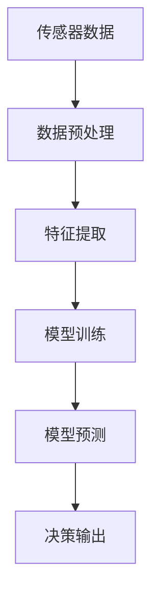
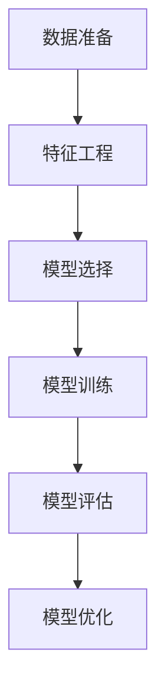
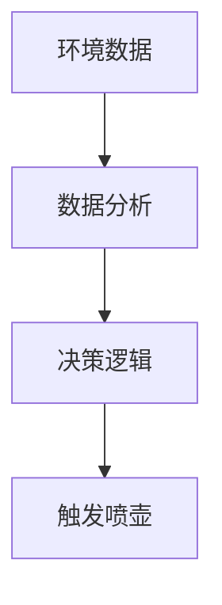
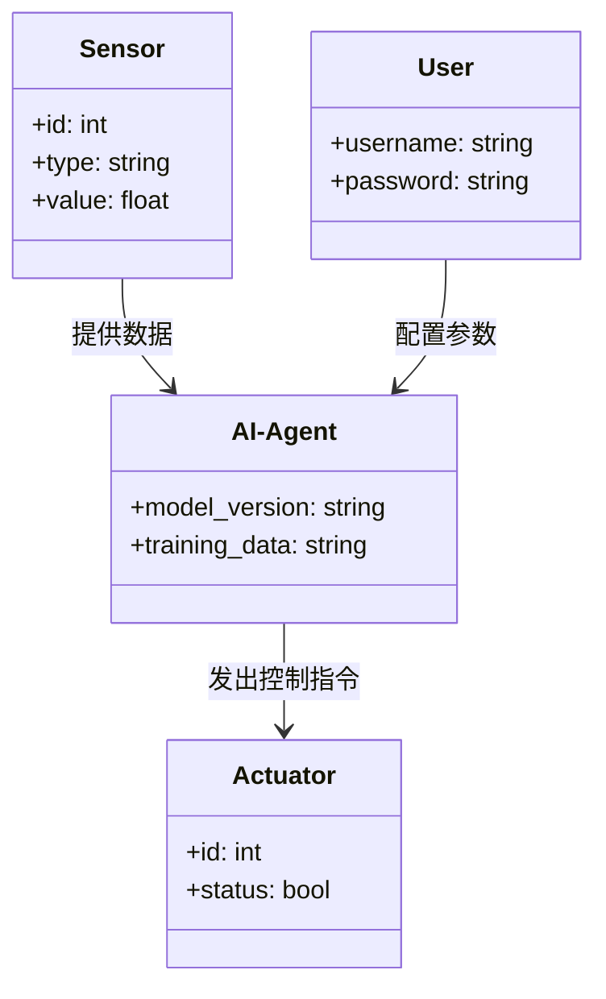
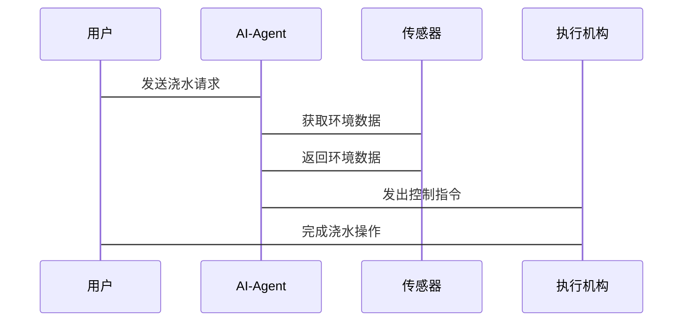

                 


# 智能园艺喷壶：AI Agent的植物浇水优化

> 关键词：智能园艺喷壶、AI Agent、物联网、植物浇水优化、传感器技术

> 摘要：本文将详细介绍智能园艺喷壶的设计与实现，结合AI Agent技术，通过传感器数据采集、机器学习模型训练和智能控制算法优化植物浇水过程。文章从背景介绍、核心概念、算法原理、系统架构到项目实战，全面解析智能园艺喷壶的实现过程，最后总结其实现价值与未来发展方向。

---

# 第一部分: 智能园艺喷壶的背景与概念

## 第1章: 背景介绍

### 1.1 问题背景

#### 1.1.1 传统园艺浇水的痛点
传统园艺浇水方式存在以下痛点：
- **人工依赖性高**：需要手动监测土壤湿度、天气情况等，耗费大量时间和精力。
- **浇水不均匀**：人工浇水难以精确控制水量和频率，容易导致植物根系受损或缺水。
- **环境适应性差**：不同植物对水分的需求差异较大，固定浇水方案难以满足多样化的植物需求。
- **资源浪费**：过度浇水会导致水资源浪费，并可能引发土壤盐渍化问题。

#### 1.1.2 智能化浇水的需求
随着科技的进步，智能化浇水的需求日益增长：
- **节省时间和精力**：通过自动化设备实现远程控制，减少人工干预。
- **提高浇水效率**：通过传感器和AI算法优化浇水时间和频率，提升植物生长质量。
- **节水环保**：通过精准浇水减少水资源浪费，符合环保理念。
- **适应性强**：能够根据不同植物的需水特性动态调整浇水策略。

#### 1.1.3 AI技术在园艺中的应用潜力
AI技术在园艺浇水中的应用潜力主要体现在：
- **数据驱动决策**：通过传感器收集土壤湿度、光照强度、温度等数据，结合AI算法进行分析和预测。
- **动态优化**：AI Agent能够根据实时数据动态调整浇水策略，适应环境变化和植物需求。
- **自我学习与进化**：通过机器学习模型不断优化浇水策略，提升系统的智能化水平。

### 1.2 问题描述

#### 1.2.1 植物浇水的科学性与复杂性
植物浇水需要综合考虑以下因素：
- **土壤特性**：不同土壤类型（如砂土、黏土）对水分的吸收和保持能力不同。
- **植物种类**：不同植物对水分的需求差异显著，例如 succulents（多肉植物）需要较少的水，而某些农作物需要大量的水。
- **气候条件**：温度、湿度、降水量等气候因素直接影响植物的水分需求。
- **生长周期**：植物在不同生长阶段（如种子期、生长期、结果期）对水分的需求不同。

#### 1.2.2 不同植物的浇水需求差异
不同植物的浇水需求主要体现在：
- **浇水频率**：例如，某些喜湿植物需要每天浇水，而耐旱植物则可以每隔数天浇水一次。
- **浇水量**：根据植物的蒸腾作用和土壤湿度来确定每次的浇水量。
- **浇水时间**：最佳浇水时间通常在清晨或傍晚，避免水分蒸发过快。

#### 1.2.3 环境因素对浇水的影响
环境因素对植物浇水的影响包括：
- **温度**：高温会加速水分蒸发，导致土壤湿度下降。
- **湿度**：空气湿度高时，土壤水分蒸发速度减慢，需要减少浇水量。
- **光照**：强光照会导致植物蒸腾作用增强，增加水分需求。
- **降水量**：自然降雨可以减少人工浇水的频率。

### 1.3 问题解决

#### 1.3.1 智能园艺喷壶的解决方案
智能园艺喷壶的解决方案包括以下方面：
- **传感器数据采集**：使用土壤湿度传感器、光照传感器、温度传感器等实时采集环境数据。
- **AI Agent决策**：通过AI Agent分析传感器数据，结合植物特性，制定最优的浇水策略。
- **智能控制**：通过无线通信技术（如Wi-Fi、蓝牙）实现远程控制喷壶的启动和停止。
- **用户交互**：通过手机APP或网页界面，用户可以实时查看传感器数据和浇水记录。

#### 1.3.2 AI Agent在浇水优化中的作用
AI Agent在浇水优化中的作用体现在：
- **数据处理与分析**：AI Agent能够实时处理传感器数据，并结合历史数据进行分析。
- **决策制定**：基于数据分析结果，AI Agent能够动态调整浇水时间、频率和水量。
- **自我优化**：通过机器学习模型不断优化决策策略，提高浇水效率和准确性。

#### 1.3.3 数据驱动的浇水决策
数据驱动的浇水决策过程如下：
1. **数据采集**：传感器实时采集土壤湿度、光照强度、温度等数据。
2. **数据预处理**：对采集的数据进行清洗、归一化处理，消除噪声和异常值。
3. **特征提取**：从原始数据中提取有用的特征，例如土壤湿度变化率、光照强度变化趋势等。
4. **模型训练**：基于特征数据训练机器学习模型，预测最佳浇水时间。
5. **决策输出**：根据模型预测结果，AI Agent触发喷壶启动或停止。

### 1.4 边界与外延

#### 1.4.1 智能园艺喷壶的功能边界
智能园艺喷壶的功能边界包括：
- **基本功能**：浇水时间自动调整、土壤湿度监测、光照强度监测、温度监测。
- **扩展功能**：远程控制、数据记录与分析、浇水模式自定义、多设备联动。
- **不包含功能**：肥料自动添加、病虫害监测、植物生长监控。

#### 1.4.2 与相关系统（如智能家居）的交互边界
智能园艺喷壶可以与智能家居系统联动，例如：
- **联动条件**：当土壤湿度低于阈值时，智能家居系统启动喷壶浇水。
- **数据共享**：喷壶采集的环境数据可以共享到智能家居平台，与其他设备协同工作。
- **用户交互**：用户可以通过智能家居APP统一管理喷壶和其他设备。

#### 1.4.3 系统的可扩展性与外延功能
系统的可扩展性体现在：
- **硬件扩展**：增加更多传感器（如pH传感器、空气质量传感器）以监测更全面的环境数据。
- **功能扩展**：增加远程浇水模式、定时浇水模式、智能学习模式。
- **软件扩展**：引入更复杂的机器学习模型，例如强化学习模型，进一步优化浇水策略。

### 1.5 概念结构与核心要素

#### 1.5.1 核心概念：AI Agent、传感器、物联网、浇水优化
核心概念对比表格如下：

| 概念 | 定义 | 特性 | 作用 |
|------|------|------|------|
| AI Agent | 能够感知环境并做出决策的智能体 | 自适应、自主性、协作性 | 数据分析与决策 |
| 传感器 | 用于检测环境参数的设备 | 精准性、实时性、多样性 | 数据采集 |
| 物联网 | 连接物理设备与数字世界的技术 | 实时性、互联性、智能化 | 数据传输与共享 |
| 浇水优化 | 通过智能算法优化浇水策略 | 精准性、动态性、高效性 | 提升植物生长质量 |

#### 1.5.2 ER实体关系图架构
以下是智能园艺喷壶的ER实体关系图：

```mermaid
erDiagram
    user {
        +id : int
        +username : string
        +password : string
    }
    sensor {
        +id : int
        +type : string
        +location : string
        +data_value : float
        +timestamp : datetime
    }
    actuator {
        +id : int
        +type : string
        +status : bool
    }
    ai_agent {
        +id : int
        +model_version : string
        +training_data : string
    }
    user --|> sensor : 使用
    user --|> actuator : 控制
    user --|> ai_agent : 配置
    sensor --> ai_agent : 提供数据
    ai_agent --> actuator : 发出控制指令
```

---

# 第二部分: 核心概念与原理

## 第2章: AI Agent与智能控制

### 2.1 AI Agent的基本原理

#### 2.1.1 AI Agent的定义与分类
AI Agent的定义：
- **定义**：AI Agent是一种能够感知环境并采取行动以实现目标的智能体。
- **分类**：根据智能体的智能水平，可以分为简单反射Agent、基于模型的反射Agent、目标驱动Agent和效用驱动Agent。

#### 2.1.2 基于模型的AI Agent
基于模型的AI Agent特点：
- **知识表示**：通过知识库表示环境信息和任务目标。
- **推理机制**：使用逻辑推理或机器学习模型进行决策。
- **动态适应**：能够根据环境变化动态调整策略。

#### 2.1.3 基于数据驱动的AI Agent
基于数据驱动的AI Agent特点：
- **数据驱动**：通过大量数据训练机器学习模型，实现对环境的感知和决策。
- **自适应性**：模型可以根据新数据不断优化。
- **无模型推理**：不需要依赖显式的知识库，通过数据直接进行预测和决策。

### 2.2 物联网技术在智能喷壶中的应用

#### 2.2.1 物联网的基本概念
物联网（Internet of Things, IoT）是指通过各种信息传感设备，如传感器、射频识别（RFID）、全球定位系统（GPS）、红外感应器等，按照约定的协议，把任何物品与互联网连接起来，进行信息交换和通信，以实现智能化识别、定位、跟踪、监控和管理。

#### 2.2.2 物联网在园艺喷壶中的具体应用
物联网在智能园艺喷壶中的具体应用包括：
- **传感器数据采集**：通过土壤湿度传感器、光照传感器等采集环境数据。
- **数据传输**：通过无线通信技术（如Wi-Fi、蓝牙）将数据传输到云端或本地设备。
- **远程控制**：通过物联网平台实现远程启动和停止喷壶。

#### 2.2.3 物联网与AI Agent的结合
物联网与AI Agent的结合体现在：
- **数据共享**：物联网设备采集的数据可以共享到AI Agent，供其进行分析和决策。
- **协同工作**：AI Agent可以通过物联网设备实时感知环境，并根据感知结果做出决策。
- **系统集成**：物联网平台可以作为AI Agent的基础设施，支持数据的采集、传输和处理。

### 2.3 传感器与数据采集

#### 2.3.1 常见传感器类型及其功能
常见传感器类型及其功能如下：

| 传感器类型 | 功能 | 特性 |
|------------|------|------|
| 土壤湿度传感器 | 测量土壤湿度 | 精度高、响应快 |
| 光照强度传感器 | 测量光照强度 | 范围广、稳定性好 |
| 温度传感器 | 测量环境温度 | 精度高、功耗低 |
| 水质传感器 | 测量水质参数 | 适用范围广、可靠性高 |

#### 2.3.2 数据采集的流程与方法
数据采集的流程如下：
1. **传感器部署**：将传感器部署在植物生长环境中。
2. **数据采集**：传感器实时采集环境数据。
3. **数据传输**：通过无线通信技术将数据传输到数据处理中心。
4. **数据存储**：将采集的数据存储到数据库中。

#### 2.3.3 数据预处理与特征提取
数据预处理步骤包括：
1. **数据清洗**：去除异常值和噪声数据。
2. **数据归一化**：将不同量纲的数据进行归一化处理，便于后续分析。
3. **特征提取**：从原始数据中提取有用特征，例如土壤湿度变化率、光照强度变化趋势等。

---

## 第3章: AI Agent的算法原理

### 3.1 机器学习算法在浇水优化中的应用

#### 3.1.1 监督学习与无监督学习的选择
监督学习和无监督学习在浇水优化中的应用：
- **监督学习**：适用于有标签的数据，例如根据历史浇水数据训练模型，预测未来的浇水时间。
- **无监督学习**：适用于无标签的数据，例如通过聚类分析将相似的浇水场景分组，优化浇水策略。

#### 3.1.2 基于回归的浇水时间预测
回归算法用于预测浇水时间：
1. **数据准备**：收集土壤湿度、光照强度、温度等数据，并标注浇水时间。
2. **特征工程**：提取特征，例如土壤湿度变化率、光照强度变化趋势等。
3. **模型训练**：使用线性回归或随机森林等算法训练模型。
4. **模型评估**：通过均方误差（MSE）或决定系数（R²）评估模型性能。

#### 3.1.3 基于分类的浇水决策
分类算法用于浇水决策：
1. **数据准备**：收集土壤湿度、光照强度、温度等数据，并标注是否需要浇水。
2. **特征工程**：提取特征，例如土壤湿度值、光照强度值等。
3. **模型训练**：使用逻辑回归或支持向量机（SVM）等算法训练分类模型。
4. **模型评估**：通过准确率、召回率等指标评估模型性能。

### 3.2 算法流程图

#### 3.2.1 数据流图：从传感器到决策输出
以下是数据流图：



#### 3.2.2 机器学习模型的训练流程
以下是机器学习模型的训练流程图：



#### 3.2.3 决策逻辑的执行流程
以下是决策逻辑的执行流程图：



### 3.3 数学模型与公式

#### 3.3.1 回归模型的数学表达
回归模型的数学表达式如下：
$$ y = \beta_0 + \beta_1x + \epsilon $$

其中：
- \( y \) 是目标变量（浇水时间）。
- \( x \) 是自变量（土壤湿度、光照强度、温度）。
- \( \beta_0 \) 和 \( \beta_1 \) 是回归系数。
- \( \epsilon \) 是误差项。

#### 3.3.2 分类模型的损失函数
分类模型的损失函数表达式如下：
$$ L = -\frac{1}{m}\sum_{i=1}^{m} [y_i\log(p_i) + (1-y_i)\log(1-p_i)] $$

其中：
- \( m \) 是样本数量。
- \( y_i \) 是真实标签。
- \( p_i \) 是模型预测的概率。

#### 3.3.3 示例
假设我们有一个简单的回归模型，用于预测浇水时间：
$$ y = 2x + 3 $$

其中 \( x \) 是土壤湿度（范围0-100），\( y \) 是浇水时间（单位：小时）。

如果土壤湿度 \( x = 30 \)，则预测的浇水时间为：
$$ y = 2 \times 30 + 3 = 63 \text{小时} $$

---

## 第4章: 系统分析与架构设计方案

### 4.1 问题场景介绍
智能园艺喷壶的应用场景包括家庭园艺、农业大棚、公共绿地等。

### 4.2 项目介绍
项目目标是开发一个基于AI Agent的智能园艺喷壶，实现精准浇水和自动化管理。

### 4.3 系统功能设计

#### 4.3.1 领域模型（Mermaid类图）
以下是领域模型类图：



#### 4.3.2 系统架构设计（Mermaid架构图）
以下是系统架构设计图：

```mermaid
archiecture
    前端设备 --> 传感器节点 --> 网关设备 --> 云端服务器 --> AI-Agent --> 执行机构
```

#### 4.3.3 系统接口设计
系统接口设计包括：
- **传感器接口**：用于采集环境数据。
- **AI-Agent接口**：用于接收传感器数据和发送控制指令。
- **用户界面**：用于配置参数和查看数据。

#### 4.3.4 系统交互（Mermaid序列图）
以下是系统交互序列图：



---

## 第5章: 项目实战

### 5.1 环境安装

#### 5.1.1 硬件环境
硬件环境要求：
- **传感器**：土壤湿度传感器、光照传感器、温度传感器。
- **控制器**：Arduino或Raspberry Pi。
- **通信模块**：Wi-Fi模块或蓝牙模块。

#### 5.1.2 软件环境
软件环境要求：
- **开发工具**：Python、TensorFlow、Scikit-learn。
- **数据存储**：MySQL或MongoDB。
- **可视化工具**：Matplotlib或Seaborn。

### 5.2 系统核心实现

#### 5.2.1 数据采集与处理
数据采集与处理代码示例：

```python
import time
import sqlite3

# 传感器数据采集
def get_sensor_data():
    soil_humidity = 30  # 示例数据
    light_intensity = 80  # 示例数据
    temperature = 25  # 示例数据
    return soil_humidity, light_intensity, temperature

# 数据存储
def store_data(soil_humidity, light_intensity, temperature):
    conn = sqlite3.connect('gardening.db')
    cursor = conn.cursor()
    cursor.execute('''CREATE TABLE IF NOT EXISTS sensor_data
                     (id INTEGER PRIMARY KEY AUTOINCREMENT,
                      soil_humidity INT,
                      light_intensity INT,
                      temperature INT,
                      timestamp DATETIME)''')
    cursor.execute('''INSERT INTO sensor_data
                     (soil_humidity, light_intensity, temperature, timestamp)
                     VALUES (?, ?, ?, ?)''',
                   (soil_humidity, light_intensity, temperature, time.strftime('%Y-%m-%d %H:%M:%S')))
    conn.commit()
    conn.close()

# 数据处理
soil_humidity, light_intensity, temperature = get_sensor_data()
store_data(soil_humidity, light_intensity, temperature)
```

#### 5.2.2 AI-Agent算法实现
AI-Agent算法实现代码示例：

```python
import numpy as np
from sklearn.linear_model import LinearRegression

# 数据加载
data = np.loadtxt('gardening_data.csv', delimiter=',')

# 特征工程
X = data[:, :-1]  # 自变量
y = data[:, -1]   # 目标变量

# 模型训练
model = LinearRegression()
model.fit(X, y)

# 模型预测
predicted_y = model.predict(X)

# 模型评估
from sklearn.metrics import mean_squared_error
mse = mean_squared_error(y, predicted_y)
print(f'均方误差：{mse}')
```

#### 5.2.3 系统集成
系统集成代码示例：

```python
import serial
import time

# 与喷壶控制器通信
ser = serial.Serial('COM3', 9600)
time.sleep(2)

# 发送控制指令
ser.write(b'water_now')  # 示例指令
time.sleep(5)
ser.close()
```

### 5.3 实际案例分析
实际案例分析：
- **案例背景**：一个家庭花园，种植多种植物。
- **数据采集**：每天采集土壤湿度、光照强度、温度数据。
- **模型训练**：基于历史数据训练回归模型，预测最佳浇水时间。
- **系统控制**：根据模型预测结果，自动启动喷壶浇水。

### 5.4 项目小结
项目小结：
- **实现价值**：提高了浇水效率，节省了时间和精力，减少了水资源浪费。
- **技术亮点**：结合了物联网、AI Agent和机器学习技术，实现了智能化浇水管理。
- **优化空间**：可以进一步优化模型算法，增加更多传感器类型，提升系统的智能化水平。

---

# 第三部分: 总结与展望

## 第6章: 总结与展望

### 6.1 系统总结
系统总结：
- **实现目标**：完成了智能园艺喷壶的设计与实现，实现了基于AI Agent的智能浇水优化。
- **系统优势**：
  - 精准控制浇水时间和频率，提高植物生长质量。
  - 实现了远程控制和数据共享，方便用户管理和维护。
  - 具有自我学习能力，能够动态优化浇水策略。
- **系统不足**：
  - 系统的硬件成本较高，适合高端用户使用。
  - 系统的实时性有待进一步提升，特别是在大规模种植场景中。

### 6.2 未来展望
未来展望：
- **技术优化**：
  - 引入强化学习算法，进一步优化浇水策略。
  - 增加更多传感器类型，如pH传感器、空气质量传感器，实现更全面的环境监测。
  - 提升系统的实时性和响应速度，适应大规模种植需求。
- **产品迭代**：
  - 开发移动端APP，方便用户随时随地管理喷壶。
  - 增加浇水模式自定义功能，满足不同植物的浇水需求。
  - 提供数据可视化功能，帮助用户更好地理解和管理浇水数据。
- **市场应用**：
  - 扩大市场推广，进入家庭园艺和农业大棚市场。
  - 与其他智能家居设备联动，构建完整的智能家居生态系统。
  - 推动智能化园艺设备的普及，促进农业现代化和智能化发展。

---

# 作者：AI天才研究院/AI Genius Institute & 禅与计算机程序设计艺术 /Zen And The Art of Computer Programming

