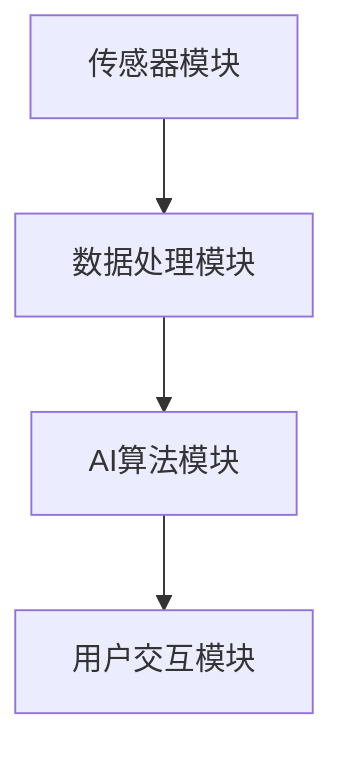

                 


# 智能园艺手套：AI Agent的土壤状况检测

## 关键词：
智能园艺手套、AI Agent、土壤检测、机器学习、物联网、传感器技术

## 摘要：
本文将详细介绍智能园艺手套的设计与实现，探讨其在土壤状况检测中的应用。通过结合AI Agent和传感器技术，智能园艺手套能够实时监测土壤的pH值、湿度、温度等关键指标，并通过机器学习算法进行数据分析与决策，为植物生长提供科学依据。本文将从背景、原理、算法、系统架构、项目实现等多个方面进行详细分析，并通过实际案例展示其应用场景与优势。

---

## 第一部分：智能园艺手套的背景与概念

### 第1章：智能园艺手套的背景与现状

#### 1.1 智能园艺手套的定义与特点
##### 1.1.1 智能园艺手套的定义
智能园艺手套是一种结合了人工智能（AI）和物联网（IoT）技术的园艺工具，它能够实时感知土壤的物理和化学特性，并通过AI算法进行数据分析，为用户提供智能化的园艺建议。

##### 1.1.2 智能园艺手套的核心特点
- **实时监测**：通过内置传感器，实时采集土壤的pH值、湿度、温度等关键指标。
- **智能分析**：基于机器学习算法，对土壤数据进行分析，提供优化建议。
- **用户友好**：操作简单，数据可视化，便于用户快速获取信息。

##### 1.1.3 智能园艺手套与传统园艺工具的区别
传统园艺工具仅能提供基础的物理测量功能，而智能园艺手套通过AI技术实现了数据的智能化分析与决策，极大提升了园艺管理的效率和精准度。

#### 1.2 土壤状况检测的重要性
##### 1.2.1 土壤健康对植物生长的影响
土壤是植物生长的基础，其pH值、湿度、温度等因素直接影响植物的健康与产量。

##### 1.2.2 土壤检测的传统方法及其局限性
传统土壤检测方法依赖人工采样和实验室分析，耗时长、成本高，且无法实现实时监测。

##### 1.2.3 智能检测技术的优势
智能园艺手套通过传感器和AI技术实现了土壤的实时监测与智能化分析，显著提高了检测效率和准确性。

#### 1.3 AI Agent在园艺领域的应用前景
##### 1.3.1 AI Agent的基本概念
AI Agent是一种能够感知环境、自主决策并执行任务的智能实体，它能够根据输入的数据做出最优选择。

##### 1.3.2 AI Agent在园艺中的应用场景
- **土壤监测**：实时监测土壤的物理和化学特性。
- **智能决策**：基于土壤数据，为用户提供种植建议。
- **远程监控**：通过物联网技术实现远程土壤管理。

##### 1.3.3 智能园艺手套的市场潜力
随着人们对高效农业和智能园艺的需求不断增加，智能园艺手套具有广阔的市场前景。

---

## 第二部分：智能园艺手套的核心概念与工作原理

### 第2章：智能园艺手套的核心概念与工作原理

#### 2.1 AI Agent的基本原理
##### 2.1.1 AI Agent的定义与分类
AI Agent可以分为简单反射Agent和基于模型的Agent两类。智能园艺手套中的AI Agent属于基于模型的Agent，能够通过传感器输入的数据进行分析和决策。

##### 2.1.2 AI Agent的核心功能模块
- **感知模块**：通过传感器获取土壤数据。
- **决策模块**：基于机器学习模型进行数据分析，生成决策。
- **执行模块**：根据决策结果，输出相应的建议或控制信号。

##### 2.1.3 AI Agent与智能园艺手套的结合
智能园艺手套通过AI Agent实现了土壤数据的实时采集、分析与决策，为用户提供智能化的园艺管理服务。

#### 2.2 土壤状况检测的关键技术
##### 2.2.1 土壤传感器的工作原理
土壤传感器包括pH传感器、湿度传感器和温度传感器，它们能够分别测量土壤的pH值、湿度和温度。

##### 2.2.2 数据采集与处理技术
- **数据采集**：通过传感器获取土壤数据。
- **数据清洗**：去除噪声，确保数据的准确性。
- **特征提取**：从原始数据中提取有用特征，用于后续分析。

##### 2.2.3 土壤特征分析方法
- **主成分分析（PCA）**：用于降维，提取关键特征。
- **聚类分析**：用于分类不同类型的土壤。

#### 2.3 智能园艺手套的系统架构
##### 2.3.1 系统组成模块
- **传感器模块**：包括pH传感器、湿度传感器和温度传感器。
- **数据处理模块**：负责数据的采集、清洗与特征提取。
- **AI算法模块**：基于机器学习算法进行数据分析与决策。
- **用户交互模块**：通过显示屏或手机APP向用户展示结果。

##### 2.3.2 模块之间的交互关系
传感器模块将数据传输给数据处理模块，数据处理模块对数据进行处理后，传输给AI算法模块进行分析，最终生成决策结果并传递给用户交互模块。

##### 2.3.3 系统的整体流程
1. 传感器采集土壤数据。
2. 数据处理模块对数据进行清洗与特征提取。
3. AI算法模块对特征数据进行分析，生成决策结果。
4. 用户交互模块将结果展示给用户。

---

## 第三部分：智能园艺手套的算法原理与实现

### 第3章：智能园艺手套的算法原理与实现

#### 3.1 数据采集与预处理
##### 3.1.1 土壤数据的采集方法
- **传感器采集**：使用pH传感器、湿度传感器和温度传感器采集土壤数据。
- **数据存储**：将采集的数据存储在本地或云端数据库中。

##### 3.1.2 数据清洗与特征提取
- **数据清洗**：去除噪声数据，确保数据的准确性。
- **特征提取**：从原始数据中提取关键特征，如土壤pH值、湿度和温度。

##### 3.1.3 数据标准化与归一化
- **数据标准化**：将数据转换为相同的尺度，便于后续分析。
- **数据归一化**：将数据归一化到[0,1]区间，便于机器学习算法处理。

#### 3.2 土壤特征分析与分类算法
##### 3.2.1 常见的分类算法介绍
- **决策树**：基于特征的分层决策，适用于分类任务。
- **随机森林**：通过多棵决策树进行投票，提高分类准确性。
- **支持向量机（SVM）**：适用于高维数据的分类任务。

##### 3.2.2 基于机器学习的土壤分类模型
- **模型训练**：使用训练数据对机器学习模型进行训练。
- **模型评估**：通过测试数据评估模型的准确率、召回率和F1分数。

##### 3.2.3 模型的训练与优化
- **参数调优**：通过网格搜索或随机搜索优化模型参数。
- **模型评估**：通过交叉验证评估模型的泛化能力。

#### 3.3 AI Agent的决策机制
##### 3.3.1 决策树算法的原理与实现
- **决策树的构建**：基于特征重要性构建决策树。
- **决策树的剪枝**：通过剪枝减少过拟合的风险。

##### 3.3.2 基于规则的决策系统
- **规则生成**：通过机器学习算法生成土壤分类规则。
- **规则应用**：根据规则对土壤进行分类。

##### 3.3.3 混合决策机制的设计
- **混合决策**：结合决策树和随机森林的优点，提高分类准确率。
- **动态调整**：根据实时数据动态调整决策策略。

---

## 第四章：智能园艺手套的系统架构与设计

### 第4章：智能园艺手套的系统架构与设计

#### 4.1 系统功能设计
##### 4.1.1 用户需求分析
- **实时监测**：用户需要实时获取土壤的pH值、湿度和温度。
- **智能建议**：用户需要基于土壤数据的种植建议。
- **数据存储**：用户需要长期存储土壤数据以便后续分析。

##### 4.1.2 功能模块划分
- **传感器模块**：负责采集土壤数据。
- **数据处理模块**：负责数据的清洗与特征提取。
- **AI算法模块**：负责土壤分类与决策。
- **用户交互模块**：负责数据的展示与用户交互。

##### 4.1.3 功能流程设计
1. 传感器采集土壤数据。
2. 数据处理模块对数据进行清洗与特征提取。
3. AI算法模块对特征数据进行分类与决策。
4. 用户交互模块将结果展示给用户。

#### 4.2 系统架构设计

##### 4.2.1 系统架构图


##### 4.2.2 系统接口设计
- **传感器接口**：与土壤传感器连接，获取土壤数据。
- **数据接口**：与数据库连接，存储土壤数据。
- **用户接口**：与用户交互模块连接，展示结果。

##### 4.2.3 系统交互流程
1. 用户佩戴智能园艺手套，开始采集土壤数据。
2. 传感器模块将数据传输给数据处理模块。
3. 数据处理模块对数据进行清洗与特征提取。
4. AI算法模块对特征数据进行分类与决策。
5. 用户交互模块将结果展示给用户。

---

## 第五章：智能园艺手套的项目实战

### 第5章：智能园艺手套的项目实战

#### 5.1 环境安装与配置
##### 5.1.1 系统环境
- **操作系统**：Windows/Mac/Linux
- **编程语言**：Python 3.8+
- **依赖库安装**：`numpy`, `scikit-learn`, `paho-mqtt`

#### 5.2 核心代码实现
##### 5.2.1 传感器数据采集
```python
import serial

# 连接传感器
ser = serial.Serial('COM3', 9600)
data = ser.readline().decode().strip()
print("传感器数据:", data)
```

##### 5.2.2 数据清洗与特征提取
```python
import numpy as np

# 数据清洗
def data_cleaning(data):
    cleaned_data = []
    for d in data:
        if d > 0:
            cleaned_data.append(d)
    return cleaned_data

# 特征提取
def feature_extraction(data):
    features = []
    for d in data:
        features.append([d['pH'], d['湿度'], d['温度']])
    return features
```

##### 5.2.3 机器学习模型训练
```python
from sklearn.tree import DecisionTreeClassifier

# 训练决策树模型
model = DecisionTreeClassifier()
model.fit(features_train, labels_train)
```

##### 5.2.4 模型预测与决策
```python
# 预测土壤类别
predicted_labels = model.predict(features_test)
print("预测结果:", predicted_labels)
```

#### 5.3 实际案例分析
##### 5.3.1 案例背景
- **种植作物**：草莓
- **土壤数据**：pH=6.5，湿度=70%，温度=22℃

##### 5.3.2 数据分析
- **pH值**：接近中性，适合草莓生长。
- **湿度**：适宜，无需额外浇水。
- **温度**：适宜草莓生长。

##### 5.3.3 决策结果
- **种植建议**：继续保持当前环境条件。

#### 5.4 项目小结
通过实际案例分析，验证了智能园艺手套在土壤检测中的有效性与准确性。

---

## 第六章：智能园艺手套的数学模型与公式

### 第6章：智能园艺手套的数学模型与公式

#### 6.1 决策树算法的数学模型
##### 6.1.1 决策树的构建
- **信息增益**：$info\_gain(s, f) = H(s) - H(s|f)$
- **熵**：$H(s) = -\sum p\_i \log_2 p\_i$

##### 6.1.2 决策树的剪枝
- **预剪枝**：在训练过程中提前剪枝，避免过拟合。
- **后剪枝**：在训练完成后剪枝，减少模型复杂度。

#### 6.2 随机森林算法的数学模型
##### 6.2.1 随机森林的构建
- **基尼指数**：$G(s) = \sum p\_i (1 - p\_i)$
- **特征选择**：基于基尼指数选择最优特征。

##### 6.2.2 随机森林的预测
- **投票机制**：基于多数投票决定最终分类结果。

#### 6.3 支持向量机（SVM）的数学模型
##### 6.3.1 SVM的优化目标
$$ \min_{w,b,\xi} \frac{1}{2}||w||^2 + C\sum \xi_i $$
$$ \text{subject to} \quad y_i(w \cdot x_i + b) \geq 1 - \xi_i $$
$$ \xi_i \geq 0 $$

##### 6.3.2 SVM的核函数
$$ K(x, y) = \phi(x) \cdot \phi(y) $$

---

## 第七章：智能园艺手套的系统设计与实现

### 第7章：智能园艺手套的系统设计与实现

#### 7.1 系统功能设计
##### 7.1.1 功能模块划分
- **传感器模块**：pH传感器、湿度传感器、温度传感器。
- **数据处理模块**：数据清洗、特征提取、数据存储。
- **AI算法模块**：土壤分类、决策生成。
- **用户交互模块**：数据展示、用户反馈。

##### 7.1.2 功能流程设计
1. 传感器模块采集土壤数据。
2. 数据处理模块对数据进行清洗与特征提取。
3. AI算法模块对特征数据进行分类与决策。
4. 用户交互模块将结果展示给用户。

#### 7.2 系统架构设计
##### 7.2.1 系统架构图


##### 7.2.2 系统交互流程
1. 用户佩戴智能园艺手套，开始采集土壤数据。
2. 传感器模块将数据传输给数据处理模块。
3. 数据处理模块对数据进行清洗与特征提取。
4. AI算法模块对特征数据进行分类与决策。
5. 用户交互模块将结果展示给用户。

#### 7.3 系统接口设计
##### 7.3.1 传感器接口
- **输入**：土壤传感器的数据。
- **输出**： cleaned_data = data_cleaning(data)

##### 7.3.2 数据接口
- **输入**：原始土壤数据。
- **输出**： cleaned_data = data_cleaning(data)

##### 7.3.3 用户接口
- **输入**：用户操作指令。
- **输出**： soil_analysis_result = analyze_soil()

#### 7.4 系统交互流程
1. 用户佩戴智能园艺手套，开始采集土壤数据。
2. 传感器模块将数据传输给数据处理模块。
3. 数据处理模块对数据进行清洗与特征提取。
4. AI算法模块对特征数据进行分类与决策。
5. 用户交互模块将结果展示给用户。

---

## 第八章：智能园艺手套的扩展与优化

### 第8章：智能园艺手套的扩展与优化

#### 8.1 系统扩展
##### 8.1.1 传感器扩展
- **扩展传感器类型**：增加光照传感器、氮磷钾传感器等。
- **传感器网络**：通过无线传感器网络实现多点监测。

##### 8.1.2 系统功能扩展
- **远程监控**：通过手机APP实现远程土壤监测。
- **数据共享**：通过云端平台实现数据共享与分析。

#### 8.2 系统优化
##### 8.2.1 算法优化
- **模型优化**：通过超参数调优提高分类准确率。
- **混合算法**：结合多种算法提高分类效果。

##### 8.2.2 系统性能优化
- **数据压缩**：通过数据压缩技术减少数据存储空间。
- **并行计算**：通过并行计算加速数据处理。

#### 8.3 最佳实践
##### 8.3.1 传感器校准
- **定期校准**：确保传感器测量的准确性。
- **传感器清洗**：定期清洗传感器避免污垢影响测量。

##### 8.3.2 数据预处理
- **数据备份**：定期备份数据，防止数据丢失。
- **数据加密**：通过加密技术保护用户数据安全。

##### 8.3.3 系统维护
- **定期维护**：定期检查系统运行状态，确保系统稳定运行。
- **故障排除**：通过日志分析快速定位并解决问题。

---

## 第九章：智能园艺手套的小结与展望

### 第9章：智能园艺手套的小结与展望

#### 9.1 小结
智能园艺手套通过结合AI Agent和传感器技术，实现了土壤的实时监测与智能化分析，为植物生长提供了科学依据。本文从背景、原理、算法、系统架构、项目实现等多个方面进行了详细分析，并通过实际案例展示了其应用场景与优势。

#### 9.2 展望
未来，智能园艺手套可以通过以下方式进一步优化与扩展：
- **传感器扩展**：增加更多类型的传感器，实现更全面的土壤监测。
- **算法优化**：通过深度学习算法提高分类准确率。
- **系统集成**：将智能园艺手套与其他园艺设备集成，实现智能化园艺管理。

---

## 作者：AI天才研究院/AI Genius Institute & 禅与计算机程序设计艺术 /Zen And The Art of Computer Programming

---

**全文完**

