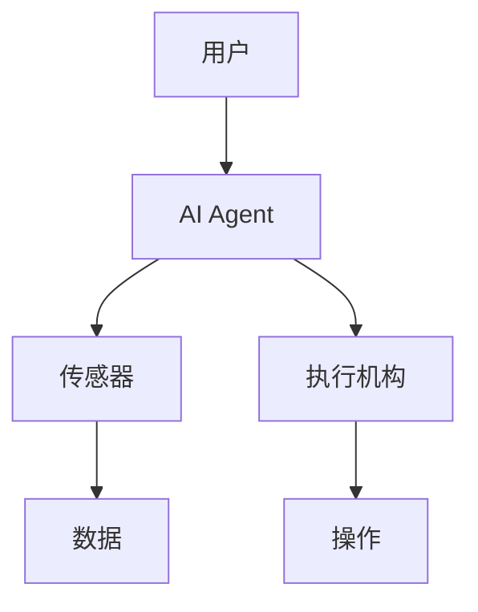
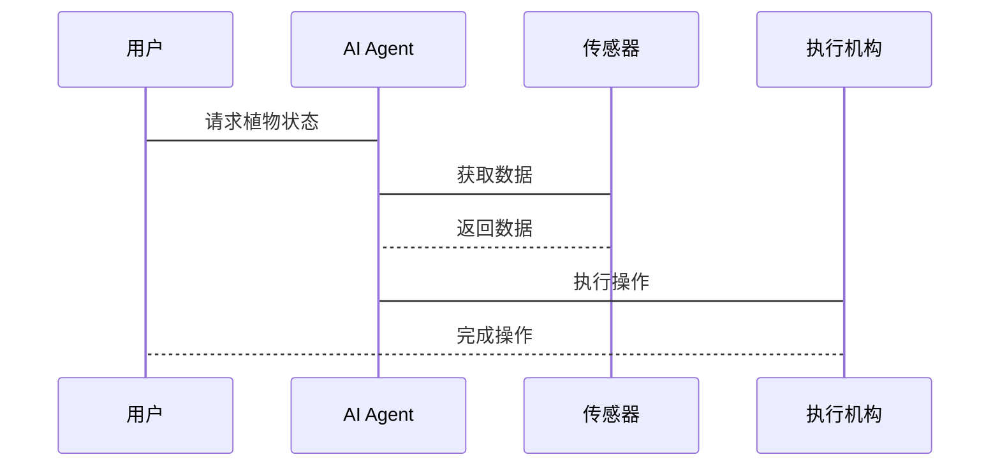

                 


# 智能园艺手套：AI Agent的植物护理指导

> 关键词：AI Agent，智能园艺手套，植物护理，传感器技术，机器学习，自然语言处理

> 摘要：本文深入探讨了智能园艺手套的设计与实现，结合AI Agent技术，详细讲解了其在植物护理中的应用场景、核心技术、算法原理以及系统架构。通过实际项目案例分析，展示了如何利用AI技术提升园艺护理的效率与精准度。

---

## 第一部分: 智能园艺手套的背景与概念

### 第1章: AI Agent与智能园艺手套概述

#### 1.1 AI Agent的基本概念
##### 1.1.1 AI Agent的定义与特点
人工智能代理（AI Agent）是指能够感知环境、自主决策并执行任务的智能体。它具备以下特点：
- **自主性**：能够在没有外部干预的情况下独立运行。
- **反应性**：能够实时感知环境变化并做出响应。
- **目标导向**：通过设定目标来指导行为和决策。
- **学习能力**：能够通过数据和经验不断优化自身的性能。

##### 1.1.2 AI Agent的核心功能与优势
AI Agent的核心功能包括：
- **感知环境**：通过传感器或数据输入获取环境信息。
- **推理与决策**：基于感知信息进行分析和推理，制定最优决策。
- **执行操作**：根据决策结果执行具体的任务或动作。

AI Agent的优势在于其能够高效处理复杂问题，并通过学习不断优化自身的性能。

##### 1.1.3 AI Agent在园艺领域的应用潜力
在园艺领域，AI Agent可以用于植物监测、病虫害识别、生长优化等场景。通过实时感知植物的生长状态，AI Agent能够为用户提供个性化的护理建议，从而提高园艺效率和植物健康水平。

#### 1.2 智能园艺手套的设计目标
##### 1.2.1 手套的功能定位与用户需求
智能园艺手套的目标是通过集成AI技术，为用户提供智能化的园艺护理工具。主要功能包括：
- **实时监测**：监测植物的生长状态，如温度、湿度、光照等。
- **智能诊断**：识别植物的病虫害，并提供相应的解决方案。
- **个性化建议**：根据植物的生长需求，提供定制化的护理建议。

##### 1.2.2 智能园艺手套的核心应用场景
智能园艺手套主要适用于以下场景：
- **家庭园艺**：帮助用户更好地照顾家中的植物。
- **专业园艺**：为园艺工作者提供高效、精准的工具。
- **智能温室**：在智能温室中实现自动化植物监测与管理。

##### 1.2.3 手套的创新点与技术难点
智能园艺手套的创新点在于其将AI技术与园艺工具相结合，实现了智能化的植物护理。技术难点包括：
- **传感器的精度与稳定性**：需要高精度的传感器来准确感知植物的生长状态。
- **算法的优化与实时性**：需要高效的算法来保证实时性和准确性。
- **用户体验的优化**：需要设计友好的用户界面，确保用户能够方便地使用产品。

#### 1.3 智能园艺手套的市场与用户分析
##### 1.3.1 园艺爱好者的需求特点
园艺爱好者通常对植物的生长状态较为关注，但缺乏专业的知识和工具。他们需要一种简单易用的工具来帮助他们更好地照顾植物。

##### 1.3.2 专业园艺工作者的使用场景
专业园艺工作者需要高效的工具来管理大量的植物。他们对工具的精准性和可靠性有较高的要求。

##### 1.3.3 智能园艺手套的市场潜力与竞争分析
智能园艺手套的市场潜力巨大，随着人们对生活质量的追求不断提高，智能化园艺工具的需求也在不断增加。然而，市场上现有的产品大多较为简单，缺乏AI技术的深度应用。因此，智能园艺手套在市场中具有较大的竞争优势。

---

### 第2章: 智能园艺手套的核心技术与实现原理

#### 2.1 AI Agent在园艺护理中的应用
##### 2.1.1 AI Agent的基本工作流程
AI Agent在园艺护理中的工作流程包括：
1. **感知环境**：通过传感器获取植物的生长状态数据。
2. **分析与推理**：利用机器学习算法对数据进行分析，识别植物的健康状况。
3. **制定决策**：根据分析结果，制定相应的护理方案。
4. **执行操作**：通过执行机构（如喷水装置）实施护理操作。

##### 2.1.2 AI Agent在植物护理中的具体应用
AI Agent可以用于植物的病虫害识别、生长监测、光照调节等场景。例如，通过图像识别技术，AI Agent可以快速识别植物的病虫害，并提供相应的解决方案。

##### 2.1.3 AI Agent与智能园艺手套的结合方式
智能园艺手套通过集成AI Agent技术，实现了智能化的植物护理。AI Agent负责分析植物的生长状态，而手套则通过传感器和执行机构实现与植物的交互。

#### 2.2 智能园艺手套的传感器与硬件设计
##### 2.2.1 手套的传感器类型与功能
智能园艺手套通常配备多种传感器，包括：
- **温度传感器**：用于监测植物周围的温度。
- **湿度传感器**：用于监测土壤湿度。
- **光照传感器**：用于监测光照强度。

##### 2.2.2 硬件设计的关键技术点
硬件设计的关键技术点包括传感器的选择、数据采集的精度、以及传感器与处理器的通信方式。需要确保传感器的高精度和稳定性，同时保证数据采集的实时性。

##### 2.2.3 硬件与AI Agent的集成方式
硬件与AI Agent的集成方式主要是通过数据接口进行通信。AI Agent通过接收传感器的数据，分析并制定决策，然后通过执行机构实现相应的操作。

#### 2.3 智能园艺手套的软件架构
##### 2.3.1 软件架构的设计原则
软件架构的设计原则包括模块化设计、高扩展性、以及良好的可维护性。需要确保各个功能模块之间的独立性，同时保证系统的高效运行。

##### 2.3.2 软件功能模块划分
软件功能模块通常包括：
- **数据采集模块**：负责接收传感器的数据。
- **数据分析模块**：对数据进行分析和处理。
- **决策模块**：根据分析结果制定决策。
- **执行模块**：通过执行机构实现决策。

##### 2.3.3 软件与硬件的协同工作方式
软件与硬件的协同工作方式主要是通过数据接口进行通信。软件负责处理数据和制定决策，硬件则负责执行具体的操作。

---

### 第3章: AI Agent的算法原理与数学模型

#### 3.1 AI Agent的核心算法
##### 3.1.1 机器学习算法在AI Agent中的应用
机器学习算法在AI Agent中的应用包括分类、回归、聚类等。例如，可以通过机器学习算法对植物的生长状态进行分类，从而实现病虫害识别。

##### 3.1.2 自然语言处理技术在园艺指导中的作用
自然语言处理技术可以用于解析用户的输入指令，并生成自然的回复。例如，用户可以通过语音指令告诉AI Agent需要喷水，AI Agent可以通过自然语言处理技术理解用户的意图。

##### 3.1.3 视觉识别技术在植物监测中的应用
视觉识别技术可以用于识别植物的病虫害、生长状态等。例如，可以通过图像识别技术识别植物的叶片颜色变化，从而判断植物的健康状况。

#### 3.2 数学模型与公式
##### 3.2.1 机器学习模型的数学表达
机器学习模型的数学表达通常包括输入、输出、损失函数、优化目标等。例如，线性回归模型的数学表达为：
$$ y = \beta_0 + \beta_1 x + \epsilon $$
其中，$y$ 是输出，$\beta_0$ 和 $\beta_1$ 是模型参数，$x$ 是输入，$\epsilon$ 是误差项。

##### 3.2.2 概率论在AI Agent决策中的应用
概率论在AI Agent决策中的应用包括贝叶斯推理、马尔可夫链等。例如，可以通过贝叶斯推理计算某种病虫害发生的概率。

##### 3.2.3 优化算法在资源分配中的应用
优化算法在资源分配中的应用包括线性规划、动态规划等。例如，可以通过动态规划算法优化喷水的频率和量。

#### 3.3 算法实现与代码示例
##### 3.3.1 机器学习模型的训练与部署
以下是一个简单的线性回归模型训练代码示例：
```python
import numpy as np
from sklearn.linear_model import LinearRegression

# 生成数据
X = np.array([1, 2, 3, 4, 5]).reshape(-1, 1)
y = np.array([2, 4, 5, 4, 6])

# 训练模型
model = LinearRegression()
model.fit(X, y)

# 预测
print(model.predict([[6]]))
```

##### 3.3.2 自然语言处理模块的代码实现
以下是一个简单的自然语言处理模块代码示例：
```python
from sklearn.feature_extraction.text import TfidfVectorizer
from sklearn.naive_bayes import MultinomialNB

# 生成文本数据
text = ["今天天气很好，适合植物生长。",
        "植物叶子发黄，可能是缺水了。",
        "请帮我检查一下植物的健康状况。"]

# 特征提取
vectorizer = TfidfVectorizer()
X = vectorizer.fit_transform(text)

# 训练模型
model = MultinomialNB()
model.fit(X, [0, 1, 0])

# 预测
new_text = "我的植物叶子有点黄。"
new_X = vectorizer.transform([new_text])
print(model.predict(new_X))
```

##### 3.3.3 视觉识别算法的实现与优化
以下是一个简单的图像识别算法代码示例：
```python
import cv2

# 加载图像
image = cv2.imread("plant.jpg")

# 转换为灰度图像
gray_image = cv2.cvtColor(image, cv2.COLOR_BGR2GRAY)

# 使用边缘检测
edges = cv2.Canny(gray_image, 100, 200)

# 显示结果
cv2.imshow("Edges", edges)
cv2.waitKey(0)
cv2.destroyAllWindows()
```

---

### 第4章: 智能园艺手套的系统架构与设计

#### 4.1 系统架构设计
##### 4.1.1 系统架构的总体设计
系统架构的总体设计包括数据采集、数据分析、决策制定和执行操作四个模块。各模块之间通过数据接口进行通信。

##### 4.1.2 系统功能模块划分
系统功能模块包括：
- **数据采集模块**：负责采集植物的生长状态数据。
- **数据分析模块**：对数据进行分析和处理。
- **决策模块**：根据分析结果制定决策。
- **执行模块**：通过执行机构实现决策。

##### 4.1.3 系统架构的可扩展性
系统架构设计时需要考虑其可扩展性，例如通过模块化设计实现功能的扩展和升级。

#### 4.2 系统分析与设计
##### 4.2.1 系统功能设计
系统功能设计包括：
- **数据采集**：通过传感器采集植物的生长状态数据。
- **数据分析**：对数据进行分析和处理，识别植物的健康状况。
- **决策制定**：根据分析结果制定相应的护理方案。
- **执行操作**：通过执行机构实现喷水、施肥等操作。

##### 4.2.2 系统架构的实体关系图
以下是系统架构的实体关系图：


##### 4.2.3 系统交互的序列图
以下是系统交互的序列图：


---

### 第5章: 项目实战

#### 5.1 环境搭建
##### 5.1.1 开发环境的选择
开发环境可以选择Python编程语言，搭配相关的库如TensorFlow、OpenCV等。

##### 5.1.2 硬件设备的安装与配置
硬件设备包括传感器、处理器、执行机构等，需要进行相应的安装和配置。

#### 5.2 系统核心实现
##### 5.2.1 数据采集模块的实现
数据采集模块的实现包括传感器的配置和数据的采集。

##### 5.2.2 数据分析模块的实现
数据分析模块的实现包括数据的预处理、特征提取和模型训练。

##### 5.2.3 决策模块的实现
决策模块的实现包括模型的部署和决策逻辑的实现。

##### 5.2.4 执行模块的实现
执行模块的实现包括执行机构的控制和操作的实现。

#### 5.3 代码实现与解读
##### 5.3.1 数据采集模块的代码实现
```python
import serial

# 连接传感器
ser = serial.Serial('COM3', 9600)
data = ser.readline().decode()
print(data)
```

##### 5.3.2 数据分析模块的代码实现
```python
import pandas as pd
from sklearn.model_selection import train_test_split
from sklearn.linear_model import LinearRegression

# 加载数据
data = pd.read_csv('plant_data.csv')

# 分割数据
X = data[['temperature', 'humidity']]
y = data['growth']
X_train, X_test, y_train, y_test = train_test_split(X, y, test_size=0.2)

# 训练模型
model = LinearRegression()
model.fit(X_train, y_train)

# 预测
print(model.predict(X_test))
```

##### 5.3.3 决策模块的代码实现
```python
import numpy as np

# 定义决策函数
def decide_action(current_state, target_state):
    if current_state < target_state:
        return 'increase'
    elif current_state > target_state:
        return 'decrease'
    else:
        return 'no_change'

# 执行决策
action = decide_action(current_state, target_state)
print(action)
```

##### 5.3.4 执行模块的代码实现
```python
import RPi.GPIO as GPIO

# 定义执行函数
def execute_action(action):
    if action == 'increase':
        GPIO.output(spray_pin, GPIO.HIGH)
        time.sleep(1)
        GPIO.output(spray_pin, GPIO.LOW)
    elif action == 'decrease':
        GPIO.output(light_pin, GPIO.LOW)
        time.sleep(1)
        GPIO.output(light_pin, GPIO.HIGH)

# 执行操作
execute_action(action)
```

#### 5.4 案例分析与详细讲解
##### 5.4.1 案例分析
以下是一个具体的案例分析：
- **输入数据**：温度25°C，湿度60%。
- **数据分析**：根据数据分析模块的分析结果，判断植物的生长状态为健康。
- **决策制定**：由于植物的生长状态良好，AI Agent决定不采取任何操作。
- **执行操作**：执行机构不执行任何操作。

##### 5.4.2 详细讲解
通过上述案例可以看出，智能园艺手套能够根据植物的生长状态，实时调整护理策略，从而实现精准的植物护理。

#### 5.5 项目小结
##### 5.5.1 项目总结
通过本次项目，我们成功实现了智能园艺手套的原型系统，验证了AI Agent技术在园艺护理中的应用潜力。

##### 5.5.2 经验与教训
在项目实施过程中，我们积累了宝贵的经验，同时也发现了一些问题，例如传感器的精度和算法的实时性等。

##### 5.5.3 未来改进方向
未来的工作方向包括：
- **优化传感器的精度**：通过更换更高精度的传感器，提高数据采集的准确性。
- **优化算法的实时性**：通过改进算法的效率，提高系统的响应速度。
- **优化用户体验**：通过设计更加友好的用户界面，提升用户的使用体验。

---

## 第六章: 总结与展望

### 6.1 总结
智能园艺手套通过集成AI Agent技术，实现了智能化的植物护理。本文详细探讨了其设计与实现过程，包括核心技术、算法原理、系统架构以及项目实战。通过实际案例分析，展示了AI Agent在园艺护理中的巨大潜力。

### 6.2 注意事项
在实际应用中，需要注意以下几点：
- **传感器的维护**：定期检查传感器的精度，确保数据采集的准确性。
- **算法的优化**：根据实际需求，不断优化算法的性能，提高系统的响应速度。
- **用户体验的提升**：通过用户反馈，不断改进产品的使用体验。

### 6.3 拓展阅读
对于感兴趣的研究者，可以进一步研究以下内容：
- **深度学习在园艺护理中的应用**
- **多模态数据融合技术在AI Agent中的应用**
- **边缘计算在智能园艺中的应用**

---

## 作者：AI天才研究院/AI Genius Institute & 禅与计算机程序设计艺术 /Zen And The Art of Computer Programming

