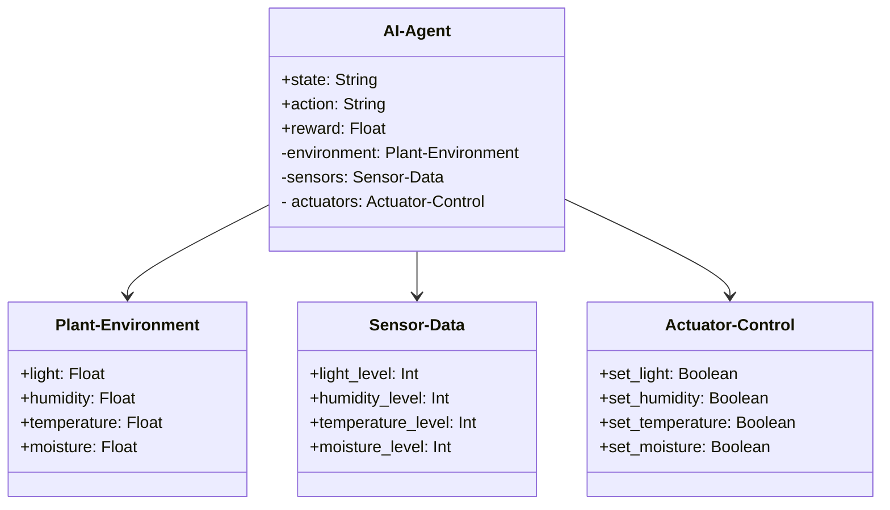

                 


# 智能园艺：AI Agent控制的室内种植系统

> 关键词：智能园艺、AI Agent、室内种植、物联网、自动化控制、环境监测

> 摘要：本文探讨了AI Agent在室内种植系统中的应用，分析了其背景、核心概念、算法原理、系统架构，并通过实际案例展示了系统的实现与优化，最后提供了最佳实践和总结。

---

## 目录

### 第1章: 智能园艺与AI Agent的背景介绍

#### 1.1 问题背景与描述
- 1.1.1 室内种植的背景与挑战
- 1.1.2 智能园艺的定义与目标
- 1.1.3 AI Agent在智能园艺中的作用

#### 1.2 问题解决与边界
- 1.2.1 AI Agent如何优化室内种植
- 1.2.2 系统边界与功能范围
- 1.2.3 智能园艺系统的外延与限制

#### 1.3 核心概念与结构
- 1.3.1 智能园艺系统的组成要素
- 1.3.2 AI Agent的核心功能与属性
- 1.3.3 系统架构与核心模块

### 第2章: AI Agent与室内种植系统的核心概念

#### 2.1 核心概念原理
- 2.1.1 AI Agent的基本原理
- 2.1.2 室内种植系统的运行机制
- 2.1.3 AI Agent与种植环境的交互

#### 2.2 核心概念对比分析
- 2.2.1 不同AI Agent的特征对比
- 2.2.2 室内种植系统与传统种植方式的对比
- 2.2.3 AI Agent在不同种植场景中的应用特点

#### 2.3 ER实体关系图
```mermaid
er
  actor(AI Agent)
  actor(种植环境)
  actor(传感器数据)
  actor(用户输入)
  actor(系统输出)
  relation(控制)
  relation(监测)
  relation(反馈)
  relation(优化)
```

### 第3章: AI Agent算法原理与实现

#### 3.1 算法原理概述
- 3.1.1 基于强化学习的AI Agent算法
- 3.1.2 算法的数学模型与公式
- 3.1.3 算法的实现步骤

#### 3.2 算法实现代码
```python
class AI-Agent:
    def __init__(self):
        self.state = None
        self.action = None
        self.reward = None
```

### 第4章: 系统分析与架构设计

#### 4.1 系统架构图
```mermaid
graph TD
    AI-Agent -> Sensor-Data
    Sensor-Data -> System-Control
    System-Control -> Actuator-Control
    Actuator-Control -> AI-Agent
```

#### 4.2 功能设计


### 第5章: 项目实战

#### 5.1 环境安装
- 安装Python、相关库和硬件设备

#### 5.2 系统核心实现
```python
def main():
    agent = AI-Agent()
    while True:
        agent.update_state()
        action = agent.decide_action()
        agent.execute_action(action)
        reward = agent.receive_reward()
        agent.update_policy(reward)
```

#### 5.3 案例分析与优化

### 第6章: 最佳实践、小结与拓展

#### 6.1 使用建议
- 系统维护与优化建议

#### 6.2 小结
- 全文总结与反思

#### 6.3 注意事项
- 使用过程中的注意事项

#### 6.4 拓展阅读
- 推荐进一步阅读的技术资料

---

### 作者：AI天才研究院/AI Genius Institute & 禅与计算机程序设计艺术 /Zen And The Art of Computer Programming

