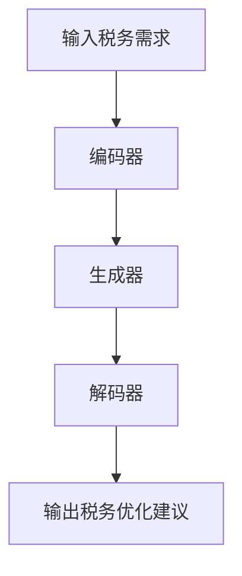
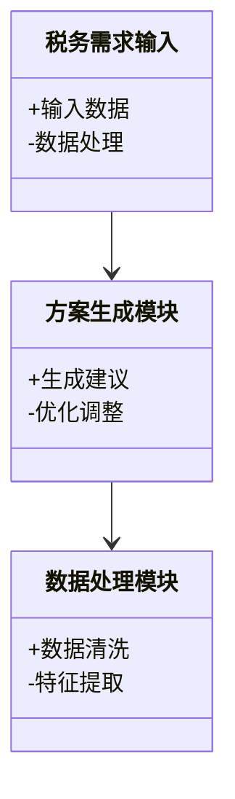

                 


```markdown
# 智能国际税收筹划建议生成器

> 关键词：智能国际税收筹划，生成式AI，大语言模型，税务优化，税收最小化

> 摘要：本文详细探讨了智能国际税收筹划的背景、核心概念、算法原理、系统架构设计及项目实战。通过生成式AI技术，结合大语言模型和数据挖掘方法，提出了高效的税务优化解决方案。文章从理论到实践，层层深入，为读者提供全面的技术指导。

---

## 第一部分: 智能国际税收筹划背景与概念

### 第1章: 智能国际税收筹划概述

#### 1.1 国际税收的基本概念
- 1.1.1 国际税收的定义与范围
  - 全球化背景下的跨国企业税务问题
  - 税收的属地原则与居民税收管辖权
- 1.1.2 国际税收的主要组成部分
  - 所得税、增值税、消费税等
- 1.1.3 国际税收与企业全球化的关系
  - 跨国经营的税务挑战与机遇

#### 1.2 智能税收筹划的背景与意义
- 1.2.1 传统税收筹划的局限性
  - 税务法规复杂，人工处理效率低
  - 税务规划的创新性不足
- 1.2.2 智能技术在税收筹划中的应用优势
  - AI驱动的自动化与智能化
  - 大语言模型的文本生成与理解能力
- 1.2.3 智能国际税收筹划的必要性与未来趋势
  - 数字化税务管理的需求
  - 全球税收政策的变化与应对

### 第2章: 智能国际税收筹划的核心概念

#### 2.1 智能国际税收筹划的定义与特点
- 2.1.1 智能国际税收筹划的定义
  - 利用AI技术进行跨国税务优化
- 2.1.2 其他相关概念对比
  - 智能税务管理 vs. 智能财务规划
- 2.1.3 智能国际税收筹划的核心特点
  - 数据驱动、实时分析、动态优化

#### 2.2 智能国际税收筹划的关键技术
- 2.2.1 生成式AI在税收筹划中的应用
  - 文本生成与税务文档优化
- 2.2.2 大语言模型（如GPT）的文本生成能力
  - 税务建议生成的创新应用
- 2.2.3 数据挖掘与分析技术在税务优化中的作用
  - 税务数据的深度分析与模式识别

### 第3章: 智能国际税收筹划的流程与工作原理

#### 3.1 税务需求分析
- 3.1.1 企业税务目标的确定
  - 税收最小化与合规性并重
- 3.1.2 税务风险的识别与评估
  - 税务合规性评估与风险等级划分
- 3.1.3 税务数据的收集与整理
  - 数据清洗与特征提取

#### 3.2 税务优化方案生成
- 3.2.1 基于AI的方案生成过程
  - 自动生成税务优化建议
- 3.2.2 方案的合法性与可行性分析
  - 税务合规性检查与方案调整
- 3.2.3 方案的动态调整与优化
  - 实时监控与动态优化

## 第二部分: 智能国际税收筹划的核心算法与数学模型

### 第4章: 生成式AI的数学模型

#### 4.1 大语言模型的训练目标函数
- $$ \text{Loss} = -\sum_{i=1}^{n} \log p(x_i) $$
  - 解释：模型通过最小化损失函数来学习数据分布

#### 4.2 模型生成概率计算公式
- $$ P(y|x) = \text{softmax}(z) $$
  - 解释：softmax函数用于将模型输出转换为概率分布

#### 4.3 模型推理过程的流程图


### 第5章: 税务优化的数学模型

#### 5.1 税收最小化目标函数
- $$ \min_{x} \sum_{i=1}^{m} t_i x_i $$
  - 解释：寻找使总税收最小的变量组合

#### 5.2 约束条件的数学表达
- $$ \sum_{i=1}^{m} a_i x_i \leq C $$
  - 解释：满足所有约束条件的限制

## 第三部分: 系统分析与架构设计

### 第6章: 系统功能设计

#### 6.1 程序功能需求
- 6.1.1 税务需求输入
- 6.1.2 方案生成与展示
- 6.1.3 方案优化与调整

#### 6.2 系统功能模块
- 6.2.1 数据处理模块
  - 数据清洗与特征提取
- 6.2.2 方案生成模块
  - 基于AI的方案生成
- 6.2.3 方案优化模块
  - 动态优化与调整

#### 6.3 系统功能实现的类图


## 第四部分: 项目实战

### 第7章: 项目实战与案例分析

#### 7.1 环境安装
- 7.1.1 安装Python与必要的库
  - 安装PyTorch、Transformers等库

#### 7.2 核心代码实现
- 7.2.1 数据处理代码
  ```python
  import pandas as pd
  data = pd.read_csv('tax_data.csv')
  data_cleaned = data.dropna()
  ```
- 7.2.2 方案生成代码
  ```python
  from transformers import GPT2LMHeadModel, GPT2Tokenizer
  tokenizer = GPT2Tokenizer.from_pretrained('gpt2')
  model = GPT2LMHeadModel.from_pretrained('gpt2')
  input_ids = tokenizer.encode("Generate tax optimization建议:", add_special_tokens=True)
  outputs = model.generate(input_ids, max_length=50)
  print(tokenizer.decode(outputs[0], skip_special_tokens=True))
  ```

#### 7.3 代码解读与分析
- 7.3.1 数据处理代码分析
  - 数据清洗与特征提取的重要性
- 7.3.2 方案生成代码分析
  - GPT模型在税务建议生成中的应用

#### 7.4 案例分析与实际应用
- 7.4.1 案例背景介绍
- 7.4.2 方案生成与优化过程
- 7.4.3 实际效果与经验总结

## 第五部分: 最佳实践与总结

### 第8章: 最佳实践与总结

#### 8.1 小结
- 智能国际税收筹划的核心技术与应用场景
- 生成式AI在税务优化中的优势

#### 8.2 注意事项
- 税务合规性的重要性
- 数据隐私与安全的保护

#### 8.3 拓展阅读
- 推荐书籍与论文
- 关联技术领域（如区块链在税务管理中的应用）

---

## 作者：AI天才研究院/AI Genius Institute & 禅与计算机程序设计艺术 /Zen And The Art of Computer Programming
```

