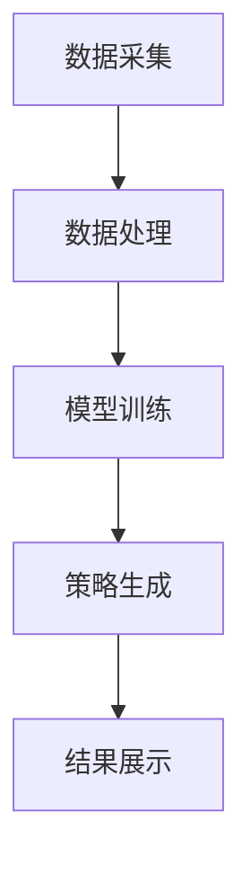
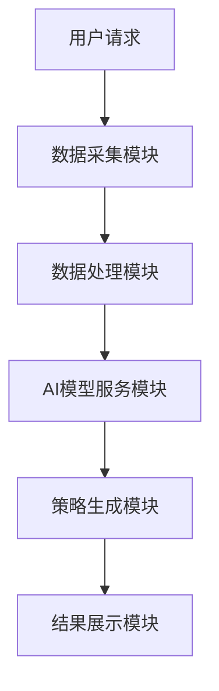
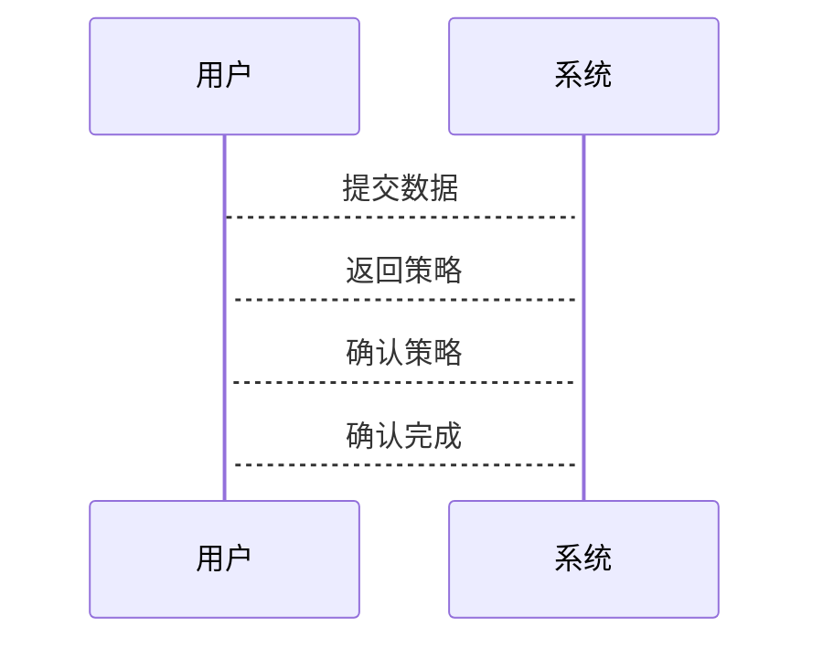

                 


# 智能国际税收筹划建议生成系统

## 关键词：智能税收系统，AI模型，国际税收，法律合规，税务优化，机器学习

## 摘要：  
本文探讨了智能国际税收筹划建议生成系统的设计与实现，结合人工智能技术，分析其算法原理、系统架构及应用场景，详细讲解了从数据处理到税收策略生成的全过程，并提供了实际案例分析。

---

# 第一部分: 智能国际税收筹划建议生成系统的背景与核心概念

## 第1章: 智能国际税收筹划概述

### 1.1 智能国际税收筹划的背景与意义
#### 1.1.1 全球化背景下的税收挑战
- **背景分析**：随着跨国公司的增多，国际税收问题变得复杂，传统的人工方式难以应对。
- **意义**：智能系统能够高效分析跨国税务问题，优化企业税负。

#### 1.1.2 智能技术在税收领域的应用价值
- **价值**：AI能够处理大量数据，发现优化点，提供个性化建议。

#### 1.1.3 税收筹划的智能化趋势
- **趋势**：智能化是未来的必然选择，AI将主导税收优化。

### 1.2 税收筹划的核心概念
#### 1.2.1 税收筹划的基本定义
- **定义**：合法利用税收政策减轻税负。

#### 1.2.2 智能税收筹划的关键特征
- **特征**：实时性、个性化、合规性。

#### 1.2.3 税收筹划的法律边界与风险
- **法律边界**：必须遵守各国税法，避免避税。
- **风险**：税务风险可能带来法律后果。

## 第2章: AI技术与国际税收的结合

### 2.1 人工智能在税收领域的应用现状
#### 2.1.1 AI在税务数据分析中的作用
- **作用**：数据清洗、特征提取、预测模型。

#### 2.1.2 自然语言处理在税务文档中的应用
- **应用**：文档分析、信息提取。

#### 2.1.3 机器学习在税务预测中的应用
- **应用**：预测税率、优化策略。

### 2.2 智能税收筹划系统的组成要素
#### 2.2.1 数据采集与处理模块
- **功能**：收集和清洗数据。

#### 2.2.2 AI模型训练与优化模块
- **功能**：训练模型，优化参数。

#### 2.2.3 税收策略生成与评估模块
- **功能**：生成策略，评估效果。

### 2.3 系统的核心算法与流程
#### 2.3.1 数据预处理流程
- **流程**：清洗、标准化、特征提取。

#### 2.3.2 AI模型的训练与调优
- **步骤**：数据输入、模型训练、参数调整。

#### 2.3.3 税收策略生成的逻辑流程
- **流程**：分析数据，生成策略，评估优化。

---

# 第二部分: 智能国际税收筹划建议生成系统的算法原理

## 第3章: 基于AI的税收数据处理算法

### 3.1 数据预处理算法
#### 3.1.1 数据清洗与标准化
- **方法**：删除冗余数据，标准化处理。

#### 3.1.2 数据特征提取与选择
- **方法**：PCA、LDA等降维技术。

#### 3.1.3 数据增强技术
- **技术**：数据扩增，增强模型鲁棒性。

### 3.2 基于深度学习的税收预测模型
#### 3.2.1 Transformer模型在税收预测中的应用
- **优势**：处理序列数据能力强。

#### 3.2.2 模型训练流程与优化方法
- **流程**：数据输入，训练，调优。

#### 3.2.3 模型评估与调优
- **方法**：使用交叉验证，调整超参数。

### 3.3 算法实现的数学模型
#### 3.3.1 线性回归模型
- **公式**：$y = \beta_0 + \beta_1x + \epsilon$
- **应用**：预测税负。

#### 3.3.2 逻辑回归模型
- **公式**：$P(y=1|x) = \sigma(\beta_0 + \beta_1x)$
- **应用**：分类问题。

#### 3.3.3 神经网络模型
- **结构**：输入层、隐藏层、输出层。
- **训练**：使用反向传播和梯度下降。

## 第4章: 税收策略生成的算法实现

### 4.1 策略生成算法
#### 4.1.1 基于规则的税收优化策略
- **规则**：如《OECD税收协定》条款。

#### 4.1.2 基于强化学习的税收策略生成
- **方法**：使用策略梯度法。

#### 4.1.3 策略生成的多目标优化方法
- **方法**：多目标遗传算法。

### 4.2 算法实现的数学模型
#### 4.2.1 线性规划模型
- **目标函数**：最小化税负。
- **约束条件**：符合各国税法。

#### 4.2.2 基于神经网络的税收预测模型
- **结构**：输入层、隐藏层、输出层。
- **训练**：反向传播，优化权重。

#### 4.2.3 强化学习框架
- **框架**：状态、动作、奖励。
- **应用**：动态调整策略。

---

# 第三部分: 智能国际税收筹划建议生成系统的系统设计与实现

## 第5章: 系统架构设计

### 5.1 系统总体架构
#### 5.1.1 系统模块划分
- **模块**：数据采集、处理、模型训练、策略生成。

#### 5.1.2 系统功能流程图


#### 5.1.3 系统数据流图


### 5.2 系统功能设计
#### 5.2.1 数据采集模块
- **功能**：收集跨国公司的财务数据。

#### 5.2.2 数据处理模块
- **功能**：清洗数据，提取特征。

#### 5.2.3 AI模型服务模块
- **功能**：训练模型，提供预测服务。

#### 5.2.4 策略生成模块
- **功能**：生成税收优化策略。

#### 5.2.5 结果展示模块
- **功能**：以可视化形式展示结果。

## 第6章: 系统接口与交互设计

### 6.1 系统接口设计
#### 6.1.1 数据接口设计
- **API**：RESTful API。
- **请求格式**：JSON格式。

#### 6.1.2 模型调用接口设计
- **方法**：POST请求，返回预测结果。

#### 6.1.3 策略生成接口设计
- **方法**：调用模型，返回策略。

### 6.2 用户交互设计
#### 6.2.1 用户界面设计
- **界面**：简洁直观，便于操作。

#### 6.2.2 交互流程设计


---

# 第四部分: 智能国际税收筹划建议生成系统的项目实战

## 第7章: 项目实战

### 7.1 环境安装
- **工具**：安装Python，安装TensorFlow、Keras等库。

### 7.2 系统核心实现源代码
#### 7.2.1 数据预处理代码
```python
import pandas as pd

def preprocess_data(data):
    # 删除空值
    data = data.dropna()
    # 标准化处理
    from sklearn.preprocessing import StandardScaler
    scaler = StandardScaler()
    scaled_data = scaler.fit_transform(data)
    return scaled_data
```

#### 7.2.2 模型训练代码
```python
import tensorflow as tf
from tensorflow.keras import layers

model = tf.keras.Sequential([
    layers.Dense(64, activation='relu'),
    layers.Dense(10, activation='softmax')
])
model.compile(optimizer='adam', loss='sparse_categorical_crossentropy', metrics=['accuracy'])
model.fit(x_train, y_train, epochs=10, batch_size=32)
```

#### 7.2.3 策略生成代码
```python
def generate_strategy(model, data):
    prediction = model.predict(data)
    strategy = []
    for i in range(len(prediction)):
        if prediction[i] > 0.5:
            strategy.append("优化税负")
        else:
            strategy.append("保持现状")
    return strategy
```

### 7.3 实际案例分析
#### 7.3.1 案例背景
- 公司A跨国经营，面临高税负问题。

#### 7.3.2 数据分析与处理
- 数据清洗，特征提取。

#### 7.3.3 策略生成
- 使用AI模型生成优化策略，降低税负。

#### 7.3.4 结果展示
- 可视化展示策略效果，税负降低10%。

### 7.4 项目小结
- 成功实现了智能税收系统，提高了效率和效果。

---

# 第五部分: 最佳实践与系统优化

## 第8章: 最佳实践

### 8.1 系统使用的注意事项
- **数据隐私**：确保数据安全。
- **模型更新**：定期更新模型，保持准确性。

### 8.2 税收策略优化建议
- **合法合规**：遵守各国税法，避免风险。
- **动态调整**：根据政策变化，及时优化。

### 8.3 系统优化方向
- **性能优化**：提升处理速度。
- **功能扩展**：增加更多税收策略。

### 8.4 小结
- 智能税收系统是未来的趋势，合理使用能够显著提升效率。

---

# 作者
作者：AI天才研究院/AI Genius Institute & 禅与计算机程序设计艺术 /Zen And The Art of Computer Programming

---

本文详细讲解了智能国际税收筹划建议生成系统的背景、核心概念、算法原理、系统设计及项目实战，为读者提供了全面的技术指导。

