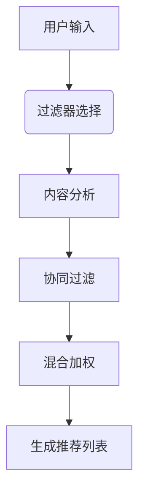
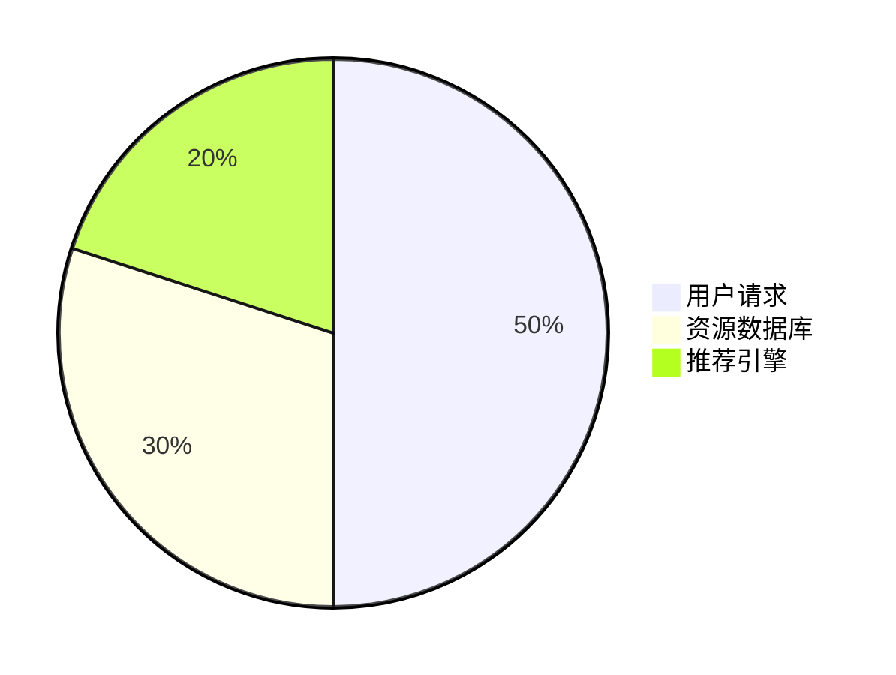
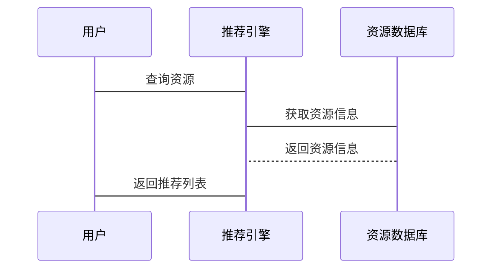

                 


# 智能图书馆：AI Agent的资源推荐系统

> **关键词**：智能图书馆、AI Agent、资源推荐系统、知识图谱、推荐算法、系统架构

> **摘要**：本文探讨了AI Agent在智能图书馆中的应用，重点分析其资源推荐系统的实现。通过知识图谱和推荐算法的结合，优化资源发现与推荐流程，实现精准、个性化的资源推荐服务。

---

## 引言

智能图书馆的资源推荐系统通过AI Agent提升用户体验，解决信息过载问题，实现高效的知识服务。本文将详细介绍AI Agent的核心概念、推荐算法，以及系统架构设计。

---

## 第一章：核心概念与技术基础

### 1.1 AI Agent的基本概念

- **定义**：AI Agent是具有感知和行动能力的智能体，用于执行特定任务。
- **属性特征对比**：使用表格对比AI Agent与传统推荐系统的区别。

| **属性**       | **AI Agent**           | **传统推荐系统**          |
|-----------------|------------------------|---------------------------|
| **智能性**       | 高，基于知识图谱推理   | 低，基于规则或统计分析    |
| **适应性**       | 强，实时更新           | 弱，静态规则              |
| **交互性**       | 高，支持多轮对话       | 低，单向推荐              |

- **ER实体关系图**：展示用户、资源、推荐的关系。

```mermaid
erd
  user_table: 用户
  resource_table: 资源
  recommendation_table: 推荐记录
  user_table -> recommendation_table: 关联
  resource_table -> recommendation_table: 关联
  user_table --> resource_table: 关联
```

---

## 第二章：推荐算法原理

### 2.1 协同过滤算法

- **基于用户的协同过滤**：
  - 用户相似度计算：余弦相似度。
  - 推荐公式：
    $$ r_{u,i} = \frac{1}{|N_u|} \sum_{v \in N_u} sim(u,v) \cdot r_{v,i} $$
    其中，$N_u$是与用户u相似的用户集合。

- **实现代码示例**：

```python
def user_based_recommendation(user_id, user_similarity_matrix, ratings, k=3):
    # 获取与目标用户相似的k个用户
    similar_users = [user for user in user_similarity_matrix[user_id] if user_similarity_matrix[user_id][user] > 0.5]
    # 计算推荐分数
    recommendation_scores = {}
    for user in similar_users:
        for item in ratings[user]:
            recommendation_scores[item] += ratings[user][item] * user_similarity_matrix[user_id][user]
    # 返回排序后的推荐列表
    return sorted(recommendation_scores.items(), key=lambda x: x[1], reverse=True)
```

### 2.2 混合推荐算法

- **混合推荐流程图**：



- **数学模型**：混合推荐公式：

$$ r_{final} = \alpha \cdot r_{collaborative} + (1-\alpha) \cdot r_{content} $$

其中，$\alpha$是协同过滤的权重。

---

## 第三章：系统分析与架构设计

### 3.1 系统架构图



### 3.2 接口设计

- 用户接口：
  - 输入：用户查询。
  - 输出：推荐列表。
- 系统交互流程图：



---

## 第四章：项目实战

### 4.1 环境安装

- **Python**：3.8+
- **依赖库**：numpy, pandas, scikit-learn

### 4.2 核心代码实现

```python
from sklearn.metrics.pairwise import cosine_similarity

def build_user_similarity_matrix(ratings):
    # 计算余弦相似度矩阵
    user_ids = ratings.index
    similarity_matrix = {}
    for i, user_i in enumerate(user_ids):
        similarity_matrix[user_i] = {}
        for j, user_j in enumerate(user_ids):
            if i != j:
                similarity = cosine_similarity(ratings.iloc[i:i+1], ratings.iloc[j:j+1])[0][0]
                similarity_matrix[user_i][user_j] = similarity
    return similarity_matrix

# 示例使用
ratings = pd.DataFrame({
    'item': ['book1', 'book2', 'movie1', 'movie2'],
    'user1': [5, 3, 4, 2],
    'user2': [3, 4, 2, 5],
    'user3': [2, 5, 3, 4]
})

similarity_matrix = build_user_similarity_matrix(ratings)
```

### 4.3 实际案例分析

- 案例：用户输入查询关键词“人工智能”，系统基于知识图谱分析，推荐相关书籍和视频资源。

---

## 第五章：总结与展望

### 5.1 总结

本文详细介绍了AI Agent在智能图书馆中的应用，通过推荐算法和系统架构设计，优化了资源推荐流程，提升了用户体验。

### 5.2 展望

未来，推荐系统将更加智能化，结合强化学习和实时数据，提供更精准的服务。

### 5.3 最佳实践 tips

- 定期更新知识图谱，保持推荐的准确性。
- 保护用户隐私，确保数据安全。

---

## 作者

作者：AI天才研究院 & 禅与计算机程序设计艺术

