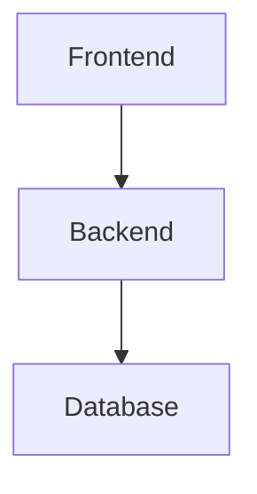

                 


# 智能垃圾分类器：AI Agent的回收指导

---

## 关键词：
智能垃圾分类器、AI Agent、图像识别、机器学习、垃圾处理

---

## 摘要：
随着城市化进程的加快，垃圾处理问题日益严峻。传统的人工垃圾分类效率低下且容易出错，而智能垃圾分类器结合AI Agent和图像识别技术，能够高效、准确地进行垃圾分类，提升资源回收效率，减少环境污染。本文将详细介绍智能垃圾分类器的核心原理、系统架构、算法实现及实际应用，为读者提供全面的技术指导。

---

## 目录

1. **智能垃圾分类器的背景与意义**
   - 1.1 垃圾分类的重要性
   - 1.2 AI Agent在垃圾分类中的作用
   - 1.3 智能垃圾分类器的核心目标

2. **智能垃圾分类器的核心概念与原理**
   - 2.1 AI Agent的基本原理
   - 2.2 图像识别与分类的基本原理
   - 2.3 AI Agent与图像识别的结合

3. **智能垃圾分类器的算法实现**
   - 3.1 垃圾图像数据的采集与预处理
   - 3.2 基于CNN的图像分类算法
   - 3.3 模型训练与优化

4. **智能垃圾分类器的系统架构与设计**
   - 4.1 系统架构设计
   - 4.2 系统功能模块设计
   - 4.3 系统接口与交互设计

5. **智能垃圾分类器的项目实战**
   - 5.1 系统环境搭建
   - 5.2 核心代码实现
   - 5.3 测试与优化

6. **智能垃圾分类器的最佳实践**
   - 6.1 小结
   - 6.2 注意事项
   - 6.3 未来展望
   - 6.4 拓展阅读

---

## 正文

### 第1章: 智能垃圾分类器的背景与意义

#### 1.1 垃圾分类的重要性
全球每年产生大量垃圾，其中很多垃圾可以回收再利用。然而，传统的人工分类效率低下，且容易出错，导致资源浪费和环境污染。垃圾分类的目的是将可回收物与不可回收物分开，减少垃圾填埋和焚烧带来的环境问题。

#### 1.2 AI Agent在垃圾分类中的作用
AI Agent是一种能够感知环境并执行任务的智能体。在垃圾分类中，AI Agent可以通过图像识别技术快速识别垃圾种类，并指导分类工作。相比人工分类，AI Agent具有高效、准确的优势。

#### 1.3 智能垃圾分类器的核心目标
智能垃圾分类器的核心目标是通过AI技术实现垃圾的自动分类，提高分类效率和准确性，减少人工成本，促进资源的循环利用。

---

### 第2章: 智能垃圾分类器的核心概念与原理

#### 2.1 AI Agent的基本原理
AI Agent通过感知环境（如摄像头捕捉图像）并执行任务（如分类垃圾）来实现智能化。其核心包括数据采集、特征提取、决策制定和执行反馈。

#### 2.2 图像识别与分类的基本原理
图像识别是通过算法分析图像内容，提取特征并进行分类的过程。在垃圾分类中，图像识别技术能够快速识别垃圾种类，如纸张、塑料、玻璃等。

#### 2.3 AI Agent与图像识别的结合
AI Agent与图像识别结合，通过摄像头采集垃圾图像，利用分类算法识别垃圾种类，并指导分类工作。

---

### 第3章: 智能垃圾分类器的算法实现

#### 3.1 垃圾图像数据的采集与预处理
垃圾图像数据需要经过采集、清洗和增强处理。例如，使用摄像头采集图像，去除噪声，并通过数据增强技术增加数据多样性。

#### 3.2 基于CNN的图像分类算法
卷积神经网络（CNN）是图像分类的常用算法。其结构包括卷积层、池化层、全连接层等。在垃圾分类任务中，CNN能够有效提取图像特征并进行分类。


#### 3.3 模型训练与优化
模型训练需要选择合适的优化器（如Adam）和损失函数（如交叉熵损失）。训练过程中，通过调整学习率和批量大小优化模型性能。

$$ \text{损失函数} = -\sum_{i} y_{i} \log(p_{i}) $$

---

### 第4章: 智能垃圾分类器的系统架构与设计

#### 4.1 系统架构设计
系统架构包括前端（用户界面）、后端（AI算法）和数据库。前端负责图像采集和显示，后端负责分类处理，数据库存储分类结果。



#### 4.2 系统功能模块设计
系统功能模块包括图像采集、分类处理、结果展示和反馈。每个模块协同工作，实现智能垃圾分类。

#### 4.3 系统接口与交互设计
系统接口包括摄像头接口、数据库接口和用户交互界面。交互设计需要直观易用，确保用户体验良好。

---

### 第5章: 智能垃圾分类器的项目实战

#### 5.1 系统环境搭建
需要安装Python、TensorFlow、OpenCV等库。确保硬件支持（如摄像头）配置正确。

#### 5.2 核心代码实现
以下是一个垃圾分类器的核心代码示例：

```python
import tensorflow as tf
from tensorflow.keras import layers

# 数据预处理
def preprocess_image(image):
    # 缩放图像并归一化
    image = tf.image.resize(image, (224, 224))
    image = tf.keras.applications.mobilenet_v2.preprocess_input(image)
    return image

# 构建模型
def build_model(num_classes):
    model = tf.keras.Sequential([
        layers.Conv2D(32, (3,3), activation='relu', input_shape=(224, 224, 3)),
        layers.MaxPooling2D((2,2)),
        layers.Conv2D(64, (3,3), activation='relu'),
        layers.MaxPooling2D((2,2)),
        layers.Flatten(),
        layers.Dense(128, activation='relu'),
        layers.Dense(num_classes, activation='softmax')
    ])
    return model

# 训练模型
def train_model(model, train_dataset, val_dataset, epochs=10):
    model.compile(optimizer='adam', loss='sparse_categorical_crossentropy', metrics=['accuracy'])
    history = model.fit(train_dataset, epochs=epochs, validation_data=val_dataset)
    return model, history
```

#### 5.3 测试与优化
测试模型性能，分析错误案例，优化算法参数，提升分类准确率。

---

### 第6章: 智能垃圾分类器的最佳实践

#### 6.1 小结
智能垃圾分类器通过AI技术实现了高效准确的垃圾分类，具有重要的社会价值和经济意义。

#### 6.2 注意事项
- 数据质量影响分类效果，需确保数据多样性和代表性。
- 系统维护和更新是确保长期稳定运行的关键。

#### 6.3 未来展望
未来，AI Agent技术将进一步提升垃圾分类的智能化水平，结合物联网技术实现更高效的垃圾分类系统。

#### 6.4 拓展阅读
建议读者深入学习深度学习和计算机视觉技术，探索更多AI在环保领域的应用。

---

## 作者：
作者：AI天才研究院 & 禅与计算机程序设计艺术

