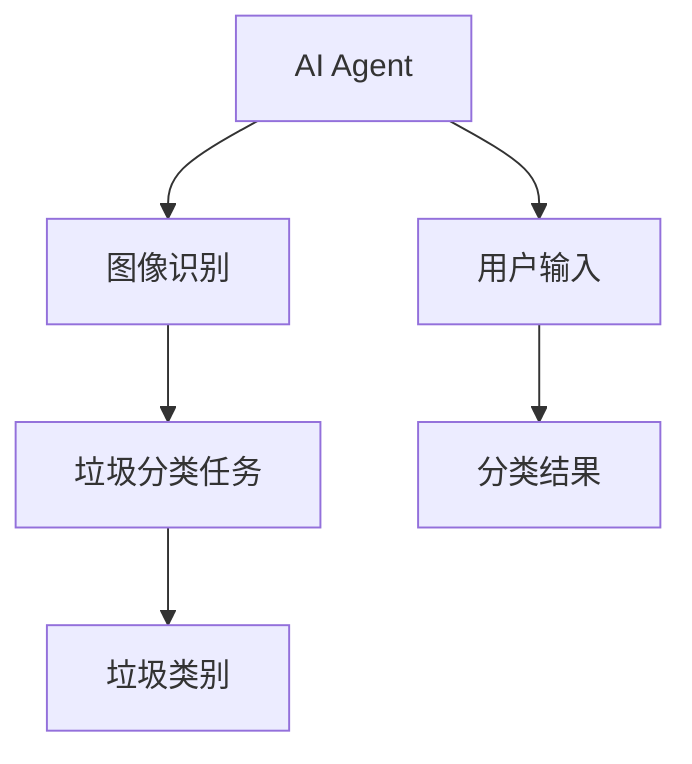
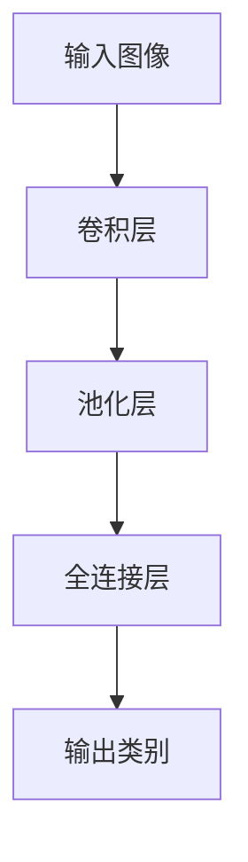
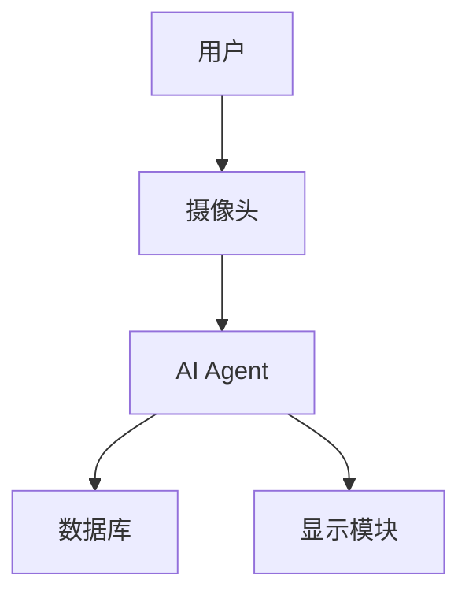

                 


# 智能垃圾分类桶：AI Agent的废物识别与分类指导

> **关键词**：智能垃圾分类桶、AI Agent、废物识别、图像识别、卷积神经网络、垃圾分类系统  
> 
> **摘要**：本文详细介绍了智能垃圾分类桶的设计与实现，重点探讨了AI Agent在垃圾分类中的应用。通过分析背景、核心概念、算法原理、系统架构及项目实战，全面揭示了如何利用AI技术提升垃圾分类效率与准确性。

---

# 第1章: 智能垃圾分类桶的背景与问题背景

## 1.1 问题背景
### 1.1.1 垃圾分类的重要性
垃圾分类是环境保护的重要环节，通过分类可以减少环境污染、节约资源、降低处理成本。然而，传统的人工分类效率低、误差大，难以应对日益增长的垃圾量。

### 1.1.2 当前垃圾分类的痛点
- 人工分类效率低，易出错。
- 垃圾种类多样，分类标准复杂。
- 缺乏智能化手段，难以大规模推广。

### 1.1.3 AI Agent在垃圾分类中的应用价值
AI Agent可以通过图像识别、机器学习等技术实现自动化分类，提高效率和准确性，降低人工成本。

## 1.2 问题描述
### 1.2.1 垃圾分类的基本流程
- 收集垃圾
- 人工或自动分类
- 处理与利用

### 1.2.2 AI Agent在垃圾分类中的具体任务
- 识别垃圾种类
- 分类至对应垃圾桶
- 提供分类指导

### 1.2.3 系统的边界与外延
- 系统边界：仅处理可回收物、厨余垃圾、有害垃圾和其他垃圾。
- 系统外延：与其他垃圾处理系统（如回收站、处理厂）接口。

## 1.3 核心概念与系统组成
### 1.3.1 AI Agent的基本概念
AI Agent是一种智能体，能够感知环境并执行任务，具备学习、推理和决策能力。

### 1.3.2 智能垃圾分类桶的功能模块
- 图像采集模块：摄像头采集垃圾图像。
- 图像识别模块：识别垃圾种类。
- 分类指导模块：指导用户正确分类。

### 1.3.3 系统的核心要素组成
- 硬件设备：摄像头、传感器、分类模块。
- 软件系统：AI算法、数据库、用户界面。

---

# 第2章: AI Agent与图像识别的核心原理

## 2.1 AI Agent的基本原理
### 2.1.1 AI Agent的定义与特点
AI Agent能够感知环境、自主决策并执行任务，具备实时性、准确性、可扩展性。

### 2.1.2 AI Agent的核心算法
- 机器学习算法：支持向量机（SVM）、随机森林（RF）。
- 深度学习算法：卷积神经网络（CNN）、循环神经网络（RNN）。

### 2.1.3 AI Agent在垃圾分类中的应用场景
- 自动识别垃圾种类
- 提供分类建议
- 实时监控分类结果

## 2.2 图像识别的核心原理
### 2.2.1 图像识别的基本流程
1. 图像采集：摄像头拍摄垃圾图像。
2. 图像预处理：调整亮度、对比度，去除噪声。
3. 特征提取：提取垃圾的形状、颜色等特征。
4. 分类识别：基于特征进行分类。

### 2.2.2 垃圾分类中的图像处理技术
- 垃圾图像分割：将图像分割为独立的物体。
- 垃圾图像增强：提高图像质量，便于识别。

### 2.2.3 图像识别的准确性与优化方法
- 数据增强：增加训练数据的多样性。
- 模型优化：调整网络参数，提高识别准确率。

## 2.3 核心概念对比与联系
### 2.3.1 AI Agent与传统分类算法的对比
| 对比项       | AI Agent                     | 传统分类算法               |
|--------------|------------------------------|-----------------------------|
| 自主性       | 高                           | 低                         |
| 可扩展性     | 高                           | 中                         |
| 处理效率     | 高                           | 中                         |

### 2.3.2 图像识别与自然语言处理的联系
- 图像识别用于分类垃圾，自然语言处理用于指导用户分类。

### 2.3.3 核心概念的ER实体关系图


---

# 第3章: 垃圾分类算法的数学模型

## 3.1 卷积神经网络（CNN）原理
### 3.1.1 卷积层的数学模型
- 卷积核：用于提取图像特征。
- 卷积操作：$f(x) = \sum_{i=1}^{k} w_i x_i + b$

### 3.1.2 池化层的作用与数学表达
- 池化操作：$f(x) = \max(x)$
- 作用：降低计算量，提取高层次特征。

### 3.1.3 全连接层的数学模型
- 输入：$x \in \mathbb{R}^n$
- 输出：$y = Wx + b$

## 3.2 图像分类的流程图


## 3.3 算法实现的Python代码
```python
import tensorflow as tf
from tensorflow.keras import layers

model = tf.keras.Sequential([
    layers.Conv2D(32, (3,3), activation='relu', input_shape=(224, 224, 3)),
    layers.MaxPooling2D((2,2)),
    layers.Flatten(),
    layers.Dense(128, activation='relu'),
    layers.Dense(4, activation='softmax')
])
```

### 3.3.1 代码解读
- `Conv2D`：卷积层，提取图像特征。
- `MaxPooling2D`：池化层，降低计算量。
- `Flatten`：将二维图像转为一维向量。
- `Dense`：全连接层，输出垃圾类别概率。

### 3.3.2 实际案例分析
- 输入一张饮料瓶图像，模型识别后输出“可回收物”。

---

# 第4章: 系统分析与架构设计

## 4.1 项目场景介绍
智能垃圾分类桶用于居民社区、公共场所，帮助用户快速分类垃圾。

## 4.2 系统功能设计
- 图像采集：摄像头拍摄垃圾图像。
- 图像识别：AI Agent识别垃圾种类。
- 分类指导：显示分类结果，指导用户。

## 4.3 系统架构设计


## 4.4 系统接口设计
- 用户输入：摄像头图像。
- 系统输出：分类结果，指导信息。

---

# 第5章: 项目实战

## 5.1 环境安装
- 安装Python 3.8+
- 安装TensorFlow、Keras、OpenCV

## 5.2 系统核心实现
```python
import cv2
import numpy as np
from tensorflow.keras.models import load_model

model = load_model('garbage_classifier.h5')
camera = cv2.VideoCapture(0)
while True:
    ret, frame = camera.read()
    cv2.imshow('Camera', frame)
    if cv2.waitKey(1) == ord('q'):
        break
camera.release()
cv2.destroyAllWindows()
```

## 5.3 代码解读
- `cv2.VideoCapture`：打开摄像头。
- `cv2.imshow`：显示图像。
- `cv2.waitKey`：等待用户输入。

---

# 第6章: 总结与展望

## 6.1 最佳实践 tips
- 数据预处理：提高识别准确率。
- 模型优化：使用迁移学习提升性能。

## 6.2 小结
智能垃圾分类桶结合AI Agent和图像识别技术，能够高效、准确地进行垃圾分类，减少人工成本，提升环保效率。

## 6.3 注意事项
- 硬件设备维护：定期检查摄像头、传感器。
- 数据隐私：保护用户隐私，避免数据泄露。

## 6.4 拓展阅读
- 推荐书籍：《深度学习实战》、《Python机器学习》。
- 推荐博客：AI与编程技术博客。

---

# 作者：AI天才研究院 & 禅与计算机程序设计艺术

