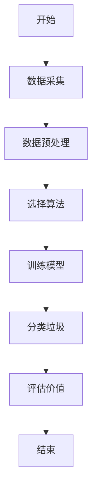
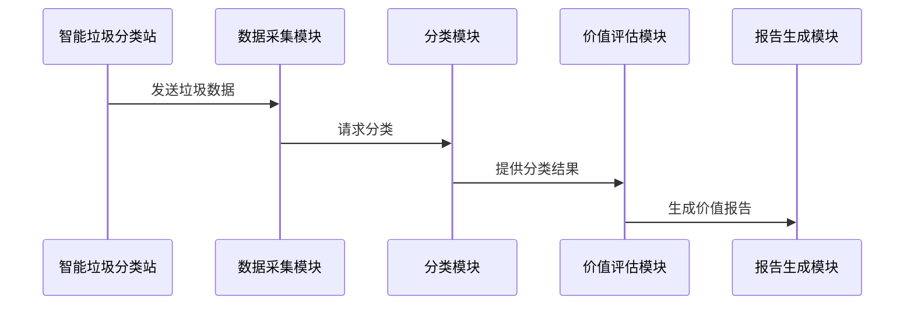

                 


# 智能垃圾分类站：AI Agent的回收价值评估

**关键词**：智能垃圾分类站, AI Agent, 回收价值评估, 人工智能, 垃圾分类

**摘要**：本文深入探讨了智能垃圾分类站在回收价值评估中的应用，详细分析了AI Agent在垃圾分类中的作用，从算法原理到系统架构，结合实际案例，全面解析了智能垃圾分类站的设计与实现。

---

## 第一部分: 智能垃圾分类站的背景与概述

### 第1章: 智能垃圾分类站的背景与问题背景

#### 1.1 智能垃圾分类站的背景介绍
##### 1.1.1 垃圾分类的重要性与现状
随着城市化进程的加快，垃圾量急剧增加，垃圾分类成为全球关注的焦点。智能垃圾分类站通过AI技术实现了高效、准确的分类，减少了人工成本，提高了资源回收效率。

##### 1.1.2 智能化垃圾分类的优势
智能垃圾分类站利用AI Agent实时分析和分类垃圾，提高了分类准确率，减少了错误分类带来的环境污染和资源浪费。

##### 1.1.3 AI Agent在垃圾分类中的应用前景
AI Agent具备学习、推理和自适应能力，能够处理复杂的垃圾分类任务，未来将在垃圾分类领域发挥更大的作用。

#### 1.2 问题背景与问题描述
##### 1.2.1 当前垃圾分类的主要问题
传统垃圾分类依赖人工，效率低、错误率高，且存在资源浪费和环境污染问题。

##### 1.2.2 AI Agent在垃圾分类中的应用需求
需要开发高效的AI算法，实现垃圾的智能分类和价值评估，提升回收效率和资源利用率。

##### 1.2.3 问题解决的目标与边界
目标是通过AI Agent实现垃圾的智能分类和价值评估，边界包括垃圾分类站的设计、数据采集与处理、算法实现等。

### 第2章: 智能垃圾分类站的核心概念与联系

#### 2.1 AI Agent的基本原理
##### 2.1.1 AI Agent的定义与特点
AI Agent是一种智能体，能够感知环境并采取行动以实现目标。其特点包括自主性、反应性、目标导向和社会能力。

##### 2.1.2 AI Agent在垃圾分类中的角色
AI Agent负责数据采集、分类算法设计、分类结果输出和价值评估，是智能垃圾分类站的核心模块。

##### 2.1.3 AI Agent与其他AI技术的对比
AI Agent与传统AI的区别在于其具备自主决策和交互能力，能够实时适应环境变化。

#### 2.2 核心概念的ER实体关系图
```mermaid
er
  entity 垃圾分类站 {
    key 垃圾类型
    attribute 类型名称, 分类标准
  }
  entity AI Agent {
    key 代理ID
    attribute 分类算法, 数据来源
  }
  entity 垃圾 {
    key 废物ID
    attribute 类型, 状态
  }
  垃圾分类站 --> AI Agent: 使用
  AI Agent --> 垃圾: 分类
```

## 第3章: AI Agent的回收价值评估算法原理

### 3.1 算法原理概述
#### 3.1.1 数据采集与预处理
AI Agent通过摄像头、传感器等设备采集垃圾图像和属性数据，预处理包括数据清洗和特征提取。

#### 3.1.2 分类算法选择
常用的分类算法包括决策树、随机森林和神经网络。根据垃圾类型选择合适的算法。

#### 3.1.3 分类准确率的计算
分类准确率公式为：
$$准确率 = \frac{正确分类数}{总分类数}$$

### 3.2 算法实现流程


### 3.3 代码实现
```python
import numpy as np
from sklearn.tree import DecisionTreeClassifier
from sklearn.metrics import accuracy_score

# 数据预处理
X = np.array([...])  # 特征向量
y = np.array([...])  # 标签

# 训练模型
model = DecisionTreeClassifier()
model.fit(X, y)

# 分类与评估
y_pred = model.predict(X_test)
print("准确率:", accuracy_score(y_test, y_pred))
```

## 第4章: 智能垃圾分类站的系统分析与架构设计

### 4.1 问题场景介绍
垃圾分类站接收垃圾，通过AI Agent分类后进行价值评估，优化资源回收流程。

### 4.2 系统功能设计
#### 4.2.1 数据采集模块
负责采集垃圾图像和属性数据，存储在数据库中。

#### 4.2.2 分类模块
实现垃圾的自动分类，输出分类结果。

#### 4.2.3 价值评估模块
根据分类结果和市场价评估垃圾价值，输出报告。

### 4.3 系统架构设计


### 4.4 系统交互设计


## 第5章: 项目实战

### 5.1 环境安装
安装Python、NumPy、Scikit-learn等库。

### 5.2 核心代码实现
```python
import numpy as np
from sklearn.ensemble import RandomForestClassifier

# 数据加载
X_train = np.load('X_train.npy')
y_train = np.load('y_train.npy')

# 模型训练
model = RandomForestClassifier()
model.fit(X_train, y_train)

# 预测与评估
X_test = np.load('X_test.npy')
y_test = np.load('y_test.npy')
y_pred = model.predict(X_test)
print("准确率:", accuracy_score(y_test, y_pred))
```

### 5.3 实际案例分析
分析一个案例，展示AI Agent如何分类和评估垃圾价值，优化回收流程。

### 5.4 项目小结
总结项目成果，讨论可能的改进方向。

## 第6章: 最佳实践

### 6.1 小结
AI Agent在垃圾分类中的应用前景广阔，能够显著提升回收效率和价值。

### 6.2 注意事项
数据质量、模型选择和系统维护是关键，需注意数据隐私和系统稳定性。

### 6.3 拓展阅读
推荐相关书籍和论文，供读者深入学习。

## 作者
作者：AI天才研究院 & 禅与计算机程序设计艺术

