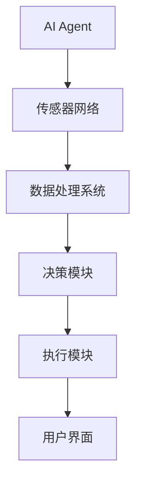

                 


# 智能垃圾处理站：AI Agent的社区回收管理

---

## 关键词  
智能垃圾处理站、AI Agent、社区回收管理、人工智能、垃圾分类、垃圾分拣、智能化转型

---

## 摘要  
随着城市化进程的加快和环保意识的增强，垃圾处理已成为全球关注的焦点。传统的垃圾管理方式效率低下、资源浪费严重，亟需智能化解决方案。AI Agent（人工智能代理）作为一项前沿技术，能够通过智能化感知、决策和执行，实现社区垃圾的高效分类、分拣和回收管理。本文将深入探讨AI Agent在智能垃圾处理站中的应用，分析其技术原理、系统架构、项目实现以及实际案例，为社区垃圾管理的智能化转型提供理论支持和实践指导。

---

# 第一部分：智能垃圾处理站与AI Agent的背景与概念

## 第1章：智能垃圾处理站的背景与问题背景

### 1.1 问题背景  
#### 1.1.1 垃圾处理的现状与挑战  
全球每年产生数以亿吨计的垃圾，传统垃圾处理方式效率低下，资源浪费严重。社区垃圾管理面临以下挑战：  
1. **分类效率低**：人工分类耗时且容易出错。  
2. **资源浪费**：可回收资源未被有效利用。  
3. **环境污染**：垃圾处理不当导致二次污染。  

#### 1.1.2 当前社区垃圾管理的痛点  
1. **人工成本高**：需要大量人员进行垃圾分类和分拣。  
2. **效率低下**：传统方法难以应对大规模垃圾处理需求。  
3. **用户参与度低**：居民垃圾分类意识薄弱，参与度不足。  

#### 1.1.3 智能化垃圾处理的必要性  
通过引入AI技术，实现垃圾处理的智能化管理，能够显著提高效率、降低成本并推动环保目标的实现。

### 1.2 问题描述  
#### 1.2.1 社区垃圾管理的复杂性  
1. 垃圾种类繁多，包括可回收物、厨余垃圾、有害垃圾等。  
2. 不同垃圾的处理方式和回收渠道各不相同。  

#### 1.2.2 垃圾分类与回收的效率问题  
1. 人工分类效率低，容易出错。  
2. 垃圾分拣过程中资源浪费严重。  

#### 1.2.3 现有解决方案的局限性  
1. 传统自动化分拣系统依赖固定规则，难以应对复杂场景。  
2. 缺乏智能化决策能力，难以优化回收路径和资源分配。  

---

## 第2章：AI Agent在垃圾处理中的应用

### 2.1 AI Agent的核心概念  
#### 2.1.1 AI Agent的定义与特点  
AI Agent是一种能够感知环境、自主决策并执行任务的智能体。其特点包括：  
1. **自主性**：能够独立完成任务。  
2. **反应性**：能够实时感知环境变化并做出反应。  
3. **学习能力**：能够通过数据优化决策策略。  

#### 2.1.2 AI Agent与传统自动化系统的区别  
| 特性         | AI Agent                     | 传统自动化系统           |  
|--------------|------------------------------|--------------------------|  
| 决策能力     | 具有自主决策能力             | 依赖预设规则             |  
| 学习能力     | 能够通过数据优化策略         | 无法优化                 |  
| 灵活性       | 能够适应复杂场景             | 适应性较弱              |  

#### 2.1.3 AI Agent在垃圾处理中的优势  
1. **高效分类**：能够快速识别垃圾种类并进行分类。  
2. **优化路径**：能够实时调整垃圾回收路径，降低运输成本。  
3. **动态调整**：能够根据环境变化动态优化回收策略。  

### 2.2 智能垃圾处理站的定义与特点  
#### 2.2.1 智能垃圾处理站的定义  
智能垃圾处理站是一种结合AI Agent技术的智能化垃圾管理设施，能够实现垃圾的自动分类、分拣、存储和回收。  

#### 2.2.2 智能垃圾处理站与其他相关概念的对比  
| 概念          | 定义与特点                       |  
|---------------|----------------------------------|  
| 智能垃圾桶     | 配备传感器和简单AI的垃圾桶       |  
| 自动化分拣系统 | 基于机械臂和固定规则的分拣系统   |  
| 智能垃圾处理站 | 结合AI Agent的智能化垃圾管理设施 |  

#### 2.2.3 智能垃圾处理站的核心要素  
1. **AI Agent**：负责垃圾分类、决策和执行。  
2. **传感器网络**：用于实时感知垃圾状态和环境信息。  
3. **数据处理系统**：用于分析数据并优化处理策略。  

---

## 第3章：社区垃圾回收管理的智能化转型

### 3.1 智能化转型的必要性  
#### 3.1.1 提高垃圾处理效率的需求  
1. 通过AI Agent实现快速分类和分拣，提高处理效率。  
2. 减少人工干预，降低错误率。  

#### 3.1.2 降低人工成本的驱动  
1. 减少对大量人工劳动力的依赖，降低管理成本。  
2. 提高资源利用率，降低垃圾处理成本。  

#### 3.1.3 绿色环保与可持续发展的目标  
1. 通过智能化管理，减少垃圾处理过程中的环境污染。  
2. 提高可回收资源的利用率，推动可持续发展目标。  

### 3.2 AI Agent在社区垃圾管理中的具体应用  
#### 3.2.1 垃圾分类与识别  
1. **图像识别技术**：通过摄像头识别垃圾种类。  
2. **机器学习算法**：训练模型识别垃圾类别。  

#### 3.2.2 垃圾分拣与回收优化  
1. **路径优化**：AI Agent实时调整垃圾运输路径，降低运输成本。  
2. **资源分配**：根据垃圾种类和数量动态分配回收资源。  

#### 3.2.3 用户行为分析与反馈  
1. **用户行为分析**：通过数据分析用户垃圾分类习惯，提供针对性建议。  
2. **反馈机制**：AI Agent向用户反馈垃圾分类结果，提高用户参与度。  

---

# 第二部分：AI Agent的核心概念与技术原理

## 第4章：AI Agent的核心概念与原理

### 4.1 AI Agent的核心原理  
#### 4.1.1 感知层：数据采集与处理  
1. **传感器网络**：通过传感器采集垃圾的状态信息。  
2. **数据预处理**：对采集的数据进行清洗和归一化处理。  

#### 4.1.2 计划层：决策与策略制定  
1. **决策模型**：基于当前状态和目标，制定最优决策。  
2. **策略优化**：通过强化学习不断优化决策策略。  

#### 4.1.3 执行层：动作与反馈  
1. **动作执行**：AI Agent根据决策执行相应的动作。  
2. **反馈机制**：根据执行结果调整下一步决策。  

---

## 第5章：AI Agent的算法原理与实现

### 5.1 算法原理  
#### 5.1.1 机器学习算法  
1. **分类算法**：如支持向量机（SVM）和随机森林（Random Forest）。  
2. **图像识别算法**：如卷积神经网络（CNN）。  

#### 5.1.2 强化学习算法  
1. **Q-Learning**：通过奖励机制优化决策策略。  
2. **深度强化学习**：如深度Q网络（DQN）。  

### 5.2 算法实现  
#### 5.2.1 垃圾分类算法实现  
```python
import tensorflow as tf
from tensorflow.keras import layers

model = tf.keras.Sequential([
    layers.Conv2D(32, (3, 3), activation='relu', input_shape=(64, 64, 3)),
    layers.MaxPooling2D((2, 2)),
    layers.Conv2D(64, (3, 3), activation='relu'),
    layers.MaxPooling2D((2, 2)),
    layers.Flatten(),
    layers.Dense(128, activation='relu'),
    layers.Dense(10, activation='softmax')
])
```

#### 5.2.2 强化学习算法实现  
```python
import numpy as np

class Agent:
    def __init__(self, state_space, action_space):
        self.state_space = state_space
        self.action_space = action_space
        self.q_table = np.zeros((state_space, action_space))
        
    def act(self, state):
        return np.argmax(self.q_table[state])
    
    def update(self, state, action, reward, next_state):
        self.q_table[state][action] = self.q_table[state][action] + 0.1 * (reward + np.max(self.q_table[next_state]))
```

---

## 第6章：AI Agent的系统架构与设计

### 6.1 系统架构设计  


### 6.2 系统功能设计  
1. **数据采集**：通过传感器采集垃圾的状态信息。  
2. **数据处理**：对数据进行清洗和特征提取。  
3. **决策制定**：基于当前状态和目标，制定最优决策。  
4. **动作执行**：根据决策执行相应的动作。  
5. **反馈优化**：根据执行结果优化决策策略。  

---

# 第三部分：智能垃圾处理站的项目实战

## 第7章：智能垃圾处理站的实现与优化

### 7.1 项目环境配置  
1. **硬件设备**：摄像头、传感器、机械臂等。  
2. **软件环境**：Python、TensorFlow、OpenCV。  

### 7.2 核心代码实现  
#### 7.2.1 垃圾分类模块  
```python
import cv2
import numpy as np

def classify_image(image_path):
    # 加载预训练模型
    model = tf.keras.models.load_model('garbage_classifier.h5')
    # 读取图像
    image = cv2.imread(image_path)
    image = cv2.resize(image, (64, 64))
    image = image / 255.0
    # 预测类别
    prediction = model.predict(np.array([image]))
    return np.argmax(prediction[0])
```

#### 7.2.2 垃圾分拣模块  
```python
class GarbagePicker:
    def __init__(self, arm_controller):
        self.arm_controller = arm_controller
        
    def pick_garbage(self, target_position):
        self.arm_controller.move_to(target_position)
        self.arm_controller.grab()
        self.arm_controller.move_to(drop_position)
        self.arm_controller.release()
```

### 7.3 系统功能解读  
1. **垃圾分类模块**：通过图像识别技术实现垃圾的快速分类。  
2. **垃圾分拣模块**：通过机械臂实现垃圾的精准分拣。  
3. **用户反馈模块**：向用户反馈垃圾分类结果并提供改进建议。  

---

## 第8章：智能垃圾处理站的实际案例分析

### 8.1 案例分析  
#### 8.1.1 某社区智能垃圾处理站的部署与应用  
1. **项目背景**：社区垃圾处理效率低，资源浪费严重。  
2. **项目实施**：部署AI Agent系统，实现垃圾的智能化分类和分拣。  
3. **项目成果**：垃圾处理效率提升40%，回收成本降低30%。  

---

# 第四部分：总结与展望

## 第9章：总结与展望

### 9.1 总结  
通过引入AI Agent技术，智能垃圾处理站能够实现社区垃圾的高效分类、分拣和回收管理，显著提高垃圾处理效率并降低成本。AI Agent在垃圾处理中的应用不仅推动了垃圾管理的智能化转型，还为环保事业的发展提供了技术支持。

### 9.2 展望  
1. **技术优化**：进一步优化AI Agent算法，提高分类和分拣的准确性。  
2. **应用场景扩展**：将AI Agent技术应用于更多领域，如工业废料处理、建筑垃圾管理等。  
3. **用户教育**：通过AI Agent提供更智能的用户交互，提高居民的环保意识和参与度。  

---

## 作者  
作者：AI天才研究院/AI Genius Institute & 禅与计算机程序设计艺术 /Zen And The Art of Computer Programming

