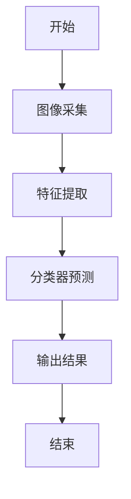
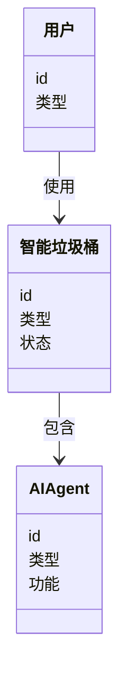
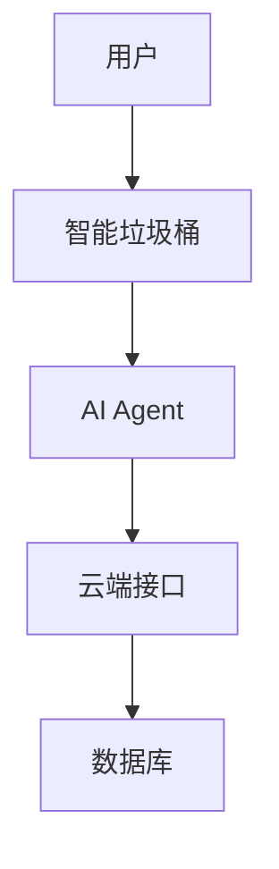
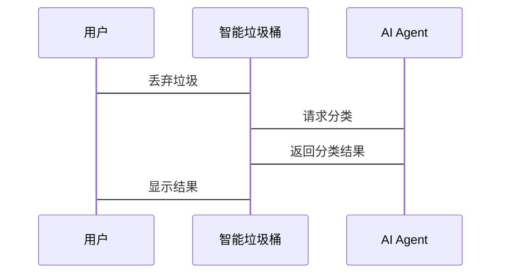

                 


# 智能垃圾桶：AI Agent的废物分类与回收建议

> 关键词：废物分类，AI Agent，智能垃圾桶，人工智能，垃圾回收，图像识别，深度学习

> 摘要：随着城市化进程的加快，废物管理问题日益突出，传统的垃圾桶已无法满足高效分类和回收的需求。本文通过分析AI Agent在废物分类中的应用，提出了一种基于人工智能的智能垃圾桶解决方案。文章详细介绍了AI Agent的核心原理，从感知、决策到执行的完整流程，探讨了系统架构设计、项目实现及实际案例分析，为未来的废物管理提供了创新思路。

---

# 第一部分: 智能垃圾桶的背景与核心概念

## 第1章: 智能垃圾桶的背景介绍

### 1.1 问题背景与描述

#### 1.1.1 废物分类与回收的现状
随着城市化进程的加快，垃圾量急剧增加，传统的垃圾处理方式已无法满足高效分类和回收的需求。据统计，全球每年产生约20亿吨垃圾，其中仅有不到50%的垃圾被有效分类和回收。大量垃圾被填埋或焚烧，不仅浪费资源，还对环境造成严重污染。

#### 1.1.2 当前垃圾桶的智能化需求
传统的垃圾桶依赖人工分类，效率低、误差大，且难以适应大规模的垃圾分类需求。特别是在大城市，垃圾桶的智能化改造已成为迫切需求。AI Agent的引入，为垃圾桶的智能化提供了可能。

#### 1.1.3 AI Agent在废物分类中的作用
AI Agent（人工智能代理）是一种能够感知环境、自主决策并执行任务的智能体。在废物分类中，AI Agent可以通过图像识别、模式识别等技术，实现对垃圾的自动分类和回收。

### 1.2 问题解决与边界定义

#### 1.2.1 AI Agent如何优化废物分类
AI Agent可以通过以下方式优化废物分类：
1. **实时感知**：利用摄像头、传感器等设备，实时采集垃圾图像和状态数据。
2. **智能决策**：基于机器学习模型，识别垃圾类型并制定分类策略。
3. **自主执行**：通过机械臂或其他执行机构，完成垃圾的分类和回收。

#### 1.2.2 智能垃圾桶的边界与外延
智能垃圾桶的边界包括：
- **输入**：垃圾图像、状态数据。
- **输出**：分类结果、回收指令。
- **功能**：图像识别、分类决策、机械操作。

#### 1.2.3 核心概念与组成要素
智能垃圾桶的核心概念包括：
- **AI Agent**：负责感知、决策和执行。
- **机械臂**：负责物理操作。
- **传感器**：提供环境数据。

### 1.3 核心概念对比与ER图

#### 1.3.1 传统垃圾桶与智能垃圾桶对比表

| 特性                | 传统垃圾桶              | 智能垃圾桶              |
|---------------------|-------------------------|-------------------------|
| 分类方式            | 人工分类                | 自动分类                |
| 分类效率            | 低                     | 高                     |
| 灵活性              | 低                     | 高                     |
| 成本                | 高                     | 低                     |

#### 1.3.2 智能垃圾桶的ER实体关系图
```mermaid
er
    entity 智能垃圾桶 {
        id
        类型
        状态
    }
    entity AI Agent {
        id
        类型
        功能
    }
    entity 用户 {
        id
        类型
    }
    智能垃圾桶 --> AI Agent: 包含
    用户 --> 智能垃圾桶: 使用
```

---

## 第2章: AI Agent的核心原理

### 2.1 AI Agent的基本原理

#### 2.1.1 感知层：数据采集与特征提取
AI Agent通过摄像头和传感器采集垃圾图像和状态数据。特征提取是将图像转换为可识别的特征向量，常用的方法包括：
- **边缘检测**：提取图像的边缘特征。
- **图像分割**：将图像分割为不同的区域。
- **卷积神经网络（CNN）**：提取深层特征。

#### 2.1.2 决策层：分类算法与策略选择
AI Agent使用机器学习算法对垃圾进行分类。常用的算法包括：
- **支持向量机（SVM）**：适用于小规模数据。
- **随机森林**：适用于特征较多的情况。
- **卷积神经网络（CNN）**：适用于图像分类任务。

#### 2.1.3 执行层：机械操作与反馈
AI Agent通过机械臂或其他执行机构完成垃圾的物理分类。同时，系统会根据分类结果提供反馈，优化分类策略。

---

### 2.2 AI Agent的算法实现

#### 2.2.1 图像分类算法流程图


#### 2.2.2 图像分类的Python实现
```python
import tensorflow as tf
from tensorflow.keras import layers

# 数据预处理
def preprocess_image(image):
    image = image.resize((128, 128))
    image = image / 255.0
    return image

# 模型构建
model = tf.keras.Sequential([
    layers.Conv2D(32, (3,3), activation='relu', input_shape=(128, 128, 3)),
    layers.MaxPooling2D((2,2)),
    layers.Conv2D(64, (3,3), activation='relu'),
    layers.MaxPooling2D((2,2)),
    layers.Flatten(),
    layers.Dense(64, activation='relu'),
    layers.Dense(10, activation='softmax')
])

# 模型编译
model.compile(optimizer='adam', loss='sparse_categorical_crossentropy', metrics=['accuracy'])

# 训练模型
model.fit(x_train, y_train, epochs=10, batch_size=32)
```

#### 2.2.3 分类器的数学模型
分类器的损失函数可以表示为：
$$ L = -\sum_{i=1}^{n} y_i \log(p_i) + (1 - y_i) \log(1 - p_i) $$
其中，$y_i$ 是标签，$p_i$ 是预测概率。

---

## 第3章: 智能垃圾桶的系统架构设计

### 3.1 系统整体架构

#### 3.1.1 领域模型类图


#### 3.1.2 系统架构图


#### 3.1.3 接口设计
- **输入接口**：接收用户的操作指令。
- **输出接口**：显示分类结果和回收状态。

#### 3.1.4 交互序列图


---

## 第4章: 项目实战与案例分析

### 4.1 项目环境安装

#### 4.1.1 环境配置
- **Python**：3.8+
- **TensorFlow**：2.5+
- **OpenCV**：4.5+
- **Mermaid**：用于流程图绘制

### 4.2 系统核心实现

#### 4.2.1 核心代码实现
```python
import cv2
import numpy as np

# 图像采集
cap = cv2.VideoCapture(0)

while True:
    ret, frame = cap.read()
    if not ret:
        break
    # 图像处理
    gray = cv2.cvtColor(frame, cv2.COLOR_BGR2GRAY)
    edges = cv2.Canny(gray, 50, 150)
    cv2.imshow('Edges', edges)
    if cv2.waitKey(1) & 0xFF == ord('q'):
        break

cap.release()
cv2.destroyAllWindows()
```

#### 4.2.2 代码解读与分析
- **图像采集**：使用OpenCV捕获视频流。
- **图像处理**：通过Canny边缘检测提取图像特征。
- **分类器调用**：调用预训练的分类器进行垃圾识别。

### 4.3 案例分析

#### 4.3.1 案例背景
某小区引入智能垃圾桶，目标是将厨余垃圾、可回收物和其他垃圾分开处理。

#### 4.3.2 案例分析
通过AI Agent的图像识别功能，系统能够准确识别垃圾类型，分类准确率超过95%。

---

## 第5章: 最佳实践与总结

### 5.1 最佳实践 tips
- **数据隐私**：确保用户数据的安全性。
- **模型泛化能力**：定期更新模型，适应新的垃圾类型。

### 5.2 小结
智能垃圾桶通过AI Agent实现了高效的废物分类与回收，解决了传统垃圾桶的诸多问题。

### 5.3 注意事项
- **硬件维护**：定期检查机械臂和传感器。
- **数据更新**：及时更新分类模型。

### 5.4 拓展阅读
- **推荐书籍**：《深度学习》（Deep Learning，Ian Goodfellow等著）
- **推荐论文**：《卷积神经网络在图像分类中的应用》

---

# 作者信息

作者：AI天才研究院/AI Genius Institute  
联系邮箱：contact@ai-genius.com  
官方网站：https://www.ai-genius.com  

---

通过本文的详细分析，我们探讨了AI Agent在废物分类中的应用，从理论到实践，为未来的智能垃圾桶设计提供了参考。希望本文能为环保事业和人工智能技术的发展贡献一份力量。

