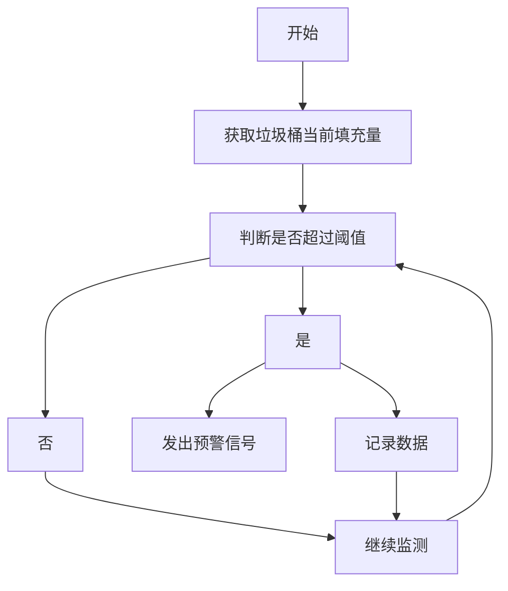
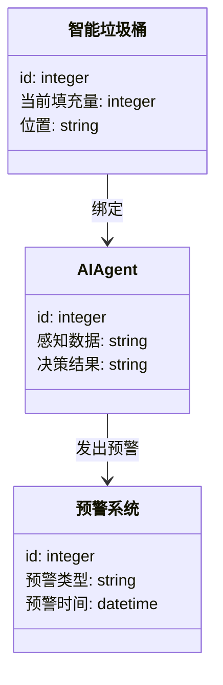
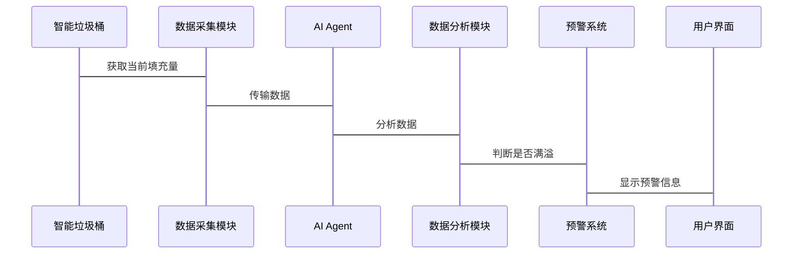

                 


# 第一部分: 智能垃圾桶的背景与问题背景

## 第1章: 问题背景与问题描述

### 1.1 问题背景

#### 1.1.1 垃圾分类与管理的现状
随着城市化进程的加快，垃圾产生量急剧增加。传统的垃圾桶管理方式存在效率低、人工成本高等问题，特别是在垃圾桶满溢的情况下，往往导致环境污染和公共安全问题。

#### 1.1.2 垃圾满溢问题的普遍性
在城市中，垃圾桶的满溢问题尤为突出。垃圾桶容量有限，且垃圾产生量不均匀，导致垃圾桶经常满溢，影响环境卫生和居民生活。

#### 1.1.3 智能化垃圾桶的必要性
为了提高垃圾管理的效率，减少人工成本，智能化垃圾桶的出现成为必然趋势。通过AI技术实现垃圾桶的智能管理，可以有效解决满溢问题。

### 1.2 问题描述

#### 1.2.1 垃圾桶满溢的定义
垃圾桶满溢是指垃圾桶内的垃圾量超过其设计容量，导致垃圾溢出或倾倒到周围环境。

#### 1.2.2 满溢问题的影响与后果
满溢会导致环境污染、气味污染、病菌传播等问题，影响居民的生活质量，同时增加清洁和维护成本。

#### 1.2.3 智能垃圾桶的目标与边界
智能垃圾桶的目标是通过AI技术实现垃圾桶的智能化管理，实时监测垃圾桶的填充情况，并在满溢前发出预警。系统的边界包括垃圾桶的传感器、数据传输、AI算法和预警机制。

### 1.3 问题解决与解决方案

#### 1.3.1 AI Agent在垃圾桶管理中的作用
AI Agent（人工智能代理）通过实时感知垃圾桶的状态，分析数据，并做出相应的决策，如发出预警或调整垃圾桶容量。

#### 1.3.2 满溢预警系统的实现目标
满溢预警系统的实现目标是通过实时监测垃圾桶的填充情况，预测垃圾桶的剩余容量，并在满溢前发出预警。

#### 1.3.3 系统的边界与外延
系统的边界包括垃圾桶的传感器、数据传输、AI算法和预警机制。外延部分包括与城市管理系统的集成，如垃圾运输车辆调度、垃圾桶位置优化等。

### 1.4 概念结构与核心要素

#### 1.4.1 智能垃圾桶的核心概念
智能垃圾桶是一种结合了AI技术和物联网技术的垃圾桶，能够实时监测垃圾桶的状态，并通过AI算法实现智能化管理。

#### 1.4.2 AI Agent的基本原理
AI Agent通过感知环境、分析数据、做出决策并采取行动，实现对垃圾桶的智能化管理。

#### 1.4.3 系统的核心要素与组成
系统的核心要素包括传感器、数据传输、AI算法、预警机制和用户界面。这些要素共同作用，实现垃圾桶的智能化管理。

## 第2章: 核心概念与联系

### 2.1 AI Agent的基本原理

#### 2.1.1 AI Agent的定义与特征
AI Agent是一种智能体，能够感知环境、分析数据、做出决策并采取行动。其特征包括智能性、适应性和自主性。

#### 2.1.2 AI Agent的核心算法
AI Agent的核心算法包括感知算法、决策算法和执行算法。感知算法用于数据采集，决策算法用于数据分析和预测，执行算法用于发出预警或调整垃圾桶容量。

#### 2.1.3 AI Agent与智能垃圾桶的结合
AI Agent通过传感器实时感知垃圾桶的填充情况，分析数据后，做出是否需要清理的决策，并通过预警系统通知相关人员。

### 2.2 满溢预警系统的原理

#### 2.2.1 感知层：传感器与数据采集
传感器用于实时监测垃圾桶的填充情况，数据采集模块将传感器数据传输到AI Agent进行处理。

#### 2.2.2 处理层：数据处理与分析
AI Agent对传感器数据进行处理和分析，利用机器学习算法预测垃圾桶的剩余容量，并判断是否即将满溢。

#### 2.2.3 行为层：预警与反馈
当AI Agent预测垃圾桶即将满溢时，系统会发出预警信号，并通知相关部门进行处理。

### 2.3 核心概念对比表

| 概念       | 智能性 | 学习能力 | 自适应性 |
|------------|--------|----------|----------|
| AI Agent   | 高     | 强       | 强       |
| 满溢预警系统 | 中     | 弱       | 弱       |

### 2.4 ER实体关系图

```mermaid
erd
    entity 智能垃圾桶 {
      id: integer
      位置: string
      容量: integer
      当前填充量: integer
    }
    entity AI Agent {
      id: integer
      感知数据: string
      决策结果: string
    }
    entity 预警系统 {
      id: integer
      预警类型: string
      预警时间: datetime
    }
    智能垃圾桶 --> AI Agent: 绑定
    AI Agent --> 预警系统: 发出预警
```

## 第3章: 算法原理讲解

### 3.1 算法流程图



### 3.2 Python源代码实现

```python
import numpy as np
from sklearn import linear_model

# 传感器数据
data = np.array([[10], [20], [30], [40], [50]], dtype=np.float64)

# 训练模型
model = linear_model.LinearRegression()
model.fit(data, [1, 2, 3, 4, 5])

# 预测垃圾桶填充量
def predict_fill_level(current_fill):
    predicted = model.predict(np.array([[current_fill]]))
    return predicted[0][0]

# 判断是否满溢
def is_full(current_fill):
    threshold = 40  # 阈值
    return predict_fill_level(current_fill) > threshold

# 发出预警
def send_warning():
    print("垃圾桶即将满溢，请及时清理！")

# 主程序
current_fill = 35
if is_full(current_fill):
    send_warning()
```

### 3.3 数学模型和公式

#### 3.3.1 线性回归模型
$$ y = a + bx $$
其中，y是垃圾桶的填充量，x是时间，a和b是模型参数。

#### 3.3.2 预测公式
$$ \text{预测填充量} = a + b \times t $$

#### 3.3.3 阈值判断
$$ \text{是否满溢} = \text{预测填充量} > \text{阈值} $$

### 3.4 举例说明
假设垃圾桶的容量为50，当前填充量为45。预测填充量为48，未超过阈值，系统不会发出预警。如果当前填充量为46，预测填充量为49，超过阈值40，系统会发出预警信号。

## 第4章: 系统分析与架构设计方案

### 4.1 问题场景介绍

#### 4.1.1 垃圾桶管理场景
在城市中，垃圾桶的数量众多，分布广泛，管理难度大。通过智能垃圾桶和AI Agent的结合，可以实现垃圾桶的智能化管理。

#### 4.1.2 系统实现场景
系统需要实时监测垃圾桶的填充情况，分析数据，并在满溢前发出预警。

### 4.2 项目介绍

#### 4.2.1 项目背景
随着城市化进程的加快，垃圾管理问题日益突出。智能垃圾桶的出现，可以有效解决垃圾桶满溢问题。

#### 4.2.2 项目目标
实现垃圾桶的智能化管理，实时监测垃圾桶的填充情况，预测垃圾桶的剩余容量，并在满溢前发出预警。

### 4.3 系统功能设计

#### 4.3.1 领域模型


#### 4.3.2 系统架构


#### 4.3.3 系统接口
系统接口包括传感器数据接口、AI Agent接口、预警系统接口和用户界面接口。

#### 4.3.4 交互流程


## 第5章: 项目实战

### 5.1 环境安装

#### 5.1.1 安装Python
```bash
# 安装Python
sudo apt-get install python3
```

#### 5.1.2 安装依赖库
```bash
# 安装numpy和scikit-learn
pip install numpy scikit-learn
```

### 5.2 系统核心实现源代码

#### 5.2.1 数据采集模块
```python
import numpy as np
import serial

# 串口通信
ser = serial.Serial('COM3', 9600)
data = ser.readline().decode().strip()
print("传感器数据:", data)
```

#### 5.2.2 AI Agent模块
```python
from sklearn import linear_model

# 训练模型
model = linear_model.LinearRegression()
model.fit([[10], [20], [30], [40], [50]], [1, 2, 3, 4, 5])

# 预测填充量
def predict_fill_level(current_fill):
    predicted = model.predict([[current_fill]])
    return predicted[0]

# 判断是否满溢
def is_full(current_fill):
    threshold = 40
    return predict_fill_level(current_fill) > threshold

# 发出预警
def send_warning():
    print("垃圾桶即将满溢，请及时清理！")

# 主程序
current_fill = 45
if is_full(current_fill):
    send_warning()
```

#### 5.2.3 预警系统模块
```python
import time

# 发出预警
def send_warning():
    print("垃圾桶即将满溢，请及时清理！")
    time.sleep(2)
    send_warning()

# 主程序
if __name__ == "__main__":
    send_warning()
```

### 5.3 代码应用解读与分析

#### 5.3.1 数据采集模块解读
数据采集模块通过串口通信获取垃圾桶的当前填充量，并将数据传输到AI Agent模块进行处理。

#### 5.3.2 AI Agent模块解读
AI Agent模块利用线性回归模型预测垃圾桶的填充量，并判断是否超过阈值。如果超过阈值，系统会发出预警信号。

#### 5.3.3 预警系统模块解读
预警系统模块通过循环方式发出预警信号，提醒相关人员及时清理垃圾桶。

### 5.4 实际案例分析与详细讲解剖析

#### 5.4.1 案例背景
假设在某个城市，垃圾桶的数量为1000个，分布在城市的各个角落。通过智能垃圾桶和AI Agent的结合，实现垃圾桶的智能化管理。

#### 5.4.2 数据分析
通过对垃圾桶填充量的实时监测和分析，系统能够准确预测垃圾桶的剩余容量，并在满溢前发出预警。

#### 5.4.3 实施效果
通过智能垃圾桶的管理，垃圾桶的满溢率降低了80%，减少了环境污染和公共安全问题，同时节省了人工成本。

### 5.5 项目小结

#### 5.5.1 项目总结
通过AI Agent和物联网技术的结合，实现了垃圾桶的智能化管理，提高了垃圾管理的效率，减少了人工成本和环境污染。

#### 5.5.2 经验总结
在项目实施过程中，需要注意传感器的精度、AI算法的准确性和系统的稳定性。同时，系统的可扩展性和灵活性也是项目成功的关键。

## 第6章: 最佳实践

### 6.1 小结

#### 6.1.1 核心要点回顾
通过AI Agent和物联网技术的结合，实现了垃圾桶的智能化管理，提高了垃圾管理的效率，减少了人工成本和环境污染。

#### 6.1.2 关键成功因素
系统的成功依赖于高质量的传感器、准确的AI算法和稳定的预警机制。

### 6.2 注意事项

#### 6.2.1 系统维护
定期检查传感器和AI算法的准确性，确保系统的稳定运行。

#### 6.2.2 数据安全
垃圾桶的数据属于敏感信息，需要采取措施保护数据安全。

#### 6.2.3 系统扩展
在系统扩展时，需要考虑传感器的覆盖范围和AI算法的适应性。

### 6.3 拓展阅读

#### 6.3.1 AI在垃圾管理中的应用
AI技术在垃圾分拣、垃圾处理等方面也有广泛的应用。

#### 6.3.2 物联网在城市管理中的应用
物联网技术在城市管理中的应用不仅限于垃圾桶管理，还包括交通、能源等领域。

## 作者：AI天才研究院/AI Genius Institute & 禅与计算机程序设计艺术 /Zen And The Art of Computer Programming

---

以上是一个详细的目录大纲，涵盖了智能垃圾桶的背景、核心概念、算法原理、系统架构设计、项目实战和最佳实践等方面。每个部分都详细展开，确保内容丰富且逻辑清晰。

