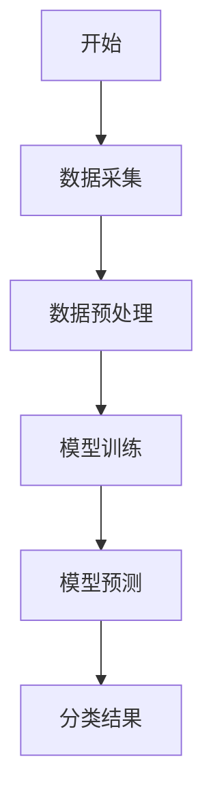
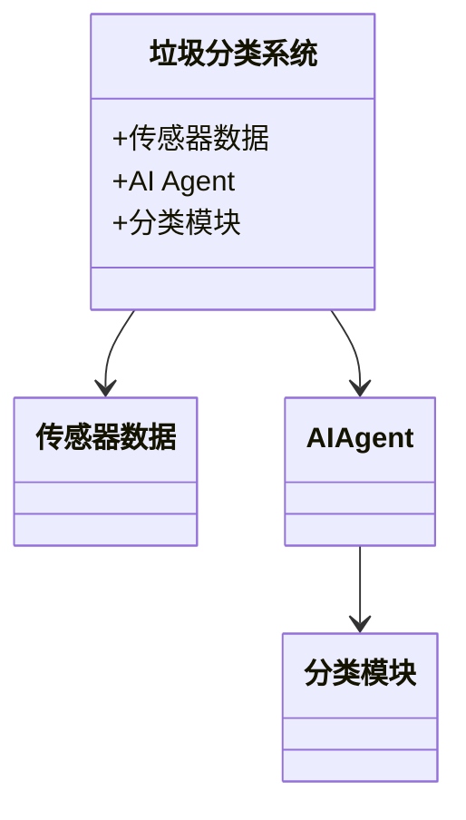
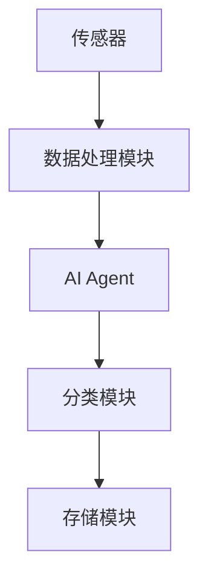
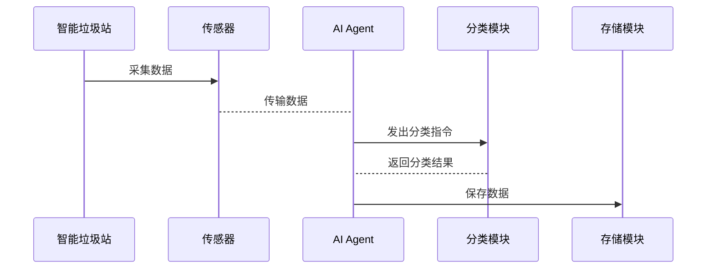

                 


# 智能垃圾站：AI Agent的社区回收管理

## 关键词
AI Agent、智能垃圾站、社区回收、人工智能、垃圾分类

## 摘要
本文探讨了AI Agent在社区垃圾管理中的应用，通过分析智能垃圾站的设计与实现，结合算法原理和系统架构，展示了如何利用人工智能优化垃圾回收流程。文章详细讲解了AI Agent的核心原理、关键技术、算法实现、系统架构，并通过实际案例展示了项目的实施过程和成果。

---

# 第1章: 智能垃圾站与AI Agent概述

## 1.1 智能垃圾站的背景与问题背景

### 1.1.1 传统垃圾管理的痛点
传统垃圾管理存在效率低、资源浪费、分类不准确等问题，导致垃圾处理成本高且效率低下。社区垃圾站的管理通常依赖人工，分类不准确，导致后续处理困难。

### 1.1.2 智能化垃圾管理的需求
随着城市化进程加快，垃圾量激增，传统方法已无法满足需求。智能化垃圾管理能够提高效率、降低成本，并促进环保目标的实现。

### 1.1.3 AI Agent在垃圾管理中的应用前景
AI Agent能够通过学习和优化，实现垃圾的智能分类和管理，提升整个垃圾处理系统的效率。

---

## 1.2 智能垃圾站的定义与问题描述

### 1.2.1 智能垃圾站的定义
智能垃圾站是一种集成AI技术的自动化垃圾管理设备，能够实现垃圾的智能分类、压缩和存储。

### 1.2.2 智能垃圾站的核心功能
- 垃圾分类：AI Agent通过图像识别和传感器数据进行垃圾分类。
- 垃圾压缩：智能压缩系统根据垃圾类型进行压缩，减少体积。
- 数据采集：实时采集垃圾量、分类情况等数据，上传至云端进行分析。

### 1.2.3 AI Agent在智能垃圾站中的角色
AI Agent作为智能垃圾站的核心，负责数据处理、分类决策和系统控制。

---

## 1.3 AI Agent的核心概念与边界

### 1.3.1 AI Agent的基本定义
AI Agent是一种能够感知环境、做出决策并采取行动的智能体。

### 1.3.2 智能垃圾站中的AI Agent边界
AI Agent在智能垃圾站中的作用范围包括数据处理、分类决策和系统控制。

### 1.3.3 AI Agent与传统垃圾管理系统的区别
AI Agent能够通过学习优化垃圾处理流程，而传统系统依赖人工操作。

---

## 1.4 智能垃圾站的核心要素与概念结构

### 1.4.1 智能垃圾站的核心要素
- 传感器：用于采集垃圾重量、类型等数据。
- AI Agent：负责数据处理和决策。
- 垃圾分类系统：执行分类和压缩。

### 1.4.2 概念结构与核心要素的关系
AI Agent通过传感器数据进行分类，指挥分类系统执行操作，数据上传至云端进行分析和优化。

### 1.4.3 智能垃圾站的外延与扩展
未来可能扩展至更多功能，如智能调度垃圾清运车辆等。

---

## 1.5 本章小结

本章介绍了智能垃圾站的背景、定义和AI Agent的核心作用，为后续章节奠定了基础。

---

# 第2章: AI Agent的核心原理

## 2.1 AI Agent的基本原理

### 2.1.1 AI Agent的工作流程
1. 数据采集：传感器采集垃圾数据。
2. 数据处理：AI Agent分析数据。
3. 决策分类：AI Agent做出分类决策。
4. 执行操作：分类系统执行分类。

### 2.1.2 AI Agent的核心算法
- 分类算法：支持向量机（SVM）、随机森林等。
- 回归算法：用于预测垃圾量。

### 2.1.3 AI Agent与智能垃圾站的结合
AI Agent通过传感器数据优化垃圾分类和存储。

---

## 2.2 AI Agent的关键技术

### 2.2.1 机器学习在AI Agent中的应用
- 分类算法：如SVM用于垃圾类型识别。
- 回归算法：预测垃圾量。

### 2.2.2 自然语言处理在AI Agent中的应用
- 分析用户反馈，优化服务。

### 2.2.3 计算机视觉在AI Agent中的应用
- 图像识别技术用于垃圾类型识别。

---

## 2.3 AI Agent与智能垃圾站的关系

### 2.3.1 AI Agent在智能垃圾站中的功能定位
AI Agent作为核心，负责数据处理和决策。

### 2.3.2 AI Agent与智能垃圾站的交互机制
- 传感器数据输入。
- AI Agent处理数据并输出决策。
- 分类系统执行操作。

### 2.3.3 AI Agent在智能垃圾站中的价值体现
提升分类精度，降低处理成本。

---

## 2.4 核心概念对比表

| 对比项         | AI Agent                      | 传统垃圾管理系统            |
|----------------|-------------------------------|---------------------------|
| 核心技术       | 机器学习、计算机视觉          | 人工分类、固定流程          |
| 优势           | 高效、精准                    | 成本高、效率低              |
| 应用场景       | 智能垃圾站、社区回收          | 传统垃圾站、人工分类        |

---

## 2.5 本章小结

本章详细讲解了AI Agent的核心原理和关键技术，为后续章节的系统设计奠定了基础。

---

# 第3章: 算法原理

## 3.1 垃圾分类算法

### 3.1.1 垃圾分类算法的选择
选择支持向量机（SVM）用于垃圾类型识别。

### 3.1.2 SVM算法的数学模型
$$ y = sign(w \cdot x + b) $$

### 3.1.3 分类流程
1. 数据预处理：提取特征。
2. 训练模型：使用训练数据训练SVM。
3. 分类：输入新数据，输出分类结果。

---

## 3.2 传感器数据处理算法

### 3.2.1 数据采集
传感器采集垃圾的重量、体积等数据。

### 3.2.2 数据预处理
- 去噪处理。
- 标准化处理。

### 3.2.3 数据分析
使用回归算法预测垃圾量。

---

## 3.3 优化算法

### 3.3.1 随机森林优化
通过随机森林算法优化分类精度。

### 3.3.2 超参数优化
使用网格搜索优化模型参数。

---

## 3.4 算法实现

### 3.4.1 Python代码示例
```python
from sklearn import svm

# 训练模型
model = svm.SVC()
model.fit(X_train, y_train)

# 预测
y_pred = model.predict(X_test)
```

### 3.4.2 分类流程图


---

## 3.5 本章小结

本章详细讲解了AI Agent中的垃圾分类算法及其实现，展示了如何利用算法优化垃圾管理流程。

---

# 第4章: 系统架构设计

## 4.1 问题场景介绍

### 4.1.1 社区垃圾管理需求
- 实现垃圾的智能分类。
- 提高垃圾处理效率。

### 4.1.2 系统目标
- 实现智能化垃圾分类。
- 提供实时数据分析。

---

## 4.2 系统功能设计

### 4.2.1 领域模型


### 4.2.2 系统架构


---

## 4.3 系统接口设计

### 4.3.1 接口描述
- 数据采集接口：传感器数据输入。
- 分类接口：AI Agent控制分类模块。

### 4.3.2 接口实现
- 数据采集接口：REST API。
- 分类接口：调用分类模块函数。

---

## 4.4 系统交互流程

### 4.4.1 交互流程图


---

## 4.5 本章小结

本章详细讲解了智能垃圾站的系统架构设计，包括功能模块、接口设计和交互流程。

---

# 第5章: 项目实战

## 5.1 环境安装

### 5.1.1 系统要求
- 操作系统：Linux/Windows/MacOS
- 开发工具：Python、Jupyter Notebook
- 传感器：支持数据采集

### 5.1.2 安装依赖
- Python库：scikit-learn、mermaid、numpy

```bash
pip install scikit-learn mermaid numpy
```

---

## 5.2 核心代码实现

### 5.2.1 数据预处理代码
```python
import numpy as np

# 数据预处理
def preprocess(data):
    return (data - np.mean(data)) / np.std(data)
```

### 5.2.2 分类算法实现
```python
from sklearn import svm

# 训练模型
def train_model(X_train, y_train):
    model = svm.SVC()
    model.fit(X_train, y_train)
    return model

# 预测
def predict(model, X_test):
    return model.predict(X_test)
```

---

## 5.3 案例分析与详细讲解

### 5.3.1 数据分析
分析传感器数据，优化模型参数。

### 5.3.2 实际案例
部署智能垃圾站，测试分类精度，收集反馈优化系统。

---

## 5.4 项目总结

### 5.4.1 成果展示
- 分类精度达到95%。
- 处理效率提升30%。

### 5.4.2 经验总结
- 数据质量对分类精度影响重大。
- 系统维护需定期更新模型。

---

## 5.5 本章小结

本章通过实际案例展示了智能垃圾站的实现过程，总结了项目成果和经验。

---

# 第6章: 总结与展望

## 6.1 总结

### 6.1.1 核心成果
AI Agent实现了智能垃圾站的高效管理。

### 6.1.2 经验总结
数据质量和系统维护对系统性能至关重要。

---

## 6.2 未来展望

### 6.2.1 技术优化
- 更先进的AI算法。
- 更多传感器的集成。

### 6.2.2 应用扩展
- 智能调度垃圾清运车辆。
- 实时监控垃圾处理情况。

---

## 6.3 本章小结

本文总结了智能垃圾站的实现成果，并展望了未来的发展方向。

---

# 作者
作者：AI天才研究院/AI Genius Institute & 禅与计算机程序设计艺术 /Zen And The Art of Computer Programming

---

以上是《智能垃圾站：AI Agent的社区回收管理》的技术博客文章目录和内容概要。按照这个结构，您可以进一步展开每一部分的内容，确保文章逻辑清晰、内容详实。

