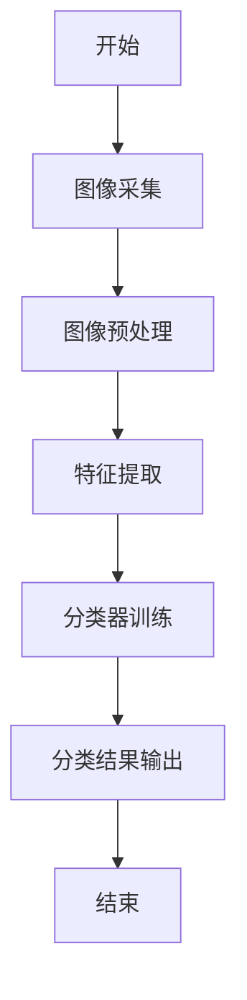
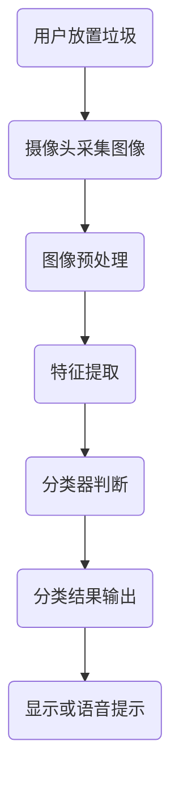

                 


# 智能垃圾箱：AI Agent的废物分类指导

## 关键词：智能垃圾箱, AI Agent, 废物分类, 人工智能, 图像识别, 分类算法, 系统架构

## 摘要：  
本文探讨了AI Agent在废物分类中的应用，详细介绍了智能垃圾箱的核心概念、算法原理、系统设计、项目实现及优化方案。通过结合图像识别和机器学习技术，AI Agent能够高效、准确地指导废物分类，提升资源回收效率，减少环境污染。文章还提供了实际案例分析和代码实现，帮助读者全面理解智能垃圾箱的设计与实现。

---

## 第一部分：智能垃圾箱与AI Agent概述

### 第1章：智能垃圾箱的背景与意义

#### 1.1 废物分类的现状与挑战
- 1.1.1 当前废物分类的主要问题  
  - 手动分类效率低  
  - 分类标准不统一  
  - 知识普及不足  
- 1.1.2 废物分类的重要性与社会价值  
  - 资源回收与环境保护  
  - 减少环境污染  
  - 提高垃圾分类效率  
- 1.1.3 智能化分类的必要性  
  - 解决人工分类的痛点  
  - 提高分类准确率  
  - 降低管理成本  

#### 1.2 AI Agent在废物分类中的作用
- 1.2.1 AI Agent的基本概念  
  - 定义：AI Agent是具有感知、决策和执行能力的智能体  
  - 类型：基于规则的Agent、基于模型的Agent、基于学习的Agent  
- 1.2.2 AI Agent在废物分类中的应用场景  
  - 图像识别：识别垃圾类型  
  - 分类决策：基于规则或模型进行分类  
  - 交互指导：通过语音或界面指导用户分类  
- 1.2.3 AI Agent的优势与局限性  
  - 优势：高效、准确、可扩展  
  - 局限性：依赖数据质量、硬件成本高  

#### 1.3 智能垃圾箱的核心概念
- 1.3.1 智能垃圾箱的定义  
  - 结合AI Agent的智能设备  
- 1.3.2 智能垃圾箱的功能模块  
  - 数据采集模块：摄像头、传感器  
  - 分类算法模块：图像识别、分类模型  
  - 交互模块：用户界面、语音提示  
- 1.3.3 智能垃圾箱与传统垃圾箱的区别  
  - 自动分类 vs 手动分类  
  - 数据驱动 vs 无数据驱动  

---

## 第二部分：AI Agent的算法原理

### 第2章：AI Agent与废物分类的核心概念

#### 2.1 AI Agent的基本原理
- 2.1.1 AI Agent的定义与分类  
  - 基于规则的Agent：简单逻辑判断  
  - 基于模型的Agent：使用知识库推理  
  - 基于学习的Agent：通过机器学习优化决策  
- 2.1.2 AI Agent的核心算法  
  - 专家系统：基于规则的分类  
  - 机器学习：基于数据的分类  
  - 深度学习：基于神经网络的分类  
- 2.1.3 AI Agent的决策机制  
  - 单点决策：基于当前输入做出决策  
  - 连续决策：动态调整分类策略  

#### 2.2 废物分类的数学模型
- 2.2.1 废物分类的基本问题  
  - 监督学习：有标签的数据训练分类器  
  - 无监督学习：聚类分析  
  - 强化学习：通过奖励机制优化分类策略  
- 2.2.2 分类算法的选择与比较  
  - 决策树：适合规则明确的分类  
  - 支持向量机：适合高维数据的分类  
  - 随机森林：适合特征较多的分类任务  
  - 卷积神经网络：适合图像数据的分类  
- 2.2.3 分类模型的性能评估  
  - 准确率：分类正确的比例  
  - 召回率：分类出的正例中实际为正例的比例  
  - F1分数：准确率和召回率的调和平均  

#### 2.3 AI Agent与废物分类的实体关系图
```mermaid
er
actor: 用户
agent: AI分类器
garbage: 废物
action: 分类操作
```

### 第3章：AI Agent的算法原理

#### 3.1 垃圾分类的常见算法
- 3.1.1 决策树分类  
  - ID3、C4.5、CART算法  
  - 适用于规则明确的分类任务  
- 3.1.2 支持向量机  
  - 线性可分与不可分数据的处理  
  - 核函数的应用  
- 3.1.3 随机森林  
  - 集成学习的优势  
  - 随机特征和样本的选择  
- 3.1.4 卷积神经网络  
  - 图像特征提取的过程  
  - 全连接层的分类决策  

#### 3.2 基于图像识别的分类算法
- 3.2.1 图像预处理  
  - 转灰度、二值化、降噪  
  - 常见的预处理方法  
- 3.2.2 特征提取  
  - 常用的特征提取方法：HOG、SIFT、CNN特征  
- 3.2.3 分类器训练  
  - 使用训练数据集训练分类器  
  - 调整超参数优化性能  

#### 3.3 算法流程图


---

## 第三部分：系统架构与设计

### 第4章：系统架构与设计

#### 4.1 系统功能设计
- 4.1.1 问题场景介绍  
  - 用户通过智能垃圾箱进行垃圾分类  
  - 系统实时识别并指导用户分类  
- 4.1.2 系统功能模块  
  - 数据采集模块：摄像头、传感器  
  - 数据处理模块：图像预处理、特征提取  
  - 分类算法模块：决策树、SVM、CNN  
  - 交互模块：LCD显示、语音提示  
- 4.1.3 系统功能流程图


#### 4.2 系统架构设计
- 4.2.1 系统架构图


#### 4.3 系统接口设计
- 4.3.1 API接口
  - 接收图像数据接口  
  - 返回分类结果接口  
  - 更新分类模型接口  

#### 4.4 系统交互设计
- 4.4.1 交互流程图
```mermaid
sequence
actor 用户
agent AI分类器
用户 ->> agent: 放置垃圾
agent --> 用户: 请将垃圾放入对应区域
```

---

## 第四部分：项目实战

### 第5章：项目实现与优化

#### 5.1 环境配置
- 5.1.1 开发工具  
  - Python 3.8及以上  
  - OpenCV、TensorFlow、Keras库  
- 5.1.2 数据集准备  
  - 公共数据集（如COCO、ImageNet）  
  - 自行采集数据集  

#### 5.2 核心代码实现
- 5.2.1 图像预处理代码  
```python
import cv2

def preprocess_image(image):
    gray = cv2.cvtColor(image, cv2.COLOR_BGR2GRAY)
    blurred = cv2.GaussianBlur(gray, (5, 5), 0)
    return blurred
```

- 5.2.2 分类器训练代码  
```python
from sklearn.tree import DecisionTreeClassifier

def train_classifier(X_train, y_train):
    clf = DecisionTreeClassifier()
    clf.fit(X_train, y_train)
    return clf
```

- 5.2.3 分类器预测代码  
```python
def classify_image(classifier, features):
    prediction = classifier.predict(features)
    return prediction
```

#### 5.3 项目优化
- 5.3.1 数据增强  
  - 使用数据增强技术提升模型泛化能力  
- 5.3.2 模型优化  
  - 调整超参数（学习率、批次大小）  
  - 使用交叉验证评估模型性能  

#### 5.4 案例分析
- 5.4.1 实际案例  
  - 使用智能垃圾箱分类电子废弃物  
  - 对比传统分类方法的效率和准确率  

---

## 第五部分：总结与展望

### 第6章：项目总结与优化建议

#### 6.1 项目成果
- 提高垃圾分类效率  
- 准确率显著提升  
- 降低成本  

#### 6.2 优缺点分析
- 优点：高效、准确、可扩展  
- 缺点：硬件成本高、依赖数据质量  

#### 6.3 改进建议
- 提高模型的泛化能力  
- 降低硬件成本  
- 提升用户体验  

#### 6.4 未来展望
- 更智能的分类算法  
- 更广泛的场景应用  
- 更高的分类准确率  

---

## 作者：AI天才研究院 / AI Genius Institute & 禅与计算机程序设计艺术 / Zen And The Art of Computer Programming

