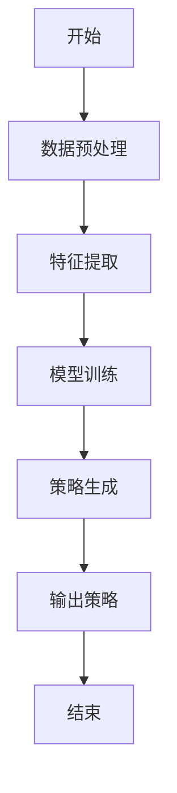
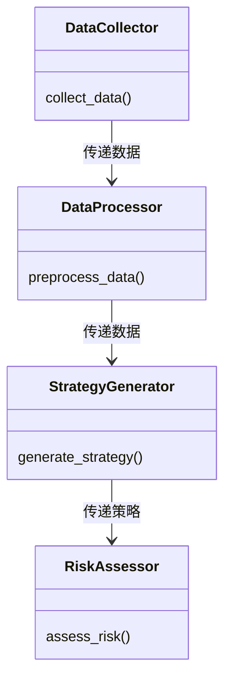
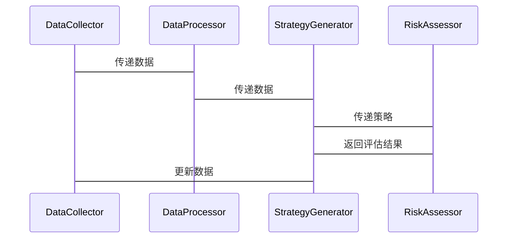

                 


---

# 智能外汇交易策略生成器

> **关键词**：智能外汇交易，策略生成器，机器学习，算法交易，外汇市场分析

> **摘要**：本文深入探讨智能外汇交易策略生成器的核心原理、算法实现、系统架构以及实际应用。通过结合机器学习与金融数据分析，本文提出了一种高效、智能的外汇交易策略生成方法，帮助交易者在复杂多变的外汇市场中捕捉机会、降低风险。文章从背景分析、核心概念、算法原理、系统设计到项目实战，层层深入，为读者提供全面的技术指导。

---

## 第一部分: 智能外汇交易策略生成器的背景与核心概念

### 第1章: 智能外汇交易策略生成器的背景与问题背景

#### 1.1 外汇交易的复杂性与挑战

##### 1.1.1 外汇交易的基本概念与特点

外汇市场是全球最大的金融市场，24小时交易，参与者包括银行、企业和个人。外汇交易涉及汇率波动、市场情绪、经济指标等多种因素，具有高度不确定性和复杂性。

##### 1.1.2 传统外汇交易策略的局限性

传统的交易策略依赖人工分析，存在以下问题：

- 交易者情绪影响决策
- 策略执行效率低
- 策略优化耗时且难以量化
- 无法有效捕捉高频交易机会

##### 1.1.3 智能化交易策略的需求与优势

智能外汇交易策略生成器通过机器学习、大数据分析和算法交易，帮助交易者：

- 自动化分析市场数据
- 快速生成和优化交易策略
- 提高交易效率和准确性
- 降低人为情绪干扰

#### 1.2 问题背景与目标

##### 1.2.1 外汇市场波动性与不确定性

外汇市场的波动性主要由经济指标、政治事件和市场情绪等因素驱动。这些因素难以预测，导致市场波动剧烈。

##### 1.2.2 交易策略生成的复杂性

传统的策略生成方法依赖经验丰富的交易员，而智能策略生成器需要解决以下问题：

- 数据量大、维度高
- 策略多样性和可解释性
- 算法高效性和鲁棒性

##### 1.2.3 智能外汇交易策略生成器的目标与意义

目标是开发一个能够自动分析市场数据、生成和优化交易策略的系统。意义在于提高交易效率，降低风险，抓住市场机会。

#### 1.3 问题描述与解决思路

##### 1.3.1 外汇交易策略生成的典型问题

- 数据噪声多
- 策略适应性差
- 算法计算效率低

##### 1.3.2 智能化解决方案的核心思路

- 数据预处理与特征提取
- 算法模型优化
- 策略生成与回测

##### 1.3.3 系统边界与外延

系统仅关注交易策略生成，不涉及实际交易执行。功能边界清晰，易于扩展。

#### 1.4 核心概念与结构

##### 1.4.1 智能外汇交易策略生成器的核心要素

- 数据输入：历史汇率数据、经济指标
- 数据处理：清洗、特征提取
- 策略生成：算法模型生成交易信号
- 输出：交易策略、风险评估

##### 1.4.2 系统架构与功能模块

- 数据采集模块：获取实时和历史数据
- 数据处理模块：清洗和特征提取
- 策略生成模块：机器学习模型生成策略
- 输出模块：策略展示与风险评估

##### 1.4.3 系统的核心逻辑与流程

- 数据输入 -> 数据处理 -> 策略生成 -> 输出策略

---

## 第2章: 智能外汇交易策略生成器的核心概念与联系

### 2.1 核心概念原理

#### 2.1.1 外汇市场数据的特征与处理

- 数据特征：时间序列、多维度
- 数据处理：去噪、归一化

#### 2.1.2 策略生成的算法原理

- 基于规则的策略：简单移动平均线、RSI指标
- 基于机器学习的策略：随机森林、神经网络

#### 2.1.3 系统的核心逻辑与流程

数据输入 -> 特征提取 -> 策略生成 -> 策略优化 -> 输出

### 2.2 核心概念属性特征对比

| 特性       | 传统策略          | 智能策略          |
|------------|-------------------|-------------------|
| 策略生成   | 人工制定          | 自动生成          |
| 数据依赖   | 单一来源          | 多数据源          |
| 精度       | 较低              | 较高              |
| 可扩展性   | 有限              | 高                |

### 2.3 ER实体关系图

```mermaid
erDiagram
    currency :- "货币对"
    indicator :- "经济指标"
    data :- "市场数据"
    strategy :- "交易策略"
    risk :- "风险评估"
    currency --> data : 影响
    indicator --> data : 影响
    data --> strategy : 生成
    strategy --> risk : 评估
```

---

## 第3章: 智能外汇交易策略生成器的算法原理

### 3.1 算法原理

#### 3.1.1 生成模型

使用随机森林回归模型预测汇率变动，生成交易信号。

#### 3.1.2 优化方法

使用遗传算法优化策略参数，提高策略表现。

### 3.2 算法实现步骤



#### 3.2.1 数据预处理

```python
import pandas as pd

data = pd.read_csv('forex.csv')
data = data.dropna()
data = data[['bid_open', 'ask_close']]
```

#### 3.2.2 特征提取

```python
from sklearn.preprocessing import MinMaxScaler

scaler = MinMaxScaler()
scaled_data = scaler.fit_transform(data)
```

#### 3.2.3 模型训练

```python
from sklearn.ensemble import RandomForestRegressor

model = RandomForestRegressor(n_estimators=100)
model.fit(scaled_data[:-100], scaled_data[100:])
```

#### 3.2.4 策略生成

```python
def generate_strategy(data, model):
    predictions = model.predict(data)
    return predictions
```

### 3.3 数学模型与公式

策略生成模型的数学公式：

$$
y_{t} = \beta_{0} + \beta_{1}x_{1} + \beta_{2}x_{2} + \epsilon
$$

其中，$y_{t}$是预测的汇率变化，$x_{1}$和$x_{2}$是输入特征，$\beta$是模型参数。

---

## 第4章: 智能外汇交易策略生成器的系统分析与架构设计方案

### 4.1 问题场景介绍

系统需要处理实时和历史数据，生成交易策略，并评估风险。

### 4.2 系统功能设计

#### 4.2.1 领域模型



#### 4.2.2 系统架构设计


#### 4.2.3 系统接口设计

- 数据采集模块接口：`get_market_data()`
- 数据处理模块接口：`preprocess_data(data)`
- 策略生成模块接口：`generate_strategy(data)`

#### 4.2.4 系统交互流程



---

## 第5章: 智能外汇交易策略生成器的项目实战

### 5.1 项目环境安装

```bash
pip install pandas numpy scikit-learn matplotlib
```

### 5.2 核心代码实现

#### 5.2.1 数据采集与预处理

```python
import pandas as pd
import numpy as np

def collect_data():
    data = pd.read_csv('forex.csv')
    return data.dropna()

def preprocess_data(data):
    data = data[['bid_open', 'ask_close']]
    data = data.apply(lambda x: x / x.max())
    return data
```

#### 5.2.2 策略生成与评估

```python
from sklearn.ensemble import RandomForestRegressor
from sklearn.metrics import mean_squared_error

def generate_strategy(data):
    X = data.iloc[:-100]
    y = data.iloc[100:]
    model = RandomForestRegressor(n_estimators=100)
    model.fit(X, y)
    return model

def evaluate_strategy(model, data):
    X_test = data.iloc[-100:]
    y_pred = model.predict(X_test)
    return mean_squared_error(X_test, y_pred)
```

### 5.3 案例分析

#### 5.3.1 数据分析

分析历史汇率数据，提取关键特征，如移动平均线、RSI等。

#### 5.3.2 策略回测

使用历史数据对生成的策略进行回测，计算收益和风险比。

---

## 第6章: 智能外汇交易策略生成器的最佳实践与小结

### 6.1 最佳实践

- 数据清洗是关键
- 模型选择要根据数据特点
- 风险评估不可忽视

### 6.2 小结

智能外汇交易策略生成器通过机器学习和算法优化，显著提高了交易策略的生成效率和准确性。

### 6.3 注意事项

- 系统需实时更新数据
- 策略需定期优化
- 风险控制是核心

### 6.4 拓展阅读

建议深入学习时间序列分析、强化学习在金融中的应用。

---

**作者**：AI天才研究院/AI Genius Institute & 禅与计算机程序设计艺术 /Zen And The Art of Computer Programming

