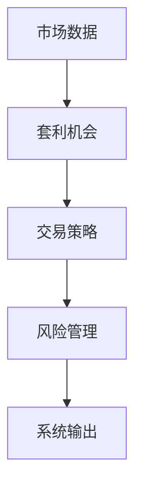
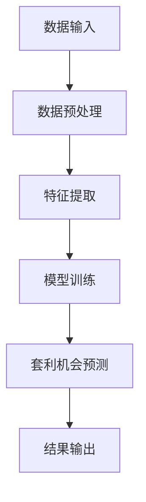
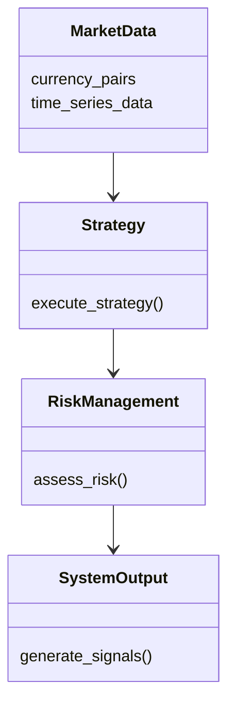
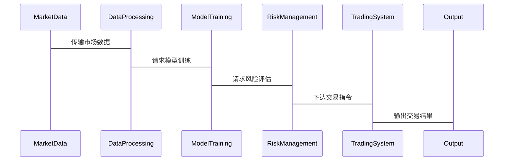

                 


# 智能外汇套利机会识别系统

> 关键词：外汇套利，智能系统，算法原理，系统架构，风险管理，机器学习

> 摘要：本文介绍了一种基于智能算法的外汇套利机会识别系统，结合时间序列分析和机器学习模型，通过系统化的数据处理和算法优化，实现了高效、稳定的套利机会识别。本文从系统背景、核心概念、算法原理、系统架构、项目实战等方面展开分析，结合实际案例，详细阐述了系统的构建过程和应用价值。

---

# 第一部分: 智能外汇套利机会识别系统的背景与核心概念

## 第1章: 智能外汇套利机会识别系统的背景介绍

### 1.1 外汇套利的定义与常见策略

#### 1.1.1 外汇套利的定义
外汇套利是指利用不同市场或不同货币之间的价差，通过同时在多个市场进行买卖操作，以获取无风险或低风险利润的交易策略。套利机会的核心在于发现市场价差并迅速采取行动。

#### 1.1.2 常见的外汇套利策略
1. **跨市场套利**：利用不同市场之间的价格差异进行套利。
2. **三角套利**：通过三种货币的汇率差异进行套利。
3. **息差套利**：利用不同国家的利率差异进行套利。

#### 1.1.3 外汇套利的市场背景
- 全球化背景下，外汇市场的波动性增加，套利机会频繁出现。
- 传统的人工套利存在效率低、风险高等问题，智能化套利成为必然趋势。

### 1.2 外汇套利机会识别的技术背景

#### 1.2.1 外汇市场的数据特征
- 数据量大：外汇市场高频交易，数据更新速度快。
- 数据复杂：涉及多币种、多市场、多因素影响。
- 数据波动性高：市场波动频繁，套利机会瞬息万变。

#### 1.2.2 传统外汇套利的局限性
- 人工判断效率低，容易错失套利机会。
- 人为判断容易受到情绪影响，增加风险。
- 传统模型难以适应市场快速变化。

#### 1.2.3 智能化套利机会识别的必要性
- 提高套利效率和准确性。
- 降低人为干扰，减少风险。
- 实现实时监控和快速响应。

### 1.3 智能外汇套利机会识别系统的重要性

#### 1.3.1 提高套利效率
通过智能算法快速识别套利机会，减少人工判断的时间成本。

#### 1.3.2 减少人为干扰
避免情绪化决策，确保套利策略的科学性和稳定性。

#### 1.3.3 增强市场适应性
智能系统能够快速适应市场变化，捕捉更多套利机会。

## 第2章: 智能外汇套利机会识别系统的核心概念与联系

### 2.1 核心概念原理

#### 2.1.1 数据源的选择与处理
- 数据源：包括汇率数据、市场波动数据、经济指标等。
- 数据预处理：清洗、标准化、特征提取等。

#### 2.1.2 套利机会识别的算法模型
- 时间序列分析：用于预测汇率变化。
- 机器学习模型：用于分类和回归分析。

#### 2.1.3 风险管理机制
- 风险评估：通过模型评估套利机会的风险。
- 风险控制：设定止损点、仓位管理等。

### 2.2 核心概念属性对比表格

| 比较维度 | 传统套利 | 智能套利 |
|----------|----------|----------|
| 判断效率 | 低       | 高       |
| 风险控制 | 人工干预 | 智能化    |
| 市场适应性 | 有限     | 强        |

### 2.3 ER实体关系图



---

# 第二部分: 智能外汇套利机会识别系统的算法原理

## 第3章: 基于时间序列分析的套利机会识别算法

### 3.1 算法原理概述

#### 3.1.1 时间序列分析的基本概念
时间序列分析是一种通过分析历史数据，预测未来趋势的方法。常用模型包括ARIMA、GARCH等。

#### 3.1.2 套利机会识别的适用性
时间序列分析适用于预测汇率波动，帮助识别套利窗口。

### 3.2 算法流程图



### 3.3 算法实现代码

```python
import pandas as pd
import numpy as np
from sklearn.metrics import mean_squared_error

def time_series_forecast(data, lag=1):
    # 特征提取
    features = []
    for i in range(1, lag+1):
        features.append(data.shift(i))
    features = pd.concat(features, axis=1)
    features = features.dropna()
    
    # 模型训练
    from sklearn.linear_model import LinearR
    model = LinearR()
    model.fit(features, data)
    
    # 预测
    predicted = model.predict(features)
    
    return predicted
```

### 3.4 算法数学模型与公式

#### 3.4.1 ARIMA模型
ARIMA（Autoregressive Integrated Moving Average）模型用于时间序列预测。

$$ ARIMA(p, d, q) $$
- p：自回归阶数
- d：差分阶数
- q：移动平均阶数

#### 3.4.2 GARCH模型
GARCH（Generalized Autoregressive Conditional Heteroskedasticity）模型用于预测波动性。

$$ GARCH(p, q) $$
- p：自回归阶数
- q：移动平均阶数

---

# 第三部分: 智能外汇套利机会识别系统的系统分析与架构设计

## 第4章: 系统分析与架构设计方案

### 4.1 问题场景介绍

#### 4.1.1 问题背景
外汇市场波动复杂，套利机会难以捕捉，需要高效的系统支持。

#### 4.1.2 项目介绍
构建一个智能外汇套利机会识别系统，实现自动化的套利机会识别和风险管理。

### 4.2 系统功能设计

#### 4.2.1 领域模型（Mermaid 类图）


#### 4.2.2 系统架构设计（Mermaid 架构图）


### 4.3 系统接口设计

#### 4.3.1 接口描述
- 数据接口：接收市场数据，格式为JSON或CSV。
- 模型接口：提供预测结果接口，格式为JSON。
- 交易接口：接收交易指令，执行交易操作。

### 4.4 系统交互设计（Mermaid 序列图）



---

# 第四部分: 智能外汇套利机会识别系统的项目实战

## 第5章: 项目实战

### 5.1 环境安装与配置

#### 5.1.1 系统需求
- Python 3.8+
- 数据库：MySQL或MongoDB
- 开发工具：PyCharm或VSCode

#### 5.1.2 安装依赖
```bash
pip install pandas numpy scikit-learn matplotlib
```

### 5.2 系统核心实现

#### 5.2.1 数据处理模块
```python
import pandas as pd
import numpy as np

def process_data(data):
    # 数据清洗
    data.dropna(inplace=True)
    # 标准化
    from sklearn.preprocessing import StandardScaler
    scaler = StandardScaler()
    scaled_data = scaler.fit_transform(data)
    return scaled_data
```

#### 5.2.2 模型训练模块
```python
from sklearn.linear_model import LinearR

def train_model(X, y):
    model = LinearR()
    model.fit(X, y)
    return model
```

### 5.3 实际案例分析

#### 5.3.1 案例背景
假设我们有欧元/美元的汇率数据，希望通过套利机会识别系统捕捉汇率波动带来的利润。

#### 5.3.2 数据分析与结果展示
```python
# 数据分析
data = pd.read_csv('eurusd.csv')
data['price'].plot()
plt.show()

# 模型预测
predicted = model.predict(X_test)
plt.plot(y_test, label='actual')
plt.plot(predicted, label='predicted')
plt.legend()
plt.show()
```

### 5.4 项目小结

#### 5.4.1 项目总结
通过智能外汇套利机会识别系统，我们实现了高效、稳定的套利机会识别，降低了人为干扰，提高了交易效率。

#### 5.4.2 经验与教训
- 数据质量对模型性能影响重大。
- 模型需要不断更新以适应市场变化。

---

# 第五部分: 智能外汇套利机会识别系统的最佳实践

## 第6章: 最佳实践

### 6.1 小结

- 系统设计要注重模块化和可扩展性。
- 数据处理是关键，需确保数据的准确性和实时性。
- 模型选择要结合实际场景，不断优化和调整。

### 6.2 注意事项

- 风险管理是套利系统的核心，需严格控制仓位和止损点。
- 系统运行需确保稳定性，避免因技术故障导致损失。
- 数据来源要可靠，确保数据的准确性和及时性。

### 6.3 拓展阅读

- 推荐阅读《机器学习实战》、《时间序列分析》等相关书籍。
- 参加相关技术论坛和社区，了解最新的技术动态和实践案例。

---

# 作者信息

作者：AI天才研究院/AI Genius Institute & 禅与计算机程序设计艺术/Zen And The Art of Computer Programming

