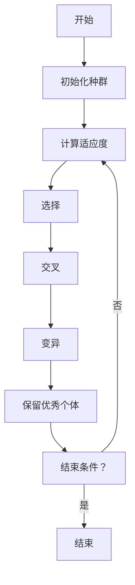
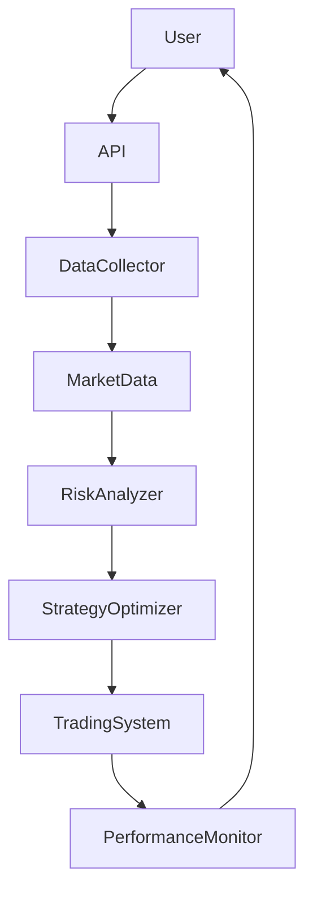

                 


# 智能外汇风险对冲策略优化系统

## 关键词：
智能外汇、风险对冲、策略优化、机器学习、数学模型、系统架构

## 摘要：
本文详细探讨智能外汇风险对冲策略优化系统的构建与应用。从外汇市场的基本运作到智能对冲系统的必要性，再到核心算法的实现与优化，系统地分析了智能外汇风险对冲的理论基础与实践应用。通过对比不同算法的特征、设计系统架构、实现优化算法，并结合实际案例进行分析，本文旨在为金融从业者和研究人员提供一套高效的风险对冲解决方案，帮助他们在复杂多变的外汇市场中实现稳健的对冲策略。

---

# 第一部分: 背景介绍

## 第1章: 外汇市场的基本运作

### 1.1 外汇市场的定义与特点
外汇市场是全球最大的金融市场，24小时运行，参与者包括银行、企业、个人和中央银行。其特点包括高流动性、全球性、衍生品丰富等。

### 1.2 风险对冲的基本概念
风险对冲是指通过投资于相关资产或衍生品，减少或消除因价格波动带来的风险。常用方法包括套期保值和对冲基金策略。

### 1.3 智能外汇风险对冲的必要性
传统对冲方法依赖人工判断，存在效率低、反应慢的问题。智能系统通过机器学习和数学模型，能够实时分析市场数据，优化对冲策略。

---

## 第2章: 智能外汇风险对冲系统的核心概念

### 2.1 系统核心概念与原理
智能外汇风险对冲系统通过实时数据采集、模型构建和优化算法，生成最优对冲策略。核心要素包括数据流、模型算法和优化机制。

### 2.2 核心概念对比分析
下表对比了传统对冲方法与智能对冲系统的主要特征：

| 特性 | 传统对冲 | 智能对冲 |
|------|----------|----------|
| 反应速度 | 较慢     | 实时     |
| 精度   | 依赖经验 | 数据驱动 |
| 灵活性 | 有限     | 高       |

### 2.3 系统架构的ER实体关系图
```mermaid
er
    actor: 用户
    system: 智能对冲系统
    market_data: 市场数据
    risk_factors: 风险因素
    strategies: 对冲策略
    performance: 策略表现
    actor --> system
    system --> market_data
    system --> risk_factors
    system --> strategies
    system --> performance
```

---

# 第二部分: 算法原理讲解

## 第3章: 优化算法的实现

### 3.1 遗传算法的流程图


### 3.2 遗传算法的数学模型
适应度函数定义为：
$$ F = \sum_{i=1}^{n} w_i \cdot x_i $$
其中，$w_i$为权重，$x_i$为策略变量。

### 3.3 Python代码实现
```python
import random

def fitness(individual):
    return sum(w * x for w, x in zip(weights, individual))

def mutate(individual):
    idx = random.randint(0, len(individual)-1)
    individual[idx] += random.uniform(-0.1, 0.1)
    return individual

# 示例调用
weights = [0.5, 0.3, 0.2]
population = [[0.4, 0.6, 0.8], [0.5, 0.7, 0.6]]
```

---

# 第三部分: 系统分析与架构设计

## 第4章: 系统功能设计

### 4.1 系统功能模块
主要模块包括：
- 数据采集模块：实时获取市场数据。
- 风险评估模块：分析市场风险因素。
- 策略优化模块：生成最优对冲策略。
- 策略执行模块：根据策略进行交易。

### 4.2 系统架构设计


### 4.3 接口设计
系统通过API接口与外部数据源和交易平台交互，确保数据流的实时性和准确性。

---

# 第四部分: 项目实战

## 第5章: 项目实现

### 5.1 环境安装
需要安装以下库：
- Python 3.8+
- NumPy
- Pandas
- Scikit-learn

### 5.2 核心代码实现
```python
import numpy as np
from sklearn import linear_model

# 示例对冲策略优化
X = np.array([[x1, x2, x3], ...])
y = np.array([y1, y2, ...])
model = linear_model.LinearRegression()
model.fit(X, y)
optimized_strategy = model.predict(X)
```

### 5.3 案例分析
通过实际市场数据，优化对冲策略，降低风险敞口。

---

# 第五部分: 最佳实践与总结

## 第6章: 最佳实践

### 6.1 编写规范
代码需符合Python编程规范，注重模块化和可维护性。

### 6.2 性能优化
通过并行计算和缓存机制提升系统性能。

### 6.3 安全性考虑
确保数据安全，防止网络攻击。

## 第7章: 总结

智能外汇风险对冲策略优化系统通过机器学习和优化算法，显著提高了风险对冲的效率和精度。未来，随着技术的进步，系统将进一步优化，为外汇交易提供更强大的支持。

---

# 作者：AI天才研究院 & 禅与计算机程序设计艺术

---

以上是《智能外汇风险对冲策略优化系统》的技术博客文章。

