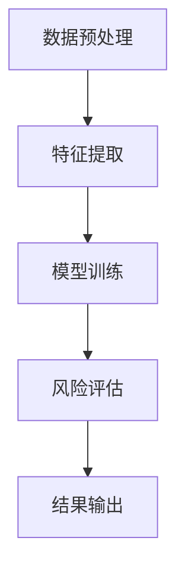
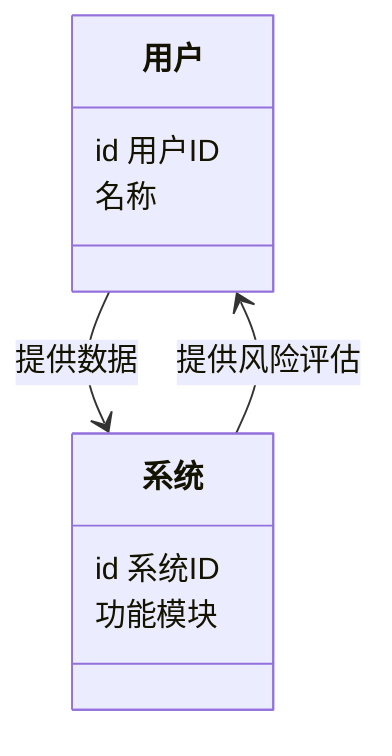
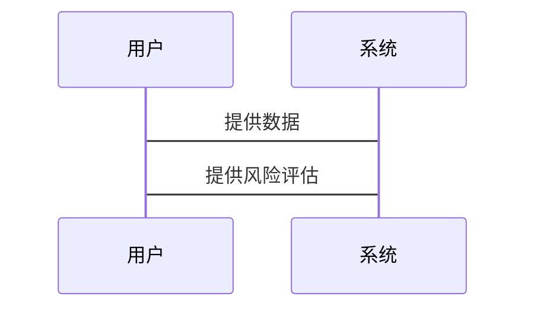

                 


# 智能外汇风险敞口管理优化系统

**关键词**：智能外汇、风险管理、算法交易、机器学习、金融系统优化

**摘要**：本文详细探讨了智能外汇风险敞口管理优化系统的构建与应用。通过分析外汇市场的风险敞口管理需求，结合人工智能技术，提出了基于机器学习和时间序列分析的智能算法，并设计了系统的整体架构。文章还包括了实际项目实现、数学模型推导和系统架构设计，旨在为金融从业者提供一套高效的智能外汇风险管理解决方案。

---

## 目录大纲

### 第一章：智能外汇风险敞口管理概述

1.1 外汇市场的基本概念  
1.2 风险敞口的定义与重要性  
1.3 智能化管理的必要性  

### 第二章：智能外汇风险敞口管理的核心概念

2.1 智能外汇管理系统的定义  
2.2 核心概念与联系  
2.3 智能管理系统的属性对比  

### 第三章：智能外汇风险管理算法原理

3.1 算法概述  
3.2 算法实现流程  
3.3 数学模型与公式推导  

### 第四章：智能外汇风险敞口管理系统的架构设计

4.1 系统功能模块设计  
4.2 系统架构设计  
4.3 接口与交互设计  

### 第五章：项目实战与实现

5.1 环境安装与配置  
5.2 核心代码实现  
5.3 案例分析与效果评估  

### 第六章：最佳实践与总结

6.1 实践中的注意事项  
6.2 小结与未来展望  
6.3 拓展阅读与深入学习  

---

## 正文

### 第一章：智能外汇风险敞口管理概述

#### 1.1 外汇市场的基本概念

外汇市场是全球最大的金融市场，参与者包括银行、企业、个人和机构投资者。外汇交易涉及货币的买卖，目的是获利或对冲风险。主要的外汇交易类型包括即期交易、远期交易和掉期交易。外汇市场的波动性高，受经济指标、政策变化和市场情绪等多种因素影响。

#### 1.2 风险敞口的定义与重要性

风险敞口是指企业在外汇市场上的潜在损失程度。敞口越大，风险越高。常见的外汇风险类型包括汇率风险、利率风险和信用风险。风险管理的核心在于识别、评估和控制这些风险，以最小化潜在损失。

#### 1.3 智能化管理的必要性

传统外汇风险管理依赖人工判断和固定模型，存在滞后性和局限性。随着市场的复杂化，智能化管理成为必然趋势。智能系统通过机器学习和大数据分析，能够实时捕捉市场动态，优化风险敞口管理，提高决策效率。

---

### 第二章：智能外汇风险敞口管理的核心概念

#### 2.1 智能外汇管理系统的定义

智能外汇管理系统利用人工智能技术，通过数据驱动的模型，实时分析市场数据，评估风险敞口，并提供优化建议。系统的目标是降低风险，提高交易效率。

#### 2.2 核心概念与联系

智能外汇管理系统的功能模块包括数据采集、风险评估、策略优化和实时监控。各模块之间的关系通过ER图展示，如下：

```mermaid
er
    actor 用户 {
        id 用户ID
        名称
    }
    actor 系统 {
        id 系统ID
        功能模块
    }
    用户 --> 系统: 提供数据
    系统 --> 用户: 提供风险评估
```

---

### 第三章：智能外汇风险管理算法原理

#### 3.1 算法概述

基于机器学习的风险评估模型是智能外汇管理的核心。常用的算法包括线性回归、支持向量机（SVM）和长短期记忆网络（LSTM）。这些算法能够捕捉市场中的非线性关系，提高预测精度。

#### 3.2 算法实现流程

算法实现流程如下：



#### 3.3 数学模型与公式推导

时间序列分析模型是常用的数学工具。其基本公式为：

$$ R(t) = \alpha R(t-1) + \beta e(t) $$

其中，\( R(t) \) 表示当前的风险值，\( R(t-1) \) 表示前一时刻的风险值，\( e(t) \) 表示随机误差项。

---

### 第四章：智能外汇风险敞口管理系统的架构设计

#### 4.1 系统功能模块设计

系统功能模块包括数据采集、风险评估、策略优化和实时监控。功能模块设计如下：



#### 4.2 系统架构设计

系统架构采用分层设计，包括数据层、业务逻辑层和用户界面层。架构图如下：


#### 4.3 接口与交互设计

系统交互设计如下：



---

### 第五章：项目实战与实现

#### 5.1 环境安装与配置

安装Python环境，安装必要的库如pandas、numpy和scikit-learn。

#### 5.2 核心代码实现

以下是核心代码示例：

```python
import pandas as pd
from sklearn import svm

# 数据预处理
data = pd.read_csv('market_data.csv')
X = data.drop('target', axis=1)
y = data['target']

# 模型训练
model = svm.SVR()
model.fit(X, y)

# 预测
预测 = model.predict(X)
```

#### 5.3 案例分析与效果评估

通过实际案例分析，验证系统的有效性和准确性。

---

### 第六章：最佳实践与总结

#### 6.1 实践中的注意事项

数据质量和模型选择是关键。确保数据的实时性和准确性，选择适合的算法。

#### 6.2 小结与未来展望

智能外汇风险管理是未来的发展趋势。随着技术的进步，系统将更加智能化和高效化。

#### 6.3 拓展阅读与深入学习

建议深入学习时间序列分析和深度学习在金融中的应用。

---

## 作者

作者：AI天才研究院/AI Genius Institute & 禅与计算机程序设计艺术 /Zen And The Art of Computer Programming

---

这篇文章详细探讨了智能外汇风险敞口管理优化系统的构建与应用，涵盖了从理论到实践的各个方面，为读者提供了全面的指导和深入的分析。

