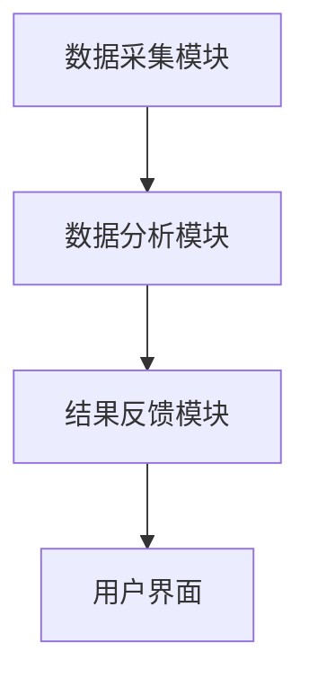

                 


```markdown
# 智能婴儿床：AI Agent的婴儿睡眠模式分析

**关键词**：智能婴儿床，AI Agent，婴儿睡眠模式，数据分析，机器学习，婴儿健康

**摘要**：  
本文探讨了AI Agent在婴儿睡眠模式分析中的应用，详细介绍了智能婴儿床的技术背景、核心算法、系统架构以及实际应用案例。通过分析婴儿睡眠数据，本文展示了如何利用AI技术优化婴儿睡眠监测和管理，为家长和医疗专业人士提供科学依据。

---

## 第1章：智能婴儿床与AI Agent概述

### 1.1 智能婴儿床的背景与意义
#### 1.1.1 婴儿睡眠的重要性
婴儿的睡眠质量直接影响其成长发育。良好的睡眠有助于婴儿的身体发育、情绪稳定和认知能力的提升。然而，许多家长在监测和管理婴儿睡眠方面面临诸多挑战。

#### 1.1.2 智能婴儿床的概念
智能婴儿床是一种结合了物联网和人工智能技术的智能设备，能够实时监测婴儿的睡眠状态，并通过AI Agent分析睡眠模式，提供个性化的睡眠管理建议。

#### 1.1.3 AI Agent在婴儿睡眠分析中的作用
AI Agent通过收集和分析婴儿的睡眠数据，能够识别睡眠模式中的异常情况，并提供相应的解决方案。这不仅减轻了家长的负担，还提高了婴儿的睡眠质量。

### 1.2 婴儿睡眠模式分析的背景
#### 1.2.1 婴儿睡眠问题的现状
许多婴儿在睡眠过程中会出现哭闹、易惊醒等问题，这不仅影响婴儿的健康，也给家长带来了极大的困扰。

#### 1.2.2 传统婴儿睡眠分析方法的局限性
传统的睡眠分析方法通常依赖于人工记录和观察，这种方式不仅耗时，而且容易出错。

#### 1.2.3 AI技术在婴儿睡眠分析中的优势
AI技术能够实时监测婴儿的睡眠数据，通过机器学习算法分析睡眠模式，提供精准的睡眠分析和建议。

### 1.3 本书的核心内容与目标
#### 1.3.1 本书的研究目标
本书旨在探讨AI Agent在婴儿睡眠模式分析中的应用，提供一种基于AI技术的智能婴儿床解决方案。

#### 1.3.2 本书的核心内容
本书将详细介绍智能婴儿床的技术背景、AI Agent的核心算法、系统架构设计以及实际应用案例。

#### 1.3.3 本书的结构安排
本书共分为七章，内容从智能婴儿床的背景介绍到实际应用案例分析，涵盖AI Agent的核心算法、系统架构设计以及优化与扩展等内容。

### 1.4 本章小结
本章主要介绍了智能婴儿床的背景与意义、婴儿睡眠模式分析的背景与现状，以及本书的核心内容与目标。下一章将详细介绍AI Agent的基本原理及其在婴儿睡眠模式分析中的应用。

---

## 第2章：AI Agent的基本原理

### 2.1 AI Agent的定义与分类
#### 2.1.1 AI Agent的定义
AI Agent（人工智能代理）是一种能够感知环境、执行任务并做出决策的智能实体。它可以分为简单反射型、基于模型的反射型、目标驱动型和实用驱动型四种类型。

#### 2.1.2 AI Agent的分类
根据功能和应用场景的不同，AI Agent可以分为单一智能体和多智能体两类。单一智能体通常用于简单的任务，而多智能体则适用于复杂场景。

#### 2.1.3 AI Agent的核心特征
AI Agent的核心特征包括感知能力、决策能力、学习能力和执行能力。这些特征使其能够独立完成复杂的任务。

### 2.2 婴儿睡眠模式分析的基本原理
#### 2.2.1 婴儿睡眠周期的特征
婴儿的睡眠周期通常包括清醒期和睡眠期两个阶段。睡眠期又分为浅睡期和深睡期，不同阶段的生理指标（如心率、呼吸频率）有所不同。

#### 2.2.2 婴儿睡眠模式的分类
婴儿睡眠模式可以根据睡眠周期的持续时间、频率和深度进行分类。常见的分类方法包括基于时间序列分析和基于机器学习的分类。

#### 2.2.3 婴儿睡眠模式分析的关键指标
婴儿睡眠模式分析的关键指标包括睡眠周期的持续时间、睡眠深度、觉醒次数和睡眠连续性等。

### 2.3 AI Agent在婴儿睡眠模式分析中的应用
#### 2.3.1 数据采集与处理
AI Agent通过智能婴儿床中的传感器（如心率传感器、运动传感器）采集婴儿的生理数据，并进行预处理和特征提取。

#### 2.3.2 数据分析与模式识别
通过机器学习算法（如支持向量机、随机森林）对婴儿睡眠数据进行分析，识别睡眠模式中的异常情况。

#### 2.3.3 结果反馈与优化
AI Agent根据分析结果提供个性化的睡眠管理建议，并通过反馈机制不断优化算法模型。

### 2.4 本章小结
本章详细介绍了AI Agent的基本原理及其在婴儿睡眠模式分析中的应用。通过数据采集、分析和反馈三个环节，AI Agent能够实现对婴儿睡眠模式的实时监测和优化管理。下一章将详细介绍AI Agent的核心算法及其在婴儿睡眠分析中的具体实现。

---

## 第3章：AI Agent的核心算法

### 3.1 数据采集与预处理
#### 3.1.1 数据采集方法
智能婴儿床通过多种传感器（如心率传感器、加速度传感器）采集婴儿的生理数据。

#### 3.1.2 数据清洗与预处理
数据清洗是去除噪声和异常值的过程，预处理包括数据归一化和特征提取。

#### 3.1.3 数据特征提取
通过时间序列分析提取婴儿睡眠数据中的特征，如睡眠周期的持续时间、觉醒次数等。

### 3.2 婴儿睡眠模式分析的算法选择
#### 3.2.1 机器学习算法的选择
常用的机器学习算法包括支持向量机（SVM）、随机森林（Random Forest）和K近邻算法（KNN）。

#### 3.2.2 深度学习算法的选择
深度学习算法（如LSTM、CNN）在处理时间序列数据方面具有优势。

#### 3.2.3 算法性能评估指标
算法性能评估指标包括准确率、召回率、F1值和AUC值等。

### 3.3 算法实现与优化
#### 3.3.1 算法实现步骤
1. 数据预处理：清洗和归一化数据。
2. 特征提取：提取睡眠周期特征。
3. 模型训练：训练机器学习或深度学习模型。
4. 模型评估：评估模型性能。
5. 模型优化：调整超参数和优化算法。

#### 3.3.2 算法优化策略
通过交叉验证和网格搜索优化模型参数，选择最优算法。

#### 3.3.3 数学模型与公式
- 机器学习模型的训练目标是最小化损失函数：
  $$ L = \frac{1}{N}\sum_{i=1}^{N}(y_i - \hat{y}_i)^2 $$
- LSTM网络的遗忘门、输入门和输出门的更新公式：
  $$ f_t = \sigma(W_f \cdot [h_{t-1}, x_t] + b_f) $$
  $$ i_t = \sigma(W_i \cdot [h_{t-1}, x_t] + b_i) $$
  $$ o_t = \sigma(W_o \cdot [h_{t-1}, x_t] + b_o) $$
  $$ \tilde{c}_t = \tanh(W_c \cdot [h_{t-1}, x_t] + b_c) $$
  $$ c_t = f_t \cdot c_{t-1} + i_t \cdot \tilde{c}_t $$
  $$ h_t = o_t \cdot \tanh(c_t) $$

### 3.4 本章小结
本章详细介绍了AI Agent的核心算法，包括数据预处理、算法选择和模型优化等内容。通过数学公式和算法流程图，展示了如何实现婴儿睡眠模式的分析。下一章将介绍系统架构与设计。

---

## 第4章：系统架构与设计

### 4.1 系统功能设计
#### 4.1.1 数据采集模块
数据采集模块通过多种传感器采集婴儿的生理数据。

#### 4.1.2 数据分析模块
数据分析模块通过机器学习算法分析睡眠数据，识别睡眠模式。

#### 4.1.3 结果反馈模块
结果反馈模块通过智能婴儿床的反馈机制，为家长提供睡眠管理建议。

### 4.2 系统架构设计
#### 4.2.1 系统模块划分
系统模块包括数据采集模块、数据分析模块和结果反馈模块。

#### 4.2.2 模块交互设计
模块之间的交互通过消息队列（如Kafka）或数据库（如MySQL）进行。

### 4.3 系统架构图


### 4.4 本章小结
本章详细介绍了智能婴儿床的系统架构与设计，包括模块划分和交互设计等内容。通过系统架构图展示了各模块之间的交互关系。下一章将介绍项目实战与案例分析。

---

## 第5章：项目实战与案例分析

### 5.1 项目环境搭建
#### 5.1.1 开发环境
- 操作系统：Linux/Windows
- 开发工具：Python、Jupyter Notebook
- 传感器：心率传感器、加速度传感器

#### 5.1.2 数据集准备
使用公开的婴儿睡眠数据集或自采集数据。

### 5.2 核心代码实现
#### 5.2.1 数据采集与预处理
```python
import numpy as np
import pandas as pd

# 数据清洗
def preprocess_data(data):
    data.dropna(inplace=True)
    data = data[~data['label'].isin(['noise'])]
    return data
```

#### 5.2.2 算法实现
```python
from sklearn.svm import SVC
from sklearn.model_selection import train_test_split
from sklearn.metrics import accuracy_score

# 数据分割
X_train, X_test, y_train, y_test = train_test_split(X, y, test_size=0.2)

# 模型训练
model = SVC()
model.fit(X_train, y_train)

# 模型预测
y_pred = model.predict(X_test)
print("准确率：", accuracy_score(y_test, y_pred))
```

#### 5.2.3 系统集成
通过Flask或Django框架搭建Web界面，展示睡眠分析结果。

### 5.3 案例分析
通过实际案例分析展示了AI Agent在婴儿睡眠模式分析中的应用效果，包括睡眠周期识别和异常检测。

### 5.4 本章小结
本章通过项目实战和案例分析，展示了AI Agent在婴儿睡眠模式分析中的具体实现和应用效果。下一章将介绍系统优化与扩展。

---

## 第6章：优化与扩展

### 6.1 算法优化
#### 6.1.1 参数优化
通过网格搜索优化机器学习模型的参数。

#### 6.1.2 模型优化
使用深度学习模型（如LSTM）替代传统机器学习模型，提升性能。

### 6.2 功能扩展
#### 6.2.1 结合可穿戴设备
将智能婴儿床与婴儿可穿戴设备（如智能手环）结合，实现多模态数据分析。

#### 6.2.2 实时监控系统
开发实时监控系统，通过边缘计算实现快速响应。

### 6.3 性能测试与优化建议
通过性能测试（如A/B测试）评估优化效果，并提出进一步优化建议。

### 6.4 本章小结
本章介绍了系统优化与扩展的内容，包括算法优化、功能扩展和性能测试等。通过优化和扩展，进一步提升了智能婴儿床的性能和功能。

---

## 第7章：总结与展望

### 7.1 全文总结
总结了本文的核心内容，包括智能婴儿床的技术背景、AI Agent的核心算法、系统架构设计以及项目实战与案例分析。

### 7.2 未来展望
展望了AI Agent在婴儿睡眠模式分析中的未来发展方向，包括多模态数据分析、实时监控系统和个性化睡眠管理等。

### 7.3 本章小结
本章总结了全文内容，并展望了未来的研究方向。

---

## 作者信息

作者：AI天才研究院/AI Genius Institute & 禅与计算机程序设计艺术/Zen And The Art of Computer Programming

---

**附录**：  
- 附录A：相关数据集的链接  
- 附录B：代码库的链接  
- 附录C：参考文献列表  

---

**感谢**：感谢读者的耐心阅读，希望本文能为AI技术在婴儿睡眠模式分析中的应用提供有价值的参考。
```

