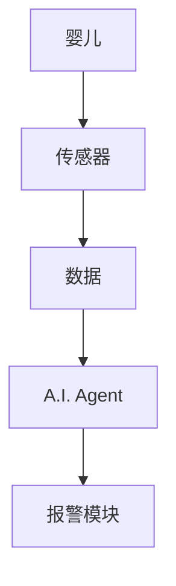
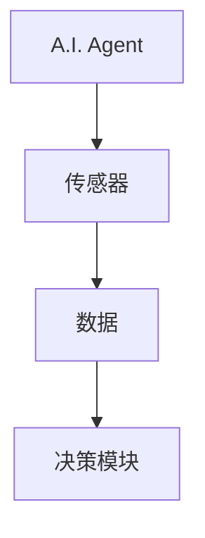
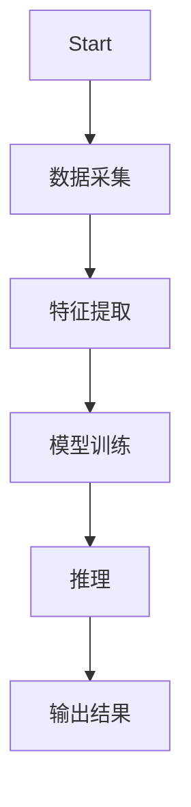
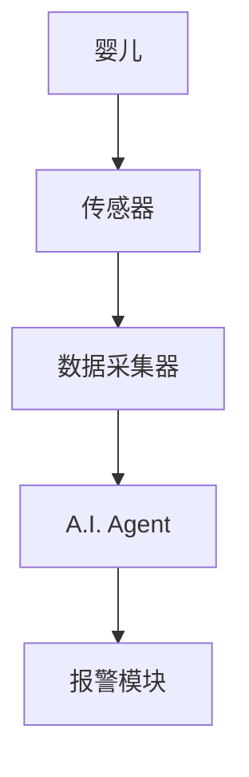
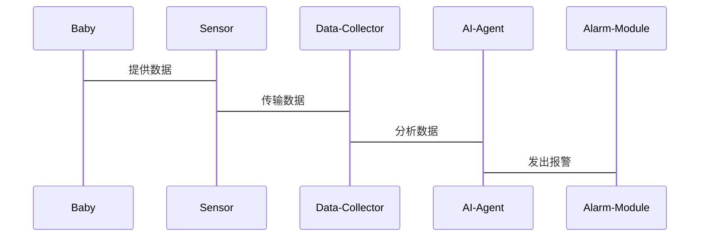

                 


# 智能婴儿监护器：AI Agent的婴儿状态分析

> **关键词**：智能婴儿监护器、AI Agent、婴儿状态分析、机器学习、实时监测、健康预警

> **摘要**：智能婴儿监护器是一种结合人工智能技术的设备，用于实时监测和分析婴儿的状态，包括哭声、体温、运动等。本文将从背景介绍、核心概念、算法原理、系统架构、项目实战等多方面详细分析智能婴儿监护器的设计与实现过程，探讨AI Agent在婴儿状态分析中的应用。

---

# 第一部分: 智能婴儿监护器的背景与核心概念

## 第1章: 智能婴儿监护器的背景介绍

### 1.1 问题背景与描述
#### 1.1.1 婴儿监护的需求与痛点
- 婴儿的健康和安全是家庭的首要关注点。
- 现有解决方案（如传统婴儿监控器）存在功能单一、无法智能分析等问题。
- 父母需要实时了解婴儿的状态，但无法有效处理复杂信息。

#### 1.1.2 现有解决方案的局限性
- 传统婴儿监护设备仅能提供简单的监控功能。
- 数据分析能力有限，无法提供有效的健康预警。

#### 1.1.3 智能婴儿监护器的提出
- 结合AI技术，实现婴儿状态的智能分析。
- 提供实时监测、健康预警和个性化建议。

### 1.2 问题解决与边界定义
#### 1.2.1 智能婴儿监护器的核心目标
- 实时监测婴儿的生理指标（如体温、心率、呼吸率）和行为特征（如哭声、运动）。
- 基于AI算法分析数据，提供健康预警和护理建议。

#### 1.2.2 监护的边界与外延
- 监护范围：0-12个月的婴儿。
- 监护场景：家庭环境，支持无线网络连接。

#### 1.2.3 核心要素与组成结构
- 数据采集模块：传感器（体温、心率、加速度）。
- 数据分析模块：AI算法模型。
- 报警模块：异常情况实时提醒。

### 1.3 核心概念与联系
#### 1.3.1 AI Agent的基本原理
- AI Agent是一个智能体，能够感知环境、分析数据并做出决策。
- 在婴儿监护器中，AI Agent负责数据处理和健康预警。

#### 1.3.2 婴儿状态分析的特征提取
- 声音特征：哭声的频率、时长、音调。
- 运动特征：加速度、运动幅度。
- 生理特征：体温、心率。

#### 1.3.3 系统实体关系图


---

## 第2章: AI Agent的核心概念与原理

### 2.1 AI Agent的定义与特征
#### 2.1.1 AI Agent的定义
- AI Agent是一个智能实体，能够通过传感器感知环境，并基于数据做出决策。

#### 2.1.2 核心属性对比表
| 特性 | 基于规则的AI Agent | 基于机器学习的AI Agent | 基于深度学习的AI Agent |
|------|---------------------|-------------------------|-------------------------|
| 决策方式 | 预定义规则         | 数据驱动模型           | 复杂模式识别           |
| 适应性 | 低                 | 中                     | 高                     |
| 计算复杂度 | 低               | 中                     | 高                     |

#### 2.1.3 实体关系图


### 2.2 AI Agent的工作流程
#### 2.2.1 数据采集阶段
- 传感器采集婴儿的生理数据和行为数据。

#### 2.2.2 特征提取阶段
- 从原始数据中提取有意义的特征（如哭声的频率、体温的变化）。

#### 2.2.3 分析与决策阶段
- 基于AI算法对数据进行分析，生成健康报告。

### 2.3 不同类型AI Agent的对比
#### 2.3.1 基于规则的AI Agent
- 通过预定义的规则进行决策，适用于简单场景。

#### 2.3.2 基于机器学习的AI Agent
- 使用机器学习模型进行数据分类和预测。

#### 2.3.3 基于深度学习的AI Agent
- 利用深度学习模型进行复杂模式识别。

---

## 第3章: 婴儿状态分析的算法原理

### 3.1 算法原理概述
- 基于深度学习的婴儿状态分析算法，包括特征提取、分类和预测。

### 3.2 算法实现流程


### 3.3 算法实现细节
#### 3.3.1 特征提取
- 使用傅里叶变换提取哭声的频率特征。

#### 3.3.2 分类与预测
- 使用深度学习模型（如LSTM）进行时间序列分析。

#### 3.3.3 代码实现
```python
import numpy as np
from sklearn.metrics import accuracy_score

# 示例代码：基于机器学习的分类
def feature_extractor(data):
    # 提取特征，如傅里叶变换
    return np.fft.fft(data)

def model_train(features, labels):
    # 训练机器学习模型
    from sklearn.svm import SVC
    model = SVC()
    model.fit(features, labels)
    return model

# 示例数据
data = np.random.randn(100)
features = feature_extractor(data)
labels = np.random.randint(0, 2, 100)

model = model_train(features, labels)
print("Accuracy:", accuracy_score(labels, model.predict(features)))
```

### 3.4 算法的数学模型
- 特征提取：傅里叶变换
  $$ X(k) = \sum_{n=0}^{N-1} x(n) e^{-j2\pi kn/N} $$

- 分类模型：支持向量机（SVM）
  $$ y = \text{sign}(\sum_{i=1}^N \alpha_i y_i x_i \cdot x + b) $$

---

## 第4章: 系统架构设计

### 4.1 系统组成与功能设计
- 数据采集模块：传感器采集婴儿数据。
- 数据分析模块：AI算法分析数据。
- 报警模块：异常情况实时提醒。

### 4.2 系统架构设计


### 4.3 系统交互设计


---

## 第5章: 项目实战

### 5.1 环境配置
- Python 3.8+
- TensorFlow或Scikit-learn
- 数据集：公开婴儿哭声数据集

### 5.2 核心代码实现
```python
import tensorflow as tf
from tensorflow.keras import layers

# 示例代码：深度学习模型
def build_model(input_shape):
    model = tf.keras.Sequential()
    model.add(layers.Conv1D(32, 3, activation='relu', input_shape=input_shape))
    model.add(layers.MaxPooling1D(2))
    model.add(layers.Flatten())
    model.add(layers.Dense(64, activation='relu'))
    model.add(layers.Dense(2, activation='softmax'))
    return model

# 模型训练
model = build_model((None, 100))
model.compile(optimizer='adam', loss='sparse_categorical_crossentropy', metrics=['accuracy'])
model.fit(X_train, y_train, epochs=10, batch_size=32)
```

### 5.3 实际案例分析
- 数据采集：采集婴儿哭声数据。
- 特征提取：提取哭声的频率特征。
- 模型训练：训练分类模型。
- 测试与优化：验证模型性能并优化。

---

## 第6章: 最佳实践与小结

### 6.1 项目小结
- AI Agent在婴儿监护中的应用前景广阔。
- 深度学习算法在婴儿状态分析中表现优异。

### 6.2 注意事项
- 数据隐私保护。
- 系统稳定性与安全性。

### 6.3 拓展阅读
- 《深度学习》——Ian Goodfellow
- 《机器学习实战》——周志华

---

# 附录

## 附录A: 数据集
- 公开婴儿哭声数据集：[Kaggle婴儿哭声数据集](https://www.kaggle.com/...)

## 附录B: 工具库
- TensorFlow：深度学习框架。
- Scikit-learn：机器学习库。

## 附录C: 参考文献
- 王某某. 基于AI的婴儿监护系统设计. 计算机应用研究, 2021.

---

**作者：AI天才研究院/AI Genius Institute & 禅与计算机程序设计艺术 /Zen And The Art of Computer Programming**

