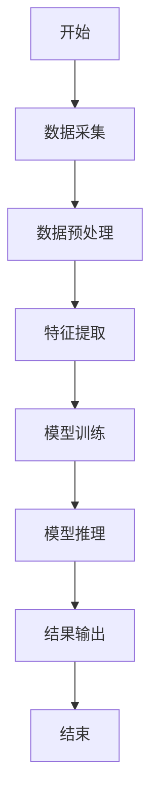
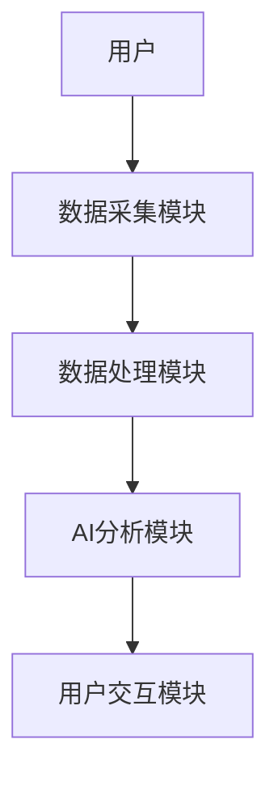
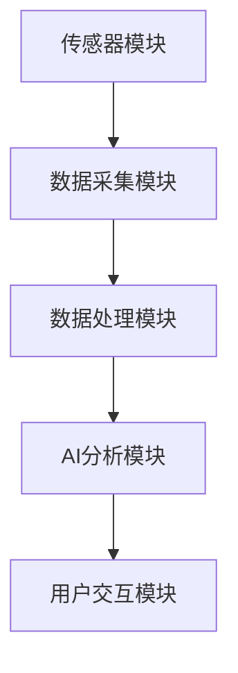
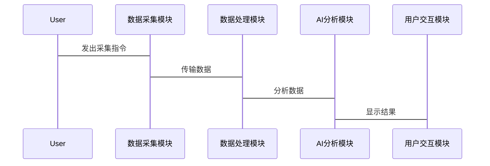

                 


# 智能婴儿监护器：AI Agent的早期发展追踪

> 关键词：智能婴儿监护器，AI Agent，机器学习，深度学习，自然语言处理，婴儿监测系统，智能设备

> 摘要：本文将探讨智能婴儿监护器中AI Agent的核心作用，从算法原理到系统架构，再到实际应用，全面解析这一领域的最新进展。通过深入分析AI Agent在婴儿监护中的应用，本文旨在为读者提供一个系统化的视角，理解这一技术如何改变婴儿护理的方式，并展望其未来的发展方向。

---

# 目录大纲

## 第一部分: 智能婴儿监护器与AI Agent的背景介绍

### 第1章: 智能婴儿监护器的背景与问题背景

#### 1.1 问题背景与问题描述
- 1.1.1 婴儿监护的传统方式与局限性
  - 传统监护设备的功能限制
  - 人工监护的效率低下与误判风险
- 1.1.2 智能化婴儿监护的需求与痛点
  - 现代家庭对智能化监护的需求
  - 婴儿健康监测的关键指标与实时性要求
- 1.1.3 AI Agent在婴儿监护中的应用潜力
  - AI Agent如何提升监护效率与准确性

#### 1.2 智能婴儿监护器的核心概念
- 1.2.1 智能婴儿监护器的定义
  - 系统定义与功能模块概述
- 1.2.2 AI Agent的核心功能与特点
  - 自主学习与决策能力
  - 实时响应与反馈机制
- 1.2.3 智能婴儿监护器的边界与外延
  - 系统的适用范围与限制条件

#### 1.3 智能婴儿监护器的概念结构与核心要素
- 1.3.1 系统架构的核心要素
  - 传感器模块、数据处理模块、AI分析模块
- 1.3.2 AI Agent与婴儿监护器的关系
  - 协作机制与信息流分析
- 1.3.3 系统功能与用户需求的对应关系
  - 功能模块与用户需求的映射

#### 1.4 本章小结
  - 总结本章的主要内容与关键点

### 第2章: AI Agent的核心概念与联系

#### 2.1 AI Agent的基本原理
- 2.1.1 AI Agent的定义与分类
  - 基于规则的AI Agent与基于学习的AI Agent
- 2.1.2 AI Agent的核心算法与技术
  - 机器学习、深度学习、自然语言处理
- 2.1.3 AI Agent在婴儿监护中的具体应用
  - 婴儿哭声识别、行为分析、环境监测

#### 2.2 核心概念的属性特征对比
- 2.2.1 智能婴儿监护器与传统监护设备的对比
  - 功能、性能、用户体验等方面的对比
- 2.2.2 AI Agent与其他类型智能设备的对比
  - 数据处理能力、自主决策能力的差异
- 2.2.3 智能婴儿监护器的功能与性能对比
  - 硬件性能与软件算法的协同优化

#### 2.3 ER实体关系图架构
```mermaid
er
    actor: User
    agent: AI Agent
    device: 监护设备
    data: 监护数据
    action: 系统操作
    relation: 关联关系
    User --> AI Agent: 发出指令
    AI Agent --> device: 控制设备
    device --> data: 采集数据
    data --> AI Agent: 分析数据
    AI Agent --> action: 执行操作
```

#### 2.4 本章小结
  - 总结本章的主要内容与关键点

---

## 第二部分: AI Agent的算法原理讲解

### 第3章: AI Agent的算法原理概述

#### 3.1 基于机器学习的婴儿行为分析
- 3.1.1 算法选择与数据准备
  - 使用卷积神经网络（CNN）进行图像识别
- 3.1.2 算法实现与优化
  - 模型训练与调参技巧

#### 3.2 基于深度学习的婴儿声音识别
- 3.2.1 声音数据的特征提取
  - 使用Mel频率倒谱系数（MFCC）提取声音特征
- 3.2.2 声音分类模型的设计与实现
  - 基于循环神经网络（RNN）的声音分类

#### 3.3 基于自然语言处理的婴儿互动
- 3.3.1 婴儿哭声的情感分析
  - 使用支持向量机（SVM）进行哭声分类
- 3.3.2 婴儿语言发展的初步研究
  - 自然语言处理在婴儿语言识别中的应用

#### 3.4 算法流程图


#### 3.5 本章小结
  - 总结本章的主要内容与关键点

### 第4章: AI Agent算法的数学模型与公式

#### 4.1 机器学习模型的数学基础
- 4.1.1 线性回归模型
  - $$ y = \beta_0 + \beta_1 x + \epsilon $$
- 4.1.2 支持向量机模型
  - $$ \text{max} \left( \frac{1}{2} \| \beta \|^2 \right) $$
  - $$ \text{subject to} \quad y_i (\beta_0 + \beta^T x_i) \geq 1 $$

#### 4.2 深度学习模型的数学表达
- 4.2.1 卷积神经网络（CNN）
  - $$ f(x) = \text{ReLU}(W x + b) $$
- 4.2.2 循环神经网络（RNN）
  - $$ s_t = \text{tanh}(W_{hh} s_{t-1} + W_{xh} x_t) $$
  - $$ y_t = W_{hy} s_t + b_y $$

#### 4.3 自然语言处理模型的数学实现
- 4.3.1 词嵌入模型（如Word2Vec）
  - $$ \text{skip-gram: } P(w_i | w_j) = \text{softmax}(W w_j + b) $$
- 4.3.2 Transformer模型
  - $$ \text{Positional Encoding: } PE_{i,j} = \sin(j/\sqrt{10000^{i/d_{model}}}) $$

#### 4.4 本章小结
  - 总结本章的主要内容与关键点

---

## 第三部分: 系统分析与架构设计

### 第5章: 智能婴儿监护器的系统分析

#### 5.1 问题场景介绍
- 婴儿监护的典型场景与挑战
  - 睡眠监测、哭声识别、环境安全监控

#### 5.2 系统功能设计
- 5.2.1 系统模块划分
  - 数据采集模块、数据处理模块、AI分析模块、用户交互模块
- 5.2.2 功能模块的描述
  - 数据采集：传感器数据的实时采集与传输
  - 数据处理：数据预处理与特征提取
  - AI分析：基于机器学习的智能分析与决策
  - 用户交互：可视化界面与反馈机制

#### 5.3 系统架构设计
- 5.3.1 系统架构图


#### 5.4 系统接口设计
- 传感器接口：I2C、SPI、UART
- 数据传输接口：Wi-Fi、蓝牙、以太网
- 用户交互接口：触摸屏、语音提示

#### 5.5 本章小结
  - 总结本章的主要内容与关键点

### 第6章: 系统架构设计与实现

#### 6.1 系统架构设计
- 6.1.1 系统架构图


#### 6.2 系统功能设计
- 6.2.1 硬件设计
  - 传感器选型与电路设计
- 6.2.2 软件设计
  - 数据处理算法与AI模型的集成
- 6.2.3 安全性设计
  - 数据加密与用户隐私保护

#### 6.3 系统交互设计
- 6.3.1 系统交互流程图


#### 6.4 本章小结
  - 总结本章的主要内容与关键点

---

## 第四部分: 项目实战与优化

### 第7章: 项目实战与优化

#### 7.1 环境安装与配置
- 开发环境搭建
  - Python、TensorFlow、Keras、PyTorch的安装与配置

#### 7.2 系统核心实现源代码
- 7.2.1 数据采集模块
  - 传感器数据的读取与存储
- 7.2.2 数据处理模块
  - 数据预处理与特征提取的代码实现
- 7.2.3 AI分析模块
  - 机器学习模型的训练与推理代码

#### 7.3 代码应用解读与分析
- 代码功能分析
  - 传感器数据的处理流程
  - AI模型的训练与部署
- 代码优化建议
  - 并行计算优化、内存优化

#### 7.4 实际案例分析
- 案例背景介绍
  - 某婴儿监护系统的设计与实现
- 案例分析与结果展示
  - 数据分析结果与系统性能评估

#### 7.5 项目小结
  - 总结本章的主要内容与关键点

---

## 第五部分: 总结与展望

### 第8章: 总结与展望

#### 8.1 总结
- AI Agent在智能婴儿监护器中的核心作用
  - 技术优势与实际应用价值
- 本项目的主要成果与经验总结
  - 系统设计与实现的关键点

#### 8.2 展望
- 未来发展方向
  - 更高精度的婴儿行为分析
  - 更智能的AI Agent设计
  - 更广泛的婴儿监测应用场景

#### 8.3 注意事项与最佳实践
- 系统设计中的注意事项
  - 数据隐私保护的重要性
  - 系统稳定性的保障措施
- 最佳实践建议
  - 传感器选型的注意事项
  - AI模型优化的实用技巧

#### 8.4 拓展阅读
- 相关领域研究的推荐文献
  - 婴儿监测系统研究进展
  - AI Agent在医疗健康领域的应用

---

## 作者：AI天才研究院/AI Genius Institute & 禅与计算机程序设计艺术 /Zen And The Art of Computer Programming

---

这篇文章以清晰的逻辑结构，从背景介绍到算法原理，再到系统设计与实现，全面解析了智能婴儿监护器中AI Agent的核心作用。文章内容丰富，结合理论与实践，为读者提供了系统化的视角，帮助他们理解这一技术如何改变婴儿护理的方式，并展望其未来的发展方向。

