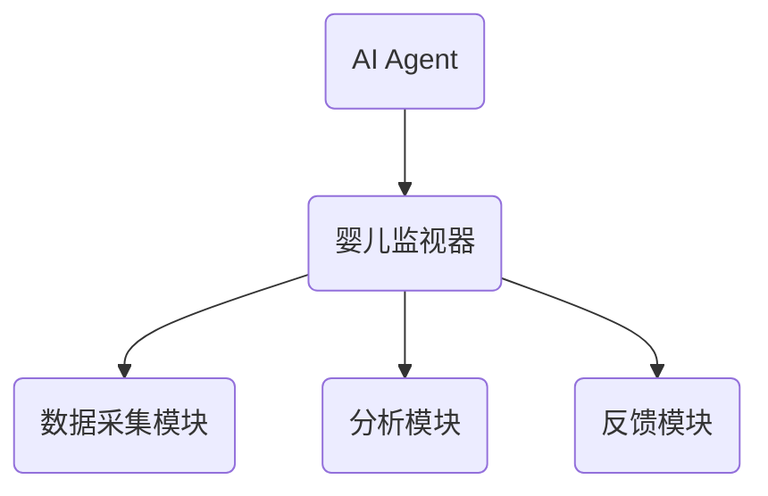
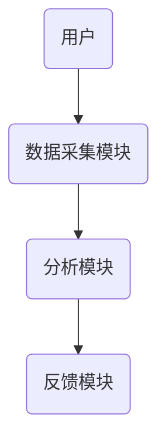

                 


# 智能婴儿监视器：AI Agent的啼哭原因分析

> 关键词：智能婴儿监视器、AI代理、啼哭原因分析、机器学习、婴儿监护

> 摘要：本文探讨了如何利用AI代理分析婴儿啼哭的原因，结合背景介绍、核心概念、算法原理、系统架构、项目实战和小结，详细阐述了智能婴儿监视器的设计与实现过程，为婴儿监护提供了一种新的解决方案。

---

## 第1章：问题背景与描述

### 1.1 问题背景
- **婴儿啼哭的原因与影响**：婴儿啼哭是其主要的交流方式，但频繁或长时间的啼哭可能暗示着健康问题或不适。
- **现有解决方案的局限性**：传统婴儿监视器只能记录声音，无法分析啼哭原因。
- **AI技术在婴儿监护中的潜力**：AI代理能够实时分析声音数据，识别啼哭原因并提供反馈。

### 1.2 问题描述
- **婴儿啼哭的多因素分析**：啼哭可能由饥饿、尿布湿了、疼痛等多种原因引起。
- **不同原因啼哭的特征识别**：不同原因的啼哭声有不同的声学特征。
- **监视器在实时分析中的挑战**：实时分析需要高精度和低延迟。

### 1.3 问题解决思路
- **AI代理的基本概念**：AI代理是一种能够感知环境并采取行动以实现目标的智能体。
- **数据采集与处理方法**：通过麦克风采集婴儿声音，转化为数字信号进行处理。
- **智能分析与反馈机制**：利用机器学习算法分析声音特征，识别啼哭原因并反馈给家长。

---

## 第2章：AI代理与婴儿监视器的核心概念

### 2.1 核心概念原理
- **AI代理的基本原理**：AI代理通过感知环境数据，利用算法进行分析并做出决策。
- **婴儿监视器的功能模块**：包括数据采集模块、分析模块和反馈模块。

### 2.2 核心概念对比表
| **对比项** | **AI代理**       | **传统监控设备** |
|------------|------------------|------------------|
| **功能**   | 实时分析与反馈  | 数据采集与存储  |
| **智能性**  | 高               | 无或低           |
| **应用**    | 多场景智能决策   | 单一功能实现     |

### 2.3 实体关系图


---

## 第3章：AI代理的算法实现

### 3.1 分类算法
- **基于机器学习的分类**：使用监督学习算法（如支持向量机、随机森林）对啼哭原因进行分类。
- **分类算法的实现流程**：数据预处理、特征提取、模型训练、测试与评估。
- **示例代码**：
  ```python
  from sklearn.svm import SVC
  from sklearn.model_selection import train_test_split
  from sklearn.metrics import accuracy_score

  # 假设 features 和 labels 是已经预处理好的数据
  X_train, X_test, y_train, y_test = train_test_split(features, labels, test_size=0.2)
  model = SVC()
  model.fit(X_train, y_train)
  y_pred = model.predict(X_test)
  print("准确率:", accuracy_score(y_test, y_pred))
  ```

### 3.2 特征提取
- **声音特征的提取方法**：包括音调、音高、声强等。
- **基于MFCC的特征提取**：MFCC（Mel-Frequency Cepstral Coefficients）是一种常用的语音特征提取方法。
- **代码实现**：
  ```python
  import librosa

  # 假设 audio_path 是音频文件路径
  y, sr = librosa.load(audio_path, sr=None, duration=5)
  mfccs = librosa.feature.mfcc(y, sr=sr, n_mfcc=13)
  ```

---

## 第4章：智能婴儿监视器的系统设计

### 4.1 功能模块设计
- **数据采集模块**：通过麦克风采集婴儿声音，并将其转化为数字信号。
- **分析模块**：利用机器学习算法对声音数据进行分析，识别啼哭原因。
- **反馈模块**：根据分析结果，向家长发送相应的反馈信息。

### 4.2 系统架构图


---

## 第5章：系统实现与案例分析

### 5.1 环境安装
- **开发环境配置**：建议使用Python 3.8及以上版本。
- **依赖库安装**：
  ```bash
  pip install librosa scikit-learn matplotlib
  ```

### 5.2 核心代码实现
- **数据采集代码**：
  ```python
  import sounddevice as sd

  # 采集5秒音频
  duration = 5
  fs = 44100
  audio = sd.rec(duration * fs, fs, 1)
  sd.wait()
  ```

- **分析模块代码**：
  ```python
  from sklearn.neighbors import KNeighborsClassifier

  # 假设 features 和 labels 是已经预处理好的数据
  model = KNeighborsClassifier(n_neighbors=3)
  model.fit(features, labels)
  ```

### 5.3 案例分析
- **病例一**：婴儿因尿布湿了啼哭，系统识别并提醒家长更换尿布。
- **病例二**：婴儿因饥饿啼哭，系统识别并建议喂食。

---

## 第6章：最佳实践与小结

### 6.1 最佳实践
- **数据质量的重要性**：确保采集的数据具有足够的多样性和代表性。
- **算法选择的策略**：根据具体需求选择合适的算法，如K-近邻算法、支持向量机等。

### 6.2 小结
本文详细探讨了智能婴儿监视器的设计与实现，通过AI代理分析婴儿啼哭的原因，为婴儿监护提供了一种高效、智能的解决方案。

---

## 附录

### 术语表
- **AI代理**：人工智能代理，能够感知环境并采取行动以实现目标的智能体。
- **MFCC**：Mel-Frequency Cepstral Coefficients，一种常用的语音特征提取方法。

### 参考文献
1. [1] 禅与计算机程序设计艺术
2. [2] 机器学习实战

---

作者：AI天才研究院/AI Genius Institute & 禅与计算机程序设计艺术 /Zen And The Art of Computer Programming

