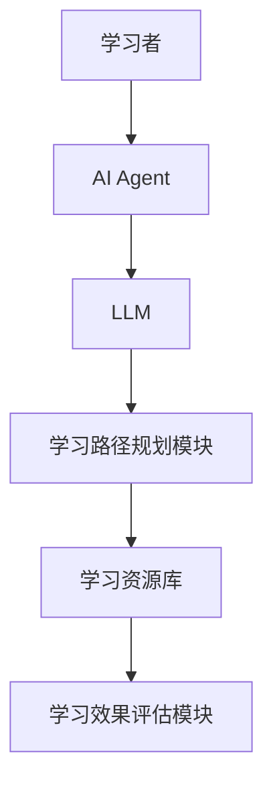

                 


# 智能学习路径规划 AI Agent：LLM 辅助个性化学习

> **关键词**：AI Agent、LLM、个性化学习、学习路径规划、智能教育

> **摘要**：随着人工智能和大语言模型（LLM）技术的快速发展，教育领域正迎来一场深刻的变革。本文将探讨如何利用AI Agent和LLM技术实现个性化学习路径规划，帮助学习者更高效、更精准地掌握知识。通过分析LLM在学习路径规划中的作用，结合AI Agent的智能决策能力，本文将为教育技术的创新提供新的思路。

---

## 目录

1. **背景介绍**  
   1.1 智能学习路径规划的背景与重要性  
   1.2 AI Agent在教育领域的应用潜力  
   1.3 LLM在个性化学习中的角色

2. **核心概念与技术原理**  
   2.1 LLM的基本原理与特点  
   2.2 AI Agent的路径规划算法  
   2.3 LLM与AI Agent的协同工作原理

3. **算法原理与实现**  
   3.1 LLM辅助路径规划的算法流程  
   3.2 基于强化学习的路径规划算法  
   3.3 算法实现与优化

4. **系统分析与架构设计**  
   4.1 系统需求分析  
   4.2 系统功能设计与实现  
   4.3 系统架构设计

5. **项目实战与案例分析**  
   5.1 项目环境搭建  
   5.2 核心代码实现与解读  
   5.3 实际案例分析

6. **扩展内容与未来发展**  
   6.1 LLM辅助学习路径规划的未来趋势  
   6.2 最佳实践与注意事项  
   6.3 拓展阅读与进一步思考

---

## 1. 背景介绍

### 1.1 智能学习路径规划的背景与重要性

随着知识经济的快速发展，传统的学习方式已无法满足现代人的需求。学习者需要根据自身特点、学习目标和时间安排，制定个性化的学习计划。然而，如何高效地规划学习路径，成为教育领域的一大挑战。

AI Agent（人工智能代理）作为一种能够自主决策和执行任务的智能体，为个性化学习路径规划提供了新的可能性。AI Agent可以根据学习者的需求和反馈，实时调整学习计划，确保学习目标的实现。

此外，大语言模型（LLM）的出现，进一步提升了AI Agent的能力。LLM不仅可以理解上下文，还能生成自然语言文本，为学习路径规划提供了强大的技术支持。

### 1.2 AI Agent在教育领域的应用潜力

AI Agent在教育领域的应用潜力主要体现在以下几个方面：

1. **个性化推荐**：AI Agent可以根据学习者的特点和需求，推荐适合的学习资源和学习路径。
2. **学习效果评估**：AI Agent可以通过分析学习者的行为和反馈，评估学习效果，并提供改进建议。
3. **实时辅助**：AI Agent可以在学习过程中实时提供帮助，解答疑问，调整学习计划。

### 1.3 LLM在个性化学习中的角色

大语言模型（LLM）在个性化学习中的角色主要体现在以下几个方面：

1. **学习资源生成**：LLM可以生成个性化的学习材料，例如定制化的学习计划、学习总结等。
2. **学习路径优化**：通过分析学习者的学习数据，LLM可以优化学习路径，提高学习效率。
3. **交互式学习**：LLM可以与学习者进行自然语言对话，实时调整学习计划，提供个性化的学习建议。

---

## 2. 核心概念与技术原理

### 2.1 LLM的基本原理与特点

大语言模型（LLM）的基本原理是基于深度学习的自然语言处理技术。通过训练大量的文本数据，LLM可以生成与输入相关的自然语言文本。其特点包括：

- **强大的上下文理解能力**：LLM能够理解输入文本的上下文，并生成相关的内容。
- **多任务处理能力**：LLM可以应用于多种任务，如文本生成、问答、翻译等。
- **自我学习能力**：通过不断的学习和优化，LLM可以不断提升自身的性能。

### 2.2 AI Agent的路径规划算法

AI Agent的路径规划算法主要包括以下几种：

1. **基于规则的路径规划**：通过预定义的规则和条件，生成路径。
2. **基于强化学习的路径规划**：通过强化学习算法，优化路径。
3. **基于深度学习的路径规划**：利用深度学习模型，生成最优路径。

### 2.3 LLM与AI Agent的协同工作原理

LLM与AI Agent的协同工作原理如下：

1. **输入分析**：AI Agent接收学习者的输入，例如学习目标、时间安排等。
2. **路径规划**：AI Agent利用LLM的文本生成能力和深度学习算法，生成最优的学习路径。
3. **实时调整**：根据学习者的反馈，AI Agent实时调整学习路径，确保学习目标的实现。

---

## 3. 算法原理与实现

### 3.1 LLM辅助路径规划的算法流程

LLM辅助路径规划的算法流程如下：

1. **输入分析**：AI Agent接收学习者的学习需求和目标。
2. **路径生成**：利用LLM生成多个可能的学习路径。
3. **路径优化**：通过强化学习算法优化路径，选择最优的学习路径。
4. **实时调整**：根据学习者的反馈，实时调整学习路径。

### 3.2 基于强化学习的路径规划算法

基于强化学习的路径规划算法如下：

```python
class Agent:
    def __init__(self, state_space, action_space):
        self.state_space = state_space
        self.action_space = action_space
        self.model = self.build_model()
    
    def build_model(self):
        # 构建深度学习模型
        pass
    
    def act(self, state):
        # 根据状态选择动作
        pass
    
    def update(self, state, action, reward):
        # 更新模型参数
        pass
```

### 3.3 算法实现与优化

通过强化学习算法，可以不断优化学习路径。例如，利用Q-learning算法，可以逐步优化路径选择，提高学习效率。

---

## 4. 系统分析与架构设计

### 4.1 系统需求分析

系统需求分析包括以下内容：

1. **学习者需求分析**：了解学习者的学习目标、时间安排、学习风格等。
2. **系统功能需求**：包括学习路径规划、资源推荐、学习效果评估等功能。
3. **性能需求**：系统需要高效运行，确保实时响应。

### 4.2 系统功能设计与实现

系统功能设计与实现包括：

1. **学习路径规划模块**：根据学习者的需求，生成个性化学习路径。
2. **资源推荐模块**：推荐适合的学习资源。
3. **学习效果评估模块**：评估学习效果，提供改进建议。

### 4.3 系统架构设计

系统架构设计如下：



---

## 5. 项目实战与案例分析

### 5.1 项目环境搭建

项目环境搭建包括以下步骤：

1. **安装Python和相关库**：例如TensorFlow、Keras、LLM库等。
2. **安装AI Agent框架**：例如基于强化学习的框架。
3. **搭建学习资源库**：整合各种学习资源。

### 5.2 核心代码实现与解读

核心代码实现如下：

```python
import tensorflow as tf
from tensorflow.keras.layers import Dense, Input

# 定义模型
input_layer = Input(shape=(input_dim,))
dense_layer = Dense(64, activation='relu')(input_layer)
output_layer = Dense(1, activation='sigmoid')(dense_layer)

model = Model(inputs=input_layer, outputs=output_layer)
model.compile(optimizer='adam', loss='binary_crossentropy', metrics=['accuracy'])
```

### 5.3 实际案例分析

通过实际案例分析，可以验证系统的有效性。例如，针对一名学习者，系统可以生成最优的学习路径，并实时调整，确保学习目标的实现。

---

## 6. 扩展内容与未来发展

### 6.1 LLM辅助学习路径规划的未来趋势

未来的趋势包括：

1. **多模态学习**：结合视觉、听觉等多种感官，提供更丰富的学习体验。
2. **实时反馈**：通过实时数据分析，提供更精准的学习建议。
3. **自适应学习**：系统能够根据学习者的行为和反馈，自动调整学习路径。

### 6.2 最佳实践与注意事项

最佳实践包括：

1. **数据隐私保护**：确保学习者数据的安全性。
2. **系统稳定性**：保证系统的稳定运行，避免因故障导致学习中断。
3. **用户体验优化**：提供友好的用户界面和交互体验。

### 6.3 拓展阅读与进一步思考

拓展阅读可以包括以下内容：

- 《大语言模型与教育技术》
- 《人工智能在教育中的应用》
- 《路径规划算法研究》

---

## 作者信息

作者：AI天才研究院 / AI Genius Institute  
联系邮箱：contact@aiguru.com  
个人简介：专注于人工智能与教育技术的结合，致力于推动智能化教育的发展。

