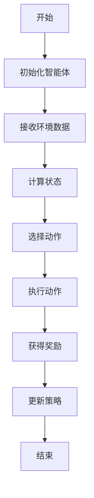
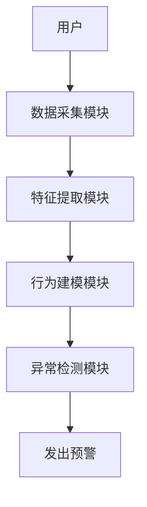

                 

# 智能安防：AI Agent的异常行为检测

> 关键词：AI Agent, 异常行为检测, 智能安防, 深度学习, 强化学习

> 摘要：本文深入探讨了智能安防领域中AI Agent的异常行为检测技术。从背景、原理、算法到系统架构设计，再到实际案例分析，系统性地介绍了如何利用AI Agent实现高效的异常行为检测，帮助读者全面理解该技术的核心与应用。

---

## 第一部分：智能安防与AI Agent概述

### 第1章：智能安防与AI Agent概述

#### 1.1 智能安防的背景与意义

##### 1.1.1 安防领域的传统挑战
传统的安防系统主要依赖于人工监控和简单的报警设备，存在效率低、误报率高、覆盖范围有限等问题。随着社会的发展，安防需求日益增长，尤其是在公共场所、交通、医疗等场景，对安全的要求越来越高。

##### 1.1.2 智能化安防的发展趋势
人工智能（AI）的快速发展为安防领域带来了新的机遇。通过引入AI技术，安防系统可以实现智能化、自动化和实时化，显著提高安全防护能力。

##### 1.1.3 AI Agent在智能安防中的作用
AI Agent（智能体）是一种能够感知环境、自主决策、执行任务的智能系统。在安防领域，AI Agent可以实时监控环境、识别异常行为、发出预警，并采取相应措施，极大地提升了安防系统的效率和准确性。

#### 1.2 异常行为检测的核心概念

##### 1.2.1 异常行为的定义与分类
异常行为是指与正常行为模式显著不同的行为，通常与潜在的安全威胁或风险相关。常见的异常行为包括暴力行为、非法入侵、未经授权的操作等。

##### 1.2.2 异常行为检测的场景与应用
异常行为检测广泛应用于多个领域，如公共场所安全、交通监控、医疗监护等。在智能安防中，异常行为检测主要用于识别潜在的安全威胁，如入侵检测、暴力行为预警等。

##### 1.2.3 AI Agent在异常行为检测中的优势
AI Agent具有以下优势：
1. **自主性**：能够自主感知环境并做出决策。
2. **学习能力**：通过机器学习技术不断优化检测算法。
3. **实时性**：能够实时分析数据，快速响应异常行为。

#### 1.3 AI Agent的基本原理

##### 1.3.1 AI Agent的定义与特点
AI Agent是一种智能体，能够感知环境、自主决策、执行任务并适应变化。其特点包括自主性、反应性、学习能力和协作性。

##### 1.3.2 AI Agent的感知与决策机制
AI Agent通过传感器、摄像头等设备感知环境，并利用机器学习算法分析数据，生成决策。决策过程包括异常检测、风险评估和行为预测。

##### 1.3.3 AI Agent在异常行为检测中的应用框架
异常行为检测的框架通常包括数据采集、特征提取、行为建模和异常检测四个步骤。

---

## 第二部分：异常行为检测的核心算法与数学模型

### 第2章：异常行为检测的算法原理

#### 2.1 基于强化学习的异常行为检测

##### 2.1.1 强化学习的基本概念
强化学习是一种机器学习方法，通过智能体与环境的交互，学习最优策略以最大化累积奖励。

##### 2.1.2 强化学习在异常行为检测中的应用
在异常行为检测中，强化学习可以用于行为建模和异常检测。例如，通过学习正常行为模式，智能体能够识别偏离正常模式的行为。

##### 2.1.3 算法流程图（使用Mermaid）

#### 2.2 基于深度学习的异常行为检测

##### 2.2.1 深度学习的基本原理
深度学习通过多层神经网络提取数据特征，能够处理复杂的数据模式。

##### 2.2.2 基于卷积神经网络的异常行为检测
卷积神经网络（CNN）常用于图像识别任务，可以用于视频中的异常行为检测。例如，通过训练CNN识别正常行为模式，智能体能够检测偏离模式的异常行为。

##### 2.2.3 基于循环神经网络的异常行为检测
循环神经网络（RNN）适用于时间序列数据的分析，能够捕捉行为的时间依赖性，适用于异常行为的实时检测。

#### 2.3 异常行为检测的数学模型

##### 2.3.1 基于概率的异常检测模型
概率模型通过计算数据的概率密度，识别低概率事件为异常行为。例如，使用高斯混合模型（GMM）进行异常检测。

##### 2.3.2 基于聚类的异常检测模型
聚类模型将数据分为正常簇和异常簇，异常行为通常属于孤立的簇。例如，使用K-Means算法进行聚类分析。

##### 2.3.3 基于时间序列的异常检测模型
时间序列模型通过分析数据的趋势和周期性，识别异常点。例如，使用ARIMA模型进行时间序列预测。

#### 2.4 算法实现与优化

##### 2.4.1 算法实现的步骤与流程
1. 数据预处理：归一化、降维。
2. 模型训练：选择合适的算法，训练模型。
3. 异常检测：利用训练好的模型识别异常行为。
4. 结果优化：调整参数，提高检测准确率。

##### 2.4.2 算法优化的策略与技巧
- 参数调优：通过网格搜索选择最优参数。
- 模型融合：结合多种算法提高检测效果。
- 实时优化：动态调整模型以适应环境变化。

#### 2.5 本章小结

---

## 第三部分：AI Agent的系统架构与实现

### 第3章：AI Agent的系统架构设计

#### 3.1 系统架构的整体设计

##### 3.1.1 系统功能模块划分
- 数据采集模块：负责采集环境数据。
- 特征提取模块：提取数据的特征。
- 行为建模模块：建立行为模型。
- 异常检测模块：识别异常行为。

##### 3.1.2 系统架构的层次结构
- 数据层：原始数据和特征数据。
- 计算层：算法实现和模型训练。
- 应用层：用户界面和结果展示。

##### 3.1.3 系统架构的优缺点分析
优点：模块化设计，便于维护和扩展；缺点：可能需要较高的计算资源。

#### 3.2 系统功能模块实现

##### 3.2.1 数据采集模块
数据采集模块通过摄像头、传感器等设备获取环境数据，并将数据传输到特征提取模块。

##### 3.2.2 特征提取模块
特征提取模块利用深度学习模型提取数据的特征，例如使用CNN提取图像特征。

##### 3.2.3 行为建模模块
行为建模模块通过训练好的模型建立正常行为的模式，用于后续的异常检测。

##### 3.2.4 异常检测模块
异常检测模块利用训练好的模型识别异常行为，并发出预警。

#### 3.3 系统接口设计

##### 3.3.1 系统内部接口
- 数据接口：模块之间的数据传输。
- 控制接口：模块之间的控制信号。

##### 3.3.2 系统外部接口
- 用户界面：与用户的交互接口。
- 外部系统接口：与其他系统的集成接口。

#### 3.4 系统交互流程设计

##### 3.4.1 系统交互的流程图（使用Mermaid）

##### 3.4.2 交互流程的优化建议
- 并行处理：多个模块同时处理数据。
- 异步通信：模块之间采用异步通信，提高效率。

#### 3.5 本章小结

---

## 第四部分：项目实战与案例分析

### 第4章：项目实战与案例分析

#### 4.1 项目背景与目标

##### 4.1.1 项目背景介绍
某大型商场需要部署智能安防系统，实时监控商场内的异常行为，预防安全事件的发生。

##### 4.1.2 项目目标设定
开发一个基于AI Agent的异常行为检测系统，能够在商场内实时检测暴力行为、非法入侵等异常行为，并发出预警。

##### 4.1.3 项目实施的可行性分析
商场内安装摄像头，数据采集方便；AI Agent技术成熟，能够满足实时检测的需求。

#### 4.2 项目环境的安装与配置

##### 4.2.1 开发环境的选择
- 操作系统：Linux
- 开发工具：Python、TensorFlow、OpenCV
- 数据库：MySQL

##### 4.2.2 开发工具的安装
安装Python、TensorFlow、OpenCV等工具，并配置环境变量。

##### 4.2.3 数据集的准备与预处理
收集商场内的视频数据，标注正常行为和异常行为，进行数据归一化和分割。

#### 4.3 系统核心代码实现

##### 4.3.1 数据采

---

作者：AI天才研究院/AI Genius Institute & 禅与计算机程序设计艺术 /Zen And The Art of Computer Programming

