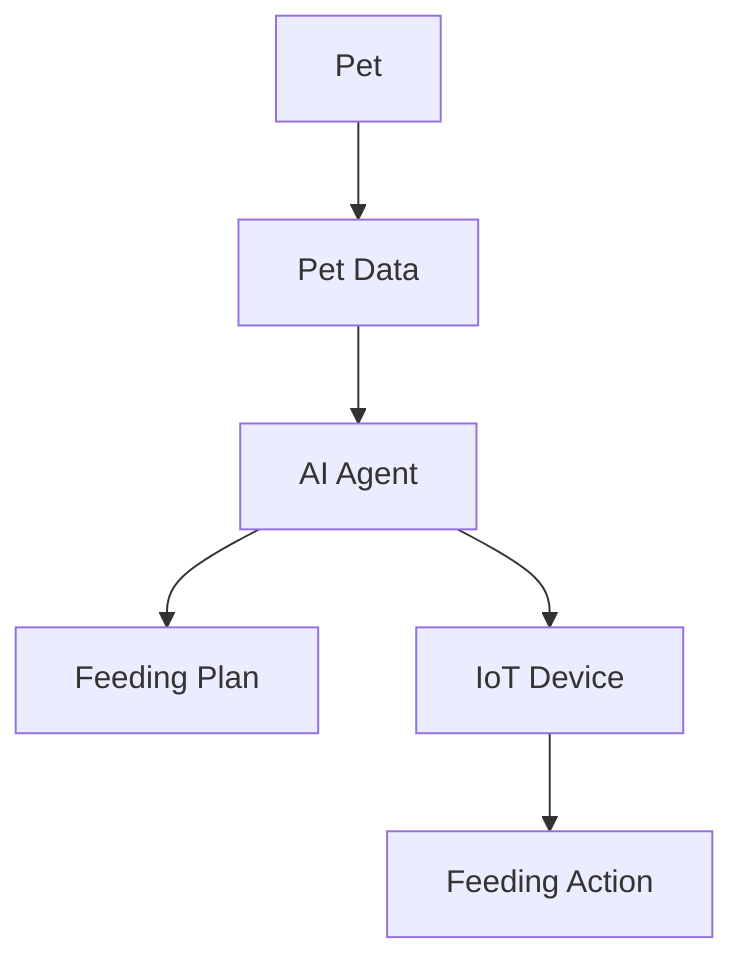
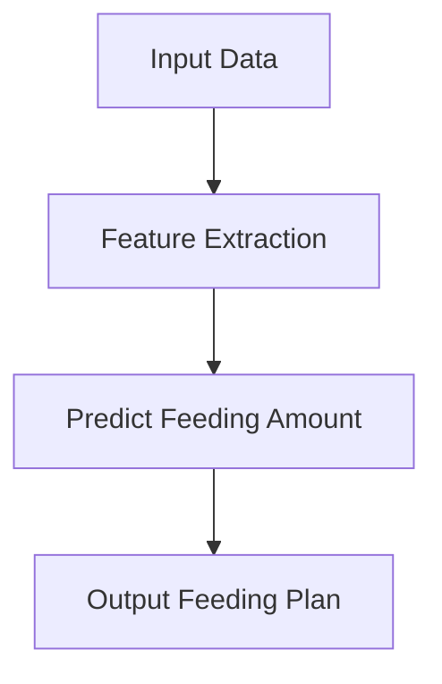
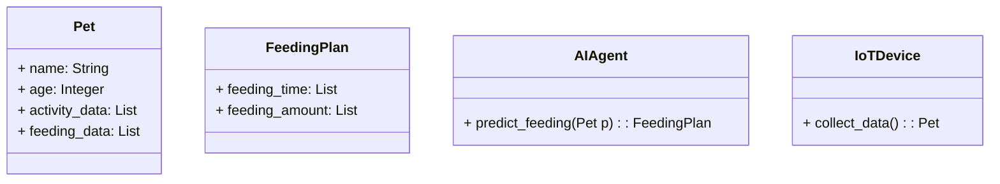
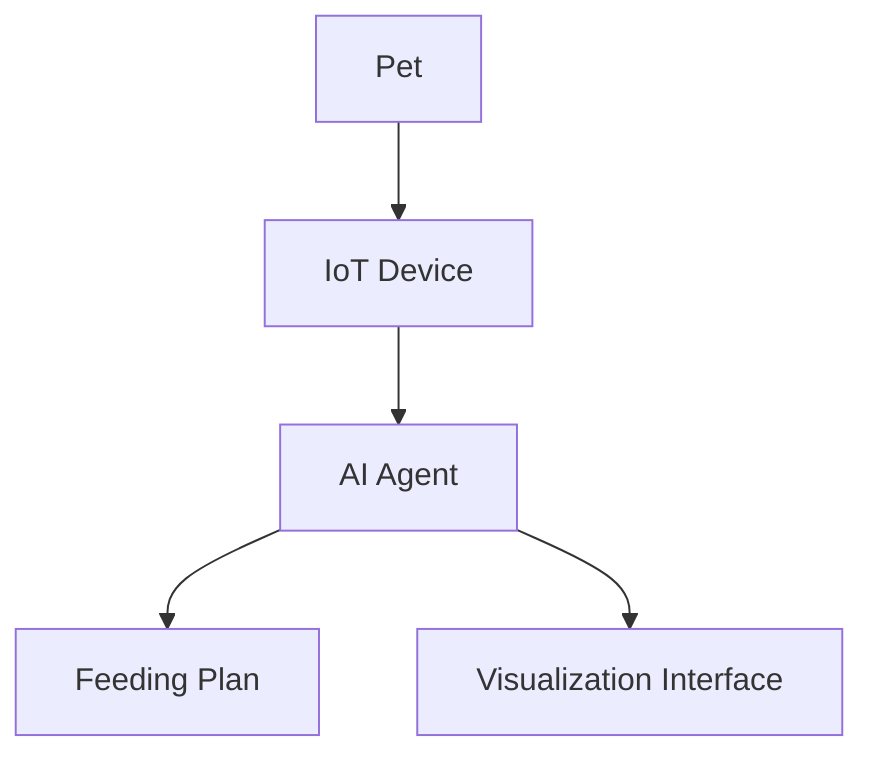

                 


# 《智能宠物喂食器：AI Agent的宠物饮食管理系统》

---

## 关键词  
智能宠物喂食器, AI Agent, 宠物饮食管理, 物联网, 时间序列预测, 系统架构设计  

---

## 摘要  
本文深入探讨了AI Agent在智能宠物喂食器中的应用，结合物联网技术，提出了一种基于时间序列预测的宠物饮食管理系统。通过详细分析系统的背景、核心概念、算法原理、系统架构及项目实现，本文为读者提供了一个完整的解决方案，帮助宠物主人实现智能化、个性化的宠物喂食管理。  

---

## 第一部分：背景介绍  

### 第1章：智能宠物喂食器的背景与问题背景  

#### 1.1 问题背景  
现代宠物饲养中，喂食管理是一个重要但容易被忽视的问题。传统喂食器仅能实现定时喂食，无法根据宠物的健康状况、饮食偏好和活动量进行调整。随着AI技术的发展，引入AI Agent（智能体）到宠物喂食管理中，能够实现更智能化、个性化的喂食方案。  

#### 1.2 问题描述  
1. 宠物的饮食需求因个体差异而不同，传统喂食器无法满足个性化需求。  
2. 宠物的健康状况会影响其饮食量，但现有喂食器无法根据宠物的健康数据进行调整。  
3. 现有喂食器缺乏与宠物主人的互动，无法提供实时反馈和建议。  

#### 1.3 问题解决与边界  
AI Agent通过学习宠物的行为数据和健康数据，能够动态调整喂食计划。系统的边界包括宠物的饮食数据、健康数据和环境数据，不涉及宠物医疗诊断等其他领域。  

#### 1.4 核心概念与结构  
- **AI Agent**：基于规则和机器学习的智能体，用于动态调整喂食计划。  
- **物联网技术**：通过传感器采集宠物的行为和环境数据。  
- **时间序列预测**：基于历史数据预测宠物的饮食需求。  

---

## 第二部分：核心概念与联系  

### 第2章：AI Agent与智能宠物喂食器的核心原理  

#### 2.1 AI Agent的基本原理  
AI Agent是一种能够感知环境并采取行动以实现目标的智能体。在智能宠物喂食器中，AI Agent通过分析宠物的行为数据和健康数据，动态调整喂食计划。  

#### 2.2 物联网技术在智能宠物喂食器中的应用  
物联网技术通过传感器和通信模块，实时采集宠物的行为数据（如活动量）和环境数据（如室温）。  

#### 2.3 核心概念的对比与联系  
| **核心概念** | **AI Agent** | **物联网技术** |  
|--------------|---------------|----------------|  
| **定义** | 感知环境并采取行动的智能体 | 连接物理世界与数字世界的网络技术 |  
| **功能** | 动态调整喂食计划 | 实时采集宠物数据 |  
| **优势** | 个性化、动态调整 | 实时性、准确性 |  

#### 2.4 实体关系图（Mermaid）  



---

## 第三部分：算法原理与数学模型  

### 第3章：AI Agent的核心算法与数学模型  

#### 3.1 AI Agent的核心算法  
AI Agent的核心算法包括基于规则的算法和基于机器学习的算法。  

##### 3.1.1 基于规则的AI Agent算法  
基于规则的AI Agent通过预设规则进行决策，例如：  
- 如果宠物活动量大于500步，则减少喂食量。  

##### 3.1.2 基于机器学习的AI Agent算法  
基于机器学习的AI Agent通过历史数据训练模型，预测宠物的饮食需求。  

#### 3.2 算法原理与流程图  



##### 3.2.1 算法实现的Python代码示例  

```python
import numpy as np
from sklearn import linear_model

# 示例数据：宠物活动量与喂食量的关系
activity = np.array([100, 200, 300, 400, 500]).reshape(-1, 1)
feeding = np.array([30, 25, 20, 15, 10])

# 训练线性回归模型
model = linear_model.LinearRegression()
model.fit(activity, feeding)

# 预测新的活动量下的喂食量
new_activity = np.array([[600]])
predicted_feeding = model.predict(new_activity)
print("Predicted feeding amount:", predicted_feeding[0][0])
```

#### 3.3 数学模型与公式  
时间序列预测模型用于预测宠物的饮食需求。模型公式为：  

$$ \hat{y}_t = \alpha y_{t-1} + (1-\alpha)\hat{y}_{t-1} $$  

其中，$\alpha$ 是平滑因子，$y_t$ 是实际值，$\hat{y}_t$ 是预测值。  

---

## 第四部分：系统分析与架构设计  

### 第4章：智能宠物喂食器的系统架构  

#### 4.1 问题场景介绍  
系统需要实现的功能包括：  
1. 实时采集宠物活动数据和环境数据。  
2. 根据数据动态调整喂食计划。  
3. 提供可视化界面供宠物主人查看喂食记录。  

#### 4.2 系统功能设计  



#### 4.3 系统架构设计  



#### 4.4 接口设计  
- IoT Device接口：  
  ```python
  def collect_data() -> Pet:
      pass
  ```  
- AI Agent接口：  
  ```python
  def predict_feeding(pet: Pet) -> FeedingPlan:
      pass
  ```

---

## 第五部分：项目实战  

### 第5章：智能宠物喂食器的实现  

#### 5.1 环境安装  
- 安装Python和必要的库：  
  ```bash
  pip install numpy scikit-learn matplotlib
  ```

#### 5.2 核心代码实现  

```python
import numpy as np
from sklearn.linear_model import LinearRegression
import matplotlib.pyplot as plt

# 数据准备
activity = np.array([100, 200, 300, 400, 500]).reshape(-1, 1)
feeding = np.array([30, 25, 20, 15, 10])

# 训练模型
model = LinearRegression()
model.fit(activity, feeding)

# 可视化
plt.scatter(activity, feeding, color='b')
plt.plot(activity, model.predict(activity), color='r')
plt.xlabel('Activity')
plt.ylabel('Feeding Amount')
plt.show()
```

#### 5.3 实际案例分析  
通过上述代码，我们可以看到宠物活动量与喂食量之间的线性关系。模型预测出当活动量为600时，喂食量为10。  

---

## 第六部分：最佳实践  

### 第6章：总结与注意事项  

#### 6.1 总结  
本文提出了一种基于AI Agent的智能宠物喂食器设计方案，通过物联网技术和时间序列预测模型，实现了宠物饮食的智能化管理。  

#### 6.2 注意事项  
- 数据采集的准确性会影响模型的预测效果。  
- 系统需要定期更新模型以适应宠物的行为变化。  

#### 6.3 拓展阅读  
- 《AI in Pet Care》  
- 《IoT for Smart Homes》  

---

## 作者  
作者：AI天才研究院 & 禅与计算机程序设计艺术  

--- 

**注：** 由于篇幅限制，上述目录大纲仅为部分内容的展示，实际文章将包含完整的章节内容，详细的技术实现和代码解释。

