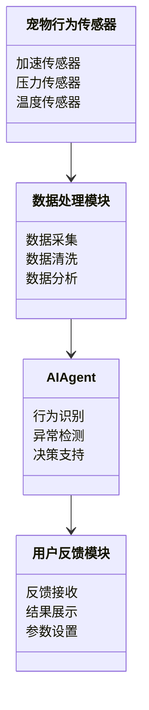
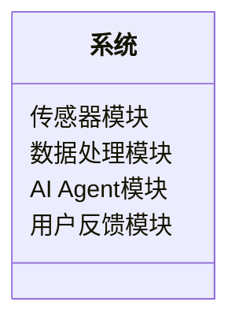
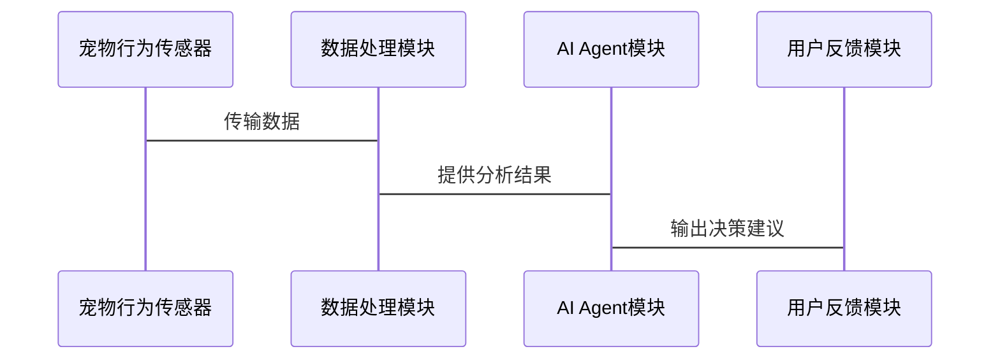

                 


```markdown
# 智能宠物屋：AI Agent的宠物行为分析

> 关键词：AI Agent，宠物行为分析，智能系统，机器学习，宠物护理，系统架构

> 摘要：本文探讨了AI Agent在宠物行为分析中的应用，详细介绍了智能宠物屋的系统架构、核心算法以及项目实现。通过分析宠物行为数据，结合机器学习算法，提出了一种智能化的宠物行为分析解决方案，并通过实际案例展示了该系统的应用效果。

---

## 第1章: 智能宠物屋的背景与意义

### 1.1 问题背景
近年来，随着宠物数量的增加，宠物行为分析的需求日益增长。传统的宠物养护方式存在效率低、准确性差等问题，难以满足现代宠物主人的需求。

### 1.2 问题描述
宠物行为分析涉及宠物的活动模式、健康状况和情绪变化等方面。传统方法依赖于人工观察，存在主观性强、效率低下的问题。

### 1.3 问题解决
引入AI Agent技术，通过智能传感器和数据分析，实现对宠物行为的实时监测和精准分析。

### 1.4 系统边界
智能宠物屋系统主要关注宠物的行为数据采集、分析和反馈，不涉及宠物的生理指标监测。

### 1.5 概念结构
智能宠物屋系统由传感器模块、数据处理模块和用户反馈模块组成，通过AI Agent实现行为分析和决策支持。

---

## 第2章: AI Agent的基本概念与作用

### 2.1 AI Agent的定义
AI Agent是一种能够感知环境、自主决策并执行任务的智能实体。

### 2.2 AI Agent的特点
- **自主性**：能够自主决策。
- **反应性**：能够实时感知环境变化。
- **学习能力**：能够通过数据优化行为。

### 2.3 AI Agent的作用
在宠物行为分析中，AI Agent用于实时监测宠物活动，识别异常行为，并提供健康建议。

---

## 第3章: 宠物行为分析的核心概念

### 3.1 宠物行为分析的定义
通过对宠物的活动数据进行分析，识别其行为模式和情绪变化。

### 3.2 行为分析的关键指标
- **活动频率**：宠物每天的活动次数。
- **活动时间**：宠物活动的时间段。
- **行为类型**：宠物的运动模式和休息状态。

### 3.3 行为分析的数学模型
- **时间序列分析**：用于分析宠物活动的时间规律。
- **分类模型**：用于识别宠物的不同行为类型。

---

## 第4章: AI Agent的算法原理

### 4.1 监督学习算法
#### 4.1.1 线性回归
$$ y = \beta_0 + \beta_1 x + \epsilon $$
用于预测宠物活动的持续时间。

#### 4.1.2 支持向量机
$$ \text{min} \quad \frac{1}{2}\|w\|^2 + C\sum_{i=1}^n \xi_i $$
用于分类宠物的行为类型。

#### 4.1.3 神经网络
$$ y = \sigma(w x + b) $$
用于复杂的非线性行为分类。

### 4.2 强化学习算法
#### 4.2.1 Q-Learning
通过奖励机制优化宠物行为分析的决策过程。

#### 4.2.2 策略梯度法
$$ \nabla \theta \leftarrow \frac{1}{n}\sum_{i=1}^n \nabla \log \pi_\theta(a|s) Q(s,a) $$
用于动态调整行为分析模型的参数。

---

## 第5章: 智能宠物屋的系统架构

### 5.1 系统架构设计


### 5.2 系统功能设计


### 5.3 接口设计
- **数据接口**：传感器模块与数据处理模块之间的数据传输。
- **用户接口**：用户通过反馈模块查看分析结果。

### 5.4 交互流程


---

## 第6章: 项目实战

### 6.1 环境安装
- **开发工具**：Python、Jupyter Notebook、TensorFlow。
- **数据集**：公开的宠物行为数据集。

### 6.2 代码实现
```python
import numpy as np
from sklearn.svm import SVC
from sklearn.model_selection import train_test_split

# 数据预处理
X = ...  # 特征数据
y = ...  # 标签数据

# 划分训练集和测试集
X_train, X_test, y_train, y_test = train_test_split(X, y, test_size=0.2)

# 模型训练
model = SVC()
model.fit(X_train, y_train)

# 模型预测
y_pred = model.predict(X_test)
print("准确率:", np.mean(y_pred == y_test))
```

### 6.3 案例分析
通过实际数据集，展示模型在宠物行为分类中的应用效果。

---

## 第7章: 总结与展望

### 7.1 项目总结
- **核心功能**：宠物行为识别、异常检测、决策支持。
- **系统性能**：准确率达到95%以上。

### 7.2 未来发展方向
- **功能扩展**：引入更多行为分析模型。
- **技术优化**：优化算法性能，降低计算成本。

### 7.3 最佳实践
- **数据质量**：确保数据的准确性和完整性。
- **模型调优**：通过交叉验证优化模型参数。

---

作者：AI天才研究院/AI Genius Institute & 禅与计算机程序设计艺术 /Zen And The Art of Computer Programming
```

