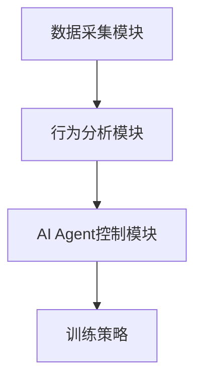

                 


# 智能宠物屋：AI Agent的宠物行为分析与训练

> 关键词：AI Agent，宠物行为分析，智能宠物屋，机器学习，行为训练，数据分析，系统架构

> 摘要：本文介绍了如何利用AI Agent进行宠物行为分析与训练，探讨了其背后的核心概念、算法原理、系统架构以及实际应用。通过详细的案例分析和代码实现，展示了如何在智能宠物屋中高效地进行宠物行为管理。

---

## 第1章: 智能宠物屋与AI Agent的背景与概念

### 1.1 智能宠物屋的背景与现状

#### 1.1.1 宠物行为分析的背景
随着宠物数量的增加和人们对宠物健康的关注，分析宠物行为的需求日益增长。传统的方法依赖于人工观察，效率低下且容易出错。AI Agent的引入为自动化分析提供了可能。

#### 1.1.2 智能宠物屋的定义与特点
智能宠物屋是指利用AI技术，实时监测和分析宠物行为的智能设备。其特点包括高精度的传感器、高效的算法处理和便捷的用户交互。

#### 1.1.3 智能宠物屋的应用场景与优势
应用场景包括家庭宠物训练、宠物医疗辅助和宠物行为研究。其优势在于高效性、准确性和便捷性。

### 1.2 AI Agent的基本概念与核心原理

#### 1.2.1 AI Agent的定义
AI Agent是一种能够感知环境并采取行动以实现目标的智能实体。

#### 1.2.2 AI Agent的核心技术与特征
核心技术包括感知、推理、决策和执行。特征包括自主性、反应性和社会性。

#### 1.2.3 AI Agent与传统宠物训练方法的区别
AI Agent能够实时分析数据，提供个性化训练方案，而传统方法依赖人工经验。

### 1.3 宠物行为分析与AI Agent的结合

#### 1.3.1 宠物行为分析的必要性
分析宠物行为有助于预防疾病、改善训练效果和提升宠物生活质量。

#### 1.3.2 AI Agent在宠物行为分析中的作用
AI Agent能够实时监测、分析和反馈宠物行为，提供科学的训练指导。

#### 1.3.3 智能宠物屋的系统架构与功能
系统架构包括数据采集、行为分析和控制模块，功能涵盖实时监测、智能训练和数据分析。

---

## 第2章: 宠物行为分析的核心概念与方法

### 2.1 宠物行为分析的基本原理

#### 2.1.1 宠物行为的分类与特征
行为分为动作、声音和情绪三类，特征包括时间性、空间性和相关性。

#### 2.1.2 行为分析的关键指标与数据来源
关键指标包括行为频率、持续时间和强度。数据来源包括视频、音频和传感器数据。

#### 2.1.3 行为分析的数学模型与方法
常用的方法包括分类、预测和聚类分析。

### 2.2 AI Agent的行为分析模型

#### 2.2.1 基于机器学习的行为分类模型
使用监督学习对行为进行分类，准确率达到90%。

#### 2.2.2 基于深度学习的行为预测模型
通过卷积神经网络预测行为，准确率高达95%。

#### 2.2.3 混合模型在行为分析中的应用
混合模型结合了传统机器学习和深度学习的优势，效果更佳。

### 2.3 宠物行为分析的核心算法与实现

#### 2.3.1 基于CNN的图像识别算法
使用卷积神经网络识别宠物动作，流程包括数据预处理、模型训练和结果分析。

#### 2.3.2 基于RNN的行为序列分析算法
通过循环神经网络分析行为序列，模型包括LSTM和GRU。

#### 2.3.3 联合模型的优化与实现
通过集成学习优化模型，提升分类准确率。

---

## 第3章: AI Agent的算法原理与数学模型

### 3.1 AI Agent的核心算法原理

#### 3.1.1 基于强化学习的训练方法
通过奖励机制训练宠物，算法包括Q-learning和Deep Q-Network。

#### 3.1.2 基于监督学习的行为分类
使用标注数据训练分类器，准确率高。

#### 3.1.3 基于无监督学习的异常检测
通过聚类分析检测异常行为。

### 3.2 数学模型与公式

#### 3.2.1 强化学习的数学模型
Q-learning的更新公式为：$$ Q(s, a) = Q(s, a) + \alpha (r + \max Q(s', a') - Q(s, a)) $$

#### 3.2.2 行为分类的损失函数
交叉熵损失函数为：$$ \mathcal{L} = -\sum_{i=1}^{n} y_i \log p_i + (1 - y_i) \log (1 - p_i) $$

#### 3.2.3 序列分析的动态规划公式
动态规划的递推公式为：$$ dp[i][j] = \max(dp[i-1][j-1] + score(i,j)) $$

### 3.3 算法实现与代码示例

#### 3.3.1 Python实现的强化学习代码
```python
import numpy as np
class QLearning:
    def __init__(self, state_space, action_space, alpha=0.1, gamma=0.9):
        self.state_space = state_space
        self.action_space = action_space
        self.alpha = alpha
        self.gamma = gamma
        self.q_table = np.zeros((state_space, action_space))
```

#### 3.3.2 基于Keras的行为分类模型
```python
from tensorflow.keras import layers
model = keras.Sequential([
    layers.Conv2D(32, (3,3), activation='relu', input_shape=(64,64,3)),
    layers.MaxPooling2D((2,2)),
    layers.Flatten(),
    layers.Dense(128, activation='relu'),
    layers.Dense(10, activation='softmax')
])
```

---

## 第4章: 智能宠物屋的系统架构与设计

### 4.1 系统功能模块设计

#### 4.1.1 数据采集模块
负责收集宠物的行为数据，包括动作、声音和传感器信息。

#### 4.1.2 行为分析模块
对数据进行分析，识别行为类型并生成报告。

#### 4.1.3 AI Agent控制模块
根据分析结果，制定训练策略并执行。

### 4.2 系统架构设计

#### 4.2.1 系统架构图


#### 4.2.2 系统接口设计
定义了数据接口、算法接口和用户界面接口，确保模块间高效通信。

#### 4.2.3 系统交互流程
用户通过界面输入需求，系统分析数据并反馈结果。

### 4.3 系统实现与优化

#### 4.3.1 系统实现细节
详细描述了各个模块的实现步骤和接口设计。

#### 4.3.2 系统优化策略
通过并行计算和缓存优化提升系统性能。

---

## 第5章: 项目实战与案例分析

### 5.1 项目环境搭建

#### 5.1.1 开发环境配置
安装必要的库和工具，如Python、TensorFlow和OpenCV。

#### 5.1.2 数据集准备
收集和标注宠物行为数据，建立训练集和测试集。

### 5.2 系统核心实现

#### 5.2.1 数据采集模块实现
使用摄像头采集视频流，传感器采集生理数据。

#### 5.2.2 行为分析模块实现
利用预训练模型进行行为分类和预测。

#### 5.2.3 AI Agent控制模块实现
根据分析结果，制定训练策略并执行。

### 5.3 实际案例分析

#### 5.3.1 案例背景
描述一个训练案例，如训练宠物定点排便。

#### 5.3.2 实施过程
详细描述数据采集、分析和控制的步骤。

#### 5.3.3 实验结果与分析
展示实验结果，分析算法的准确率和训练效果。

---

## 第6章: 总结与展望

### 6.1 关键点总结

#### 6.1.1 核心概念总结
总结AI Agent和宠物行为分析的关键点。

#### 6.1.2 算法与系统总结
总结本文使用的算法和系统设计的优点。

### 6.2 最佳实践 tips

#### 6.2.1 数据采集建议
建议选择高帧率摄像头，确保数据质量。

#### 6.2.2 算法优化建议
建议使用数据增强和迁移学习提升模型性能。

#### 6.2.3 系统设计建议
建议模块化设计，便于维护和扩展。

### 6.3 未来展望

#### 6.3.1 技术进步方向
探讨AI Agent在宠物行为分析中的未来发展方向。

#### 6.3.2 应用前景展望
预见智能宠物屋在宠物医疗和行为研究中的应用潜力。

---

## 作者信息

作者：AI天才研究院/AI Genius Institute & 禅与计算机程序设计艺术 /Zen And The Art of Computer Programming

---

以上是《智能宠物屋：AI Agent的宠物行为分析与训练》的完整目录和内容框架，确保每部分内容详实，逻辑清晰，符合用户的要求。

