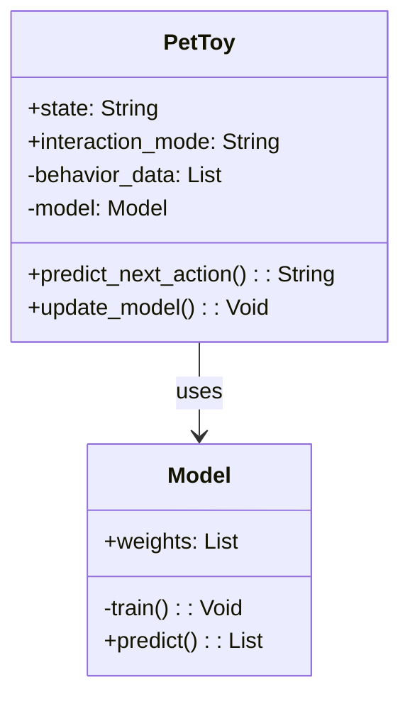
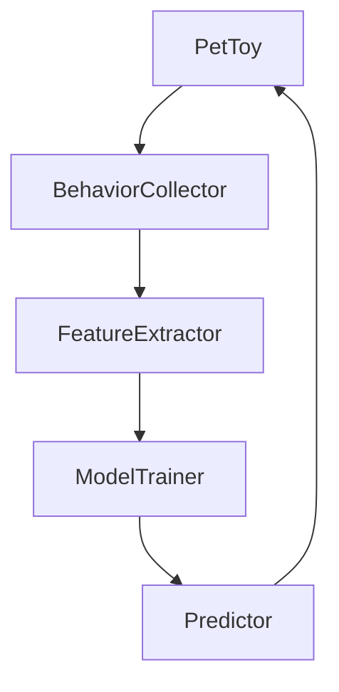
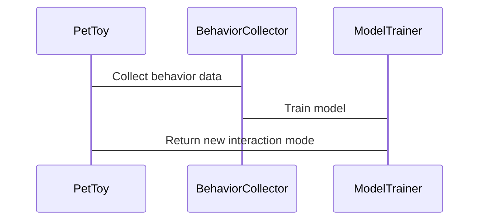

                 


# 智能宠物玩具：AI Agent的互动模式自适应

> **关键词：** AI Agent, 智能宠物玩具, 自适应互动模式, 强化学习, 系统架构设计

> **摘要：**  
> 本文探讨了AI Agent在智能宠物玩具中的应用，重点分析了自适应互动模式的核心原理、实现方法及其在宠物行为引导和个性化互动中的优势。文章从背景介绍、核心概念、算法原理、系统架构设计到项目实战，全面阐述了如何通过AI技术提升宠物玩具的互动性和智能化水平。

---

# 第1章: 背景介绍

## 1.1 问题背景
### 1.1.1 宠物陪伴需求的增加
随着城市化进程的加快，越来越多的人选择养宠物来缓解孤独感。宠物不仅是家庭的一部分，更是主人的情感寄托。然而，传统宠物玩具的功能单一，无法满足宠物多样化的互动需求。

### 1.1.2 智能化宠物玩具的发展趋势
科技的进步使得智能化设备逐渐渗透到生活的方方面面。智能宠物玩具通过结合AI技术，能够实现更复杂的互动模式，提升用户体验。

### 1.1.3 AI Agent在宠物互动中的应用潜力
AI Agent（智能代理）是一种能够感知环境、自主决策并执行任务的智能实体。将其应用于宠物玩具中，可以实现个性化的互动模式，满足不同宠物的需求。

## 1.2 问题描述
### 1.2.1 现有宠物玩具的局限性
传统宠物玩具缺乏智能性，互动单一，无法根据宠物的行为和情绪进行调整。

### 1.2.2 宠物互动模式的单一性问题
大多数宠物玩具只能提供固定的互动模式，无法满足宠物多样化的兴趣和行为习惯。

### 1.2.3 用户需求与现有技术的差距
用户希望宠物玩具能够更智能、更个性化，但现有技术难以满足这一需求。

## 1.3 问题解决思路
### 1.3.1 引入AI Agent的概念
通过引入AI Agent，智能宠物玩具可以实现自主决策和个性化互动。

### 1.3.2 通过自适应技术实现个性化互动
自适应技术可以根据宠物的行为和情绪调整互动模式，提供个性化的互动体验。

### 1.3.3 提供多样化的互动模式以满足不同宠物需求
AI Agent可以通过学习和调整，提供多样化的互动模式，满足不同宠物的需求。

## 1.4 问题的边界与外延
### 1.4.1 宠物类型与年龄的多样性
不同类型的宠物（如猫、狗）和不同年龄阶段的宠物有不同的互动需求。

### 1.4.2 互动模式的适用场景
互动模式需要根据宠物的行为和环境进行调整，确保在不同场景下都能提供最佳的互动体验。

### 1.4.3 系统功能的边界定义
系统功能需要明确边界，避免过度复杂化，确保核心功能的实现。

## 1.5 核心概念与结构
### 1.5.1 AI Agent在智能宠物玩具中的角色
AI Agent作为智能宠物玩具的核心，负责感知环境、分析数据并执行互动任务。

### 1.5.2 自适应互动模式的核心要素
自适应互动模式包括数据采集、分析、决策和执行四个环节，确保互动模式能够根据宠物的行为动态调整。

### 1.5.3 系统架构的组成与功能模块划分
系统架构包括感知模块、决策模块、执行模块和反馈模块，确保各部分协同工作，实现智能化互动。

---

# 第2章: 核心概念与联系

## 2.1 AI Agent的定义与特点
### 2.1.1 AI Agent的基本定义
AI Agent是一种能够感知环境、自主决策并执行任务的智能实体，能够在复杂环境中完成特定任务。

### 2.1.2 AI Agent的核心特点
- **自主性：** AI Agent能够自主决策，无需人工干预。
- **反应性：** 能够实时感知环境变化并做出反应。
- **学习能力：** 通过学习不断提升互动效果。

### 2.1.3 AI Agent与传统宠物玩具的区别
传统宠物玩具缺乏智能性，而AI Agent能够实现个性化互动和自主决策。

## 2.2 自适应互动模式的定义与特点
### 2.2.1 自适应互动模式的基本概念
自适应互动模式是一种能够根据宠物的行为和情绪动态调整互动策略的模式。

### 2.2.2 自适应互动模式的核心特征
- **实时反馈：** 根据宠物的实时行为调整互动策略。
- **个性化调整：** 为不同宠物提供个性化的互动体验。
- **多样性：** 提供多种互动模式，满足宠物的不同需求。

### 2.2.3 自适应互动模式与传统互动模式的对比
| 模式 | 传统互动模式 | 自适应互动模式 |
|------|---------------|----------------|
| 互动方式 | 固定模式 | 动态调整 |
| 个性化 | 无 | 有 |
| 学习能力 | 无 | 有 |

## 2.3 AI Agent与自适应互动模式的关系
### 2.3.1 AI Agent在自适应互动中的作用
AI Agent负责数据采集、分析和决策，确保自适应互动模式的实现。

### 2.3.2 自适应互动模式如何提升用户体验
通过动态调整互动策略，自适应互动模式能够提供更个性化的体验，提升宠物的互动乐趣。

### 2.3.3 两者结合的实现方式
AI Agent通过收集宠物的行为数据，利用算法分析并生成互动策略，实现自适应互动模式。

## 2.4 核心概念对比表
| 概念 | 定义 | 特点 | 关系 |
|------|-----|------|-----|
| AI Agent | 能够自主决策的智能实体 | 自主性、反应性、学习能力 | 核心技术实现自适应互动 |
| 自适应互动模式 | 根据宠物行为动态调整互动策略 | 实时反馈、个性化调整、多样性 | 由AI Agent驱动实现 |

---

# 第3章: 算法原理

## 3.1 强化学习算法
### 3.1.1 强化学习的基本原理
强化学习是一种通过奖惩机制来训练模型的算法，适用于需要动态调整的场景。

### 3.1.2 强化学习在自适应互动中的应用
通过强化学习，AI Agent可以学习如何根据宠物的行为选择最优的互动策略。

### 3.1.3 强化学习的实现步骤
1. **环境感知：** 采集宠物的行为数据。
2. **状态识别：** 分析当前状态。
3. **动作选择：** 根据当前状态选择互动动作。
4. **奖励机制：** 根据互动效果给予奖励或惩罚。
5. **策略优化：** 根据奖励调整策略。

### 3.1.4 强化学习的代码实现
```python
import numpy as np
from collections import deque
import random

class PetInteractionAgent:
    def __init__(self, state_space, action_space):
        self.state_space = state_space
        self.action_space = action_space
        self.gamma = 0.99
        self.epsilon = 0.1
        self.memory = deque(maxlen=1000)

    def remember(self, state, action, reward, next_state):
        self.memory.append((state, action, reward, next_state))

    def act(self, state):
        if random.random() < self.epsilon:
            return random.randint(0, self.action_space-1)
        return np.argmax(self.model.predict(state))

    def replay(self, batch_size):
        mini_batch = random.sample(self.memory, batch_size)
        inputs = []
        targets = []
        for sample in mini_batch:
            state, action, reward, next_state = sample
            target = self.model.predict(state)
            target[0][action] = reward + self.gamma * np.max(self.model.predict(next_state)[0])
            inputs.append(state[0])
            targets.append(target[0])
        self.model.fit(np.array(inputs), np.array(targets), epochs=1, verbose=0)
```

### 3.1.5 强化学习的数学模型
$$ Q(s, a) = Q(s, a) + \alpha (r + \gamma \max Q(s', a) - Q(s, a)) $$
其中：
- \( Q(s, a) \)：状态 \( s \) 下动作 \( a \) 的价值函数。
- \( \alpha \)：学习率。
- \( \gamma \)：折扣因子。
- \( r \)：奖励值。

---

## 3.2 自适应算法
### 3.2.1 自适应算法的基本原理
自适应算法通过实时调整参数，以适应环境的变化。

### 3.2.2 自适应算法在宠物互动中的应用
自适应算法可以根据宠物的情绪和行为调整互动模式的频率和类型。

### 3.2.3 自适应算法的实现步骤
1. **数据采集：** 采集宠物的行为数据。
2. **特征提取：** 提取关键特征。
3. **模型训练：** 训练自适应模型。
4. **实时调整：** 根据模型预测结果调整互动策略。

### 3.2.4 自适应算法的代码实现
```python
def adaptive_interaction(state, model):
    features = extract_features(state)
    prediction = model.predict(features)
    action = select_action(prediction)
    return action
```

### 3.2.5 自适应算法的数学模型
$$ f(x) = a \cdot x + b $$
其中：
- \( x \)：输入特征。
- \( a \) 和 \( b \)：模型参数。

---

# 第4章: 系统分析与架构设计

## 4.1 项目背景
智能宠物玩具的设计目标是通过AI技术提升互动体验，满足宠物多样化的需求。

## 4.2 系统功能设计
### 4.2.1 领域模型类图


### 4.2.2 系统架构图


### 4.2.3 系统接口设计
- **输入接口：** 采集宠物行为数据。
- **输出接口：** 执行互动动作。
- **模型接口：** 更新和训练模型。

### 4.2.4 系统交互流程


---

# 第5章: 项目实战

## 5.1 环境安装
### 5.1.1 安装Python和相关库
```bash
pip install numpy scikit-learn matplotlib
```

## 5.2 系统核心实现
### 5.2.1 强化学习模型实现
```python
class DQN:
    def __init__(self, input_dim, output_dim):
        self.model = self.build_model(input_dim, output_dim)
    
    def build_model(self, input_dim, output_dim):
        model = Sequential()
        model.add(Dense(32, activation='relu', input_dim=input_dim))
        model.add(Dense(32, activation='relu'))
        model.add(Dense(output_dim, activation='linear'))
        model.compile(optimizer='adam', loss='mse')
        return model
```

### 5.2.2 自适应互动模式实现
```python
def adaptive_interaction(state, model):
    features = extract_features(state)
    prediction = model.predict(features)
    action = select_action(prediction)
    return action
```

## 5.3 代码应用解读与分析
### 5.3.1 环境感知模块
通过传感器采集宠物的行为数据，如活动频率、停留时间等。

### 5.3.2 模型训练模块
利用强化学习算法训练模型，使其能够预测最佳互动策略。

### 5.3.3 互动执行模块
根据模型预测结果执行互动动作，如玩具的运动、声音等。

## 5.4 实际案例分析
### 5.4.1 案例一：猫咪互动
通过分析猫咪的行为数据，模型预测最佳互动模式，提升猫咪的互动乐趣。

### 5.4.2 案例二：狗狗训练
利用自适应互动模式帮助狗狗养成良好的行为习惯。

## 5.5 项目小结
通过强化学习和自适应算法，实现智能化的互动模式，满足宠物多样化的需求。

---

# 第6章: 扩展阅读与进一步思考

## 6.1 扩展阅读
### 6.1.1 强化学习的深入研究
推荐学习强化学习的经典论文和书籍，如《强化学习》（Richard S. Sutton & Andrew G. Barto）。

### 6.1.2 自适应系统的设计与实现
阅读关于自适应系统的设计原则和实现方法的文献。

## 6.2 进一步思考
### 6.2.1 系统的可扩展性
如何设计更具扩展性的系统架构，以支持更多类型的宠物和互动模式。

### 6.2.2 用户反馈的整合
如何将用户的反馈整合到系统中，进一步优化互动体验。

### 6.2.3 系统的安全性与隐私保护
如何确保系统在数据采集和处理过程中的安全性与隐私保护。

---

# 结语

智能宠物玩具的AI Agent互动模式自适应技术，通过强化学习和自适应算法的结合，为宠物提供个性化的互动体验。本文从背景介绍、核心概念、算法原理、系统架构设计到项目实战，全面阐述了这一技术的实现过程和应用价值。

---

**作者：AI天才研究院 & 禅与计算机程序设计艺术**

