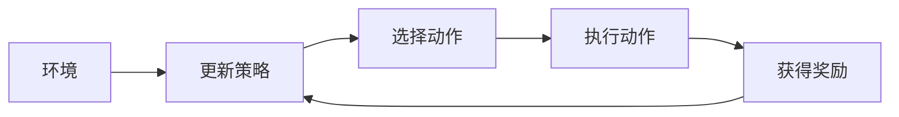
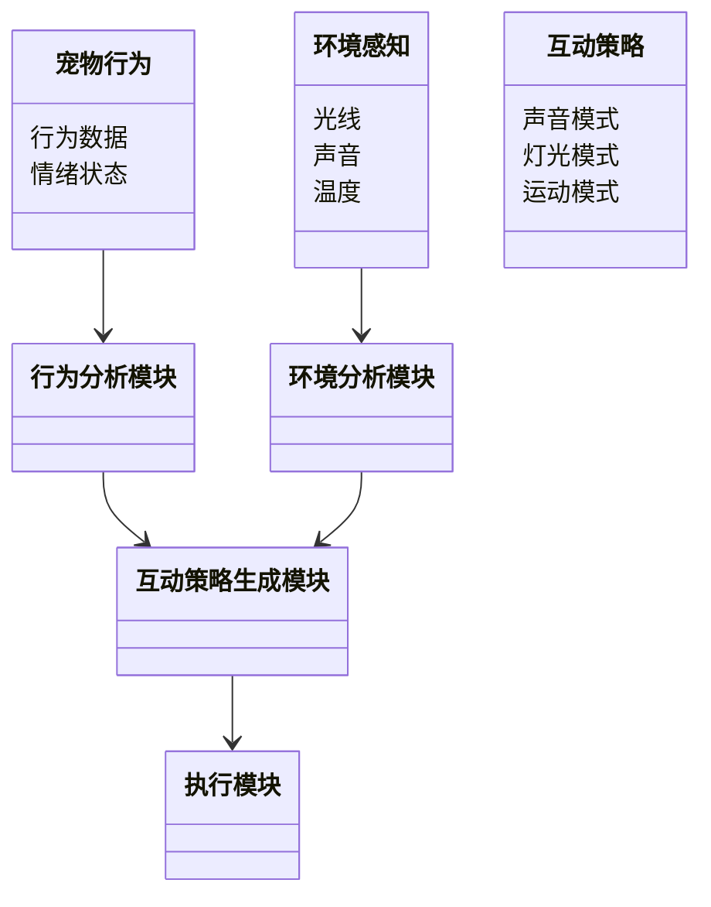
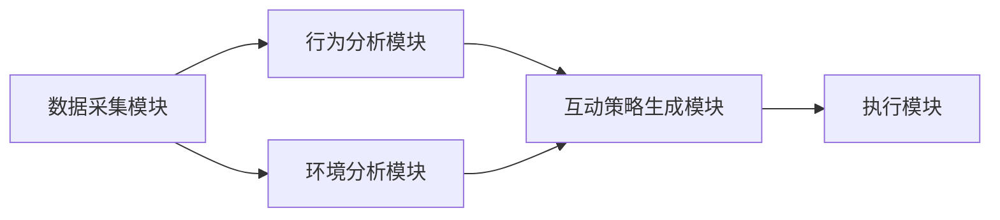
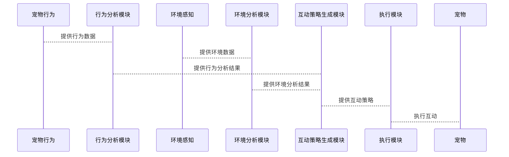

                 


# 智能宠物玩具：AI Agent的互动模式调整

> **关键词**：智能宠物玩具、AI Agent、互动模式、强化学习、行为识别、系统架构

> **摘要**：本文探讨了AI Agent在智能宠物玩具中的应用，分析了传统宠物玩具的局限性，介绍了AI Agent的核心概念与算法原理，提出了系统架构设计，并通过项目实战展示了AI Agent在智能宠物玩具中的实现。最后，总结了最佳实践和未来发展方向。

---

## 第一部分: 智能宠物玩具与AI Agent的背景介绍

### 第1章: 智能宠物玩具的现状与问题背景

#### 1.1 传统宠物玩具的局限性
##### 1.1.1 玩具功能单一性问题
传统的宠物玩具通常仅提供单一的功能，例如滚动球或摇晃的玩具，无法根据宠物的行为或情绪做出动态调整。这种局限性使得宠物的互动体验缺乏深度和个性化。

##### 1.1.2 用户互动的被动性
传统宠物玩具无法主动与宠物互动，只能被动地等待宠物去触发其功能。这种被动性限制了宠物的主动性和创造力，无法满足宠物的多样化需求。

##### 1.1.3 宠物行为引导的缺失
传统宠物玩具无法识别宠物的行为或情绪，因此无法提供针对性的行为引导，例如鼓励宠物进行特定动作或帮助宠物缓解焦虑情绪。

#### 1.2 AI Agent在宠物玩具中的应用前景
##### 1.2.1 AI技术如何赋能宠物玩具
AI技术可以通过感知宠物的行为、情绪和环境变化，动态调整玩具的功能和互动模式，从而提供更加智能和个性化的互动体验。

##### 1.2.2 智能宠物玩具的核心价值
智能宠物玩具的核心价值在于通过AI技术实现与宠物的深度互动，提升宠物的幸福感和主人的满意度。

##### 1.2.3 市场需求与发展趋势
随着宠物主人对宠物福利的关注度提高，智能宠物玩具市场逐渐扩大，AI技术的应用将成为未来宠物玩具行业的重要发展方向。

### 第2章: AI Agent的核心概念与原理

#### 2.1 AI Agent的基本定义
##### 2.1.1 AI Agent的定义与特点
AI Agent是一种能够感知环境、自主决策并执行任务的智能体。与传统自动化不同，AI Agent具备学习和适应能力，能够根据环境变化动态调整其行为。

##### 2.1.2 AI Agent与传统自动化的区别
| 特性         | AI Agent                     | 传统自动化                   |
|--------------|----------------------------|------------------------------|
| 感知能力     | 具备环境感知能力             | 无环境感知能力               |
| 决策能力     | 具备自主决策能力             | 需要预设规则或程序           |
| 适应能力     | 具备学习和适应能力           | 适应能力有限或无             |

##### 2.1.3 AI Agent在智能宠物玩具中的角色
在智能宠物玩具中，AI Agent负责感知宠物的行为和环境，分析数据并生成互动策略，最终通过执行模块与宠物进行互动。

#### 2.2 AI Agent的核心功能模块
##### 2.2.1 感知模块
感知模块负责采集宠物的行为数据，例如动作、声音、位置等。常用的技术包括图像识别、语音识别和传感器数据采集。

##### 2.2.2 决策模块
决策模块基于感知模块获取的数据，结合预设规则或机器学习模型生成互动策略。例如，当识别到宠物表现出焦虑情绪时，决策模块会触发安抚模式。

##### 2.2.3 执行模块
执行模块负责将决策模块生成的策略转化为具体动作，例如调整玩具的运动速度、声音频率或灯光亮度。

#### 2.3 AI Agent的分类与应用场景
##### 2.3.1 基于规则的AI Agent
基于规则的AI Agent通过预设的规则和条件来生成互动策略。例如，当宠物触摸玩具时，规则触发玩具的震动模式。

##### 2.3.2 基于学习的AI Agent
基于学习的AI Agent通过机器学习模型（如强化学习）来优化互动策略。例如，AI Agent通过试错学习，找到最佳的互动方式以提高宠物的参与度。

##### 2.3.3 混合型AI Agent
混合型AI Agent结合了基于规则和基于学习的两种模式，能够在复杂环境中灵活调整互动策略。

---

## 第3章: AI Agent与智能宠物玩具的结合

### 3.1 智能宠物玩具的核心需求
#### 3.1.1 宠物行为分析需求
智能宠物玩具需要能够识别和分析宠物的行为，例如识别宠物的焦虑情绪或疲劳状态。

#### 3.1.2 用户互动需求
智能宠物玩具需要与宠物进行实时互动，例如通过声音、灯光或动作与宠物交流。

#### 3.1.3 环境感知需求
智能宠物玩具需要感知环境中的光线、温度、声音等信息，以调整互动模式。

### 3.2 AI Agent在智能宠物玩具中的实现路径
#### 3.2.1 数据采集与处理
AI Agent通过传感器、摄像头和麦克风等设备采集宠物的行为数据，并进行预处理和特征提取。

#### 3.2.2 行为识别与分析
通过机器学习模型，AI Agent能够识别宠物的具体行为，并分析其情绪状态。例如，通过图像识别技术识别宠物的肢体语言。

#### 3.2.3 互动策略生成与执行
AI Agent根据分析结果生成互动策略，并通过执行模块与宠物进行互动。例如，当识别到宠物表现出焦虑情绪时，AI Agent会启动安抚模式，播放舒缓的声音或调整玩具的运动速度。

### 3.3 智能宠物玩具的系统架构概述
#### 3.3.1 系统功能模块划分
- 数据采集模块：负责采集宠物的行为数据。
- 行为分析模块：负责识别和分析宠物的行为。
- 互动策略生成模块：根据分析结果生成互动策略。
- 执行模块：负责执行互动策略。

#### 3.3.2 系统交互流程
1. 数据采集模块采集宠物的行为数据。
2. 行为分析模块分析数据，识别宠物的行为和情绪。
3. 互动策略生成模块根据分析结果生成互动策略。
4. 执行模块根据互动策略与宠物进行互动。

#### 3.3.3 系统性能要求
- 数据采集的实时性和准确性。
- 行为分析的准确性和响应速度。
- 互动策略生成的灵活性和多样性。

---

## 第4章: AI Agent的算法原理

### 4.1 基于强化学习的AI Agent
#### 4.1.1 强化学习的基本原理
强化学习是一种机器学习方法，通过智能体与环境的交互，学习如何采取最优动作以获得最大奖励。

##### 4.1.2 状态-动作-奖励机制
在强化学习中，智能体会根据当前状态选择一个动作，并通过与环境交互获得奖励。奖励机制用于指导智能体优化其策略。

##### 4.1.3 强化学习的算法实现
使用Q-Learning算法进行强化学习的实现：

```python
import numpy as np

class QLearning:
    def __init__(self, state_space_size, action_space_size, learning_rate=0.1, gamma=0.99):
        self.q_table = np.zeros((state_space_size, action_space_size))
        self.learning_rate = learning_rate
        self.gamma = gamma

    def choose_action(self, state, epsilon=0.1):
        if np.random.random() < epsilon:
            return np.random.randint(0, self.q_table.shape[1])
        else:
            return np.argmax(self.q_table[state])

    def update(self, state, action, reward, next_state):
        current_q = self.q_table[state][action]
        next_max_q = np.max(self.q_table[next_state])
        self.q_table[state][action] = current_q + self.learning_rate * (reward + self.gamma * next_max_q - current_q)
```

##### 4.1.4 强化学习的流程图


---

### 第5章: 数学模型与公式

#### 5.1 马尔可夫决策过程
马尔可夫决策过程（MDP）是强化学习的基本模型，描述了智能体在环境中的决策过程。

##### 5.1.1 状态转移概率
状态转移概率表示从当前状态转移到下一个状态的概率：

$$ P(s', r | s, a) = \text{概率从状态}s$通过动作$a$转移到状态$s'$并获得奖励$r$。

##### 5.1.2 Q-learning算法的更新公式
Q-learning算法通过以下公式更新Q值：

$$ Q(s, a) = Q(s, a) + \alpha [r + \gamma \max Q(s', a') - Q(s, a)] $$

其中，$\alpha$是学习率，$\gamma$是折扣因子。

---

## 第6章: 系统分析与架构设计方案

### 6.1 问题场景介绍
智能宠物玩具需要在复杂环境中与宠物互动，因此需要考虑多种因素，例如宠物的行为、环境的光线和声音等。

### 6.2 系统功能设计
#### 6.2.1 领域模型图


#### 6.2.2 系统架构图


#### 6.2.3 系统接口设计
- 数据采集模块提供API接口，供行为分析模块和环境分析模块调用。
- 互动策略生成模块提供API接口，供执行模块调用。

#### 6.2.4 系统交互流程图


---

## 第7章: 项目实战

### 7.1 环境安装
安装必要的软件和库：
```bash
pip install numpy
pip install tensorflow
pip install cv2
```

### 7.2 核心代码实现
#### 7.2.1 训练模型
```python
import numpy as np
import cv2
import tensorflow as tf

# 加载预训练的图像分类模型
model = tf.keras.applications.MobileNetV2(weights='imagenet', include_top=False)

def preprocess_image(image_path):
    image = cv2.imread(image_path)
    image = cv2.resize(image, (224, 224))
    image = tf.keras.preprocessing.image.img_to_array(image)
    image = tf.keras.applications.mobilenet_v2.preprocess_input(image)
    return image

# 示例图像分类
image_path = 'pet.jpg'
image = preprocess_image(image_path)
predictions = model.predict(tf.expand_dims(image, axis=0))
```

#### 7.2.2 行为识别与分析
```python
import numpy as np
import cv2

def detect_emotion(frame):
    # 示例情绪识别代码
    gray = cv2.cvtColor(frame, cv2.COLOR_BGR2GRAY)
    eyes = cv2.CascadeClassifier('haarcascade_eye.xml')
    eye_coords = eyes.detectMultiScale(gray)
    if len(eye_coords) == 0:
        return 'neutral'
    return 'happy'

# 示例实时视频流检测
cap = cv2.VideoCapture(0)
while cap.isOpened():
    ret, frame = cap.read()
    if not ret:
        break
    emotion = detect_emotion(frame)
    print(f'Emotion detected: {emotion}')
    cv2.imshow('Pet Emotion Detection', frame)
    if cv2.waitKey(1) & 0xFF == ord('q'):
        break
cap.release()
cv2.destroyAllWindows()
```

#### 7.2.3 互动策略生成
```python
import numpy as np
import cv2

def generate_interaction_strategy(emotion):
    if emotion == 'happy':
        return 'high_intensity'
    elif emotion == 'neutral':
        return 'low_intensity'
    else:
        return 'calm_mode'

# 示例互动策略生成
emotion = 'happy'
strategy = generate_interaction_strategy(emotion)
print(f'Generated interaction strategy: {strategy}')
```

### 7.3 案例分析
#### 7.3.1 情况一：宠物表现出焦虑情绪
- 行为分析模块识别到宠物的焦虑情绪。
- 互动策略生成模块生成安抚模式。
- 执行模块播放舒缓的声音并调整玩具的运动速度。

#### 7.3.2 情况二：宠物表现出快乐情绪
- 行为分析模块识别到宠物的快乐情绪。
- 互动策略生成模块生成高互动模式。
- 执行模块加快玩具的运动速度并增加声音频率。

### 7.4 项目小结
通过AI Agent的实现，智能宠物玩具能够根据宠物的情绪和行为动态调整互动模式，显著提升了宠物的互动体验和主人的满意度。

---

## 第8章: 最佳实践与未来展望

### 8.1 小结
本文详细探讨了AI Agent在智能宠物玩具中的应用，分析了其核心概念、算法原理和系统架构，并通过项目实战展示了其实现过程。

### 8.2 注意事项
- 数据采集的准确性和实时性。
- 算法的可解释性和可扩展性。
- 系统的稳定性和安全性。

### 8.3 未来发展方向
- 强化学习算法的优化与改进。
- 多模态数据的融合与分析。
- 系统的智能化与自适应能力。

---

**作者：AI天才研究院/AI Genius Institute & 禅与计算机程序设计艺术 /Zen And The Art of Computer Programming**

---

这篇文章系统地介绍了AI Agent在智能宠物玩具中的应用，从背景分析到算法实现，再到系统设计和项目实战，全面覆盖了相关知识点。希望对读者有所帮助！

