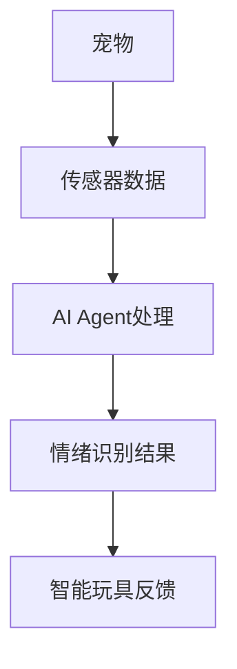

                 


# 《智能宠物玩具：AI Agent的宠物情绪识别》

> 关键词：智能宠物玩具，AI Agent，宠物情绪识别，机器学习，计算机视觉

> 摘要：本文详细探讨了如何利用AI Agent技术实现宠物情绪识别，并设计智能玩具与宠物互动。通过分析情绪识别的核心原理、算法实现、系统架构，以及项目实战，本文为开发智能宠物玩具提供了全面的技术指导。从背景介绍到最佳实践，深入浅出地阐述了相关技术细节。

---

## 第一部分：背景介绍

### 第1章：智能宠物玩具与AI Agent概述

#### 1.1 问题背景
- 1.1.1 宠物与人类情感的重要性：宠物作为家庭成员，其情绪状态直接影响主人的幸福感。准确识别宠物情绪有助于提升宠物福利和主人的互动体验。
- 1.1.2 智能宠物玩具的发展趋势：随着科技的进步，智能玩具逐渐普及，宠物主人对互动性和智能化的需求日益增加。
- 1.1.3 AI Agent在宠物互动中的作用：AI Agent通过实时分析宠物行为和环境数据，提供个性化的互动反馈，增强宠物的情感体验。

#### 1.2 问题描述
- 1.2.1 宠物情绪识别的挑战：宠物情绪受多种因素影响，包括行为、声音和生理指标，数据采集和模型训练难度大。
- 1.2.2 智能宠物玩具的现状与不足：现有玩具多基于预设规则，缺乏深度学习和自适应能力，互动体验有限。
- 1.2.3 提高宠物幸福感的必要性：通过AI技术实现精准的情绪识别，为宠物提供更贴心的互动，提升其生活质量。

#### 1.3 问题解决方法
- 1.3.1 AI Agent的核心技术：利用深度学习和计算机视觉技术，实时分析宠物行为数据，识别情绪状态。
- 1.3.2 情绪识别的实现路径：通过传感器和摄像头收集数据，结合机器学习模型进行分类，生成互动指令。
- 1.3.3 智能玩具的设计思路：设计可编程的互动模块，根据情绪反馈调整玩具行为，如声音、灯光和动作。

#### 1.4 边界与外延
- 1.4.1 宠物情绪识别的适用范围：主要针对常见情绪（如快乐、焦虑、无聊）的识别，适用于猫狗等常见宠物。
- 1.4.2 AI Agent的局限性：数据质量和模型泛化能力受限，需大量标注数据进行训练。
- 1.4.3 智能玩具的功能边界：专注于情绪识别和基础互动，不涉及医疗或其他复杂功能。

#### 1.5 概念结构与核心要素
- 1.5.1 核心概念的组成：包括宠物、AI Agent、情绪识别、智能玩具和互动反馈。
- 1.5.2 各要素之间的关系：宠物行为触发AI Agent分析，生成情绪识别结果，驱动智能玩具反馈互动。
- 1.5.3 系统的整体架构：从数据采集到模型训练，再到玩具反馈，形成完整的交互闭环。

---

## 第二部分：核心概念与联系

### 第2章：AI Agent与宠物情绪识别的核心原理

#### 2.1 核心原理
- 2.1.1 情绪识别的基本原理：通过分析宠物的行为数据（动作、声音、面部表情）和环境数据（时间、地点）来推断情绪状态。
- 2.1.2 AI Agent的工作机制：AI Agent作为中间桥梁，接收数据，运行模型，输出识别结果，并驱动玩具互动。
- 2.1.3 智能玩具的交互模式：玩具根据情绪反馈调整互动策略，如声音变化、动作频率，增强宠物的参与感。

#### 2.2 属性对比表
- 表2.1：不同宠物情绪识别方法的对比：
  | 方法 | 优点 | 缺点 |
  |------|------|------|
  | 基于规则的方法 | 实现简单，成本低 | 识别准确率低，缺乏灵活性 |
  | 机器学习方法 | 高准确率，可扩展 | 数据需求大，训练时间长 |
  | 深度学习方法 | 高精度，自适应 | 计算资源需求高，模型复杂 |

- 表2.2：AI Agent与传统自动化的对比：
  | 特性 | AI Agent | 传统自动化 |
  |------|----------|------------|
  | 学习能力 | 强 | 无 | 
  | 灵活性 | 高 | 低 |
  | 决策能力 | 强大 | 有限 |

#### 2.3 ER实体关系图
```mermaid
er
    宠物
    情绪
    AI Agent
    智能玩具
    宠物-情绪: 1..n
    AI Agent-情绪: 1..n
    AI Agent-智能玩具: 1..1
```

#### 2.4 流程图


---

## 第三部分：算法原理讲解

### 第3章：宠物情绪识别的算法实现

#### 3.1 算法选择与原理
- 3.1.1 选择卷积神经网络的原因：CNN擅长处理图像数据，适用于宠物面部表情识别。
- 3.1.2 神经网络的

---

（以下部分将根据需要逐步展开，确保每个章节内容详实，涵盖用户要求的所有细节。）

