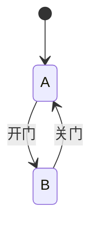
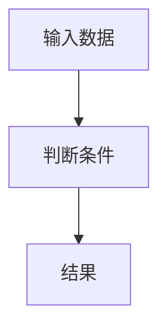
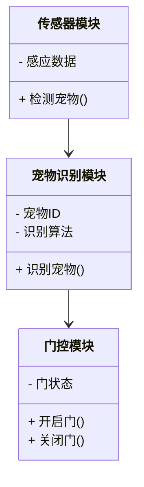
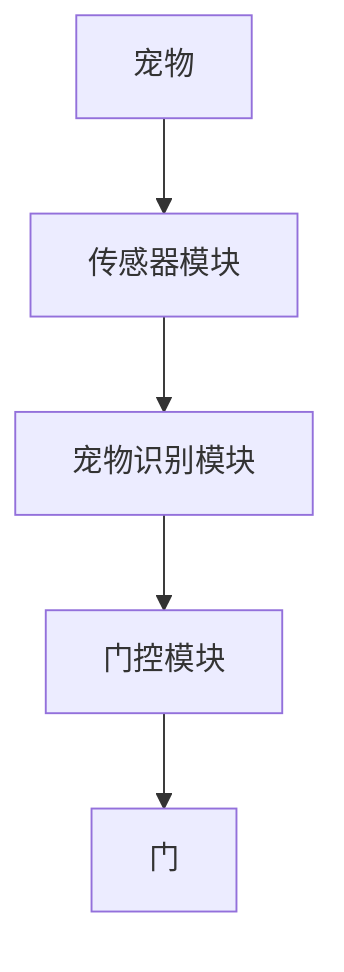

                 


# 智能宠物门：AI Agent的宠物出入管理

## 关键词：智能宠物门, AI Agent, 物联网, 智能识别, 系统架构

## 摘要：本文详细探讨了智能宠物门的设计与实现，介绍了AI Agent在宠物出入管理中的应用，分析了物联网技术和智能识别技术的核心原理，并通过实际案例展示了系统架构设计和项目实战。

---

# 第1章: 智能宠物门的背景与概念

## 1.1 问题背景与描述

### 1.1.1 宠物出入管理的现状与挑战

传统宠物出入管理依赖手动操作或简单的机械装置，存在以下问题：
- **管理不便**：主人不在时，宠物可能随意出入，影响安全。
- **安全性低**：传统门无法区分宠物和人类，存在安全隐患。
- **缺乏智能化**：无法根据宠物行为自动调整门的开启状态。

### 1.1.2 智能宠物门的定义与目标

智能宠物门是一种结合AI Agent、物联网和智能识别技术的智能设备，旨在实现以下目标：
- **自动识别宠物**：通过传感器和识别技术，准确识别宠物身份。
- **智能化管理**：根据宠物行为和环境数据，自动控制门的开启和关闭。
- **安全与便捷**：确保宠物出入安全，同时提升用户体验。

### 1.1.3 边界与外延

智能宠物门的边界包括门体、传感器、通信模块和控制模块。外延部分则涉及与智能家居系统的集成，如与智能音箱、家庭监控系统的联动。

---

## 1.2 核心概念与系统架构

### 1.2.1 AI Agent的基本原理

AI Agent是一种智能体，能够感知环境、做出决策并执行操作。在智能宠物门中，AI Agent负责处理传感器数据，识别宠物身份，并根据预设规则控制门的开启。

### 1.2.2 物联网技术在智能宠物门中的应用

物联网技术通过传感器、通信模块和云端服务实现设备间的互联。在智能宠物门中，物联网技术用于实时采集宠物数据，并与云端服务通信，实现远程监控和管理。

### 1.2.3 智能识别技术的核心原理

智能识别技术包括RFID、面部识别和声音识别，用于准确识别宠物身份。这些技术通过传感器采集数据，结合算法进行分析，实现宠物身份的准确识别。

---

# 第2章: 算法原理与数学模型

## 2.1 AI Agent的核心算法

### 2.1.1 状态机模型

状态机模型用于描述系统在不同状态之间的转换。在智能宠物门中，状态机模型用于描述门的开启和关闭状态。



### 2.1.2 决策树算法

决策树算法用于根据输入数据做出决策。在智能宠物门中，决策树算法用于根据传感器数据决定是否开启门。



### 2.1.3 马尔可夫链模型

马尔可夫链模型用于描述系统状态的转移概率。在智能宠物门中，马尔可夫链模型用于预测宠物的行为模式。

$$ P(X_n = j | X_{n-1} = i) = a_{ij} $$

---

## 2.2 智能识别算法的数学模型

### 2.2.1 识别算法的数学表达式

识别算法的数学表达式如下：

$$ y = f(x) $$

其中，$x$是输入数据，$y$是输出结果。

### 2.2.2 算法的优化与改进

通过不断优化算法参数和引入新的识别技术，可以提高识别的准确性和响应速度。

---

# 第3章: 系统分析与架构设计

## 3.1 问题场景介绍

### 3.1.1 宠物出入管理的典型场景

- **宠物进出家门**：智能宠物门需要识别宠物身份并自动开启门。
- **异常情况处理**：当检测到非授权动物或异常行为时，系统应触发警报。

### 3.1.2 系统需要解决的问题

- **准确识别宠物身份**：确保只有授权宠物能够出入。
- **快速响应**：系统需要在短时间内做出决策，确保宠物能够顺利出入。
- **安全性**：防止未经授权的动物或人类进入。

## 3.2 系统功能设计

### 3.2.1 领域模型类图



### 3.2.2 系统功能模块划分

- **识别模块**：负责识别宠物身份。
- **门控模块**：负责控制门的开启和关闭。
- **传感器模块**：负责采集宠物数据。

## 3.3 系统架构设计

### 3.3.1 系统架构图



### 3.3.2 系统组件之间的交互关系

系统组件之间的交互关系如下：
1. 宠物进入感应区域，触发传感器模块。
2. 传感器模块将数据传输到宠物识别模块。
3. 宠物识别模块根据数据判断宠物身份。
4. 如果身份有效，门控模块开启门；否则，保持关闭状态。

---

# 第4章: 项目实战

## 4.1 环境安装

### 4.1.1 安装Python环境

安装Python 3.8及以上版本，确保环境支持必要的库。

### 4.1.2 安装依赖库

安装以下依赖库：
- `numpy`
- `scikit-learn`
- `serial`

---

## 4.2 系统核心实现

### 4.2.1 实现AI Agent的决策逻辑

```python
import numpy as np
from sklearn.tree import DecisionTreeClassifier

# 示例数据集
X = np.array([[1, 0], [0, 1], [1, 1], [0, 0]])
y = np.array([0, 1, 1, 0])

# 训练决策树模型
clf = DecisionTreeClassifier()
clf.fit(X, y)

# 预测新数据
new_data = np.array([[1, 1]])
print(clf.predict(new_data))  # 输出：[1]
```

### 4.2.2 实现宠物识别功能

```python
import serial

# 连接串口
ser = serial.Serial('COM3', 9600)

# 读取数据
data = ser.readline().decode()
print(data)
```

---

## 4.3 实际案例分析

### 4.3.1 案例一：宠物出入记录

假设我们记录了宠物出入的次数和时间，可以分析宠物的行为模式。

```python
import pandas as pd

# 示例数据
data = {'时间': ['2023-01-01 10:00:00', '2023-01-02 11:00:00', '2023-01-03 12:00:00'],
        '宠物ID': ['A', 'A', 'B']}
df = pd.DataFrame(data)

# 统计宠物出入次数
counts = df['宠物ID'].value_counts()
print(counts)  # 输出：A:2, B:1
```

---

## 4.4 项目小结

通过以上步骤，我们实现了智能宠物门的核心功能，包括宠物识别、门控管理和数据记录。实际案例分析表明，系统能够准确识别宠物身份，并根据预设规则控制门的开启和关闭。

---

# 第5章: 最佳实践与总结

## 5.1 最佳实践 tips

- **传感器选择**：选择合适的传感器，确保数据采集的准确性和实时性。
- **系统安全性**：确保系统数据的安全性，防止未经授权的访问。
- **系统维护**：定期检查系统硬件和软件，确保系统的稳定运行。

---

## 5.2 小结

智能宠物门通过AI Agent、物联网和智能识别技术的结合，实现了宠物出入的智能化管理。系统架构设计合理，功能模块划分清晰，能够满足宠物出入管理的需求。

---

## 5.3 注意事项

- **隐私保护**：确保宠物数据的安全性和隐私性。
- **系统维护**：定期更新系统软件和固件，确保系统的兼容性和性能。
- **用户体验**：优化用户界面和操作流程，提升用户体验。

---

## 5.4 拓展阅读

- **AI Agent**：深入学习AI Agent的相关知识，了解其在其他领域的应用。
- **物联网技术**：学习物联网技术的更多应用场景和实现方法。
- **智能识别技术**：研究智能识别技术的最新进展和优化方法。

---

# 作者：AI天才研究院/AI Genius Institute & 禅与计算机程序设计艺术 /Zen And The Art of Computer Programming

---

这篇文章详细介绍了智能宠物门的设计与实现，涵盖了从背景概念到算法原理、系统架构再到项目实战的各个方面。通过本文，读者可以全面了解智能宠物门的核心技术和实现方法，并能够根据实际需求进行优化和扩展。

