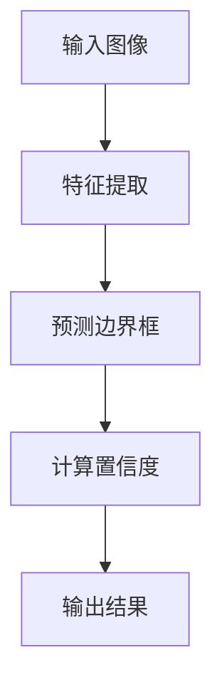
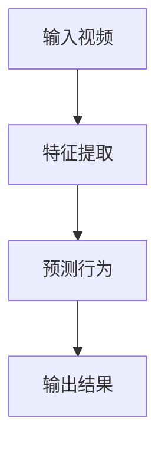
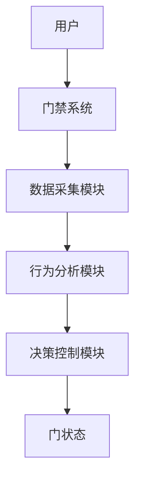
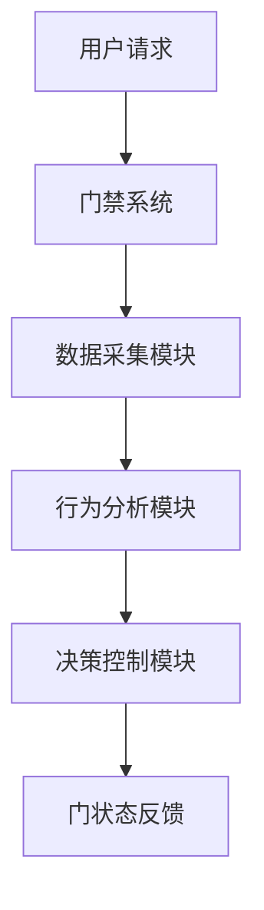
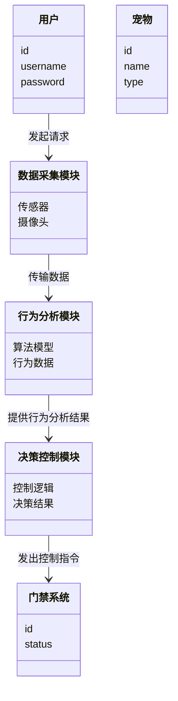
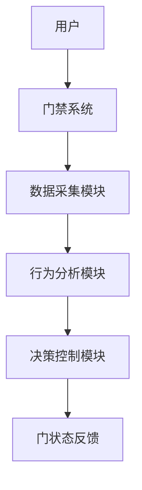

                 


# 智能宠物门：AI Agent的宠物出入行为分析

> 关键词：智能宠物门，AI Agent，宠物行为分析，目标检测，行为识别，系统架构

> 摘要：本文探讨了智能宠物门的设计与实现，结合AI Agent技术，分析宠物出入行为，详细介绍系统架构、算法原理及项目实战。

---

## 第1章: 智能宠物门的背景与问题背景

### 1.1 智能宠物门的定义与核心概念

#### 1.1.1 传统宠物门的局限性
传统宠物门仅提供机械开关功能，无法智能化管理宠物出入行为，存在以下问题：
- **缺乏数据采集**：无法记录宠物出入时间、频次等数据。
- **无法识别异常行为**：无法判断宠物是否强行闯入或被卡住。
- **无法远程监控**：主人无法实时了解宠物出入情况。

#### 1.1.2 智能宠物门的定义
智能宠物门是一种结合AI Agent技术的智能设备，能够实时监测宠物出入行为，并通过数据分析提供行为分析、异常检测等服务。

#### 1.1.3 智能宠物门的核心功能与目标
- **实时监测**：监测宠物出入时间、行为模式。
- **异常检测**：识别宠物强行闯入、卡住等异常情况。
- **数据记录**：记录宠物出入数据，供主人分析。
- **远程监控**：通过手机APP实时查看宠物出入情况。

### 1.2 宠物出入行为分析的背景与意义

#### 1.2.1 宠物行为分析的背景
随着宠物在家庭中的地位日益重要，主人希望更好地了解和管理宠物的行为。

#### 1.2.2 智能宠物门在宠物行为分析中的作用
智能宠物门通过AI技术分析宠物行为，帮助主人了解宠物的健康状况和行为习惯。

#### 1.2.3 智能宠物门的应用场景与目标用户
- **应用场景**：家庭宠物管理、宠物健康管理、宠物行为研究。
- **目标用户**：宠物主人、宠物医疗机构、宠物行为学家。

### 1.3 问题背景与问题描述

#### 1.3.1 宠物出入行为管理的难点
- 宠物行为复杂，难以准确捕捉和分析。
- 传统宠物门缺乏智能化，无法提供行为数据支持。

#### 1.3.2 智能宠物门的目标问题
- 如何实时监测宠物出入行为。
- 如何准确识别宠物行为异常。

#### 1.3.3 问题边界与外延
智能宠物门仅关注宠物出入行为，不涉及宠物的其他行为或健康问题。

### 1.4 核心概念与联系

#### 1.4.1 核心概念原理
智能宠物门通过传感器和摄像头采集宠物出入数据，结合AI算法进行行为分析。

#### 1.4.2 核心概念属性特征对比表格

| **属性**      | **传统宠物门** | **智能宠物门** |
|----------------|----------------|----------------|
| 数据采集       | 无             | 有             |
| 行为分析       | 无             | 有             |
| 远程监控       | 无             | 有             |

#### 1.4.3 ER实体关系图架构

```mermaid
erDiagram
    user {
        id
        username
        password
    }
    pet {
        id
        name
        type
    }
    door {
        id
        status
    }
    log {
        id
        time
        action
        pet_id
    }
    user --> log : 记录出入日志
    pet --> log : 记录出入日志
    door --> log : 记录门状态变化
```

---

## 第2章: 智能宠物门的核心技术与实现

### 2.1 AI Agent的基本原理

#### 2.1.1 AI Agent的定义与特点
- **定义**：AI Agent是一种智能主体，能够感知环境并执行任务。
- **特点**：自主性、反应性、目标导向、社交能力。

#### 2.1.2 AI Agent的核心技术
- **感知**：通过传感器和摄像头获取数据。
- **推理**：使用机器学习模型分析数据。
- **决策**：根据分析结果做出决策。

#### 2.1.3 AI Agent在智能宠物门中的应用
- **感知**：识别宠物身份和行为。
- **推理**：分析宠物行为模式。
- **决策**：控制门的开关。

### 2.2 宠物行为分析的算法原理

#### 2.2.1 目标检测算法

##### 2.2.1.1 YOLO算法
YOLO（You Only Look Once）是一种实时目标检测算法，适合用于宠物检测。

##### 2.2.1.2 YOLO算法公式
$$ \text{置信度} = \text{预测值} \times \text{真实值} $$

##### 2.2.1.3 YOLO算法流程图


#### 2.2.2 行为识别算法

##### 2.2.2.1 3D-CNN算法
3D-CNN算法用于视频级别的行为识别。

##### 2.2.2.2 3D-CNN算法公式
$$ \text{概率} = \frac{\text{正向传播}}{\text{反向传播}} $$

##### 2.2.2.3 3D-CNN算法流程图


#### 2.2.3 算法的数学模型与公式
- **目标检测损失函数**：$$ \text{损失} = \text{分类损失} + \text{定位损失} $$
- **行为识别损失函数**：$$ \text{损失} = \text{分类损失} + \text{时序损失} $$

### 2.3 系统架构与设计

#### 2.3.1 系统功能模块划分
- **数据采集模块**：负责采集宠物出入数据。
- **行为分析模块**：负责分析宠物行为。
- **决策控制模块**：负责控制门的开关。

#### 2.3.2 系统架构设计


#### 2.3.3 系统接口设计
- **数据采集接口**：提供传感器和摄像头的数据接口。
- **行为分析接口**：提供行为分析结果的API接口。
- **决策控制接口**：提供门开关控制的API接口。

#### 2.3.4 系统交互流程图


---

## 第3章: 智能宠物门的系统分析与架构设计

### 3.1 系统功能设计

#### 3.1.1 领域模型设计


### 3.2 系统架构设计

#### 3.2.1 系统架构设计


#### 3.2.2 系统组件之间的交互关系
- **用户**：通过手机APP或网页发起请求。
- **门禁系统**：接收用户请求并调用数据采集模块。
- **数据采集模块**：采集宠物出入数据并传递给行为分析模块。
- **行为分析模块**：分析数据并传递给决策控制模块。
- **决策控制模块**：根据分析结果控制门的状态。

#### 3.2.3 系统扩展性与可维护性
- **模块化设计**：各功能模块独立，便于扩展和维护。
- **接口标准化**：系统接口标准化，便于与其他系统集成。

---

## 第4章: 智能宠物门的项目实战

### 4.1 环境安装

#### 4.1.1 硬件安装
- **摄像头**：安装在门禁系统上方。
- **传感器**：安装在门禁系统两侧。
- **门禁系统**：安装在门禁位置。

#### 4.1.2 软件安装
- **操作系统**：Linux系统。
- **AI框架**：TensorFlow或PyTorch。
- **编程语言**：Python。

### 4.2 系统核心实现源代码

#### 4.2.1 数据采集模块实现
```python
import cv2

def采集数据():
    cap = cv2.VideoCapture(0)
    while True:
        ret, frame = cap.read()
        if not ret:
            break
        cv2.imwrite("data/frame.jpg", frame)
    cap.release()
    cv2.destroyAllWindows()
```

#### 4.2.2 行为分析模块实现
```python
import tensorflow as tf

def行为分析():
    model = tf.keras.models.load_model("model.h5")
    image = cv2.imread("data/frame.jpg")
    prediction = model.predict(image)
    print("预测结果：", prediction)
```

#### 4.2.3 决策控制模块实现
```python
def控制门禁():
    if prediction > 0.5:
        打开门()
    else:
        关闭门()
```

### 4.3 项目小结

#### 4.3.1 实战经验总结
- **数据采集模块**：确保摄像头和传感器正常工作。
- **行为分析模块**：选择合适的AI模型，优化模型性能。
- **决策控制模块**：确保门禁系统稳定运行。

#### 4.3.2 实战中遇到的问题及解决方案
- **问题**：模型准确率低。
- **解决方案**：增加训练数据，优化模型结构。

#### 4.3.3 最佳实践 tips
- **数据预处理**：对数据进行归一化处理。
- **模型调参**：选择合适的超参数。
- **系统测试**：进行全面的功能测试。

---

## 小结

智能宠物门通过AI Agent技术，实现了宠物出入行为的智能化管理。本文详细介绍了智能宠物门的设计与实现，包括系统架构、算法原理和项目实战。通过本文的分析，读者可以全面了解智能宠物门的技术细节和实现方法。

作者：AI天才研究院/AI Genius Institute & 禅与计算机程序设计艺术 /Zen And The Art of Computer Programming

