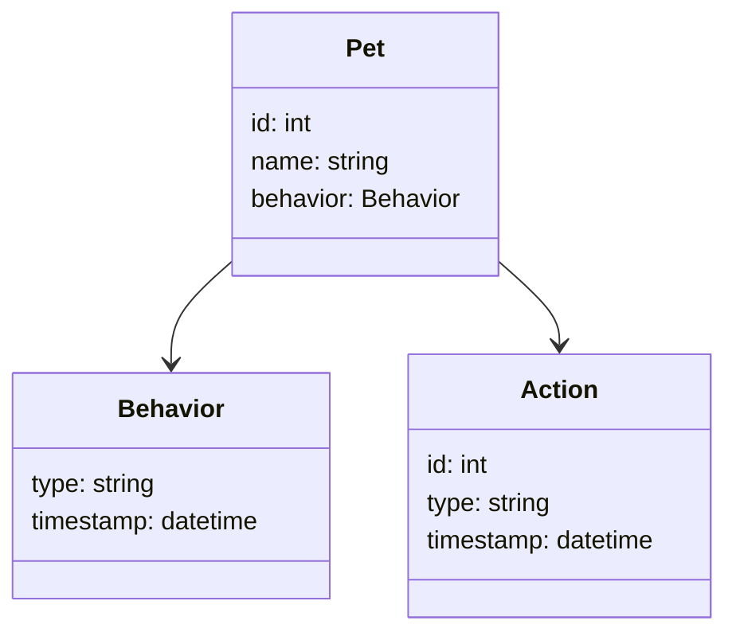

                 


# 智能宠物门：AI Agent的宠物行为分析与管理

## 关键词：
智能宠物门、AI Agent、宠物行为分析、行为识别、机器学习、系统架构

## 摘要：
本文将详细介绍智能宠物门的设计与实现，探讨AI Agent在宠物行为分析中的应用，通过背景介绍、核心概念、算法原理、系统架构、项目实战等多维度展开，深入剖析智能宠物门的技术细节与实现方案，为读者提供全面的技术指导。

---

# 第一部分: 智能宠物门与AI Agent概述

## 第1章: 智能宠物门的背景与概念

### 1.1 智能宠物门的背景介绍
#### 1.1.1 宠物行为管理的传统挑战
传统的宠物管理方式存在诸多问题，例如无法实时监测宠物行为、难以分析宠物情绪、缺乏智能化管理手段等。这些问题使得宠物主人难以全面了解宠物的行为状态，也无法有效管理宠物的活动范围。

#### 1.1.2 AI技术在宠物管理中的应用潜力
随着人工智能技术的快速发展，AI Agent（智能代理）逐渐被应用于宠物行为分析与管理领域。AI Agent能够通过传感器、摄像头等设备实时采集宠物的行为数据，并结合机器学习算法进行分析，为宠物主人提供智能化的管理方案。

#### 1.1.3 智能宠物门的定义与目标
智能宠物门是一种结合了AI技术的智能设备，主要用于监测和管理宠物的行为。其目标是通过实时分析宠物的行为数据，提供智能化的管理功能，例如行为识别、行为预测、行为管理等。

### 1.2 AI Agent在智能宠物门中的作用
#### 1.2.1 AI Agent的基本概念
AI Agent是一种能够感知环境、自主决策并执行任务的智能实体。在智能宠物门中，AI Agent负责采集宠物的行为数据，分析数据并生成相应的管理策略。

#### 1.2.2 AI Agent在宠物行为分析中的应用
AI Agent可以通过摄像头、传感器等设备采集宠物的行为数据，利用机器学习算法进行行为识别和行为预测，从而帮助宠物主人更好地管理宠物的行为。

#### 1.2.3 智能宠物门与AI Agent的结合
智能宠物门通过与AI Agent的结合，实现了对宠物行为的实时监测和智能化管理。AI Agent不仅能够识别宠物的行为，还能够根据行为数据生成相应的管理策略，例如限制宠物的活动范围、提醒主人宠物的情绪变化等。

---

## 第2章: 宠物行为分析的核心概念

### 2.1 宠物行为分析的基本原理
#### 2.1.1 行为识别的定义与方法
行为识别是指通过感知设备（如摄像头、传感器等）采集宠物的行为数据，并利用算法对这些数据进行分析和分类的过程。常见的行为识别方法包括基于图像的分析、基于声音的分析等。

#### 2.1.2 基于AI的行为分析技术
基于AI的行为分析技术利用机器学习算法对宠物的行为数据进行分析和分类。常见的算法包括卷积神经网络（CNN）、支持向量机（SVM）等。

#### 2.1.3 行为分析的数学模型
行为分析的数学模型通常包括特征提取、分类器设计和模型训练等步骤。例如，可以通过提取宠物的行为特征（如动作幅度、频率等）构建分类器，并利用训练数据对模型进行训练。

### 2.2 宠物行为分析的特征对比
#### 2.2.1 不同宠物行为的特征分析
不同宠物行为的特征包括动作幅度、频率、持续时间等。例如，宠物的跳跃行为可能具有较高的动作幅度和较快的频率，而宠物的休息行为则具有较低的动作幅度和较长的持续时间。

#### 2.2.2 行为特征与分类的对比表格
以下是不同宠物行为的特征对比表格：

| 行为类型 | 动作幅度 | 频率 | 持续时间 |
|----------|----------|------|----------|
| 跳跃      | 高       | 高   | 短       |
| 休息      | 低       | 低   | 长       |
| 行走      | 中       | 中   | 中       |

#### 2.2.3 行为分析的ER实体关系图
以下是行为分析的ER实体关系图：

```mermaid
erDiagram
    Pbehavior }{ Pet
    Pbehavior }{ Action
    Pet }{ Action
    Action }{ Pbehavior
```

---

## 第3章: AI Agent的核心算法原理

### 3.1 基于卷积神经网络的行为识别算法
#### 3.1.1 CNN网络结构
卷积神经网络（CNN）是一种常用的图像识别算法，其结构包括卷积层、池化层、全连接层等。以下是CNN的网络结构图：


#### 3.1.2 行为识别的流程图
以下是行为识别的流程图：


#### 3.1.3 算法实现的Python代码示例
以下是基于CNN的行为识别算法的Python代码示例：

```python
import tensorflow as tf
from tensorflow.keras import layers

model = tf.keras.Sequential([
    layers.Conv2D(32, (3,3), activation='relu', input_shape=(64, 64, 3)),
    layers.MaxPooling2D((2,2)),
    layers.Conv2D(64, (3,3), activation='relu'),
    layers.MaxPooling2D((2,2)),
    layers.Flatten(),
    layers.Dense(128, activation='relu'),
    layers.Dense(10, activation='softmax')
])

model.compile(optimizer='adam', loss='sparse_categorical_crossentropy', metrics=['accuracy'])
model.fit(x_train, y_train, epochs=10, batch_size=32)
```

### 3.2 行为预测的数学模型
#### 3.2.1 线性回归模型
线性回归模型是一种常用的回归模型，其数学表达式为：

$$ y = \beta_0 + \beta_1 x + \epsilon $$

其中，$y$ 是预测结果，$x$ 是输入特征，$\beta_0$ 和 $\beta_1$ 是模型参数，$\epsilon$ 是误差项。

#### 3.2.2 支持向量机模型
支持向量机（SVM）是一种常用的分类算法，其数学表达式为：

$$ y = \text{sign}(\sum_{i=1}^n \alpha_i y_i x_i \cdot x + b) $$

其中，$\alpha_i$ 是拉格朗日乘子，$y_i$ 是标签，$x_i$ 是支持向量，$b$ 是偏置项。

#### 3.2.3 随机森林模型
随机森林是一种基于树的集成算法，其数学表达式为：

$$ y = \text{mode}(\{y_i\}_{i=1}^n) $$

其中，$y_i$ 是决策树的预测结果，$\text{mode}$ 表示众数。

---

## 第4章: 系统架构与设计

### 4.1 系统功能设计
#### 4.1.1 领域模型的Mermaid类图
以下是系统功能设计的类图：



#### 4.1.2 系统功能模块划分
系统功能模块包括数据采集模块、行为分析模块、管理模块等。

#### 4.1.3 功能模块的交互流程
以下是功能模块的交互流程图：


### 4.2 系统架构设计
#### 4.2.1 系统架构的Mermaid架构图
以下是系统架构的架构图：


#### 4.2.2 系统组件之间的关系
系统组件包括客户端、服务器、数据库和分析模块。

#### 4.2.3 系统的扩展性设计
系统可以通过增加更多的传感器和算法模型来扩展功能。

---

## 第5章: 项目实战与实现

### 5.1 环境安装与配置
#### 5.1.1 开发环境的选择
推荐使用Python 3.8及以上版本，安装TensorFlow、Keras等库。

#### 5.1.2 必需库的安装
安装以下库：

```bash
pip install tensorflow keras matplotlib
```

#### 5.1.3 开发工具的配置
配置Jupyter Notebook或其他IDE。

### 5.2 核心功能的实现
#### 5.2.1 行为识别的代码实现
以下是行为识别的代码实现：

```python
import tensorflow as tf
from tensorflow.keras import layers

# 定义模型
model = tf.keras.Sequential([
    layers.Conv2D(32, (3,3), activation='relu', input_shape=(64, 64, 3)),
    layers.MaxPooling2D((2,2)),
    layers.Conv2D(64, (3,3), activation='relu'),
    layers.MaxPooling2D((2,2)),
    layers.Flatten(),
    layers.Dense(128, activation='relu'),
    layers.Dense(10, activation='softmax')
])

# 编译模型
model.compile(optimizer='adam', loss='sparse_categorical_crossentropy', metrics=['accuracy'])

# 训练模型
model.fit(x_train, y_train, epochs=10, batch_size=32)
```

#### 5.2.2 AI Agent的实现
以下是AI Agent的实现代码：

```python
class PetBehaviorAgent:
    def __init__(self, model):
        self.model = model

    def analyze_behavior(self, input_data):
        prediction = self.model.predict(input_data)
        return prediction
```

#### 5.2.3 系统接口的设计与实现
以下是系统接口的设计：

```python
from flask import Flask, request, jsonify

app = Flask(__name__)

@app.route('/analyze', methods=['POST'])
def analyze():
    data = request.json
    result = model.predict(data)
    return jsonify(result)
```

---

## 第6章: 最佳实践与注意事项

### 6.1 实践中的注意事项
#### 6.1.1 数据采集的质量控制
确保数据的准确性和完整性，避免噪声干扰。

#### 6.1.2 算法优化的技巧
可以通过增加数据量、调整模型参数等方式优化算法性能。

#### 6.1.3 系统部署的注意事项
确保系统的稳定性和安全性，避免数据泄露和系统崩溃。

### 6.2 项目小结与未来展望
#### 6.2.1 项目总结
通过本文的介绍，读者可以了解到智能宠物门的设计与实现过程，掌握AI Agent在宠物行为分析中的应用方法。

#### 6.2.2 未来研究方向
未来可以进一步研究更复杂的宠物行为分析算法，例如基于深度学习的实时行为分析、多宠物行为协同分析等。

#### 6.2.3 智能宠物门的未来发展
随着AI技术的不断进步，智能宠物门的功能将更加智能化和多样化，为宠物主人提供更优质的服务。

---

## 第7章: 拓展阅读与深入学习

### 7.1 相关领域的最新研究
#### 7.1.1 AI在宠物行为分析中的最新进展
可以参考相关学术论文和研究报告，了解最新的研究成果和技术动态。

#### 7.1.2 智能门禁系统的前沿技术
可以关注智能门禁系统的最新技术发展，例如基于AI的门禁控制、多模态识别技术等。

---

## 作者：AI天才研究院/AI Genius Institute & 禅与计算机程序设计艺术 /Zen And The Art of Computer Programming

---

本文通过系统化的分析与实践，详细介绍了智能宠物门的设计与实现过程，探讨了AI Agent在宠物行为分析中的应用，为读者提供了丰富的技术指导和实践案例。

