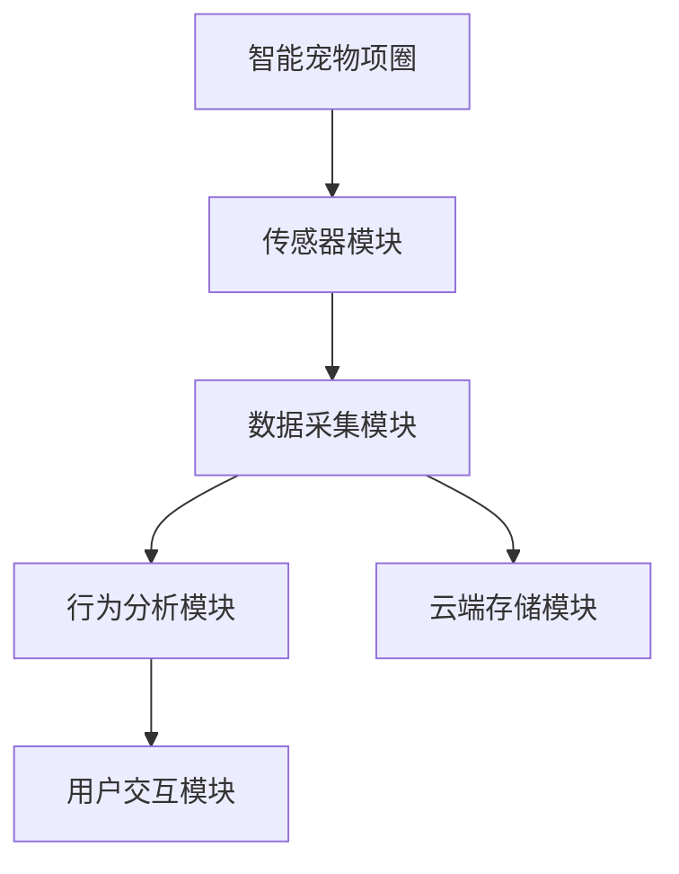
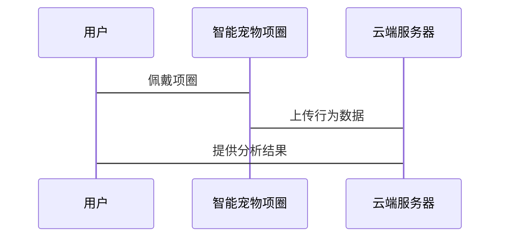

                 


# 智能宠物项圈：AI Agent的宠物行为分析

> 关键词：智能宠物项圈，AI Agent，宠物行为分析，物联网，机器学习，数据分析

> 摘要：智能宠物项圈是一种结合了人工智能和物联网技术的设备，用于实时监测和分析宠物的行为。本文将深入探讨AI Agent在宠物行为分析中的应用，从硬件设计、数据采集、算法实现到系统架构，全面解析智能宠物项圈的核心技术与实际应用。

---

# 第1章: 智能宠物项圈概述

## 1.1 智能宠物项圈的定义与特点
### 1.1.1 传统宠物项圈的功能与局限性
传统的宠物项圈主要用于宠物的标识和基本行为记录，但功能单一，无法提供深入的行为分析。

### 1.1.2 智能宠物项圈的核心功能
智能宠物项圈通过集成传感器、AI算法和物联网技术，能够实时监测宠物的活动、情绪和健康状况。

### 1.1.3 智能宠物项圈的技术优势
- 高精度传感器：能够捕捉宠物的运动、心率、体温等数据。
- AI算法：通过机器学习模型分析宠物行为，识别异常行为。
- 物联网连接：数据实时上传到云端，供主人查看和分析。

## 1.2 AI Agent在宠物行为分析中的作用
### 1.2.1 AI Agent的基本概念
AI Agent是一种智能体，能够感知环境、自主决策并执行任务。在宠物行为分析中，AI Agent负责数据处理和行为识别。

### 1.2.2 AI Agent在宠物行为分析中的应用场景
- 情绪识别：通过分析宠物的运动和声音，判断其情绪状态。
- 行为分类：识别宠物的活动类型（如奔跑、休息、玩耍）。
- 健康监测：监测宠物的体温、心率等生理指标。

### 1.2.3 AI Agent的优势与挑战
- 优势：高效、准确、实时性强。
- 挑战：数据隐私、计算资源限制、模型训练数据不足。

## 1.3 宠物行为分析的背景与意义
### 1.3.1 宠物行为分析的背景
随着宠物在家庭中的地位提升，主人希望更好地了解和照顾宠物的行为和健康。

### 1.3.2 宠物行为分析的意义
- 提高宠物健康水平。
- 帮助主人理解宠物需求。
- 为宠物医疗提供数据支持。

### 1.3.3 智能宠物项圈在宠物行为分析中的价值
智能宠物项圈通过实时监测和分析宠物行为，为宠物主人提供科学的养宠建议。

## 1.4 本章小结
本章介绍了智能宠物项圈的定义、技术优势以及AI Agent在宠物行为分析中的作用，为后续的技术分析奠定了基础。

---

# 第2章: AI Agent的核心概念与原理

## 2.1 AI Agent的基本原理
### 2.1.1 AI Agent的感知机制
AI Agent通过传感器（如加速度计、心率传感器）收集宠物的行为数据。

### 2.1.2 AI Agent的决策机制
AI Agent基于收集的数据，利用机器学习模型进行行为分类和异常检测。

### 2.1.3 AI Agent的执行机制
AI Agent根据分析结果，向主人发送提醒或建议。

## 2.2 宠物行为数据的采集与处理
### 2.2.1 数据采集的传感器技术
- 加速度计：监测宠物的运动状态。
- 心率传感器：测量宠物的心率变化。
- 陀螺仪：分析宠物的运动方向和姿态。

### 2.2.2 数据的预处理与特征提取
- 数据清洗：去除噪声和异常值。
- 特征提取：从原始数据中提取有用特征（如运动频率、心率变化幅度）。

### 2.2.3 数据存储与管理
- 数据库设计：存储宠物行为数据和分析结果。
- 数据同步：通过物联网技术将数据上传到云端。

## 2.3 AI Agent的行为分析算法
### 2.3.1 基于机器学习的行为分类算法
- K-近邻算法（KNN）：用于分类宠物行为类型。
- 支持向量机（SVM）：适用于小规模数据分类。

### 2.3.2 基于深度学习的行为分析模型
- 卷积神经网络（CNN）：用于图像和时序数据的特征提取。
- 循环神经网络（RNN）：适用于时序数据分析。

### 2.3.3 算法的优缺点与适用场景
- 机器学习算法：简单易实现，但对特征工程依赖较高。
- 深度学习算法：性能强大，但需要大量数据和计算资源。

## 2.4 本章小结
本章详细介绍了AI Agent的核心原理，包括感知、决策和执行机制，以及宠物行为数据的采集与处理方法。

---

# 第3章: 系统架构与实现

## 3.1 系统架构设计
### 3.1.1 系统组成与功能模块划分
- 硬件模块：传感器、通信模块、电源模块。
- 软件模块：数据采集、行为分析、用户交互。

### 3.1.2 系统功能模块之间的关系
- 数据采集模块与行为分析模块：数据采集模块提供输入数据，行为分析模块进行处理。
- 用户交互模块与云端存储：用户通过手机APP查看分析结果，云端存储模块提供数据备份。

## 3.2 系统架构的实现
### 3.2.1 系统架构图


### 3.2.2 系统功能流程图
```mermaid
graph TD
    start --> sensor[数据采集]
    sensor --> data_processing[数据处理]
    data_processing --> analysis[行为分析]
    analysis --> user_interface[用户反馈]
    user_interface --> end
```

### 3.2.3 系统交互设计


## 3.3 本章小结
本章通过系统架构图和功能流程图，详细展示了智能宠物项圈的系统设计与实现过程。

---

# 第4章: 项目实战

## 4.1 环境搭建与工具安装
### 4.1.1 开发环境的选择
- 操作系统：Windows/Mac/Linux
- 开发工具：PyCharm/VS Code
- 物联网平台：AWS IoT/阿里云 IoT

### 4.1.2 开发工具的安装与配置
- Python：安装必要的库（如numpy、pandas、scikit-learn）。
- 物联网 SDK：配置设备连接参数。

### 4.1.3 数据集的准备与处理
- 数据来源：宠物行为数据集（包括运动、心率等数据）。
- 数据预处理：清洗数据、提取特征。

## 4.2 系统核心功能的实现
### 4.2.1 数据采集模块的实现
```python
import numpy as np
import pandas as pd

# 读取数据
data = pd.read_csv('pet_behavior.csv')

# 数据预处理
data_clean = data.dropna()
data_feature = data_clean[['acceleration', 'heart_rate']]
```

### 4.2.2 行为分析算法的实现
```python
from sklearn.svm import SVC

# 训练模型
model = SVC()
model.fit(data_feature, data_clean['behavior_label'])

# 预测行为
new_data = pd.DataFrame({'acceleration': [1.2, 1.5], 'heart_rate': [120, 130]})
prediction = model.predict(new_data)
```

### 4.2.3 用户界面的设计与实现
```python
import tkinter as tk

# 创建GUI界面
root = tk.Tk()
root.title("智能宠物项圈")

# 添加标签和输入框
label = tk.Label(root, text="宠物行为分析结果:")
label.pack()

result_label = tk.Label(root, text="")
result_label.pack()

# 添加显示结果的函数
def show_result():
    # 调用行为分析模型
    result = model.predict(new_data)
    result_label.config(text=f"预测行为：{result[0]}")

# 添加显示结果的按钮
button = tk.Button(root, text="显示结果", command=show_result)
button.pack()

root.mainloop()
```

## 4.3 本章小结
本章通过实际项目案例，详细展示了智能宠物项圈的环境搭建、数据处理和系统实现过程。

---

# 第5章: 总结与展望

## 5.1 本章总结
智能宠物项圈通过AI Agent技术，能够实时监测和分析宠物的行为，为宠物主人提供科学的养宠建议。

## 5.2 未来展望
- 更高精度的传感器：提高数据采集的准确性。
- 更强大的AI算法：提升行为分析的准确性和实时性。
- 更多应用场景：扩展智能宠物项圈的应用领域。

---

作者：AI天才研究院/AI Genius Institute & 禅与计算机程序设计艺术 /Zen And The Art of Computer Programming

---

版权声明：本文为原创文章，转载请注明出处。

