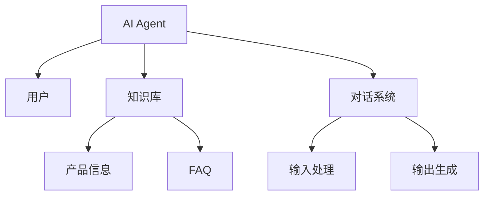
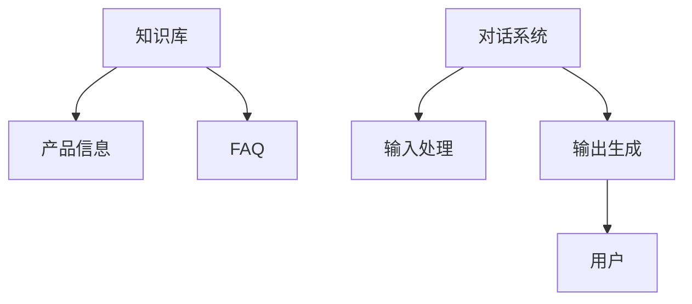
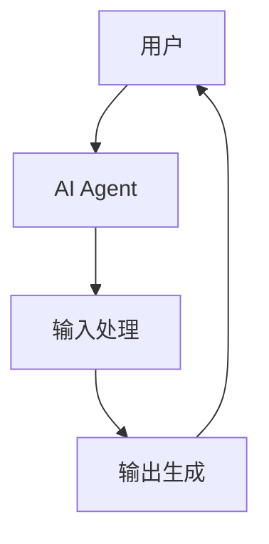
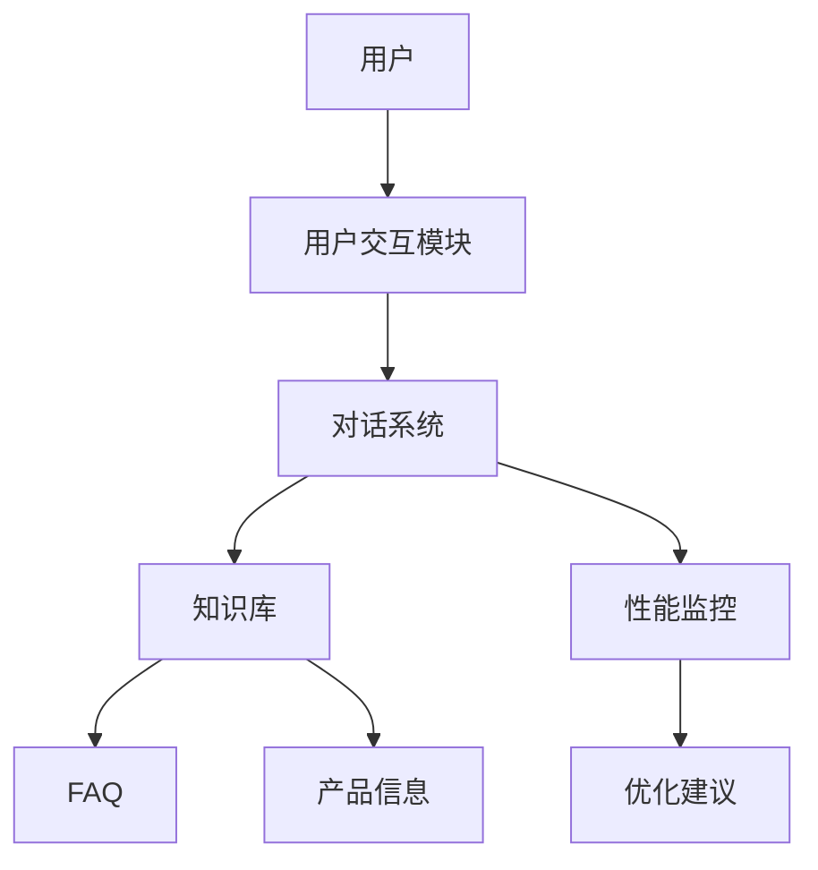
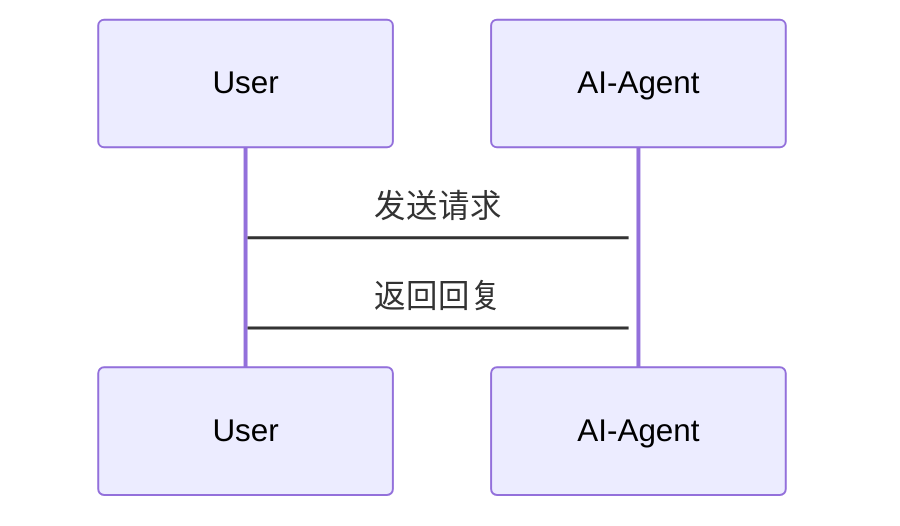

                 


# 智能客户服务AI Agent：LLM驱动的全天候支持系统

> 关键词：智能客服、AI Agent、LLM、自然语言处理、大语言模型

> 摘要：本文深入探讨了基于大语言模型（LLM）的智能客户服务AI Agent系统，分析了其核心概念、算法原理、系统架构以及实际应用场景。通过详细的技术分析和案例研究，揭示了LLM驱动的智能客服系统如何实现全天候支持，为企业提供高效、智能的客户服务解决方案。

---

## 第一部分: 智能客户服务AI Agent概述

### 第1章: AI Agent与智能客户服务的背景介绍

#### 1.1 AI Agent的基本概念

##### 1.1.1 什么是AI Agent
AI Agent（人工智能代理）是一种能够感知环境并采取行动以实现目标的智能实体。在智能客户服务场景中，AI Agent通常以虚拟助手的形式出现，能够通过自然语言处理技术与用户进行交互。

##### 1.1.2 AI Agent的核心特点
- **智能性**：能够理解用户意图并提供个性化回复。
- **自主性**：无需人工干预，能够独立完成任务。
- **适应性**：能够根据上下文动态调整响应策略。
- **学习能力**：通过机器学习技术不断优化自身性能。

##### 1.1.3 AI Agent与传统客服系统的区别
| 特性                | AI Agent             | 传统客服系统         |
|---------------------|----------------------|----------------------|
| 响应速度            | 实时响应             | 受限于人工处理时间    |
| 智能程度            | 高度智能化           | 依赖人工判断         |
| 可扩展性            | 支持大规模并发处理   | 受人力资源限制       |
| 成本效益            | 降低人力成本         | 人力资源需求较高     |

#### 1.2 智能客户服务的定义与特点

##### 1.2.1 智能客户服务的定义
智能客户服务是一种基于人工智能技术的客户支持方式，通过自然语言处理、机器学习等技术，实现自动化、智能化的客户服务。

##### 1.2.2 智能客户服务的核心要素
- **自然语言处理（NLP）**：实现用户意图的理解和识别。
- **知识库管理**：存储产品信息、常见问题解答等。
- **对话系统**：支持多轮对话，提供连贯的用户体验。
- **实时反馈机制**：根据用户反馈优化服务流程。

##### 1.2.3 智能客户服务与传统客服的主要区别
| 特性                | 智能客户服务          | 传统客服系统          |
|---------------------|-----------------------|-----------------------|
| 服务时间            | 24/7全天候支持        | 受限于工作时间        |
| 响应速度            | 几乎实时              | 较慢                  |
| 服务质量            | 高度一致              | 可能存在波动          |
| 成本                 | 初期投入较高，长期成本低 | 初期投入较低，长期成本高 |

#### 1.3 LLM在智能客户服务中的应用

##### 1.3.1 大语言模型的基本原理
大语言模型（LLM）通过大量的训练数据学习语言模式，能够生成与训练数据相似的文本。其核心是基于Transformer架构的编码器-解码器模型。

##### 1.3.2 LLM在智能客服中的优势
- **强大的文本生成能力**：能够自动生成连贯、准确的回复。
- **快速响应**：通过并行计算实现高效的文本处理。
- **可扩展性**：支持多种语言和领域知识。

##### 1.3.3 LLM驱动的智能客服系统的演进历程
1. **规则引擎阶段**：基于预定义的规则进行简单的匹配和回复。
2. **关键词匹配阶段**：通过关键词匹配提供标准化回复。
3. **NLP技术阶段**：引入自然语言处理技术，实现意图理解和实体识别。
4. **LLM驱动阶段**：基于大语言模型实现更智能、更自然的对话交互。

### 第2章: 智能客户服务AI Agent的核心概念与联系

#### 2.1 AI Agent的核心原理

##### 2.1.1 基于LLM的自然语言处理
AI Agent通过LLM解析用户输入，生成回复。其流程包括：
1. **输入处理**：将用户输入的文本转换为模型可处理的向量表示。
2. **意图理解**：通过LLM分析用户的意图和情感倾向。
3. **知识库查询**：根据意图从知识库中检索相关信息。
4. **回复生成**：基于检索结果生成回复文本。

##### 2.1.2 知识库的构建与管理
- **知识库构建**：包括产品信息、FAQ、操作指南等。
- **知识库管理**：支持动态更新和扩展。

##### 2.1.3 多轮对话的实现机制
- **对话上下文**：记录当前对话的历史信息。
- **对话状态管理**：跟踪对话的进展，确保回复的连贯性。

#### 2.2 核心概念对比表

##### 2.2.1 AI Agent与传统客服系统的对比
| 特性                | AI Agent             | 传统客服系统         |
|---------------------|----------------------|----------------------|
| 响应时间            | 几乎实时             | 较长                 |
| 服务范围            | 全球化                | 地域限制             |
| 服务成本            | 低                   | 高                   |

##### 2.2.2 LLM与传统NLP技术的对比
| 特性                | LLM                  | 传统NLP              |
|---------------------|----------------------|----------------------|
| 处理能力            | 高度并行化            | 单线程                |
| 知识表示能力        | 更强                 | 较弱                 |
| 训练数据量          | 巨大                 | 较小                 |

##### 2.2.3 不同LLM模型的性能对比
| 模型                | GPT-3                | GPT-4                | PaLM                  |
|---------------------|----------------------|----------------------|-----------------------|
| 参数数量            | 175B                | 184B                | 560B                 |
| 上下文窗口          | 4096                | 8192                | 4096                 |
| 性能提升            | 显著                | 更加显著             | 巨大提升             |

#### 2.3 实体关系图

##### 2.3.1 AI Agent的实体关系图


##### 2.3.2 知识库与对话系统的实体关系


##### 2.3.3 用户与AI Agent的交互流程图


---

## 第二部分: LLM驱动的智能客户服务系统架构

### 第3章: LLM驱动的智能客服系统架构设计

#### 3.1 系统功能模块划分

##### 3.1.1 用户交互模块
- 负责接收用户的输入并将其传递给对话系统。
- 支持多种输入方式，如文本、语音等。

##### 3.1.2 知识库管理模块
- 负责存储和管理与客服相关的知识。
- 支持动态更新和扩展。

##### 3.1.3 对话控制模块
- 负责管理对话流程，确保对话的连贯性和逻辑性。
- 支持多轮对话和上下文管理。

##### 3.1.4 性能监控模块
- 监控系统的运行状态，包括响应时间、错误率等。
- 提供实时反馈和优化建议。

#### 3.2 系统整体架构图


#### 3.3 系统接口设计

##### 3.3.1 用户端接口
```python
class UserInterface:
    def __init__(self):
        self.dialogue_system = DialogueSystem()
    
    def send_request(self, user_input):
        response = self.dialogue_system.generate_response(user_input)
        return response
```

##### 3.3.2 知识库接口
```python
class KnowledgeBase:
    def __init__(self):
        self.faq = []
        self.product_info = []
    
    def add_faq(self, question, answer):
        self.faq.append((question, answer))
    
    def get_answer(self, question):
        for q, a in self.faq:
            if q == question:
                return a
        return None
```

##### 3.3.3 对话引擎接口
```python
class DialogueSystem:
    def __init__(self, knowledge_base):
        self.knowledge_base = knowledge_base
    
    def generate_response(self, user_input):
        # 具体实现见第4章
        pass
```

##### 3.3.4 监控与反馈接口
```python
class Monitor:
    def __init__(self):
        self.response_time = []
        self.error_rate = []
    
    def record_response_time(self, time):
        self.response_time.append(time)
    
    def calculate_error_rate(self):
        return sum(1 for t in self.response_time if t > 5) / len(self.response_time)
```

---

## 第4章: 系统交互流程与实现

### 4.1 用户与AI Agent的交互流程

#### 4.1.1 用户发起请求


#### 4.1.2 系统解析请求
- 对话系统接收到用户输入后，首先进行意图理解。
- 通过LLM模型生成回复。

#### 4.1.3 系统生成回复
- 根据意图和知识库内容生成回复。
- 支持多种回复方式，如文本、语音等。

#### 4.1.4 用户反馈与系统优化
- 系统记录用户反馈，用于优化模型性能。
- 定期更新知识库，确保信息的准确性。

### 4.2 对话控制机制

#### 4.2

---

## 第三部分: LLM驱动的智能客户服务系统实现

### 第5章: LLM驱动的智能客服系统实现

#### 5.1 环境安装

##### 5.1.1 安装Python
```bash
# 安装Python
python --version
```

##### 5.1.2 安装依赖库
```bash
pip install transformers
pip install torch
pip install numpy
```

#### 5.2 核心代码实现

##### 5.2.1 LLM模型加载
```python
from transformers import AutoTokenizer, AutoModelForCausalLM
import torch

model_name = "gpt2"
tokenizer = AutoTokenizer.from_pretrained(model_name)
model = AutoModelForCausalLM.from_pretrained(model_name)
```

##### 5.2.2 对话系统实现
```python
class DialogueSystem:
    def __init__(self, tokenizer, model):
        self.tokenizer = tokenizer
        self.model = model
    
    def generate_response(self, user_input):
        inputs = self.tokenizer(user_input, return_tensors="pt")
        outputs = self.model.generate(
            inputs.input_ids,
            max_length=50,
            num_beams=5,
            temperature=0.7
        )
        response = self.tokenizer.decode(outputs[0], skip_special_tokens=True)
        return response
```

##### 5.2.3 知识库集成
```python
class KnowledgeBase:
    def __init__(self):
        self.faq = {
            "问题1": "答案1",
            "问题2": "答案2"
        }
    
    def get_answer(self, question):
        return self.faq.get(question, "抱歉，我暂时无法回答这个问题。")
```

#### 5.3 案例分析与实现细节

##### 5.3.1 实际案例分析
假设用户输入为“如何重置密码？”，系统将通过LLM生成回复：“您可以前往设置页面，点击‘忘记密码’，然后按照提示操作。”

##### 5.3.2 代码实现细节
- 对话系统通过LLM生成回复，确保回复的多样性和准确性。
- 知识库集成确保系统能够快速检索常见问题的解答。

#### 5.4 项目小结
通过本章的实现，我们成功构建了一个基于LLM的智能客服系统，能够实现高效的用户交互和智能的回复生成。

---

## 第四部分: 最佳实践与小结

### 第6章: 最佳实践与小结

#### 6.1 最佳实践

##### 6.1.1 系统优化建议
- 定期更新知识库，确保信息的准确性。
- 优化LLM模型的超参数，提升生成回复的质量。

##### 6.1.2 技术实现建议
- 使用更先进的LLM模型，如GPT-4，提升系统的智能性。
- 引入情感分析技术，增强用户体验。

#### 6.2 小结

##### 6.2.1 全文总结
本文详细探讨了基于LLM的智能客户服务AI Agent系统，分析了其核心概念、算法原理、系统架构以及实际应用场景。通过详细的技术分析和案例研究，揭示了LLM驱动的智能客服系统如何实现全天候支持，为企业提供高效、智能的客户服务解决方案。

##### 6.2.2 未来展望
随着大语言模型技术的不断发展，智能客户服务AI Agent将更加智能化和个性化，为企业和用户提供更优质的服务体验。

---

## 作者

作者：AI天才研究院/AI Genius Institute & 禅与计算机程序设计艺术 /Zen And The Art of Computer Programming

---

本文通过系统化的分析和详细的技术实现，全面探讨了智能客户服务AI Agent的构建与应用。从理论到实践，从设计到实现，本文为读者提供了一套完整的解决方案，帮助企业在智能时代提升客户服务能力。

